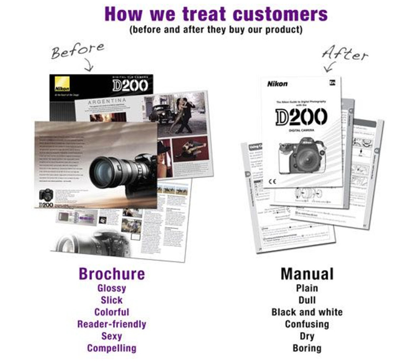
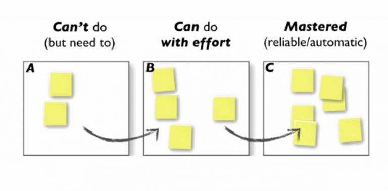

Overall, this was an interesting read, but I found it hard to apply the lessons to my product. The book contains compelling case studies and ideas from the field of meta-learning, but most of the ideas were either too theoretical or too specific to large companies.

<!--more-->

I couldn't get over the feeling that Kathy Sierra just wanted to write about meta-learning, but she had to shoehorn it into a book about product design to fit her brand. The material was interesting, but it wasn't what I wanted from a book that was ostensibly about user experience design.

Sierra argues that most companies market their products well but treat everything after the sale as an afterthought. Her central thesis is that successful products create expert users. To create an expert user, the product team has to design a path that helps the customer gain mastery in a domain related to the product.

I found the thesis compelling, but it was hard to translate the ideas into my products. To follow Sierra's advice, you'd need an entire team dedicated to creating high-quality educational content. Perhaps the book is just not a good match for indie developers like me.

The book's biggest weakness was relying too heavily on theory. Sierra has plenty of examples of companies she thinks *should* follow her advice but none that actually do. Instead, she points to lab studies that support her theory, but she hand-waves away the real-world challenges of putting these ideas into practice.

---

## What I Liked

* It discusses meta-learning and deliberate practice in an accessible, engaging way.
* Sierra makes complex ideas feel light and easy to read.
* It includes interesting scientific studies, similar [Malcolm Gladwell's books](/book-reports/outliers/).
* It's laugh-out-loud funny.
  * Creative use of stock photos.

## What I Disliked

* The strategies seem optimized for products with extremely large teams.
  * Sierra suggests reading third-party discussion forums about your product, which suggests a high level of scale already.
  * Most of the examples are about Olympus cameras and Microsoft Office products.
  * Would have benefited from other examples.
* Many of the ideas were too abstract.
  * I kept wishing for more real-life examples.
  * It was hard to connect the lessons to my product.
* Does not make a convincing case that this is practical.
  * Almost all of the discussion is theoretical or based on lab studies.
* It gets too into the weeds on the subject of meta-learning.

## Key Takeaways

### The brand engagement arms race

* Out-engaging competing brands is unsustainable.
* Users don't fall in love with a product by engaging with it on social media.

> On their deathbed, nobody will say, "If only I'd engaged with more brands."

* Best-selling products maintain their position through social recommendations.
  * When someone loves a product, they tell people.
* When people talk about a product's funny viral video, they're discussing the product's *marketing*, which isn't the goal.

### Goal of user experience

Which of the following do you want the user to feel after using your product if you can pick only one?

* A. "This **product** is awesome."
* B. "This **company** is awesome."
* C. "This **brand** is awesome."

Answer: Secret option D &mdash; "**I'm** awesome."

**Takeaway**: People will love a product if it helps them achieve something important to them.

### What makes badass users?

* We make our users badass when our product helps them achieve badass results.
  * e.g., an effective presentation, a beautiful photograph
* To identify badass results for a product, think about the context in which customers use it.
  * e.g., nobody wants to be the best at tripods, but people use tripods in pursuit of excellent photographs.
* Companies often market their product in terms of the greater context but stop thinking that way after the purchase.
  * After the customer buys the product, all the company's messaging around the product treats it as a simple tool instead of helping the customer use it to achieve the greater context.

{{}}

### The value of expert users

* The more expertise someone has in a field, the more they appreciate fine details.
  * e.g., audiophiles pay for expensive headphones because they hear a richer sound with them.
* We want to make our users experts so that they have a richer experience and value the fine details of our product.
* Expert users are more likely to evangelize the tools they use and share their results.

### Auto mode vs. manual mode

* If you sell a camera, an "auto" mode helps users get started, but they should eventually grow past it and master the camera's manual controls.
* If your tool doesn't have more advanced controls, figure out how to help users produce better results with your tool.
  * e.g., if you sell a point-and-shoot camera, you can still help users with lighting and digital editing.

### Building expertise

* When building expertise in any domain, you can think of your skills in that domain as being in one of three possible states:

{{}}

* It's not as simple as moving each skill from A -> B -> C.
* Experts move skills from C back to B in order to keep growing and refine their skills.
* Experts continuously find new skills to add to the "can't do" bucket so that they're constantly improving.
* "Use it or lose it" is misleading.
  * Skills deteriorate if you're not consciously refining them, even if you're still using those skills.

### Deliberate practice

* Deliberate practice separates experts from non-experts.
* A key element of deliberate practice is keeping the "can do with effort" bucket small.
  * Practicing too many skills at once is inefficient and usually counterproductive.

### Half a skill beats a half-assed skill

* It's better to have more, tinier skills in the unconscious / mastered board than a bunch of big, clumsy skills in the conscious board.
  * Exception: It's okay to let a user rely on a half-assed skill to get them to the point of basic comfort with your product.

### Designing for deliberate practice

* Pick a subskill you can't do reliably but could get to 95% reliability in three sessions of 45-90 minutes.
* Examples
  * Play a section of music at half-speed without errors
  * Shoot a basketball 8-12 ft. from the hoop.
* If you can't get to 95% reliability in 3 sessions, split the task into smaller subtasks or reduce the success criteria.
* Not all practice is deliberate practice.
  * Watching a lecture is not deliberate practice.
  * Following a tutorial is not deliberate practice.
  * Practicing a skill you've already mastered is not deliberate practice.

### Why isn't deliberate practice more common?

 * By definition, deliberate practice is outside of your comfort zone.
 * It's more appealing to do things we already know in the hopes of getting incrementally better.

### Masters have better exposure

* Experts generally have exposure to other experts that help them learn.

### Training chicken sexers

* Large commercial chicken forms need to determine a chicken's sex as early as possible.
* "Chicken sexing" is the practice of identifying a chicken's biological sex at a glance.
* In the 1900s, Japan trained expert chicken sexers.
  * These chicken sexers could identify the chickens' gender with near-perfect accuracy, but they have no conscious awareness of their reasoning.
 * To train new chicken sexers, a trainee stands next to an expert, examines a chick, makes a guess, and then the expert tells them whether or not their guess was correct. Eventually, the trainee develops an accurate intuition for chicken sexing.

###  Perceptual exposure

* Experts learn through repeated perceptual exposure.
* Effective training involves showing a student a large number of examples that have persistent patterns but feel varied to the learner.
  * The learner must receive frequent feedback about their accuracy in evaluating the examples.
* The brain learns better if it can "discover" a concept rather than just hear someone explain it.
  * There are subtleties to skills that you don't learn if someone explains the concept.

### How to create an effective perceptual experience

* Show the learner a high volume of positive examples in a compressed amount of time.
* Limit negative examples in the lessons.
  * The brain tends to mimic patterns it sees, even if it consciously knows they're negative examples.
* When showing bad examples, make the negative examples "feel" bad (e.g., big X's, scary red font).

### Be honest about struggle

* Users start out excited to learn expertise in a tool, but then they get discouraged and stop.
* It's a mistake to encourage them by emphasizing the goal more.
  * The user is already motivated to reach the goal.
  * They stop because reaching the goal is hard, not because they've lost interest in it.
* Be honest about which parts of the learning curve are difficult.
  * e.g., the first day someone learns to snowboard, they dislike it. Then, it starts to become fun. They need to know the unpleasant part is normal and expected.

### Freedom to experiment

* Users are reluctant to experiment with your product if they're afraid of breaking it.
* Give users an easy way to reset to stock settings so they feel free to explore curiously.
