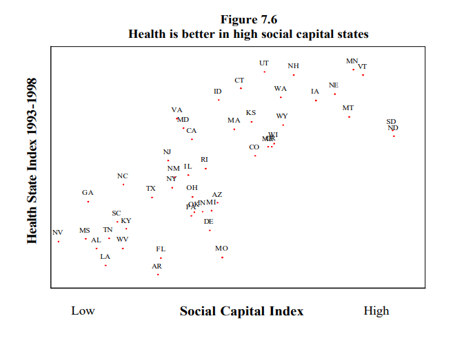

The idea of social capital has interested me for a long time, but when I finally sat down to read this book, it was painfully dry. It offers an eye-opening investigation into the many ways that civic engagement has declined in the US, but it was a real slog to get through.

<!--more-->

I find [the idea of social capital](/book-reports/bowling-alone/#social-capital) fascinating, and I was hoping the book would delve further into how to foster social capital in a community. Social capital profoundly affects society, but people forget about it when considering policy issues. In that way, the book reminded me of [_Happy City_](/book-reports/happy-city/), which described how city design affects happiness and community bonds among residents. The difference is that _Happy City_ found ways to make the research lively and engaging, whereas _Bowling Alone_ felt like it was endlessly throwing charts at me.


**Note**: A [revised 2020 edition](https://www.indiebound.org/book/9781982130848) came out while I was reading the book, but my notes are for the [first edition](https://www.indiebound.org/book/9780743203043), published in 2001.


---

## What I Liked

- The history of social and political group membership in the US was interesting.
- The [correlations](#social-capital-indexhttpswwwoecdorginnovationresearch1825848pdf) between measures of civic engagement and other measures of social well-being were surprising and enlightening.
- The middle third of the book was engaging, especially the discussion of how television has affected social capital.

## What I Disliked

- It's extremely dry.
  - It buries the reader in graphs and statistics to an extent far beyond what was necessary to make the point.
- The book repeatedly refers to social networking as "computer-mediated communication."
  - I know Putnam wrote it in 2001, but I don't remember anyone calling it that, even then.
- Putnam's proposed remediations felt vague.
  - There's a whole section of the book about ways to fix the issues he raises, but it frames the answers as, "what should we do as a society?" as opposed to concrete steps that an individual can take.

## Key Takeaways

### Social capital

- **Social capital** is the value generated from people in a community knowing and interacting with one another.
- Generalized reciprocity

  - People in high-trust communities do favors for one another without expecting reciprocity immediately because they're confident they'll receive a favor later.
  - Generalized reciprocity makes communities more efficient because obligations don't need to be settled immediately.
  - Generalized reciprocity is like moving from a system of barter, where goods are traded for other goods, to a system of cash, where everyone trusts that the cash can later be traded for other goods.

- Bonding vs. bridging social capital
  - "Bonding social capital" is the value of close relationships in a community.
    - Good for encouraging kind behavior, donating to charity, helping neighbors.
  - "Bridging social capital" is the value of loose networks of acquaintances.
    - Good for finding jobs.

### Trends of civic disengagement in the US

- Political campaigns

  - Political campaigns now reach many more people than they did a century ago, but it's because they've switched from in-person gatherings and door-to-door visits to direct mail and telemarketing.

- Drops after the 1970s

  - Between the 1970s and 1990s, most forms of civic participation (e.g., attending town meetings, making a public speech) dropped by 30-40%.
  - The activities that dropped the least were solitary forms of civic participation like writing a letter to a newspaper or congressperson, but even these dropped by 10%.

- Club membership
  - Americans still outrank almost every other nation in terms of percentage of citizens involved in clubs and organizations.
  - Throughout the 1900s, the number of membership organizations increased, but the average size shrunk.
    - Organizations also focused less on meetings and more on mailing lists, where people are "members" by virtue of writing a check every year, but they don't attend any meetings.

### Machers and schmoozers

- The terms "macher" and "schmoozer" come from Yiddish.
- "Macher" - a person who spends a lot of time participating in formal organizations.
  - e.g., current events, church and club meetings, work on community projects
- "Schmoozer" - a person who spends time on informal conversations and gatherings.
  - e.g., dinner parties, bars, night clubs, barbecues
- Men are more likely to be machers, though it's likely a function of employment rather than gender.
  - When women began entering the workforce, there was a proportional increase in women entering formal membership organizations.
- The frequency of informal social gatherings declined consistently in the US throughout the second half of the 20th century.

### Americans and playing cards

- Americans apparently used to **really** love playing cards.
- A survey in 1958 revealed that one in three adults regularly played bridge.
- In the 1970s, 40% of adults reported playing cards once a month.
- In 1940, 87% of homes had a deck of cards.
  - For comparison, only 83% had radios, and 36% had phones.

### Reciprocity, honesty, and trust

- French diplomat Alexis de Tocqueville described Americans' cooperation with one another as ["self interest rightly understood."](https://history.hanover.edu/courses/excerpts/111tocqueville.html)
- A society with generalized reciprocity reduces the "transaction costs" of everyday interaction.
  - It's easy to go about your business when you don't have to worry whether you locked your door or if the cashier is pocketing some of your change.
- Dense social networks encourage honest behavior.

  - The knowledge that reputations persist and spread encourages honest behavior.
  - If you interact with someone once, you're likely to interact with them in the future, so they'd remember if you did something dishonest.

- Thick trust vs. thin trust

  - Thick trust: you trust someone based on specific knowledge of them.
  - Thin trust: you trust someone because trust is the default in your community.
  - Thin-trust communities tend to have greater civic engagement.

- Decline in trust
  - Between 1960 to 2000, people who agreed with the survey question, "most people can be trusted," dropped from 55% to 35%.
    - Interestingly, the decline comes from new generations.
    - Individuals tend to maintain the same level of trust as they age, but younger generations start at a lower baseline level of trust and drive trends down.

### Urban sprawl

- Sprawl diminishes civic engagement, as commuting soaks up non-work time and separates people from their communities.

### TV

- TV is likely a significant factor in America's reduced civic engagement.
- TV is the fastest-growing consumer product in the US.

  - It went from 1% penetration to 75% of American households in just seven years.
    - Telephones took 67 years.
    - Cars took 52 years.
    - Radio took 14 years.
    - Internet was ~15 years.

- Newspaper readership declined as TV viewership increased.

  - Initially, people thought that newspaper readers were switching to TV news, but it turns out most TV news watchers also read the newspaper. TV news is generally a supplement to newspapers, not a replacement.
  - Declines in newspaper readership are mostly due to generational succession. People within the same age cohort continue reading the newspaper at the same rate, but the next generation reads substantially less.

- Soaking up leisure time

  - Between 1965 and 1995, Americans gained an average of six extra hours per week of leisure time. Over the same time, the average time watching TV swelled to six hours per week, suggesting that TV absorbed almost all of the gains in leisure time.
  - Americans spend 3-4x as much time watching TV as they do talking to their spouse and 6-7x as much as they spend participating in community activities.

- Anti-social behavior

  - In surveys, the amount of TV that people watch is strongly correlated with many antisocial behaviors.
    - Heavy TV watchers are more likely to experience road rage, less likely to attend club meetings, less likely to attend church, less likely to stay in touch with friends.

- [Notel, Unitel, and Multitel](http://sk.sagepub.com/reference/childmedia/n325.xml)

  - Researchers observed one Canadian town that had no TV reception or cable access until 1970. As soon as they got TV, their civic participation dropped.

### Suicide rates

- In 1950, suicide was least common among younger people and most common among older people.
- Between 1950 and 1990, suicide rates for all age groups converged to a rough average across all ages.

### [Social capital index](https://www.oecd.org/innovation/research/1825848.pdf)

- Putnam created a "social capital index" that aggregates various measures of civic engagement into a single score.
- Putnam's index correlates closely with many measures of a healthy society.
  - Unexpected bit of trivia: South Dakota scores well on almost all of these metrics.

{{}}
{{}}
{{}}
{{}}
