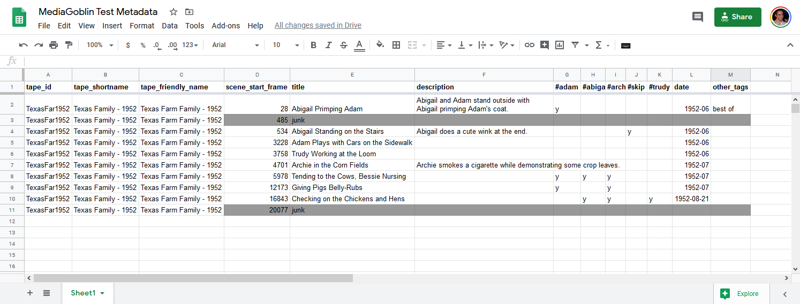
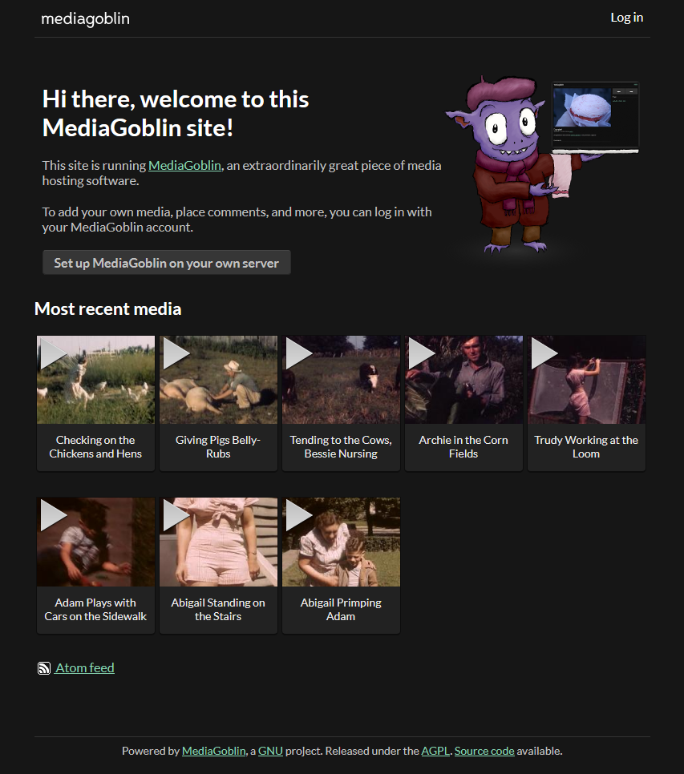
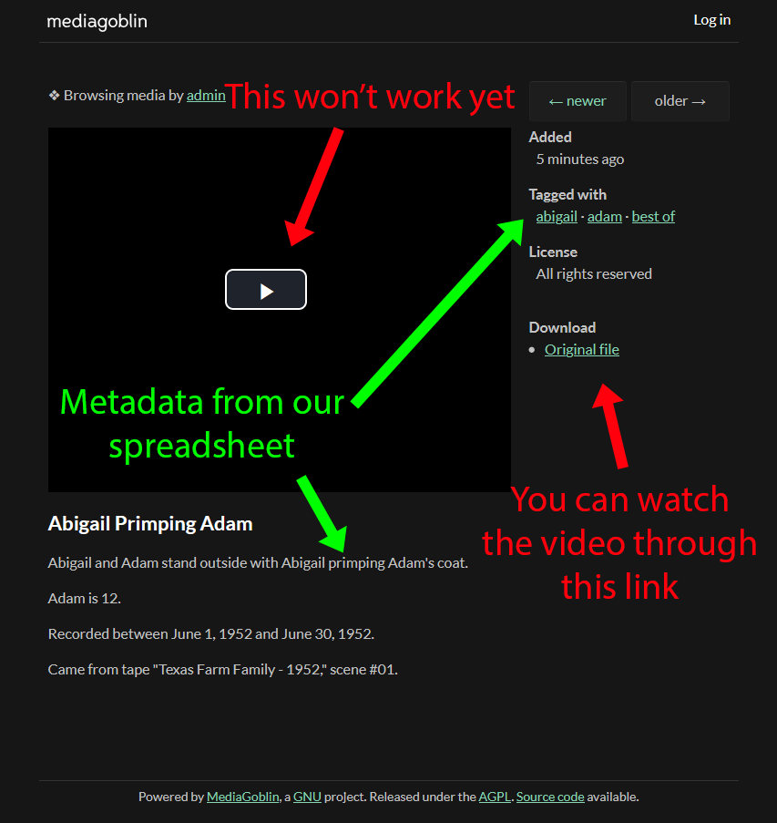
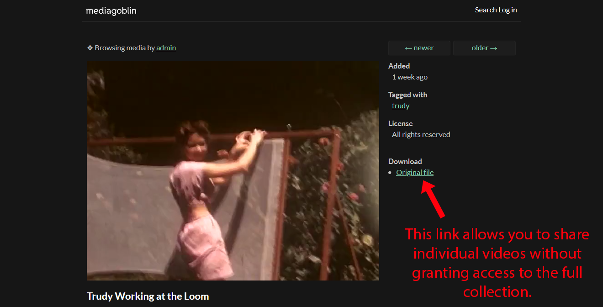

## Goal

This tutorial shows you how to edit digitized video captures into smaller clips that you can publish on your own password-protected [MediaGoblin](https://mediagoblin.org/) server. You'll use a free [Heroku](https://heroku.com) dyno, so your only ongoing cost for running this private media server is the cost of storage on Google Cloud Storage, which is 2.3 cents per GB.

I used this workflow to edit and share my family's home videos at a cost of only $0.77 per month. For the detailed backstory, check out the blog post, "[My Eight-Year Quest to Digitize 45 Videotapes](/digitizing-1/)." You can use this workflow for any kind of video file that contains lots of subclips that you'd like to chop out and share.

## Pre-requisites

- Python 3
- virtualenv
- Git
- Docker
- ffmpeg
- A video player
  - Ideally one with an edit timeline like [Adobe Premiere Elements](https://www.adobe.com/products/premiere-elements.html) or [OpenShot](https://www.openshot.org/).
- A free Heroku account
  - And the [Heroku CLI](https://devcenter.heroku.com/articles/heroku-cli)
- A Google Cloud Platform account (with billing enabled)
  - And the [Google Cloud SDK](https://cloud.google.com/sdk/docs/quickstarts)

## Demo video

As an example, the video I use throughout this tutorial is a [public domain home video](https://archive.org/details/TexasFar1952) from a Texas family in the 1950s:



To download this video, run the commands below:

```bash
VIDEO_URL="https://github.com/mtlynch/free-usage-videos/blob/master/texas-farm-family-1952/TexasFar1952.mp4?raw=true"
RAW_VIDEOS_DIR="${HOME}/videos-raw"
RAW_VIDEO="${RAW_VIDEOS_DIR}/TexasFar1952.mp4"

mkdir -p "$RAW_VIDEOS_DIR"
wget "$VIDEO_URL" -O "$RAW_VIDEO"
```

## Annotating

Video files are made up of a series of frames. To identify the start and ends of clips in your video files, you need a way of identifying the frame number that corresponds to a position in playback. To do that, you can use ffmpeg to make a scratch copy of the original video with frame annotations:

```bash
ANNOTATED_VIDEO=TexasFar1952-annotated.mp4
ffmpeg \
  -i "$RAW_VIDEO" \
  -vf "drawtext=fontfile=Arial.ttf: text='%{frame_num}': start_number=1: x=(w-tw)/2: y=h-(2*lh): fontcolor=black: fontsize=20: box=1: boxcolor=white: boxborderw=5" \
  -c:a copy \
  "$ANNOTATED_VIDEO"
```

That creates a copy of the video that looks like this:

{{}}

## Cataloging

Now, it's time to catalog the footage on the tape. You'll go through the video to identify individual scenes, who appears in them, and what's happening.

Open up your favorite video player. I think [Adobe Premiere Elements](https://www.adobe.com/products/premiere-elements.html) is best for this, but you can also try the free [OpenShot editor](https://www.openshot.org/). Any video player will technically work, but you'll save time if you choose one that supports stepping through frame by frame and a zoomable timeline.

Next, create a spreadsheet. You can start with [mine](https://docs.google.com/spreadsheets/d/1kuamVFEYBrOI097IWBQ8sB0q37ZRACYe2o389Ag92zI/edit?usp=sharing). I'll explain the fields below:

{{}}

- `tape_id`: This is the filename (without extension) of the video file.
- `tape_shortname`: This is a shortname you want to identify files that came from this raw file. It can be the same as `tape_id`.
- `tape_friendly_name`: When MediaGoblin displays which tape this clip came from, it will use this field. If there's a more descriptive name than the tape's filename, use it here.
- `scene_start_frame`: The number of the first frame where the clip begins.
  - In the example Texas Farm footage, the first few frames are blank, so the first clip starts at frame 28.
- `title`: A title for this scene. This will be the title used in output filenames and in MediaGoblin's thumbnails.
  - To tell `render_scenes` to ignore a segment of footage, title it `junk`.
- `description`: (optional) A description of what's happening in the scene. This will appear under the clip in MediaGoblin's watch video view.
- hashtags: After the `description` column, you can create tags prefixed by a hash mark. Any clip with a `y` (or any value) in a hashtag column will have that tag added to the clip in MediaGoblin.
  - For example: Row 9 in my spreadsheet has `y` under columns `#adam` and `#archie`. When `publish_to_mediagoblin` adds the clip to MediaGoblin, it will add the tags `adam` and `archie` to the clip.
  - The purpose of these columns is if you have family members or pets that you want to tag in videos, you can add columns with their hashtag and put a `y` in this column for each clip they appear in.
- `date`: The date the clip was recorded.
  - This can be in one of the following formats:
    - `YYYY-MM-DD`
    - `YYYY-MM`
    - `YYYY`
- `other_tags`: Add any additional tags you want to apply to the clip in a comma-separated list.

When you run `render_scenes` (below), it will chop the video into shorter clips using this naming scheme:

- `[tape_shortname] - [clip index] - [title].mp4`

For example:

- `Texas Family - 1952 - 05 - Archie in the Corn Fields.mp4`

## Create a scenes YAML file

Now that you have the clips catalogued, you can use my script to convert the CSV into a YAML file that instructs my other scripts how to chop up the videos and import them to MediaGoblin.

```bash
git clone https://github.com/mtlynch/process-home-videos.git
cd process-home-videos
mkdir -p ./venv
virtualenv --python python3 ./venv
. venv/bin/activate
pip install --requirement requirements.txt
```

Next, you'll need to create a configuration file. Copy `config.example.yaml` from `process-home-videos` to `config.yaml`, and edit it for your clips based on the instructions in the file.

```bash
cp config.example.yaml config.yaml
```

Now, create paths for the CSV and YAML files of clip metadata:

```bash
MEDIAGOBLIN_METADATA="${HOME}/mediagoblin-meta"
mkdir -p "$MEDIAGOBLIN_METADATA"
# Path to the CSV you created.
SCENES_CSV="${MEDIAGOBLIN_METADATA}/scenes.csv"
# Path to output file to create.
SCENES_YAML="${MEDIAGOBLIN_METADATA}/scenes.yaml"
```

If you're following along with my spreadsheet example, you can download it as a CSV:

```bash
CSV_URL="https://docs.google.com/spreadsheets/d/1kuamVFEYBrOI097IWBQ8sB0q37ZRACYe2o389Ag92zI/export?format=csv&id=1kuamVFEYBrOI097IWBQ8sB0q37ZRACYe2o389Ag92zI&gid=401061703"
wget "$CSV_URL" -O "$SCENES_CSV"
```

Run the following script to convert your CSV to a YAML file:

```bash
app/csv_to_yaml.py \
  --config config.yaml \
  "$SCENES_CSV" \
  > "$SCENES_YAML"
```

This creates a YAML file like the following:

```bash
$ head -n 19 "$SCENES_YAML"
- description: 'Abigail and Adam stand outside with Abigail primping Adam''s coat.


    Adam is 12.


    Recorded between June 1, 1952 and June 30, 1952.


    Came from tape "Texas Farm Family - 1952," scene #01.'
  duration_frames: 457
  raw_source_filename: TexasFar1952.mp4
  rendered_filename: Texas Family - 1952 - 01 - Abigail Primping Adam.mp4
  tags:
  - abigail
  - adam
  - best of
  timecode_start: '0:00:00.934267'
  title: Abigail Primping Adam
```


This was kind of a silly design choice I made. The other scripts could have just read the CSV, but this is what I did.


## Chop up the clips

Now that you have all your metadata ready, it's time to chop the large video file into a series of smaller clips:

```bash
# Specify the directory where the script should write out the processed clips.
PROCESSED_CLIPS_DIR="${HOME}/videos-processed"
mkdir -p "$RAW_VIDEOS_DIR"

app/render_scenes.py \
  --metadata "$SCENES_YAML" \
  --raw_videos_dir "$RAW_VIDEOS_DIR" \
  --output_clips_dir "$PROCESSED_CLIPS_DIR"
```

When the script is done, you should have a folder that looks like this:

```bash
$ ls "$PROCESSED_CLIPS_DIR"
'Texas Family - 1952 - 01 - Abigail Primping Adam.mp4'
'Texas Family - 1952 - 02 - Abigail Standing on the Stairs.mp4'
'Texas Family - 1952 - 03 - Adam Plays with Cars on the Sidewalk.mp4'
'Texas Family - 1952 - 04 - Trudy Working at the Loom.mp4'
'Texas Family - 1952 - 05 - Archie in the Corn Fields.mp4'
'Texas Family - 1952 - 06 - Tending to the Cows, Bessie Nursing.mp4'
'Texas Family - 1952 - 07 - Giving Pigs Belly-Rubs.mp4'
'Texas Family - 1952 - 08 - Checking on the Chickens and Hens.mp4'
```

## Create MediaGoblin files

With your clips processed, you're ready to upload files to MediaGoblin. You'll first import your videos and metadata into an instance of MediaGoblin on your local machine. This allows MediaGoblin to convert your files into an internal database and file structure that you can reuse to run your MediaGoblin instance in the cloud.

To begin, populate your environment information into `mediagoblin.ini`, MediaGoblin's configuration file.


**Note**: To help distinguish between paths on your host machine and paths _within_ your MediaGoblin Docker container, I've followed the naming convention that the `MG_` prefix refers to your host machine and `MGC_` refers to paths within your Docker container.


```bash
MG_CONFIG=$(mktemp)
wget digitizing-home-videos-walkthrough/mediagoblin.ini \
  -O "$MG_CONFIG"

# Path to MediaGoblin's home directory within the container.
MGC_HOME="/var/lib/mediagoblin"
MGC_DB_PATH="${MGC_HOME}/mediagoblin.db"

# Update the relevant lines in the config file.
sed \
  --in-place \
  "s@.*sql_engine = .*@sql_engine = sqlite:///${MGC_DB_PATH}@" \
  "$MG_CONFIG"
```

Now launch the container:

```bash
# This is a path on the host machine that will receive the files the MediaGoblin
# container generates.
MG_SERVING_DIR=$(mktemp --directory)

# These are paths within the MediaGoblin container.
MGC_INPUT_VOLUME="/opt/input-videos"
MGC_APP_DIR="/srv/mediagoblin.example.org/mediagoblin"

# Name for MediaGoblin Docker container.
MGC_NAME=mediagoblin

docker run \
  --tty \
  --detach \
  --publish 6543:6543 \
  --volume "${PROCESSED_CLIPS_DIR}:${MGC_INPUT_VOLUME}" \
  --volume "${MG_CONFIG}:${MGC_APP_DIR}/mediagoblin_host.ini" \
  --volume "${MG_SERVING_DIR}:${MGC_HOME}" \
  --name "$MGC_NAME" \
  mtlynch/mediagoblin
```

The command above mounts several paths on your host machine into the MediaGoblin container, allowing you to share files between your host and MediaGoblin:

- `PROCESSED_CLIPS_DIR` allows MediaGoblin to read the clips you created above.
- `MG_CONFIG` specifies the configuration file for MediaGoblin to use.
- `MG_SERVING_DIR` receives the video and thumbnail files when MediaGoblin places them on its local filesystem.

When you run the container, MediaGoblin will take a few seconds to start up. You can monitor progress by running

```bash
docker logs "$MGC_NAME" -f
```

When the server is ready, you'll see lines like the following:

```text
Starting server in PID 26.
Serving on http://0.0.0.0:6543
```

You can visit [http://localhost:6543](http://localhost:6543) to verify the MediaGoblin server is up and running.


**Note**: If you'd like, you can log in with username `admin`, password `admin`, but logging in is not necessary.


Run the following script to import your clips and metadata into MediaGoblin:

```bash
MEDIAGOBLIN_PUBLISH_HISTORY=$(mktemp)
app/publish_to_mediagoblin.py \
  "$MGC_INPUT_VOLUME" \
  --metadata "$SCENES_YAML" \
  --publish_history "$MEDIAGOBLIN_PUBLISH_HISTORY" \
  --container_name "$MGC_NAME"
```

When the script completes, you should see all the clips appear in MediaGoblin's web interface at [http://localhost:6543](http://localhost:6543).

{{}}

If you click a video, you won't be able to view it in the normal video player because MediaGoblin uses a web player that's too old for modern streaming-optimized video formats. You can still watch it if you click the "Original file" link.

{{}}

Don't worry; we'll fix this in the next step so that you'll be able to watch all videos normally in the embedded player.

You're all done with the local container, so tear it down.

```bash
docker rm --force "$MGC_NAME"
```

And Docker took over control of your shared folder. Now it's time to reclaim it.

```bash
sudo chown "${USER}:${USER}" "$MG_SERVING_DIR" --recursive
```

If you examine that directory, you should see something like this:

```bash
find "$MG_SERVING_DIR" -type f
/tmp/tmp.bq7GAbNNNW/media/public/media_entries/8/Texas_Family_-_1952_-_08_-_Checking_on_the_Chickens_and_Hens.mp4
/tmp/tmp.bq7GAbNNNW/media/public/media_entries/8/Texas_Family_-_1952_-_08_-_Checking_on_the_Chickens_and_Hens.thumbnail.jpg
/tmp/tmp.bq7GAbNNNW/media/public/media_entries/5/Texas_Family_-_1952_-_05_-_Archie_in_the_Corn_Fields.mp4
/tmp/tmp.bq7GAbNNNW/media/public/media_entries/5/Texas_Family_-_1952_-_05_-_Archie_in_the_Corn_Fields.thumbnail.jpg
/tmp/tmp.bq7GAbNNNW/media/public/media_entries/1/Texas_Family_-_1952_-_01_-_Abigail_Primping_Adam.thumbnail.jpg
/tmp/tmp.bq7GAbNNNW/media/public/media_entries/1/Texas_Family_-_1952_-_01_-_Abigail_Primping_Adam.mp4
/tmp/tmp.bq7GAbNNNW/media/public/media_entries/4/Texas_Family_-_1952_-_04_-_Trudy_Working_at_the_Loom.thumbnail.jpg
/tmp/tmp.bq7GAbNNNW/media/public/media_entries/4/Texas_Family_-_1952_-_04_-_Trudy_Working_at_the_Loom.mp4
/tmp/tmp.bq7GAbNNNW/media/public/media_entries/7/Texas_Family_-_1952_-_07_-_Giving_Pigs_Belly-Rubs.mp4
/tmp/tmp.bq7GAbNNNW/media/public/media_entries/7/Texas_Family_-_1952_-_07_-_Giving_Pigs_Belly-Rubs.thumbnail.jpg
/tmp/tmp.bq7GAbNNNW/media/public/media_entries/6/Texas_Family_-_1952_-_06_-_Tending_to_the_Cows_Bessie_Nursing.thumbnail.jpg
/tmp/tmp.bq7GAbNNNW/media/public/media_entries/6/Texas_Family_-_1952_-_06_-_Tending_to_the_Cows_Bessie_Nursing.mp4
/tmp/tmp.bq7GAbNNNW/media/public/media_entries/3/Texas_Family_-_1952_-_03_-_Adam_Plays_with_Cars_on_the_Sidewalk.thumbnail.jpg
/tmp/tmp.bq7GAbNNNW/media/public/media_entries/3/Texas_Family_-_1952_-_03_-_Adam_Plays_with_Cars_on_the_Sidewalk.mp4
/tmp/tmp.bq7GAbNNNW/media/public/media_entries/2/Texas_Family_-_1952_-_02_-_Abigail_Standing_on_the_Stairs.mp4
/tmp/tmp.bq7GAbNNNW/media/public/media_entries/2/Texas_Family_-_1952_-_02_-_Abigail_Standing_on_the_Stairs.thumbnail.jpg
/tmp/tmp.bq7GAbNNNW/mediagoblin.db
/tmp/tmp.bq7GAbNNNW/.cache/gstreamer-1.0/registry.x86_64.bin
```

## Configuring Google Cloud Storage

The purpose of the last step was for MediaGoblin to generate a database, file layout, and video thumbnails for all of your clips. Now, it's time to deploy MediaGoblin to a cloud server so that you can access it from anywhere, not just your local machine.

### Create a new Google Cloud Platform project (optional)

If you want a clean Google Cloud Platform project for your MediaGoblin files, you can create one with the commands below. If you'd prefer to use an existing project, set `GCP_PROJECT_ID` to the project ID you'd like to use and skip this section.

```bash
GCP_PROJECT_NAME="mediagoblin"
RANDOM_SUFFIX=$(head /dev/urandom | tr -dc 'a-z0-9' | head -c 16 ; echo '')
GCP_PROJECT_ID="${GCP_PROJECT_NAME}-${RANDOM_SUFFIX}"
gcloud projects create \
  "$GCP_PROJECT_ID" \
  --name "$GCP_PROJECT_NAME" \
  --set-as-default
```

You'll need to link your new project to a billing account. For a list of your billing accounts, run:

```bash
gcloud beta billing accounts list
```

Then replace `BILLING_ACCOUNT` with the account you want to bill for this storage bucket:

```bash
BILLING_ACCOUNT="0X0X0X-0X0X0X-0X0X0X" # Replace with account from the list
gcloud beta billing projects link \
  "$GCP_PROJECT_ID" \
  --billing-account "$BILLING_ACCOUNT"
```

### Create a storage bucket

Next, create a Google Cloud Storage bucket for your files. I created a bucket that makes all objects public, but I'm relying on the difficulty of guessing the random bucket name.


The 24-character random suffix means that there are 36<sup>24</sup> = 2.24 x 10<sup>37</sup> possibilities. In other words, the attacker would need to guess ~10<sup>37</sup> bucket names until they find yours. This is on par with guessing a 128-bit private key.


```bash
RANDOM_SUFFIX=$(head /dev/urandom | tr -dc 'a-z0-9' | head -c 24 ; echo '')
BUCKET_NAME="mediagoblin-${RANDOM_SUFFIX}"

# All the videos need to be public for users to access them directly from the
# browser, but we're adding enough entropy to the bucket name to make it
# infeasible for unauthorized users to access the files by guessing or
# enumerating URLs.
UNIFORM_ACCESS="on"

# Bucket storage properties. You can adjust these depending on your preferences.
STORAGE_CLASS="Standard"
BUCKET_LOCATION="US-EAST1"

# Create the GCS bucket.
gsutil mb \
  -p "$GCP_PROJECT_ID" \
  -c "$STORAGE_CLASS" \
  -l "$BUCKET_LOCATION" \
  -b "$UNIFORM_ACCESS" \
  "gs://${BUCKET_NAME}/"

# Set uniform access policy for the bucket.
# We use legacyObjectReader because it grants read access to individual files but
# prevents clients from exploring the bucket's contents.
gsutil iam ch allUsers:roles/storage.legacyObjectReader "gs://${BUCKET_NAME}"
```

### Copy your files to Google Cloud Storage

Remember the files that [the MediaGoblin container generated](#create-mediagoblin-files) in your `MG_SERVING_DIR` directory? Move them to the Google Cloud Storage bucket you just created:

```bash
gsutil -m cp -r "${MG_SERVING_DIR}/media/public/*" "gs://${BUCKET_NAME}/"

RANDOM_FOLDER=$(head /dev/urandom | tr -dc 'a-zA-Z0-9' | head -c 16 ; echo '')
gsutil cp "${MG_SERVING_DIR}/mediagoblin.db" "gs://${BUCKET_NAME}/${RANDOM_FOLDER}/"

# Save the public URL of the mediagoblin.db file.
MEDIAGOBLIN_DB_URL="https://storage.googleapis.com/${BUCKET_NAME}/${RANDOM_FOLDER}/mediagoblin.db"
```


**Note**: I add an extra layer of randomness for the location of the `mediagoblin.db` because otherwise anyone who knows the bucket name can discover the database file. Adding entropy in this way allows you to [share individual videos](#bonus-share-individual-videos) without exposing the entire collection.


## Deploying to Heroku

Now that your media files are in an Internet-accessible location on Google Cloud Storage, all that's left is to deploy your MediaGoblin server. I use Heroku because it offers a generous free tier for Docker containers, and it's easy to set up.

If you haven't already authenticated the Heroku CLI on this machine, log in with your Heroku credentials:

```bash
heroku login --interactive
```

Next, authenticate to Heroku's container registry and create a new Heroku app. By default, the created app will be a free Heroku dyno:

```bash
heroku container:login

RANDOM_SUFFIX=$(head /dev/urandom | tr -dc 'a-z0-9' | head -c 10 ; echo '')
HEROKU_APP_NAME="mediagoblin-${RANDOM_SUFFIX}"
heroku apps:create "$HEROKU_APP_NAME"
```

The final step is to customize the Docker build with your authentication settings and title, then push it to Heroku for serving:

```bash
pushd $(mktemp -d)

REPO="https://github.com/mtlynch/mediagoblin-docker.git"
# This is a special branch I created that adds authentication and adds a few
# other features.
TARGET_BRANCH="mtlynch-custom"
git clone --single-branch --branch "$TARGET_BRANCH" "$REPO" .

HTTP_AUTH_USER="mediagoblin" # change this to a username you choose
HTTP_AUTH_PASS="goblinmedia" # change this to a password you choose

# Title you want for your MediaGoblin server.
HTML_TITLE="My Demo MediaGoblin Server"

heroku container:push web \
    --app "$HEROKU_APP_NAME" \
    --arg "HTTP_AUTH_USER=${HTTP_AUTH_USER},HTTP_AUTH_PASS=${HTTP_AUTH_PASS},GCS_BUCKET=${BUCKET_NAME},MEDIAGOBLIN_DB_URL=${MEDIAGOBLIN_DB_URL},HTML_TITLE=${HTML_TITLE}"

heroku container:release --app "$HEROKU_APP_NAME" web && \
  printf "Your app is live at https://${HEROKU_APP_NAME}.herokuapp.com/\n"
```

If all went well, you should see the URL of your new MediaGoblin instance like this:

```bash
Your app is live at https://mediagoblin-v5lmqis51k.herokuapp.com/
```


**Note**: Because you're using Heroku's free tier, Heroku launches your MediaGoblin instance on-demand when you request it in the browser. This means that your first page load will take 30-60 seconds and you my see an HTTP 502 Gateway timeout error. This is normal. After the app is serving, it will be quick and responsive until you let it sit idle for a few hours.


I've published mine, though in the interest of limiting shenanigans, I've disabled the ability to log in as MediaGoblin's admin user:

- **URL**: [https://mediagoblin-v5lmqis51k.herokuapp.com](https://mediagoblin-v5lmqis51k.herokuapp.com)
- **Username**: `mediagoblin`
- **Password**: `goblinmedia`

### Bonus: Share individual videos

If you're using this process to store family videos, you probably want your family to have the ability to browse and access all videos, but sometimes you want to share individual videos with others without giving them access to your entire collection.

If you want to do that, click the "Original file" link in the MediaGoblin interface:

{{}}

This will give the guest access to that individual file, but because of the way you [configured Google Cloud Storage bucket permissions](#create-a-storage-bucket), they won't be able to explore the library and access other videos.

The "original file" link gives you a URL that looks like this:

- <https://storage.googleapis.com/mediagoblin-39dpduhfz1wstbprmyk5ak29/media_entries/4/Texas_Family_-_1952_-_04_-_Trudy_Working_at_the_Loom.mp4>

As you can see, given the above URL, you can watch that single video, but it's not possible to explore the bucket to find other videos.

---

## Source code

| Repository                                                            | Description                                                                                                                                                                                                                                                                                                                                                               |
| --------------------------------------------------------------------- | ------------------------------------------------------------------------------------------------------------------------------------------------------------------------------------------------------------------------------------------------------------------------------------------------------------------------------------------------------------------------- |
| [MediaGoblin](https://github.com/mtlynch/mediagoblin)                 | Mirror of the MediaGoblin core repo + Circle CI configuration.<br><br>The branch [mtlynch-custom](https://github.com/mtlynch/mediagoblin/tree/mtlynch-custom) has custom fixes for my instance (replaces their old video player and trims some parts of their UI that I don't need).                                                                                      |
| [mediagoblin-docker](https://github.com/mtlynch/mediagoblin-docker)   | Builds a Docker image for MediaGoblin.<br><br>The branch [mtlynch-custom](https://github.com/mtlynch/mediagoblin-docker/tree/mtlynch-custom) builds with my customizations, which include pointing to a Google Cloud Storage bucket and adding [HTTP Basic Authentication](https://developer.mozilla.org/en-US/docs/Web/HTTP/Authentication#Basic_authentication_scheme). |
| [process-home-videos](https://github.com/mtlynch/process-home-videos) | Python scripts for chopping up raw video files into clips and then publishing those clips to MediaGoblin.                                                                                                                                                                                                                                                                 |
