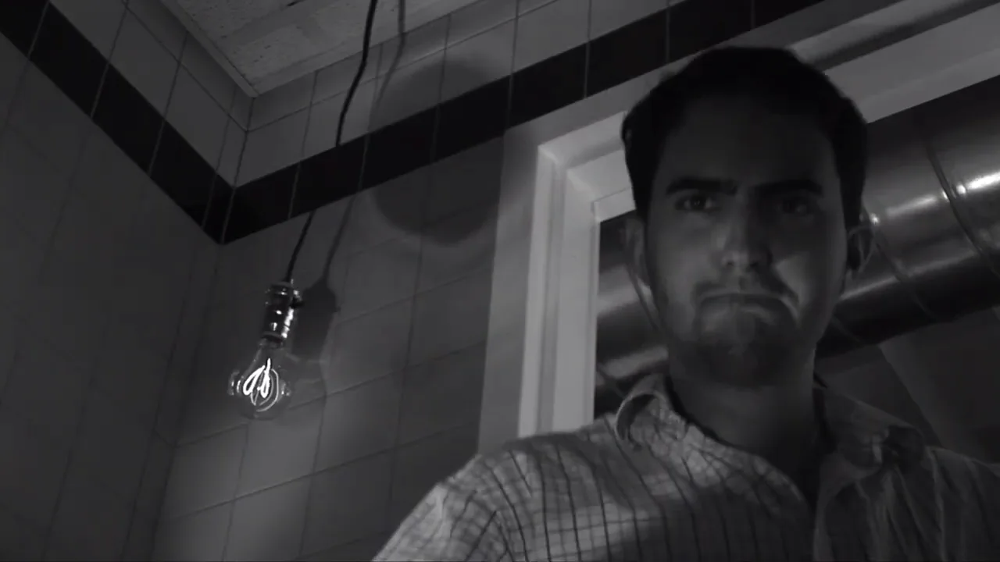

_Aardvark'd: 12 Weeks with Geeks_, the 2005 documentary about Fog Creek's internship program was recently [published for free on YouTube](https://www.youtube.com/watch?v=YbrkZ07LKbk).

At the time of this writing, it has 41 views, which is surprisingly low for a movie that features early interviews with many people who would go on to much greater fame and success, such as:

- Joel Spolsky and Michael Pryor (StackOverflow, Trello, Glitch founders)
- Paul Graham and Jessica Livingston (Y Combinator founders)
- Aaron Swartz, Steve Huffman, and Alexis Ohanian (reddit founders)

{{}}

_Aardvark'd_ follows four college interns at Fog Creek as they design, implement, and launch a completely new software product. As a documentary, it's mediocre, but as a time capsule of independent tech industry in 2005, it's great!

I watched the documentary for the first time, and I went down a bit of a rabbit hole researching what happened to all the subjects of the documentary 18 years later.

## What was going on in 2005?

To understand what makes _Aardvark'd_ a fun watch, you have to understand what was going on at the time.

### Fog Creek Software

In 2005, Joel Spolsky was 40 years old. He had co-founded Fog Creek XX years prior. Fog Creek only had XX employees.

Fog Creek was profitable and Joel was one of the most popular software bloggers in the world, but Fog Creek wasn't making crazy money. It would still be years before Joel's mega-hit products like StackOverflow (year XX) or Trello (year XX).

At one point in the documentary, Joel Spolsky brings Fog Creek to present at a "software trade show" which the viewer soon learns is a conference for [ColdFusion developers](https://en.wikipedia.org/wiki/Adobe_ColdFusion).

TODO: Photo of Joel Spolsky

### Y Combinator

[Paul Graham](<https://en.wikipedia.org/wiki/Paul_Graham_(programmer)>) and [Jessica Livingston](https://en.wikipedia.org/wiki/Jessica_Livingston) appear in the documentary because they had just co-founded [Y Combinator](https://en.wikipedia.org/wiki/Y_Combinator), which would go on to become one of the most successful startup accelerators in the software industry.

At the time of the documentary, [Paul Graham](<https://en.wikipedia.org/wiki/Paul_Graham_(programmer)>) was 41 years old. Ten years prior, Graham had co-founded [Viaweb](https://en.wikipedia.org/wiki/Viaweb), which is now considered the first software as a service (SaaS) business. Yahoo acquired the company in 1998 for $50M, after which Paul became popular online for [the essays](http://paulgraham.com/articles.html) he publishing on his blog.

[Jessica Livingston](https://en.wikipedia.org/wiki/Jessica_Livingston) was 34 years old. She was not active in the startup community at the time, having come from a career in marketing.

{{}}

Graham and Livingston [had been dating for two years](http://paulgraham.com/worked.html) but weren't married yet. The documentary interviews them in the middle of Y Combinator's first batch of startups, which included a then-unknown project called [reddit](https://en.wikipedia.org/wiki/Reddit).

### reddit

reddit had launched a few months before the documentary began filming, and it was not at all on anyone's radar.

At the time, reddit only allowed users to post links, as there was no support for commenting. [Fark](https://en.wikipedia.org/wiki/Fark), [digg](https://en.wikipedia.org/wiki/Digg), and [slashdot](https://en.wikipedia.org/wiki/Slashdot) were still the dominant platforms for social link sharing.

{{}}

College roommates Steve Huffman and Alexis Ohanian drove to Boston to attend one of Paul Graham's lectures in 2005. After graduating a few months later, they applied to Y Combinator and got accepted with reddit.

TODO: Photos of reddit co-founders

## Amateurish documentary filmmaking

On a technical level, _Aardvark'd_ seemed like it was made by someone who didn't have much experience filming anything. The interviews are uncomfortably close to people's faces, often with harsh lighting and mediocre sound quality.

{{}}

Beyond the technical weaknesses, the documentary feels unfocused. Is it a story about the interns' project? Or is it about the interns themselves? Or is it a story about Fog Creek as a company? Or tech culture in the mid-2000s?

The film flits from topic to topic, but it never feels like it quite tells a cohesive story.

The total runtime is a short 78 minutes, but there still manages to be a lot of dead air. They keep interviewing a programmer at the Fog Creek office about his tomato plant, and it has no relevance to anything. They also do bizarre reenactments of things that didn't matter in the first place, like two of the interns finding a cockroach and getting scared.

{{}}

## The launch day scene

There's one _Aardvark'd_ scene in particular that drove me crazy.

It's the end of the internship, and Fog Creek is finally launching Copilot. Fog Creek's employees start a betting pool with predictions about when they'll make their first sale. Some guessed it would happen within a minute of launch, while others thought it might take up to an hour.

{{}}

But the sale doesn't come. One by one, you see the interns cross out predictions that turned out to be too optimistic. You're watching the team grow increasingly worried that this thing they expected to be a hit might end up a total flop.


{{}}
{{}}


As a founder, I found this moment extremely relatable. There have been so many times where I put weeks or months of work into something that I was sure people would love. Then, after I launch it, I discover that I was completely wrong and nobody's interested in what I built.

The documentary does a great job of capturing that anxiety &mdash; that moment where you haven't definitely failed, but every minute that ticks by without a sale makes it more likely that you've made a big mistake. I've talked about it with other founders, but I've never seen it captured on video.

The problem is that _Aardvark'd_ builds excellent tension in that scene and then seemingly... forgets what it was doing.

The story just moves on to the next thing. The next scene is Joel popping champagne later that day, but it's not even clear if there's been a sale or if they're just celebrating the launch. You never see anyone's sighing in relief or admitting defeat.

TODO: Photo of Joel popping champagne

It would be like if you ended the story of Little Red Riding Hood by saying, "And then Little Red Riding Hood realized her grandmother was a wolf! Suddenly, the wolf threw her to the floor and bared his razor-sharp teeth inches from her neck. Anyway, she ended up being fine. The End."

## What the documentary did well

I think it was relatable, especially because I was a college student at the same time. I felt like it was an accurate picture of culture at young tech firms of that era.

One thing I thought it captured really well was the self-important intern. In _Aardvark'd_, one of the Fog Creek interns speaks very seriously to the camera about how he has to stay grounded because one day, Fog Creek is going to be so big, and he'll be so important within Fog Creek, that people will pass him in the hallway and greet him by name, but he won't know who they are.

It reminded me a lot of a guy in my computer science program who told me how much responsibility he was given at his enviable finance internship. He spoke confidently of his future career with the company, telling me, "the brothers" would take care of him. This was in 2007, and he was describing his internship with [Lehman Brothers](https://en.wikipedia.org/w/index.php?title=Lehman_Brothers&oldid=1165023032#Bankruptcy).

There's a funny moment later on, when that same intern, after spending most of the film thinking he's the smartest guy in the room, realizes a showstopper bug was his fault.

## "Back when they were getting started, they were terrified"

There's a voiceover from Jessica Livingston that summarizes my favorite part of the documentary.

> A lot of these tech startup founders who are extremely successful, back when they were getting started, they were terrified.
>
> They were very unsure of what they were doing. They questioned things, and I'm sure doubted themselves...
>
> And so to see these people as vulnerable people at one point in time is interesting to me.

And it really rang true for me when I think about Steve Huffman, reddit's co-founder and current CEO.

Huffman is currently the widespread target of ire for greedily cutting third party clients out of the platform they helped build. In 2005, he was a lovably doofy-looking kid who had such bad nightmares about reddit having an outage that he had to sleep with his laptop in bed with him.


{{}}
{{}}


## Joel is not big on praise

Joel Spolsky surprisingly stingy with praise. In the penultimate scene, the marketing intern excitedly announces to Joel that he got an article about Fog Creek into the popular business magazine, _Crain's_.

Without turning from his computer screen, Joel Spolsky simply says, "Cool."

The intern stands in Joel's doorway, waiting hopefully for more praise or further acknowledgment. When it doesn't come, he slowly walks back to his desk.

Joel has the final line in the documentary, and it explains a bit more about this interaction:

> We hire people who are really, really brilliant individually and do incredible work. But that's sort of what we expect of them
>
> I don't really feel like it's necessary to puff up their ego too much by saying, "Wow, you did an unbelievable, great thing! Nobody else could have done this."
>
> What I really want to say is, "That's what we expected."

## Fog Creek didn't finance the documentary

In researching the documentary, one of the big surprises was that Fog Creek didn't actually finance it. I had remembered it as essentially a vanity project that Fog Creek funded as advertising, but reading the [job posting](https://www.joelonsoftware.com/2005/03/23/documentary-filmmaker-wanted/), I realized it was more of an angel investor model:

> We’re looking for a filmmaker who will finance and make the film themselves and own the rights. We want someone who can promote the film to typical documentary outlets...

Spolsky said in his blog that he paid the filmmaker $5k stipend and $5k for expenses, but [a later column](https://web.archive.org/web/20230712203549/https://www.inc.com/magazine/20080101/how-hard-could-it-be-the-four-pillars-of-organic-growth.html) he wrote for _Inc._ magazine says, "We ended up paying the filmmaker about $30,000."

It's an interesting choice, and I guess it worked. Fog Creek no longer cares about Copilot or _Aardvark'd_. They've taken the intern's development blog offline, and Joel has deleted many of the artifacts related to Copilot. But the filmmaker still cared enough about _Aardvark'd_ that he uploaded a high-def copy to YouTube 18 years later.

## Aardvark artifacts

https://www.joelonsoftware.com/2005/08/17/the-project-aardvark-spec/

https://web.archive.org/web/20051028171624/https://www.joelonsoftware.com/RandomStuff/copilot_spec.pdf

On using GPL code:

> VNC is GPL. The two components we’re building based on VNC, the helper and victim, will need to bere-released under GPL.
>
> This is not that big a deal. The code will be highly optimized for our own use and will require the reflector to work, which will not be released under GPL.

On CSS:

> We will use CSS for formatting but not positioning since CSS positioning is too buggy on modern browsers: we’ll just use tables for most positioning.

Uses "Apps Hungarian" (also known as "Simonyi notation"), which Joel was a big proponent of.

Uses apps simonyl style, a style Joel strongly supported. Joel admits that coding conventions "doesn't belong in a functional specification, and it should really have been a separate document."

They did release the code, but I unfortunately couldn't find the original version the interns wrote. The earliest version I could find was from 2011, at which point the code had been rewritten from C# to C++. I suspect that was part of the [Copilot 2.0](https://www.joelonsoftware.com/2007/01/26/copilot-20-ships/), as that's when they added Mac support, and they probably didn't feel like running .NET on Mac.

https://web.archive.org/web/20150911071232/https://www.copilot.com/copilot_helper_src.zip/

## _Make Better Software: The Training Series_

Five years later, Fog Creek collaborated once again with Boondoggle Media on a video course called [_Make Better Software: The Training Series_](https://boondogglemedia.com/project/make-better-software/). Fog Creek [used to sell this course](https://web.archive.org/web/20110711014829/http://training.fogcreek.com/order.html) for $2000, but now Boondoggle Media has released it [free on YouTube](https://www.youtube.com/playlist?list=PLcIkt5s7w8D0ywp0CBmNFWRTFZic3pWNn).

I'm watching it, and it's pretty good. It's kind of like a video version of Joel Spolsky's most famous blog posts, and they show how they put those ideas into practice at Fog Creek.

## Where are they now?

### The interns

#### Tyler Griffin Hicks-Wright

- [Tyler's website](https://tghw.com)

In 2012, Tyler left Fog Creek and launched a photo backup business called Snaposit. The company applied for funding from Y Combinator. Tyler's _Aardvark'd_ co-star, Paul Graham, rejected his pitch, and Tyler [shuttered the business a year later](https://tghw.com/blog/well-that-sucks-what-else-you-got).

In 2014, Fog Creek restructured to spin out Trello, its ultra-successful product. As part of the restructuring, Fog Creek sold Copilot to Tyler, who was one of the original implementers and maintained the product for several years as a Fog Creek employee. [acquired the Copilot product from Fog Creek for an undisclosed sum](https://tghw.com/blog/copilot-coming-full-circle). He ran Copilot on the side for eight years before [shutting it down in April 2022](https://news.ycombinator.com/item?id=31192812).

At the time of the shutdown notice, people assumed Tyler was shutting down the company to sell the copilot.com domain Github, who had recently launched a well-known AI product called Copilot. Surprisingly, the buyer wasn't Github but rather a company that makes CRM software for service businesses.

{{}}

#### Michael Lehenbauer

https://twitter.com/mikelehen

According to his LinkedIn, after completing his undergrad at Rose Hulman, he started at Microsoft in 2006. I started a year later. He left in 2011 to join Firebase as employee #2. When Google acquired Firebase in 2014, Michael and I both worked at Google at the same time, though I don't recall ever crossing paths.

We have a mutual friend, and I'm surprised it's just one given so much employer overlap.

#### Ben Pollack

Ben acknowledges the _Aardvark'd_ documentary [on his website](https://www.bitquabit.com/meta/about/), saying:

> Oh, and at one point in my life, I was in a movie, which is available on YouTube if you’re feeling masochistic.

Worked at Fog Creek for several years

Sometimes had public debates with Tyler.

#### Yaron Guez

https://www.yaronguez.com/

Co founder of a very buzzwordy consulting firm
https://www.trestian.com/#about

### Other Fog Creek people

#### Joel Spolsky

#### Michael Pryor

became CEO of trello
https://www.joelonsoftware.com/2014/07/24/trello-inc/

#### Liz Gordon

In the film, Liz Gordon is Fog Creek's recently hired office manager. She's
They shush Liz on her birthday

{{}}

was the office manager and became head of people at Fog Creek, She's now [Elizabeth Hall](https://www.linkedin.com/in/elizabeth-hall-8939551b/) and is chief people officer of [Splash](https://splashthat.com).

https://splashthat.com/about-us

### Y Combinator people

#### Paul Graham

[Married Jessica Livingston in 2008](https://news.ycombinator.com/item?id=205918).

#### Jessica Livingston

In 2007, Jessica Livingston published the well-received book _Founders at Work: Stories of Startups' Early Days_, a collection of interviews with successful startup founders. She continued in her leadership role with Y Combinator.

### Reddit founders

#### Aaron Swartz

He continued working on reddit after Conde Nast acquired it, but he [complained publicly](http://www.aaronsw.com/weblog/officespace) about working within a larger corporation and was fired from the company [in 2007](http://blogoscoped.com/archive/2007-05-07-n78.html).

Aaron died by suicide at 2013 when he was 26 years old. This [followed extreme pressure](https://en.wikipedia.org/wiki/Aaron_Swartz) from the FBI.

Swartz's [blog](http://www.aaronsw.com/weblog/) is still available online, and there's a separate documentary about his life called [_The Internet's Own Boy_](https://archive.org/details/TheInternetsOwnBoyTheStoryOfAaronSwartz).

#### Steve Huffman

Steve Huffman left reddit in 2006 .

He co-founded Hipmunk in 2010, again receiving funding from Y Combinator, but he left in 2015, to re-join reddit as CEO.

#### Alexis Ohanian

Alexis stepped down as CEO. He hasn't founded any major companies, but he serves in an advisory role in many companies. In 2017, he married tennis star [Serena Williams](https://en.wikipedia.org/wiki/Serena_Williams).
