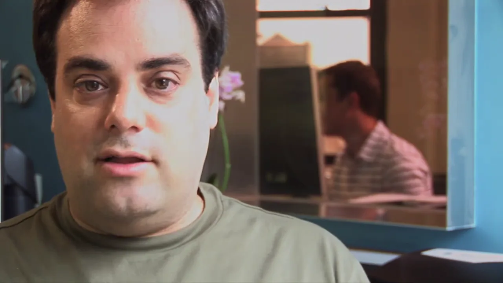
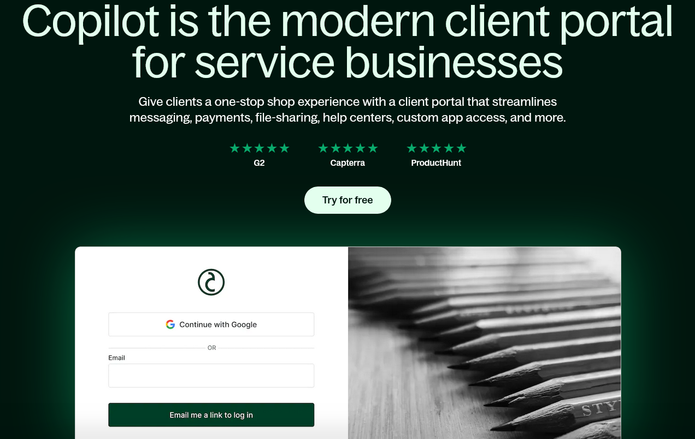

- Dan Bricklin
- Dislike
  - Way too much time on dumb stuff
  - Audio is bad
  - People are overexposed and shot from weirdly close

## What was going on in 2005?

The most enjoyable part is that it's an interesting time capsule

Michael Pryor long speech about cockroaches

Never reveal when the first sale happened

### Fog Creek Software

https://www.joelonsoftware.com/2005/03/23/documentary-filmmaker-wanted/
not actually financed by Fog Creek

At the time of the documentary, Joel was 40 years old. He had co-founded Fog Creek XX years prior. Fog Creek was profitable and Joel was one of the most popular software bloggers in the world, but Fog Creek wasn't making crazy money. Joel hadn't yet co-created StackOverflow or Trello.

Joel is presenting at a "trade show" which turns out to be a ColdFusion conference. The interns admit they don't know what ColdFusion is.

### Y Combinator

Paul Graham is XX years old. He had sold Viaweb to XX XX years prior.

Jessica Livingston is XX years old.

At the time of the documentary,

Jessica Livingston captures why it was interesting - seeing founders when they're vulnerable.

### Reddit

spez is now the widespread target of ire for greedily cutting third party clients out of the platform they helped build. But in 2005, he was a lovably doofy-looking kid who had such bad nightmares about reddit having an outage that he slept in bed with his laptop.

## As a documentary, it's not very good

The fundamental problem seemed like the documentary couldn't decide what it was. Is it a story about the intern project or the interns themselves? Or is it a story about Fog Creek in general? Or is it about tech culture in the mid-2000s?

The documentary tries to be lots of different things, so The total runtime with credits is only 78 minutes, and there's a lot of dead air. They keep interviewing a programmer at the Fog Creek office about his tomato plant, and it has no relevance to anything. They also do bizarre reenactments of things that didn't matter in the first place, like two of the interns finding a cockroach and getting scared.

From just a technical level, it seemed like it was made by someone who didn't have much experience filming anything. The interviews are uncomfortably close to people's faces, often with harsh lighting and mediocre sound quality.

{{}}

## What the documentary did well

At my college, it was the kids who had internships in finance. In 2007, he proudly told me that Lehman Brothers would take care of him

One of the interns says very seriously how he has to stay grounded because one day, Fog Creek is going to be so big, and he so important within Fog Creek, that people will pass him in the hallway and greet him by name, but he won't know who they are.

## Capture vulnerability

TODO: Jessica Livingston's quote

## Joel liked it, apparently

One of the most surprising parts of the documentary is that Joel Spolsky, someone who cares a lot about product quality, thinks _Aardvark'd_ was a good documentary. TODO: Link to part where he says it was good.

And maybe you think, he's of course going to say that. He's financially tied to the movie, so he wants to spin it positively regardless of how he feels.

But five years later, Fog Creek collaborated once again with Boondoggle Media on a video course called [_Make Better Software: The Training Series_](https://boondogglemedia.com/project/make-better-software/). Fog Creek [used to sell this course](https://web.archive.org/web/20110711014829/http://training.fogcreek.com/order.html) for $2000, but now Boondoggle Media has released it [free on YouTube](https://www.youtube.com/playlist?list=PLcIkt5s7w8D0ywp0CBmNFWRTFZic3pWNn).

## Aardvark artifacts

https://www.joelonsoftware.com/2005/08/17/the-project-aardvark-spec/
https://web.archive.org/web/20051028171624/https://www.joelonsoftware.com/RandomStuff/copilot_spec.pdf

On using GPL code:

> VNC is GPL. The two components we’re building based on VNC, the helper and victim, will need to bere-released under GPL.
>
> This is not that big a deal. The code will be highly optimized for our own use and will require the reflector to work, which will not be released under GPL.

On CSS:

> We will use CSS for formatting but not positioning since CSS positioning is too buggy on modern browsers: we’ll just use tables for most positioning.

Uses "Apps Hungarian" (also known as "Simonyi notation"), which Joel was a big proponent of.

Uses apps simonyl style, a style Joel strongly supported. Joel admits that coding conventions "doesn't belong in a functional specification, and it should really have been a separate document."

They did release the code, but I unfortunately couldn't find the original version the interns wrote. The earliest version I could find was from 2011, at which point the code had been rewritten from C# to C++. I suspect that was part of the [Copilot 2.0](https://www.joelonsoftware.com/2007/01/26/copilot-20-ships/), as that's when they added Mac support, and they probably didn't feel like running .NET on Mac.

https://web.archive.org/web/20150911071232/https://www.copilot.com/copilot_helper_src.zip/

## Where are they now?

### Tyler Griffin Hicks-Wright

took it over but then shut it down in 2022
https://tghw.com

He launched another app called Snaposit, failed for the reasons Rob Fitzpatrick would later make obvious in The Mom Test. Rejected from YC from his Aardvark'd co-star Paul Graham.
https://tghw.com/blog/well-that-sucks-what-else-you-got

When Fog Creek restructured to spin out Trello in 2014, Tyler [acquired the Copilot product for an undisclosed sum](https://tghw.com/blog/copilot-coming-full-circle). He ran it on the side for eight years before [shutting it down in April, 2022](https://news.ycombinator.com/item?id=31192812).

At the time of the shutdown notice, people assumed Tyler was shutting down the company to sell the copilot.com domain Github, who had recently launched a well-known product called Copilot. Surprisingly, the buyer wasn't Github but rather a company that makes CRM software for service businesses.

{{}}

### Michael Lehenbauer

https://twitter.com/mikelehen

According to his LinkedIn, after completing his undergrad at Rose Hulman, he started at Microsoft in 2006. I started a year later. He left in 2011 to join Firebase as employee #2. When Google acquired Firebase in 2014, Michael and I both worked at Google at the same time, though I don't recall ever crossing paths.

We have a mutual friend, and I'm surprised it's just one given so much employer overlap.

### Ben Pollack

Ben acknowledges the _Aardvark'd_ documentary [on his website](https://www.bitquabit.com/meta/about/), saying:

> Oh, and at one point in my life, I was in a movie, which is available on YouTube if you’re feeling masochistic.

Worked at Fog Creek for several years

Sometimes had public debates with Tyler.

### Yaron Guez

https://www.yaronguez.com/

Co founder of a very buzzwordy consulting firm
https://www.trestian.com/#about

### Liz Gordon

was the office manager and became head of people at Fog Creek, is now chief people officer of Splash.

https://splashthat.com/about-us

They shush Liz on her birthday

### Michael Pryor

became CEO of trello
https://www.joelonsoftware.com/2014/07/24/trello-inc/

Joel Spolsky surprisingly stingy with praise.
