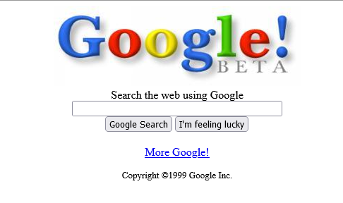
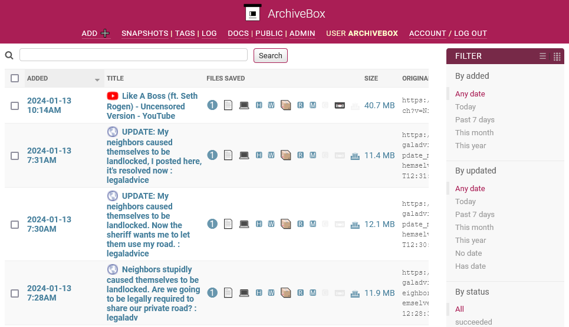
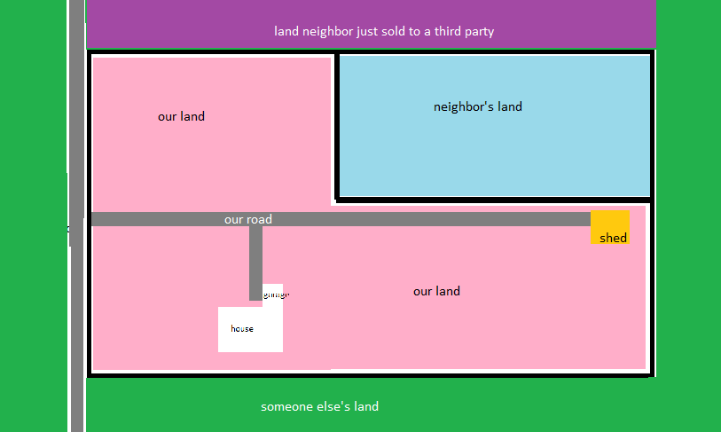
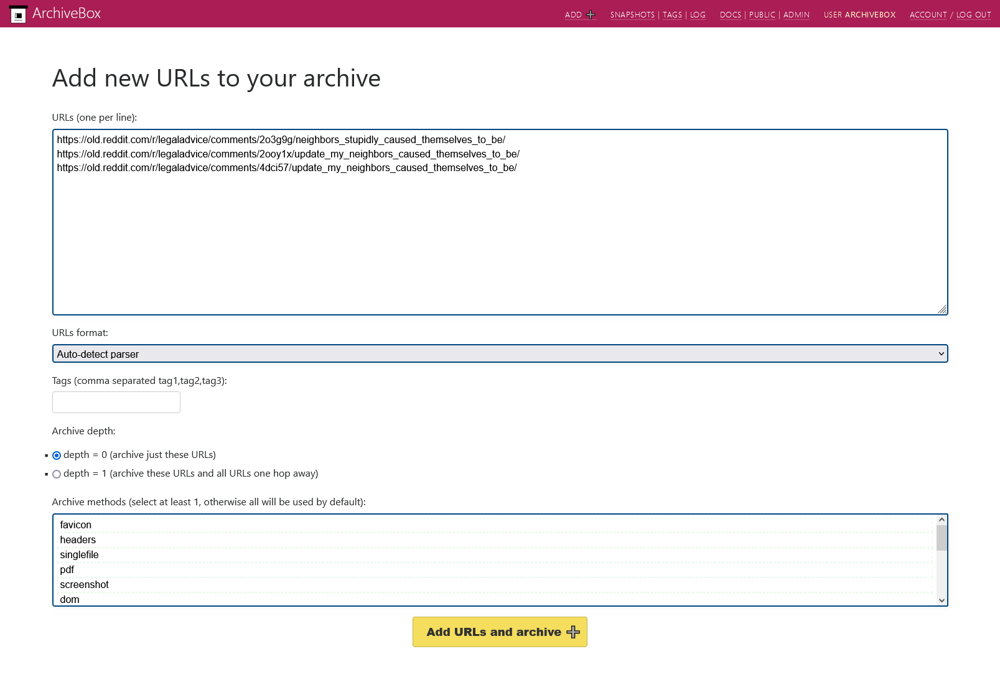
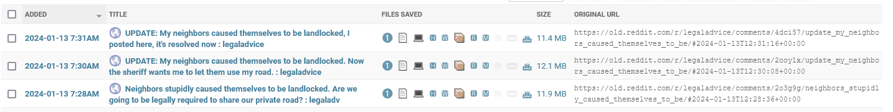
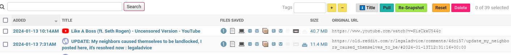
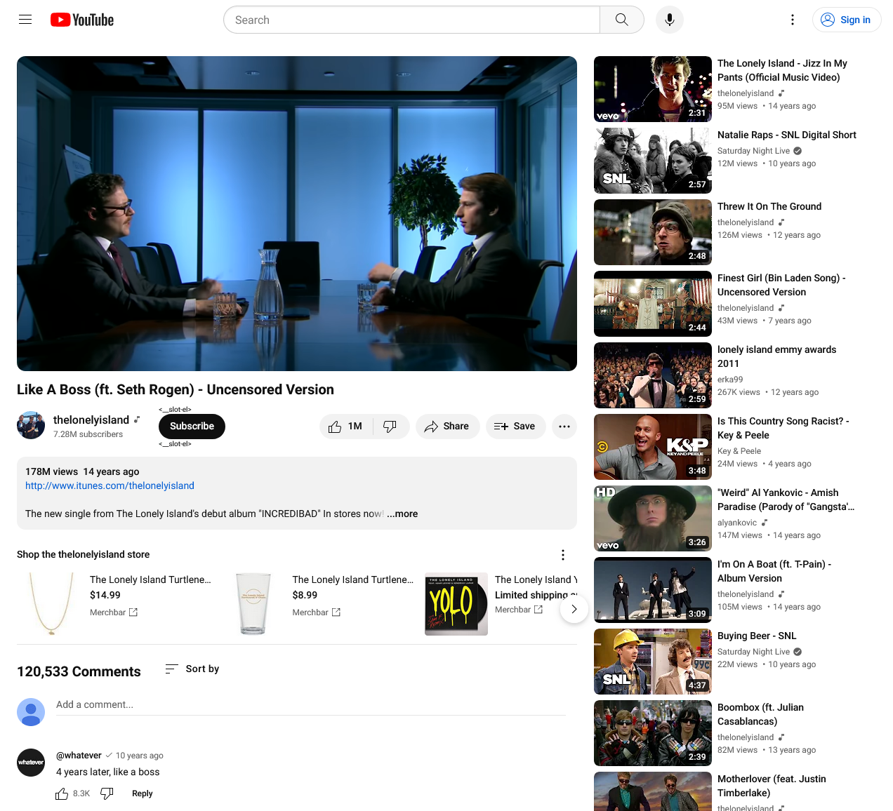
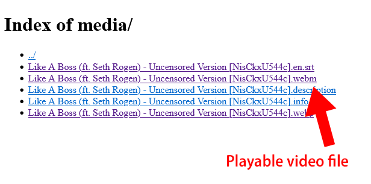

Have you ever used archive.org's [Internet Wayback Machine](https://web.archive.org/)? It's a free tool that's been archiving the web since 1996. So, if you want to see what Google looked like in 1999, [they've got it](https://web.archive.org/web/19990422191353/http://google.com/).

{{}}

[ArchiveBox](https://archivebox.io/) is like your own, personal Internet Wayback Machine. It's free and open-source, and you can use it to archive most websites.

{{}}

## Why archive?

Until about a year ago, I never had the inclination to archive a website locally. There are tools online that archive websites and save a public copy, so why would I go to the trouble of self-hosting my own archive?

Then, last year, there was a power grab from a lot of social media companies. reddit famously [locked down its third-party APIs](https://techcrunch.com/2023/06/16/reddit-ceo-lashes-out-on-protests-moderators-and-third-party-apps/), which broke a lot of the sites that archived reddit. The reddit archive sites simply folded and the archives disappeared.

I realized how much faith I was putting in these free, volunteer-run archive services despite many red flags that should have tipped me off that they were operationally unsustainable.

So if I can't rely on some cloud-based archiving service to stay online forever, I should retain my own copies of the things I care about.

## Installing ArchiveBox

There are a few ways to install ArchiveBox, but I went with the recommended method of Docker Compose:

```bash
mkdir archivebox && \
  cd archivebox && \
  curl -O 'https://raw.githubusercontent.com/ArchiveBox/ArchiveBox/dev/docker-compose.yml' && \
  docker compose run archivebox init --setup
```

From there, I can bring up ArchiveBox by starting the Docker container:

```bash
docker compose up
```

It spins up a local web server on port 8000:

- <http://localhost:8000>

## Archiving reddit posts

One of my all-time favorite reddit stories is the /r/legaladvice saga from [a guy whose neighbor "landlocked" himself](https://old.reddit.com/r/legaladvice/comments/2o3g9g/neighbors_stupidly_caused_themselves_to_be/).

The reddit poster's neighbor owned property that included a driveway connecting their house to public roads, but they sold part of their land that included their driveway. As a result, the neighbor had no way of getting on or off their property without trespassing on property they didn't own. The neighbor was trying to solve this by demanding access to the reddit poster's private driveway.

{{}}

The story is told in three reddit threads:

- [Neighbors stupidly caused themselves to be landlocked. Are we going to be legally required to share our private road?](https://old.reddit.com/r/legaladvice/comments/2o3g9g/neighbors_stupidly_caused_themselves_to_be/)
- [UPDATE: My neighbors caused themselves to be landlocked. Now the sheriff wants me to let them use my road.](https://old.reddit.com/r/legaladvice/comments/2ooy1x/update_my_neighbors_caused_themselves_to_be/)
- [UPDATE: My neighbors caused themselves to be landlocked, I posted here, it's resolved now](https://old.reddit.com/r/legaladvice/comments/4dci57/update_my_neighbors_caused_themselves_to_be/)

So I pasted the three URLs into ArchiveBox:

{{}}

Within a few seconds, ArchiveBox had archived those posts and made them available to me locally, offline:

{{}}

ArchiveBox downloads the page in a few formats: PDF, PNG, WARC, but one of the formats is single-file HTML, which I'd never heard of before:

- [Single-file snapshot of reddit thread](reddit-singlefile.html)

Single-file HTML is a neat trick! It smushes all the HTML, JavaScript, and CSS into a single file. And it even base64-encodes images so they live in the same HTML file.

```html
<style>:root{--sf-img-2: url("data:image/gif;base64,R0lGODlhFQAQAIABAICAgP///yH5BAEAAAEALAAAAAAVABAAAAIajI...
```

It's so cool to read reddit threads this way because it's so _fast_. I've just gotten used to how slow reddit and the rest of the web has gotten at loading a simple mostly-text page. It's fun to see how browsing feels when you can browse a precomputed page locally.

## Archiving YouTube videos

There are more specialized tools for archiving YouTube videos like, but ArchiveBox also bundles [yt-dlp](https://github.com/yt-dlp/yt-dlp), so you can just hand it a YouTube URL, and it will archive the page and the video.

So if I want to make sure I always have a copy of the _Lonely Island_ / _SNL_ classic, ["Like a Boss,"](https://www.youtube.com/watch?v=NisCkxU544c) I can hand it to ArchiveBox like any other website.

{{}}

ArchiveBox isn't able to perfectly recreate the real YouTube experience, but it creates a snapshot of the page and then saves the video separately:



{{}}

{{}}



## Why does this feel so familiar?

When I looked at the contributor list for ArchiveBox, I noticed a familiar name, [Nick Sweeting](https://nicksweeting.com/). I know him! I met him at PyGotham in 2019.

I scrubbed through the video of Nick's talk and realized Nick actually demo'ed ArchiveBox at that same conference five years ago. I [wrote about his talk](/retrospectives/pygotham-2019-notes/#archiving-the-internet-before-it-all-rots-away) at the time, but I guess ArchiveBox didn't stick with me for whatever reason.

In the years since seeing Nick's talk, ArchiveBox has clearly matured, and I've realized a greater need for archiving, so I'm glad to have rediscovered it.

## Resources

- [ArchiveBox](https://archivebox.io) - A free, open-source tool for creating local, private archives of webpages.
- [archive.org's Internet Wayback Machine](https://web.archive.org/) - A public archive of the web going back to 1996.
