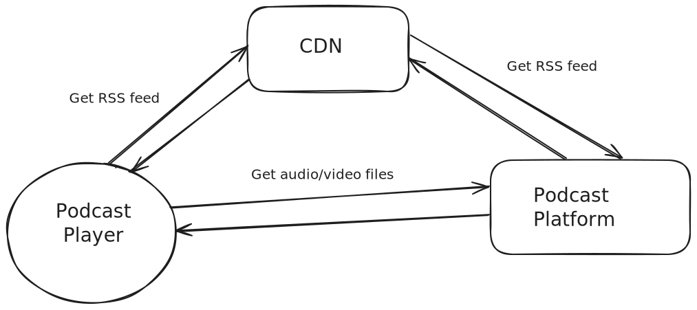
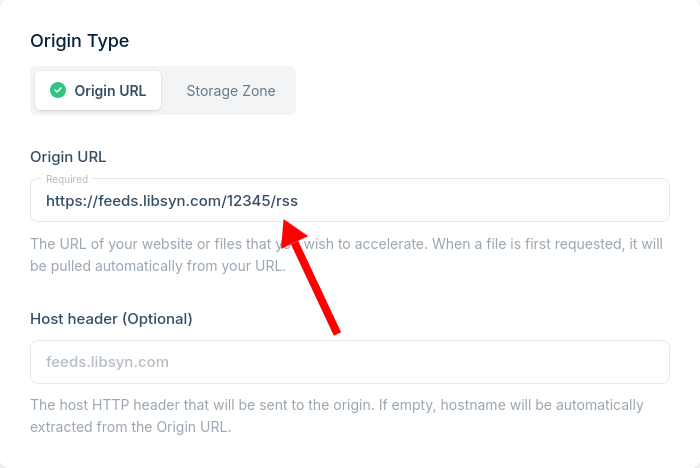
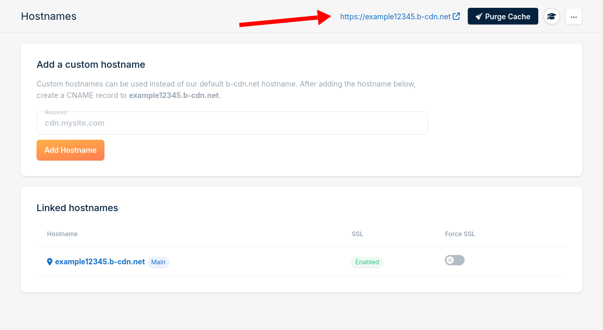
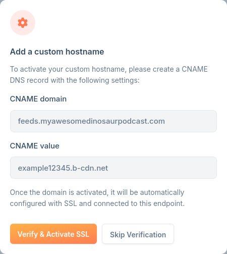

Suppose you host your podcast on a platform like Libsyn or Podbean. What happens if you decide to switch podcast platforms? You already gave everyone a RSS URL that pointed to your old platform.

For example Libsyn gives your podcast an RSS URL like this:

- `https://feeds.libsyn.com/12345/rss`

When you submitted your podcast to Apple Podcasts and shared your RSS URL with your listeners, you pointed them directly to your podcast platform.

If you move, all of your listeners' podcast apps will still be looking for your podcast at your old URL.

## Don't rely on redirects

When most podcasts switch platforms, they ask their old platform to set up a redirect. For example, if you're moving from Libsyn to Podbean, you'd go to your Libsyn settings and point it to your new podcast URL.

That way, anytime a listener tries to access your old Libsyn RSS URL, Libsyn tells them that you've moved.

There are two problems with this strategy:

1. Not all podcast players will update their URL when they see a redirect, so they'll keep checking your old feed forever.
1. There's no guarantee that your old podcast host will keep providing redirects for you.

(2) is especially significant. If you're a podcast hosting platform, why do you want to offer a feature that helps customers _leave_ your platform? If that platform starts to get desperate to stay in business, redirects are likely one of the first features they'd eliminate.

So, what do you do? You need to give your listeners a URL to your podcast, so how do you avoid this problem?

## Host your own RSS feed

A podcasting platform actually hosts two separate services, though they seem like they're the same thing.

When you host a podcast with Libsyn or Podbean, they're actually hosting two different types of files for you:

1. Your audio/video recordings
1. Your podcast's RSS feed, which is an index of all of your recordings

But the two services are actually completely independent. If you want to, you can host them from two separate vendors, and everything works fine. And this is actually what I do and what I recommend other podcast owners do.

Neither services is technically very difficult, but service (2) is extremely inexpensive to do.

Podcast recordings are generally large files of anywhere from 50 MB to 5 GB, depending on length, quality, and whether there's video. But podcast RSS feeds are tiny, generally less than 1 MB. In hosting costs, you'd pay about a penny for every 10,000 times your listeners check your podcast feed.

You can host your RSS feed simply and inexpensively by setting up a CDN in front of your podcast provider. The CDN will only be responsible for serving your RSS feed. Podcast players will still retrieve the large audio/video files directly from your podcast provider.

## Only distribute your own custom domain name

When you distribute a URL like `https://feeds.libsyn.com/12345/rss` to your listeners and podcast directories, you're married to Libsyn (or whoever your hosting provider is).

Instead, you should only distribute an RSS URL for a domain name that you own.

For example, if your podcast is called "My Awesome Dinosaur Podcast," then you can register this domain name for your show:

- myawesomedinosaurpodcast.com



**Note**: I'm not going to explain how to purchase a domain name, as that's out of scope, but any domain name provider will be fine. I personally like DNSimple.



When you give out your podcast feed to listeners and podcast directories, it will be:

- https://feeds.myawesomedinosaurpodcast.com

If you switch podcast hosts, your listeners will never have to do anything as they'll still listen from your same `feeds.myawesomedinosaurpodcast.com` URL. They've never seen any Libsyn or Podbean URL at all.

## Hosting your own RSS feed

For this example, I'm going to use these example values:

- `https://feeds.libsyn.com/12345/rss`: The RSS feed your podcast host told you to use.
- `https://feeds.myawesomedinosaurpodcast.com`: The actual URL you'll use instead.

### Create a BunnyCDN account

First, create an account with [BunnyCDN](https://bunny.net).

You can use any CDN for this, but I like Bunny as they're simple and inexpensive.

### Add a Pull Zone

From your Bunny account, go to CDN > Add Pull Zone.

Give your Pull Zone a name. It doesn't matter what name. For this example, I'm using the name `example12345`.

Under Origin Type, select "Origin URL" and enter your vendor's podcast's RSS URL:

{{}}

Choose "Standard Tier."

Under "Pricing Zones," just choose the cheapest option and unselect the rest. It doesn't matter if your RSS feed is super fast in every region, as it has no effect on listener experience.

Finally, click "Add Pull Zone."

### Testing your URL

When Bunny creates your Pull Zone, try visiting the URL `b-cdn.net` URL it created at the top:

{{}}

If this worked, you should see your podcast's RSS feed when you visit that link (your browser may download the file automatically).

If everything is working, you're through the hard part. You just have to set up your custom domain name.

### Linking your custom domain

From the pull zone you created, go to General > Hostnames.

Enter your podcast's domain like:

- `feeds.myawesomedinosaurpodcast.com`



**Note**: The subdomain doesn't strictly have to be `feeds`. It can be anything you want, but I find that `feeds` is a useful convention.



Bunny will give you a DNS record that you need to activate on your domain registrar's side.

{{}}

Go back to where you registered your domain, and add the DNS entry that Bunny showed you.

When you've finished adding the CNAME record to your domain registrar, come back to the Bunny screen, and click "Verify & Activate SSL."

### Disable caching

Bunny (and all CDNs) aggressively cache data. They're designed to lighten the load on other servers, so Bunny, by default, only checks the "Origin URL" (your podcast provider) occasionally for updates.

This can get in the way of your listeners getting timely updates. You don't want to update your podcast and then have nobody see it for a day or two because Bunny is serving an old copy.

You can prevent Bunny from serving stale copies of your podcast feed by going to your pull zone and going to Caching > General.

Change "Cache Expiration Time" to "Override: 20 minutes."

That tells Bunny to only store a copy of your podcast's feed for a maximum of 20 minutes. You can dial this up or down depending on your preference.

I recommend against "Do not cache." If you have a popular podcast where hundreds of listeners might check your feed at once, that would cause Bunny to send your podcast provider hundreds of requests at once, which might cause your podcast provider to block requests from Bunny, which would cause your listeners to see an error message.

## You're done!

If you set things up correctly, you should now have a custom URL that serves your podcast feed.

Your podcast hosting platform is still hosting all your large audio and video files. They're still hosting your podcast feed, too, in fact.

By setting up the CDN, you created a server in front of your podcast provider that serves your podcast feed, so your listeners will see your copy of the RSS feed rather than talk to your podcast provider directly for the feed.
