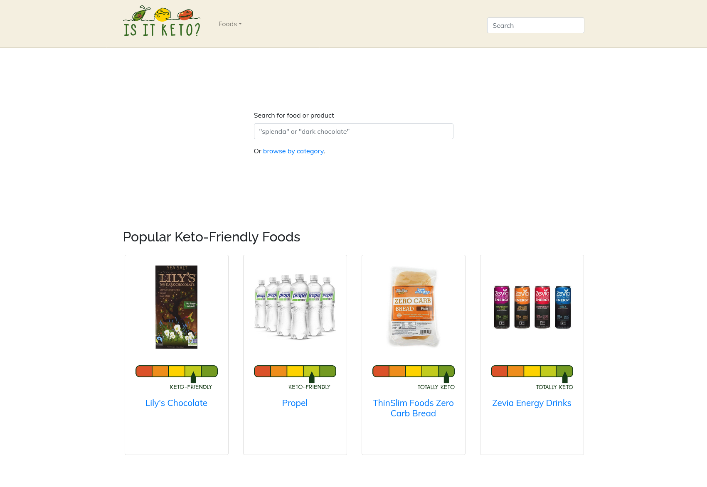


**Update (2024-07-12)**: I've received more inquiries than I expected, so I'm now closing applications.


I'm looking for someone to take over my old content website, [Is It Keto](https://isitketo.org).

{{}}

I worked on the site [on and off between 2019 and 2020](/retrospectives/2020/07/), but I no longer have time for it, so it's just been neglected for the past several years. Still, it consistently earns $1-2k/yr in fully passive revenue.

## Stats for last six months

From January 1, 2024 until June 30, 2024, here are the key stats for the site:

- Unique visitors: 53k
- Total pageviews: 128k
- Revenue from Google AdSense: $947.51
- Revenue from Amazon Affiliate program: $139.30
- Total revenue (last six months): $1,086.81
  - $1,793.20 in last 12 months
- Ahrefs domain rating (current): 18

## Asking price

I'm looking for a minimum price of **$1k**.

This is below market value, as I'm more interested in selling the site to someone who wants to do something interesting with it.

## Ideal buyer

In short, I want to sell to someone who wants to continue building the site and doesn't require hand-holding.

I'd like to sell to someone who is:

- Interested in entrepreneurship.
- Comfortable working with JavaScript and HTML code, especially Vue 2.
- Interested in growing the site.
  - You don't have to make it your full-time job, but I'm hoping to sell to someone who wants to try new things with the site rather than just sit back and collect revenue.
- Bonus: You have a history of building in public.

I don't want to sell to someone who uses spammy tactics or deceives users for growth. A lot of other diet sites monetize by tricking users into purchasing snake oil, and I've always hated that.

I can't control what you do after you take over the site, but I'll give preference to buyers who have a track record of operating ethically.

## What's appealing about the business?

- It's a static site, so it's inexpensive to host.
  - It fits into the free tier of most static hosting platforms.
- As a static site, it's also low-maintenance, as there's no server or database to manage.
- All the build steps are already in CI, so there's no magic to learning to build the site.
- There's low-hanging fruit to increase the revenue, as I haven't updated Amazon affiliate links in years, and most pages are missing affiliate links entirely.

## What are the risks with the business?

- It's the kind of content that LLMs are trying to dominate.
  - It's possible that in a year, everyone will ask an LLM which foods are keto rather than use a website.
- The site is built on an obsolete JavaScript framework.
  - It will take a few hours of work to port the code to something more modern.
- The keto diet is [fading in popularity](https://trends.google.com/trends/explore?date=today%205-y&geo=US&q=keto&hl=en), so a keto diet site will shrink with it.

## Tech stack

- Gridsome / Vue2
  - Gridsome is a static site generator built on top of Vue2.
  - Gridsome is defunct, but the tool still builds the site without issue.
- CircleCI
  - Automatically runs linters and end-to-end tests on every commit.
  - Automatically builds and publishes site to Netlify on every commit to the main branch.

Gridsome is slow, but all of the content is in Markdown, so you can easily port it to another static site generator. It should be easy to port it to a more modern Vue-based static site generator like [Nuxt Content](https://content.nuxt.com/). There are only \~2,000 lines of Vue code in the project.

### Hosting

I currently host Is It Keto on Netlify.

## What you get

- Transfer of isitketo.org domain
- Transfer of admin of Google Analytics for isitketo.org domain
- Transfer of admin of Google Search Console for isitketo.org domain
- Is It Keto's [Twitter account](https://x.com/HeyIsItKeto)
- Is It Keto's [Pinterest account](https://www.pinterest.com/isitketo/)
- Is It Keto web app git repository
- [Keto Recipe Search](https://recipe-search.isitketo.org) git repositories
  - This is an old web application that's a sister site to the main Is It Keto website hosted on a subdomain.
  - The code is old and bad, and it's probably more trouble than it's worth to switch hosts.
  - I'll give you the code, but I don't guarantee that you'll be able to use it to redeploy the recipe search feature.
- Assignment of all Is It Keto copyrights
  - Including source code, content, and custom graphics
- Two 1:1 one-hour video calls with me to ask questions about the code or the business.

## What you don't get

- Access to my Google AdSense account
  - You will need to create your own and replace the account ID in the Is It Keto source code.
- Access to my Amazon Affiliate account
  - You will need to create your own and replace the account ID in the Is It Keto source code.
- Access to my Netlify account, where I host Is It Keto
  - You will point the domain name at a different host, and I'll turn down my copy.
- Historical Google Analytics data
  - I lost most analytics data prior to 2024 in the switch to GA4.
- Any historical emails related to Is It Keto
- Control over what I say about Is It Keto.
  - I will keep writing I've published about Is It Keto online.
- Guaranteed backlinks from mtlynch.io
  - Is It Keto currently has a lot of backlinks from this blog. I have no plans to remove those links, but I don't guarantee that I'll keep them live forever.

## Payment

I'll accept payment through an escrow service like [escrow.com](https://escrow.com). If I know you or someone I know vouches for you, I'm open to skipping escrow. If you're open to paying in ETH or USDC, we can skip escrow.

## Inquiries


**Update (2024-07-12)**: Applications are now closed

