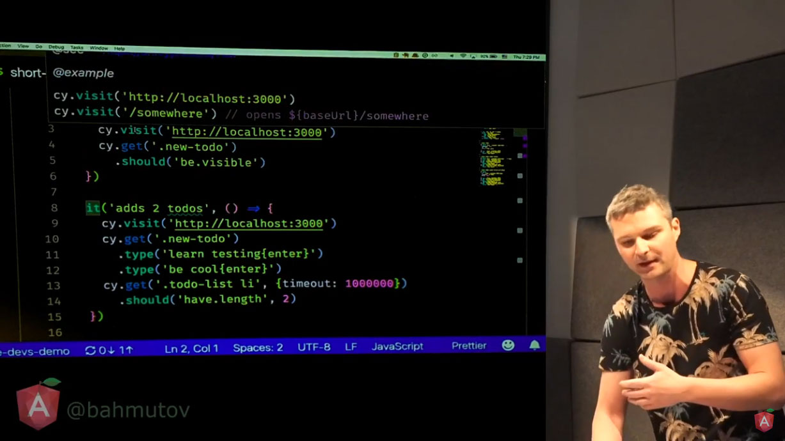
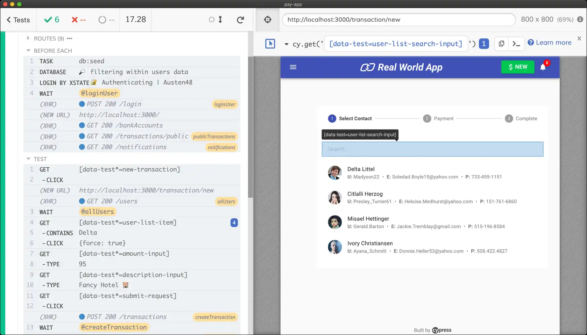
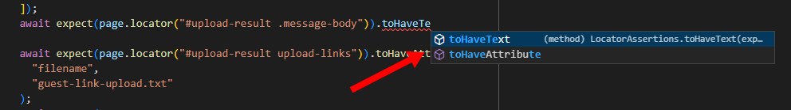
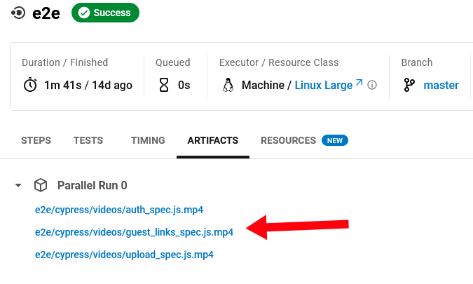

[Cypress](https://cypress.io) is an open-source tool for testing web applications end-to-end. I first saw Gleb Bahmutov [demo Cypress at a 2018 web dev meetup](https://youtu.be/wApmbgPGmqQ) in New York, and I was blown away.

{{}}

Before discovering Cypress, I had begrudgingly used [Selenium](https://www.selenium.dev/). Cypress was a refreshing leap forward, as it offered elegant solutions to tons of pain points that made Selenium impractical to use.

I recently tried [Playwright](https://playwright.dev), Microsoft's answer to Cypress. After experimenting with it for a day, I'm ready to completely switch over from Cypress to Playwright.

It pains me to say it because I have a soft spot for Cypress' small, scrappy team. I'm certainly not enthusiastic about adding a dependency on a huge megacorp like Microsoft, but Playwright is just so much better that I can't justify sticking with Cypress.

What follows are my notes on switching from Cypress to Playwright while they're still fresh in my head.

## Contents

- [My prior experience with Cypress and Playwright](#my-prior-experience-with-cypress-and-playwright)
- [What I like about Playwright](#what-i-like-about-playwright)
  1. [Playwright is significantly faster than Cypress](#playwright-is-significantly-faster-than-cypress)
  1. [Playwright exposes a consistent set of assertions](#playwright-exposes-a-consistent-set-of-assertions)
  1. [Playwright does not depend on a GUI environment](#playwright-does-not-depend-on-a-gui-environment)
  1. [Playwright has fewer feature gaps](#playwright-has-fewer-feature-gaps)
  1. [Playwright requires less domain-specific knowledge](#playwright-requires-less-domain-specific-knowledge)
  1. [Text comparisons are easier in Playwright](#text-comparisons-are-easier-in-playwright)
  1. [Playwright makes it easier to navigate the shadow DOM](#playwright-makes-it-easier-to-navigate-the-shadow-dom)
  1. [Playwright launches your app for you](#playwright-launches-your-app-for-you)
  1. [Playwright's logging actually works](#playwrights-logging-actually-works)
  1. [Playwright's team doesn't feel resource-constrained](#playwrights-team-doesnt-feel-resource-constrained)
  1. [Playwright integrates better with VS Code](#playwright-integrates-better-with-vs-code)
  1. [Parallel tests are free in Playwright](#parallel-tests-are-free-in-playwright)
- [What I miss about Cypress](#what-i-miss-about-cypress)
  1. [Cypress' syntax is more consistently fluent](#cypress-syntax-is-more-consistently-fluent)
  1. [Cypress has a small, indepdentent team](#cypress-has-a-small-indepdentent-team)
  1. [Cypress test artifacts work in CI](#cypress-test-artifacts-work-in-ci)
  1. [Cypress' Docker image actually contains the software](#cypress-docker-image-actually-contains-the-software)
- [Summary](#summary)

## My prior experience with Cypress and Playwright

I've written Cypress end-to-end tests for almost every web app I've built in the last four years. I'd rate myself as an intermediate Cypress user. Most of my Cypress needs are straightforward and only exercise the basic APIs. I've never written any custom plugins, but I've used a few third-party ones.

I've used Playwright for only one day. To get my hands dirty, I tried porting a test suite of one of my apps from Cypress to Playwright. I chose [PicoShare](https://github.com/mtlynch/picoshare), my minimalist file-sharing tool, which has just 10 end-to-end tests. I was able to [port them all from Cypress to Playwright](https://github.com/mtlynch/picoshare/pull/340) in about five dev hours, including the time it took to learn Playwright's APIs.

I've never paid money for Cypress or Playwright, so I'm entitled to anything from either tool. Cypress has a paid SaaS component, but I've never purchased it, as it doesn't fit into my workflow. I would have happily sponsored Cypress, as I do other open-source projects I use, but Cypress doesn't offer any sponsorship options.

## What I like about Playwright

### Playwright is significantly faster than Cypress

My Playwright test suite runs 34% faster than the equivalent Cypress tests on CircleCI. On my local dev machine, Playwright gives a 5x speedup over Cypress. This is not a rigorous measurement, but it's clear there's a substantial speed difference between the two.

| Task                               | Cypress | Playwright | Difference                      |
| ---------------------------------- | ------- | ---------- | ------------------------------- |
| Run tests on CircleCI              | 127s    | 84s        | <font color="green">-34%</font> |
| Run tests from development machine | 40s     | 7s         | <font color="green">-83%</font> |

Part of the performance difference on CI is that the Playwright Docker container is significantly smaller than the Cypress container. For local development, it's not a big deal because you download it once, and you're done. But when I run Cypress in CI, I have to wait for CircleCI to download and decompress a ~1 GB image each time.

|      | cypress/included:10.9.0 | playwright:v1.26.0-focal-amd64 |
| ---- | ----------------------- | ------------------------------ |
| Size | 940 MB                  | 651 MB                         |

### Playwright exposes a consistent set of assertions

Cypress bundles [nine different third-party libraries](https://docs.cypress.io/guides/references/bundled-libraries) into its tool, which creates a mishmash of inconsistent APIs. There's `should`, `expect`, and `assert`, and you use a different keyword depending on the context you're in.

For example, the following two code snippets perform identical assertions:

```javascript
cy.get("#error-message").should("be.visible");
```

```javascript
cy.get("#error-message").should(($el) => expect($el).to.be.visible);
```

With Playwright, there's a single, consistent API. Asserting that the element with an ID of `error-message` is visible on the screen requires a simple function call:

```javascript
expect(page.locator("#error-message")).toBeVisible();
```

### Playwright does not depend on a GUI environment

One of Cypress' most touted features is their desktop GUI app:

{{}}

The Cypress desktop app lets you "time travel" through your tests, so you can see what the browser window looked like at each point in your test.

But what if you develop without a GUI? I do all of my development [on headless server VMs](/building-a-vm-homelab/). In four years of Cypress, I've never used their desktop app. Instead, I run Cypress [within a Docker container](https://mtlynch.io/painless-web-app-testing/), which is sometimes an obstacle for a tool that expects you to work in their desktop GUI.

The GUI problem crops up again when you try to run your Cypress tests in a CI environment. There's generally not a desktop GUI there either. Cypress' answer is to use their paid CI service, which is the primary way they fund the company.

I support companies monetizing their open-source product however they want, but Cypress' CI product has never appealed to me. I want to be able to reproduce my CI environment locally with Docker containers. Playwright lets me do that, but Cypress' CI service doesn't.

To run Cypress on CircleCI, I had to do a bit of [juggling with Docker Compose](https://mtlynch.io/painless-web-app-testing/). It's not an egregious amount of overhead, but it makes the testing stack a little more complicated than I'd like.

When I tried Playwright, it was such a breath of fresh air to use a tool that's designed to run headless. I don't have to do anything tricky to run Playwright in CI because it just works out of the box in a headless environment.

Playwright has the same time-travel feature as Cypress, but they implement it in a web UI instead of a desktop GUI, so it works in more environments.

Time traveling is pretty nice! Playwright's snapshots aren't even just static screenshots of your app. You can interact with the browser in each stage of the test, which feels a bit like magic.



### Playwright has fewer feature gaps

Cypress makes it easy to get up and running with basic end-to-end tests, but I've found that as my apps grow, I frequently run into feature gaps in my testing tool.

For example, I'd add a file upload feature and then realize that Cypress can't exercise file upload functionality. I'd stop what I'm doing and go find a third-party Cypress plugin to fill the gap.

As I was writing this, I discovered that Cypress [added native support for file uploads](https://www.cypress.io/blog/2022/01/19/uploading-files-with-selectfile/) earlier this year, but it's a bit of a headscratcher that [it took them seven years](https://github.com/cypress-io/cypress/issues/170) to support an extremely common scenario.

Similarly, if you want to simulate mouse hovering, a feature present in almost every web UI framework, [Cypress can't do it](https://github.com/cypress-io/cypress/issues/10). That bug has been open for almost eight years.

I'm sure Playwright has its own feature gaps, but I didn't hit any in my day of porting tests from Cypress to Playwright. All of the workarounds in my test suite for Cypress gaps had native solutions in Playwright.

### Playwright requires less domain-specific knowledge

Back when I discovered Cypress, one of the things that appealed to me was that it was designed for JavaScript, whereas Selenium was Java-first.

For basic testing, Cypress' semantics feel natural and familiar to someone who understands JavaScript. But when you stray off the beaten path, Cypress suddenly feels less like JavaScript and more like its own domain-specific framework.

As an example, there's functionality in my app PicoShare to generate URLs for files that you want to share with unauthenticated users. To test the functionality, I needed to navigate through PicoShare's sharing feature, log out of the user session, and then verify that the browser can still access the URL it generated a few steps earlier.

Here's how I originally implemeted that test in Cypress:

```javascript
// Save the route to the guest link URL so that we can return to it later.
cy.get('.table td[test-data-id="guest-link-label"] a')
  .invoke("attr", "href")
  .then(($href) => {
    // Log out.
    cy.get("#navbar-log-out").click();
    cy.location("pathname").should("eq", "/");

    // Make sure we can still access the guest link after logging out.
    cy.visit($href);

    // Continue with the test
  });
```

You see `then`, so you might assume that `invoke` returned a `Promise`. But if you try to `await` that promise, it returns `undefined` because Cypress actually returned something [only pretending to be a `Promise`](https://github.com/cypress-io/cypress/issues/1417#issuecomment-370860080).

This may not seem like a big deal, but if you ever need to refer to a value in your app dynamically, Cypress forces you into [a new nested closure level](https://docs.cypress.io/guides/core-concepts/variables-and-aliases#Closures) for every value you need. There's a widely supported [feature request](https://github.com/cypress-io/cypress/issues/1417) to support `await`, but there's been no progress in four years, and Cypress recently stated that they currently [have no plans to implement it](https://github.com/cypress-io/cypress/issues/1417#issuecomment-1133112085).

Here's what the same test looks like in Playwright:

```javascript
// Save the route to the guest link URL so that we can return to it later.
const guestLinkRouteValue = await page
  .locator('.table td[test-data-id="guest-link-label"] a')
  .getAttribute("href");
expect(guestLinkRouteValue).not.toBeNull();
const guestLinkRoute = String(guestLinkRouteValue);

// Log out.
await page.locator("#navbar-log-out").click();
await expect(page).toHaveURL("/");

// Make sure we can still access the guest link after logging out.
await page.goto(guestLinkRoute);

// Continue with the test.
```

In Playwright, when we have a reference to a DOM element, we can call normal APIs on it like `getAttribute`, and we get back simple values we expect without bothering with the complexity of closures. And the promise-looking values that Playwright returns really are `Promise`s that you can `await`, so the code is tidier.

### Text comparisons are easier in Playwright

One aspect of Cypress that's always frustrated me is how difficult it is to assert that an element contains a particular text value.

Here's an example `<p>` element from PicoShare:

```html
<p data-test-id="github-instructions">
  Visit our
  <a href="https://github.com/mtlynch/picoshare">Github repo</a> to create your
  own PicoShare server.
</p>
```

#### Unexpected text comparison results in Cypress

Here's the naïve approach to asserting the text value in Cypress:

```javascript
cy.get("[data-test-id='github-instructions']").should(
  "have.text",
  "Visit our Github repo to create your own PicoShare server."
);
```

Unfortunately, this test will fail:

```text
Timed out retrying after 10000ms
+ expected - actual

-'\n      Visit our\n      Github repo to create\n      your own PicoShare server.\n    '
+'Visit our Github repo to create your own PicoShare server.'
```

Cypress is grabbing the [textContent](https://developer.mozilla.org/en-US/docs/Web/API/Node/textContent) property, which includes all the whitespace around the text as it appears in the raw HTML instead of how the text appears in the browser.

You can work around this by grabbing the element's `innerText`, but the syntax is convoluted and difficult to remember because it uses a totally different set of assertion APIs:

```javascript
cy.get("[data-test-id='github-instructions']").should(($el) => {
  expect($el.get(0).innerText).to.eq(
    "Visit our Github repo to create your own PicoShare server."
  );
});
```

#### Unsurprising text comparisons in Playwright

In Playwright, the naïve assertion yields the correct behavior:

```javascript
await expect(page.locator("data-test-id=github-instructions")).toHaveText(
  "Visit our Github repo to create your own PicoShare server."
);
```

Playwright also looks at the `textContent` of the element, but it automatically trims and collapses whitespace like a browser does.

You can force Playwright to look at `innerText` instead with a much simpler syntax than what's available in Cypress:

```javascript
await expect(page.locator("data-test-id=github-instructions")).toHaveText(
  "Visit our Github repo to create your own PicoShare server.",
  { useInnerText: true }
);
```

Playwright loses a few points for having two seemingly identical APIs with similar names:

- [`toHaveText`](https://playwright.dev/docs/test-assertions#locator-assertions-to-have-text): "Ensures the `Locator` points to an element with the given text. You can use regular expressions for the value as well."
- [`toContainText`](https://playwright.dev/docs/test-assertions#locator-assertions-to-contain-text`): "Ensures the `Locator` points to an element that contains the given text. You can use regular expressions for the value as well."

One API is for asserting that an element exists "with the given text" whereas the other asserts an element exists "that contains the given text?" What's the difference between "having" text and "containing" text?

Reading more of the documentation, the difference seems to comes down to subtle differences in what you expect about an element's child elements, but the documentation could definitely be improved.

### Playwright makes it easier to navigate the shadow DOM

I write a lot of web apps using [HTML custom elements](https://css-tricks.com/creating-a-custom-element-from-scratch/), so my code often contains nested [shadow DOMs](https://developer.mozilla.org/en-US/docs/Web/Web_Components/Using_shadow_DOM).

In Cypress, specifying page elements within a shadow DOM is a bit awkward because you have to interrupt the CSS selector every time you encounter a shadow DOM boundary:

```javascript
cy.get("#upload-result upload-links")
  .shadow()
  .find("#verbose-link-box")
  .shadow()
  .find("#link")
  .should("be.visible");
```

Playwright pierces the shadow DOM by default, resulting in concise CSS selectors:

```javascript
await expect(
  page.locator("#upload-result upload-links #verbose-link-box #link")
).toBeVisible();
```

### Playwright launches your app for you

One of Cypress' odd design decisions is that they refuse to launch your app for you. You have to figure out how to launch your app yourself and then [orchestrate your Cypress tests](https://docs.cypress.io/guides/continuous-integration/introduction#Basics) to start after your app is serving.

Playwright eliminates the orchestration headache and offers [a simple config option](https://playwright.dev/docs/test-advanced#launching-a-development-web-server-during-the-tests) to launch your app. Here's [what it looks like for PicoShare](https://github.com/mtlynch/picoshare/blob/b7a78186cf8cb5249becdff888a24c81fb4f9b8d/playwright.config.ts#L33L36):

```javascript
webServer: {
  command: "PS_SHARED_SECRET=dummypass PORT=6001 ./bin/picoshare",
  port: 6001,
},
```

### Playwright's logging actually works

One of the big pain points of Cypress is that you have to learn to live without debug logging to the terminal. Cypress has [no official way to print to stdout or stderr](https://github.com/cypress-io/cypress/issues/448).

If I stick in a call to `console.log`, nothing happens:

```javascript
console.log("hello from Cypress"); // this does nothing
```

Cypress has its own [`cy.log` API](https://docs.cypress.io/api/commands/log), so what if I try that instead?

```javascript
cy.log("hello from Cypress"); // this prints nothing to the terminal
```

Nope, that doesn't work either. That only prints output within the Cypress desktop GUI or Cypress' proprietary SaaS dashboard.

Cypress developer Zach Bloomquist published [an unofficial plugin](https://github.com/flotwig/cypress-log-to-output) for printing browser console output to the terminal, but it's a third-party plugin and not something Cypress officially supports.

In Playwright, `console.log` just works: no fuss, no muss:

```javascript
console.log("hello from Playwright");
```

When I run the test, I see the log message in the terminal output:

```text
[chromium] › auth.spec.ts:3:1 › logs in and logs out
hello from Playwright
```

### Playwright's team doesn't feel resource-constrained

The core Cypress repo has [2,782 open bugs](https://github.com/cypress-io/cypress/issues), some for important feature requests that have been neglected for years. Sometimes people fill the gap with plugins, but it often feels like Cypress core just doesn't have the resources to keep pace with modern web development.

I submitted [an uncontroversial PR](https://github.com/cypress-io/cypress-docker-images/pull/521) to Cypress a year ago that they still haven't acknowledged. I suspect that they just don't have the resources to review external pull requests.

In contrast, Playwright has just [603 open bugs](https://github.com/microsoft/playwright/issues) despite receiving roughly the same volume of bug reports. When I [filed a bug](https://github.com/microsoft/playwright/issues/18108) with Playwright, they triaged it and gave me a meaningful response in less than one business day.

### Playwright integrates better with VS Code

Playwright offers [an official VS Code plugin](https://marketplace.visualstudio.com/items?itemName=ms-playwright.playwright), which gives you context-aware auto-complete. It's something I never realize I'd been missing from Cypress until I saw it in Playwright:

{{}}

In Cypress, there are a small number of functions, and you exercise different functionality by passing special string values. It's hard for IDEs to help with those semantics, but Playwright's list of explicit TypeScript functions make it easier for the IDE to help you out. There are third-party VS Code plugins for Cypress but nothing the Cypress team officially supports.

### Parallel tests are free in Playwright

In theory, you can run parallel tests for free in Cypress, but they deliberately make it inconvient. I can't blame them, as parallel tests are one of the flagship features in Cypress' paid SaaS tool, so they lose money by making the free version more useful.

Microsoft has vastly deeper pockets than Cypress, so they can afford to give away all of Playwright's features for free. As such, Playwright supports parallel tests out of the box.

## What I miss about Cypress

### Cypress' syntax is more consistently fluent

Both Cypress and Playwright offer [fluent-style APIs](https://en.wikipedia.org/wiki/Fluent_interface), where you chain together a series of actions into a single statement.

Cypress more strictly adheres to the fluent style, allowing the developer to read testing logic left-to-right.

```javascript
cy.get(".navbar-item [data-test-id='log-in']").should("be.visible");
```

With Cypress, the order I write the code matches the order I think about the test. First, I grab a reference to the element. Then, I think about what assertions I want to make.

In Playwright, the ordering is a little muddled. Before I start locating the element I want to test, I have to wrap the code in an `expect` call:

```javascript
await expect(
  page.locator(".navbar-item [data-test-id='log-in']")
).toBeVisible();
```

Playwright's syntax interrupts the left-to-right ordering I'm used to from Cypress. I wish Playwright's syntax looked more like this:

```javascript
// INVALID - not how Playwright actually behaves
await page
  .locator(".navbar-item [data-test-id='log-in']")
  .expect()
  .toBeVisible();
```

### Cypress has a small, indepdentent team

I have a personal appreciation for Cypress as an open-source company, and in particular, Gleb Bahmutov, their VP of Engineering. Gleb publishes high-quality [blog posts](https://glebbahmutov.com/blog/), and he's an excellent conference speaker.

When I wrote [a blog post about Cypress](https://mtlynch.io/painless-web-app-testing/), Gleb was gracious in sharing feedback to improve the post. After I published it, Cypress promoted my article on [their blog](https://www.cypress.io/blog/2019/05/02/run-cypress-with-a-single-docker-command/).

Microsoft, on the other hand, has historically has been hostile to open-source. They're in a period of friendliness now, but if the winds change, and they realize they can make more money by crushing open-source, they probably will.

If this were a movie, Cypress would be the scrappy underdog you can't help but root for, and Microsoft would be the reformed villain who who's probably going to betray the hero in the third act.

### Cypress test artifacts work in CI

When a Cypress test fails, it screenshots your app at the point of failure and saves the image to disk. It's easy to configure your CI platform to keep these images as test artifacts for easy debugging. Similarly, Cypress lets you save videos of each of your tests that you can also publish as CI test artifacts.

{{}}

Playwright produces a more complicated set of test artifacts. Instead of simple images and videos, Playwright generates a static web app for viewing all the test artifacts.

Unfortunately, Playwright's report viewer [doesn't work on CircleCI](https://github.com/microsoft/playwright/issues/18108), so I have to download assets and run a Playwright server locally instead of just viewing them from my CircleCI dashboard.

### Cypress' Docker image actually contains the software

In a pattern I've only ever seen in end-to-end testing tools, the official Docker images for Cypress and Playwright don't actually contain the tools themselves. That is, the Cypress Docker image does not contain Cypress and the Playwright Docker image doesn't contain Playwright.

Instead, the Docker images contain the _dependencies_ you need to install Playwright or Docker respectively. So when you're running the Playwright Docker image, you still have to install Playwright as part of your environment setup.

There must be some good reason for this, but I've never understood it. When I [complained about this to the Cypress team](/painless-web-app-testing/#further-reading), they added a special [cypress/included](https://hub.docker.com/r/cypress/included) image that contains the Cypress tool itself. There doesn't seem to be an equivalent Docker image for Playwright.

## Summary

Even though I'm only a few hours into using Playwright, I found it to be a substantially better experience than Cypress. Between the clearer APIs, simpler testing setup, and speed, I'm likely 50-100% more productive in Playwright than I was in Cypress.

Going forward, I'll be testing all of my new apps with Playwright. I'll likely even port some of my old Cypress tests to Playwright for apps [where my tests have crept above the five-minute mark](https://github.com/mtlynch/whatgotdone).

If you're a Cypress user, I strongly suggest giving Playwright a look. To me, the jump from Cypress to Playwright is as substantial as the jump was from Selenium to Cypress.
