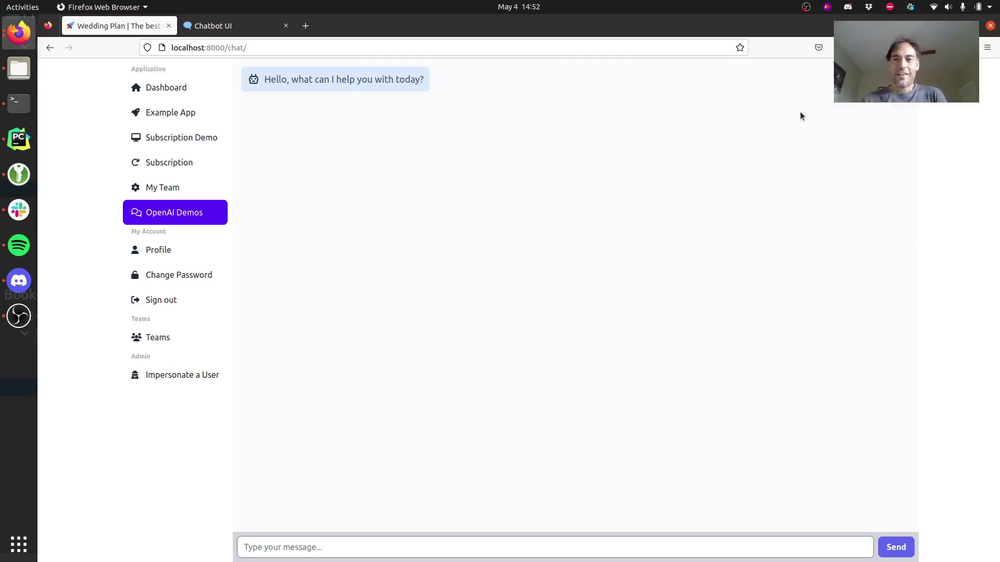
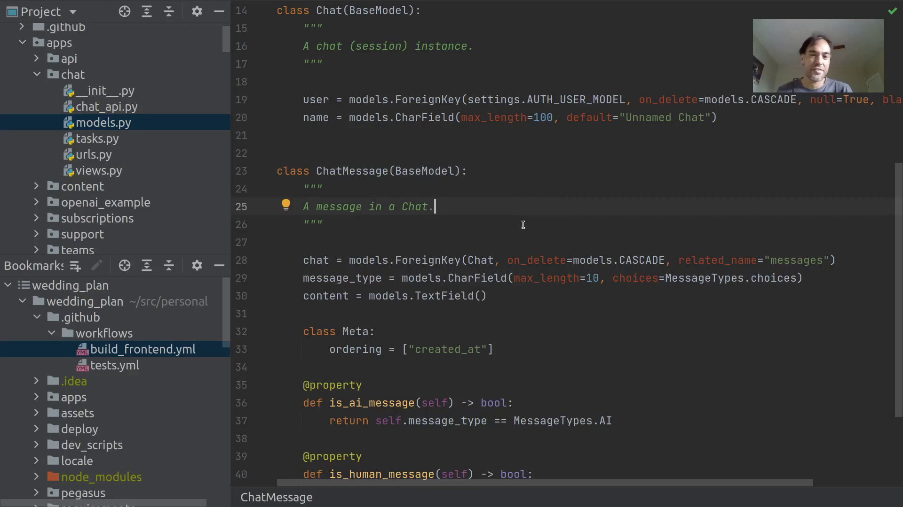
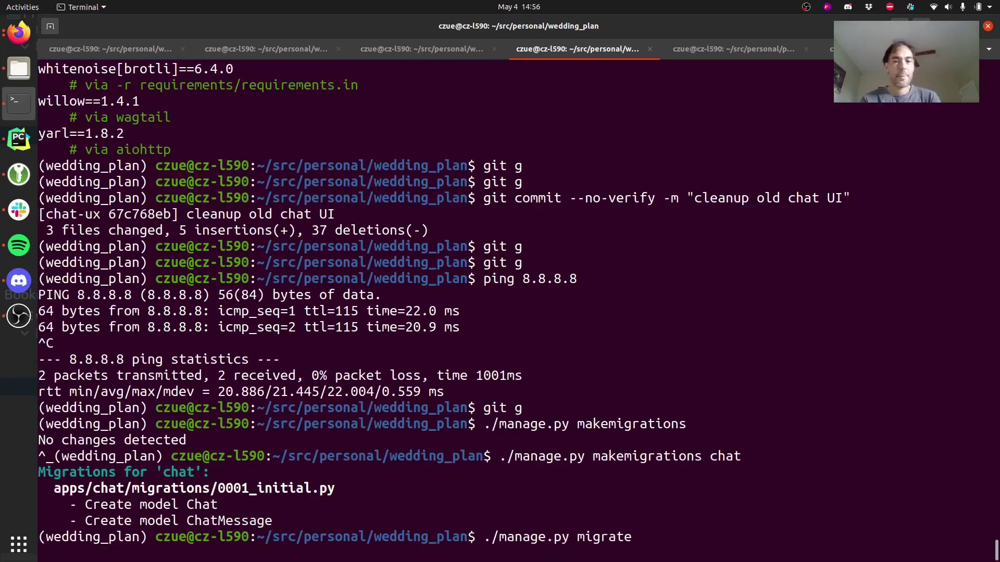
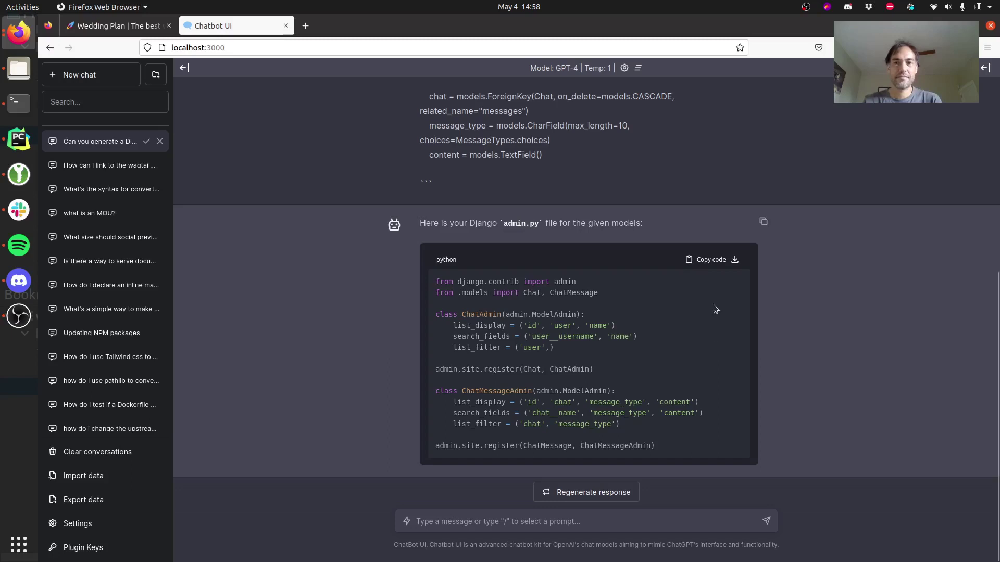
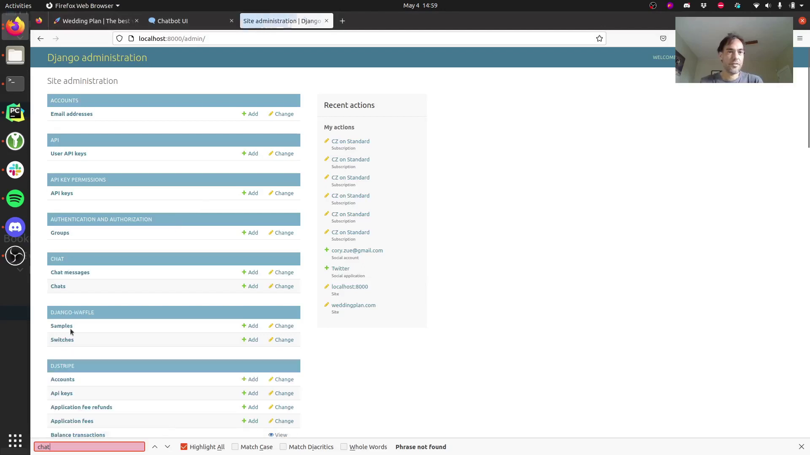
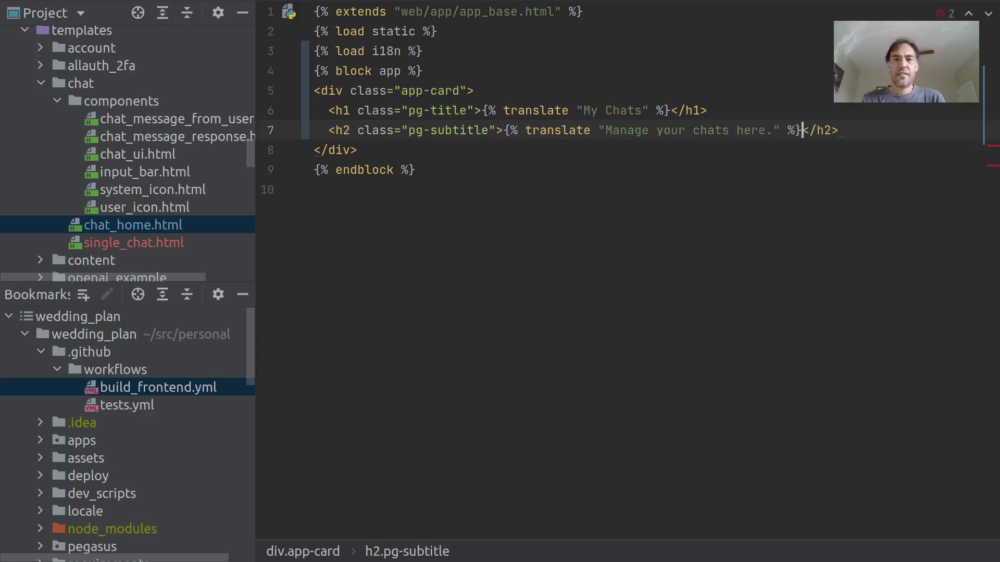

Here are my takeaways.

https://www.youtube.com/watch?v=zEDaeG6nw48

## My background vs. Cory's

I've read a lot of Cory's blog. We're both Python developers, but he specializes in Django, whereas I've always done more min. I have no experience with Django, but I'm comfortable in Python.

## Dev environment

{{}}

- OS: Ubuntu
  - I expected Cory to be an OS X guy.
- Browser: Firefox
- IDE: PyCharm (I think)
  - I've never used PyCharm.

## Models

{{}}

- I'm getting worried that I'm going to get lost with Django stuff.
- Cory shows the `ChatMessage` model, which seems to be an ORM object that tells the framework how to store and retrieve the object from a database.
  - All new to me, as I've never worked with an ORM.

## Migrations

{{}}

- Cory runs a command `./manage.py makemigrations chat`, which seems to generate a database migration so that his database can support the two models he just defined.
- Cory then runs `./manage.py migrate` to perform the migration he just created.
- Django is definitely more "magic" than what I'm used to, as I've been creating my database migrations by hand.
  - What Cory is doing is much less tedious than my experience writing a bunch of SQL boilerplate every time I define a new object, but it also adds a lot of abstraction between the developer and the database.

## Creating admin UI

{{}}

- Cory uses ChatGPT to create the boilerplate definitions of an admin page based on the models he added.
  - ChatGPT gets it right, but Cory needs to tweak it to match his preferred Django syntax.

{{}}

- It looks like Django uses the definitions to auto-generate an admin UI to add/edit the new models in the database.
  - That's neat. When I do this, I end up just querying the database directly, but this is certainly easier.

## Translations

{{}}

- Something I never think about.

``

- I guess he's going to create translations later?

## Django control flow

14:52

- Django is weird! You can just do a `get_object_or_404`, which seems to exit the function and return a 404 if it can't find the object.
  - This is quite foreign to me coming from Python Flask or Go, which force the developer to be more explicit but also create more verbosity.

## git GUI

25:08

- Cory uses a GUI for git that I've never seen before.
  - He spawns it by calling `git g`, which I think is a Cory-specific git alias.
- Cory goes through each file one-by-one and adds it to the commit as he reviews it.
- Cory has a pre-commit hook that rejects the commit if the formatting is incorrect, and then it reformats it to the desired style.
  - This is something I've always been afraid to do, as I don't trust automated tools to change my code.
  - The way Cory does it, the automated tools change his code, but then he still reviews the change before committing it.

## Sharing code between client-side and server-side rendering

29:06

- Cory seems to be able to use htmx to solve a problem I struggle with: how to avoid duplicating code between client-side rendering and server-side rendering.

  - In web apps, I often run into a situation where I want to add content to the page, but I don't want to completely reload the page.
  - If the user reloads, they should see the same content that they saw when we added the content dynamically.
  - I often get stuck between three bad options:
    1. Always render the content client-side, which is complicated and renders more slowly in the browser.
    1. Always render the content server-side, which means that I generally have to reload the entire page to show changes.
    1. Implement rendering logic twice: once for client-side rendering and once for server-side rendering.

- I can't see enough of it in the video, but it looks like htmx lets Cory define his HTML server-side, and then the htmx attributes let certain elements re-render themselves without a full reload or Cory having to reimplement the render logic.

## ChatGPT API

35:88

- ChatGPT API is surprisingly easy to use.
  - The API is just a model name and a list of messages in the conversation.
  - You keep "state" of the conversation by passing ChatGPT the full message history on every API call.

## Final thoughts

I expected Django to be a heavy framework, but it's actually even heavier than I expected. Django even has its own wrappers for Python lists, dicts, and enums.

I had trouble adapting lessons to my own work because a lot of what Cory was doing was Django-specific. It could just be that I got unluck with video choice, as the work Cory was doing in this video was largely gluing different elements of Django together.
