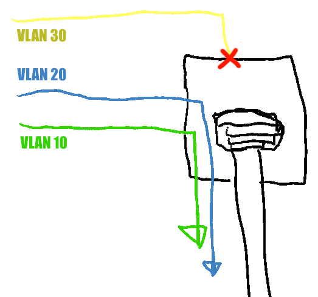
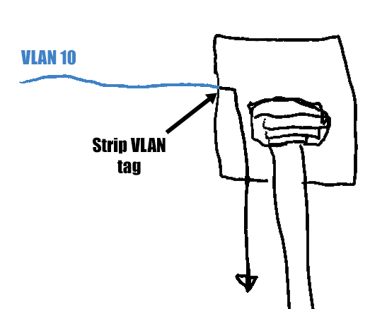
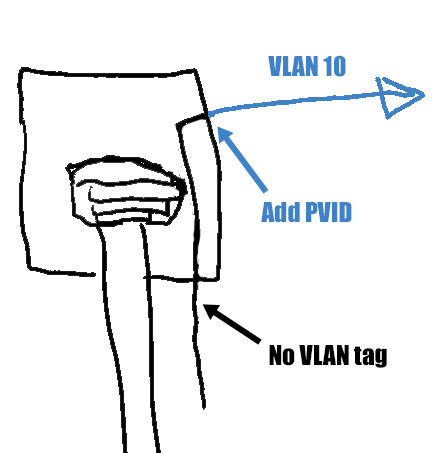
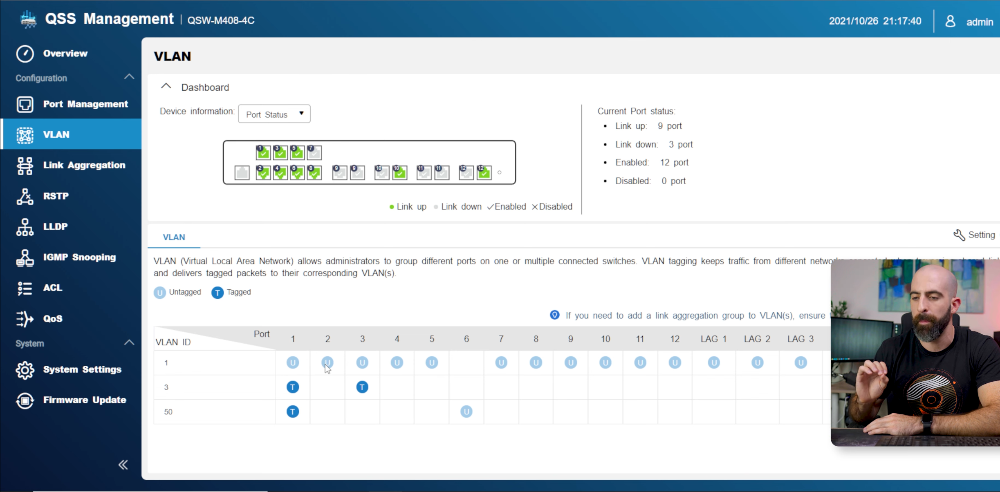

I recently bought a TP-Link TL-SG3428X JetStream managed switch. It's my first time owning a managed switch, and I spent several hours figuring out how to configure its VLAN settings for my network.

I found [TP-Link's VLAN documentation](https://www.tp-link.com/us/support/faq/2149/) lacking, so I'm sharing my notes in case they're helpful to others.

## Scope

I'm not going to go into detail on what a VLAN is. My favorite resource for understanding VLANs is [Raid Owl's video on the subject](https://www.youtube.com/watch?v=XdqP14NclZ0).

In this post, I'm focusing specifically on how to use the TP-Link interface for setting up VLANs.

## Tagged ports, untagged ports, and PVIDs

Different devices use different terminology to describe VLAN features. On TP-Link switches, the relevant settings to know are tagged ports, untagged ports, and PVIDs.

### Tagged ports

When you add a port to a VLAN as a **tagged port**, it tells the switch to allow packets into that port if the packet's VLAN tag matches the VLAN. It leaves the VLAN tag on the packets because the devices connected understand the tags.

For example, if you add port 5 to VLANs 10 and 20 as a tagged port, then the switch will send packets to that port with VLAN tags 10 and 20. It won't strip off the tags, so the device on port 5 will receive packets with the VLAN tag still set. The device won't receive packets with any other VLAN tag, as only 10 and 20 are allowed.

{{}}

Tagged ports are for devices that are VLAN-aware, like routers, other managed switches, and wireless access points that support VLANs.

### Untagged ports

When you add a port to a VLAN as an **untagged port**, it tells the switch to forward those packets to the port but strip the VLAN tag.

Untagged ports are for non-VLAN aware devices. The switch strips the VLAN tags because the device attached to the port doesn't know anything about VLANs.

For example, if you add port 6 to VLAN 10 as an untagged port, then the switch will send packets with VLAN tags 10 to that port, but it will strip off the tag before passing the packet along. The device on port 6 will receive packets without any VLAN tag. The device won't receive packets with any other VLAN tag, as only VLAN 10 is allowed.

{{}}

Untagged ports are for devices that are not VLAN-aware, like regular desktop PCs, scanners, or printers.

### PVIDs

On TP-Link switches, each port also has a **PVID**, or [port VLAN identifier](https://www.megajason.com/2018/04/30/what-is-pvid/). When packets enter the switch through the given port, the switch adds the specified PVID to the packet as a VLAN tag.

While tagged and untagged ports define how packets go from the switch to the port, the PVID affects packets that come from the port into the switch.

{{}}

You don't need to set a PVID for ports that are connected to VLAN-aware devices because those devices are adding their own VLAN tags.

You do need to set a PVID for ports connected to non-VLAN-aware devices, as the switch needs to know which VLAN tag to add to those packets.

## TP-Link makes VLAN settings confusing

On other managed switches I've seen, the switch does not expose the PVID in the settings. There's just tagged ports, untagged ports, and that's it. On these switches, adding a port to VLAN 20 as an untagged port implicitly also sets the PVID to 20.

{{}}

A non-VLAN-aware device should only be a member of a single VLAN. You should add the device's port to the VLAN as an untagged port, and you should set the port's PVID to the VLAN's ID.

For example, if you connected a printer to port 16 on your switch and wanted it to be in VLAN 20, you'd add port 16 to VLAN 20 as an untagged port, and you'd set port 16's PVID to 20.

TP-Link _technically_ allows you to add a port to multiple VLANs as untagged, but I don't think there's ever a reason to do this in practice. It would mean that the device can _receive_ packets from devices on other VLANs, but it can only _send_ packets to devices on the single VLAN that matches the port's PVID.

Other switch vendors limit ports from being untagged members of more than one VLAN, and I wish TP-Link had chosen this approach.

## My home network, before the managed switch

Before I got the managed switch, I was already using VLANs, but I connected them through an unmanaged switch.

The relevant network devices in this story are:

- My desktop PC, which should have full access to all VLANs
- My Proxmox server (TODO: link), which can tag certain VMs with VLAN tags
- My Ruckus WiFI access point, which hosts three WLAN networks with distinct VLANs
- My OPNSense firewall, which enforces firewall rules on packets crossing VLANs or to the Internet

TODO: Diagram

Note that in this diagram, I have no VLAN-aware devices connected in series. This simplified configuration a lot, which I didn't realize until I upgraded to a managed switch.

## Mistake 1: Replacing unmanaged switch with managed switch kills Internet on WiFi

When I purchased my TP-Link TL-SG3428X, I just dropped it in as a replacement for my previous unmanaged switch. Not much changed about my network diagram:

TODO: Diagram

A few minutes after installing the new managed switch, my fiance told me she lost Internet access. I checked my phone and saw the same thing.

The WiFi devices could all join the WiFi network, but the network didn't have Internet access. How could that be? I hadn't changed any of my firewall settings. I just replaced an unmanaged switch with a managed one.

I only realized days later what the problem was. My managed switch was dropping all tagged packets. So traffic could get from WiFi devices to the AP, but the switch was dropping everything after that point.

The solution was to configure my VLANs on my managed switch. Otherwise, it would just continue dropping all VLAN-tagged packets. Here was my configuration after the fix.

## Mistake 2: Forgetting to add my router to the VLAN

TODO: Diagram

## My home network, after the managed switch

TODO: Diagram

## Tips for debugging VLAN issues

### Open up Wireshark

I tried a

The most useful tool I used was Wireshark. I'm normally reluctant to pull in Wireshark because it feels so heavyweight. It's dumping so much information, and I always hate having to re-learn the filter query language to get to something sensible.

For debugging VLANs, Wireshark ended up being incredibly helpful.

### Rebooting

I wish this wasn't the most reliable technique I found for resetting network state, but it was. It's a pain because it takes 30-90 seconds depending on what kind of system the host is running, so it's a slow test cycle. But it did, more than any other method, ensure that the system reset its network state in response to changes I made in VLAN configuration.

I'm sure there are better ways, but I didn't find them.

### `ifconfig`

### Other CLI tools

This command sequence is supposed to force the host to release its DHCP lease and request a new one:

```bash
dhclient -r
dhclient
```

These commands never worked for me

## Gotchas

- You specified an untagged port for a VLAN, but you forgot to also set the PVID for that port.
- You added a port to a VLAN, but you forgot to add your router to the VLAN.
