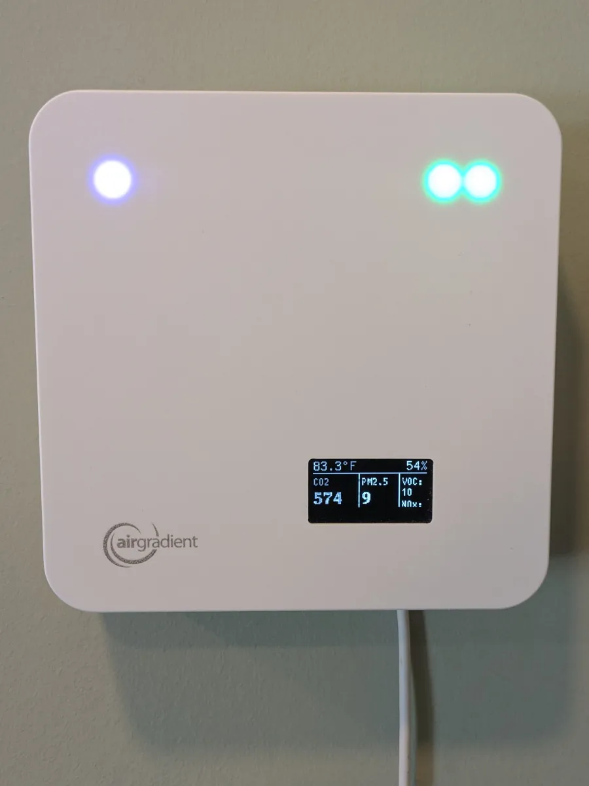
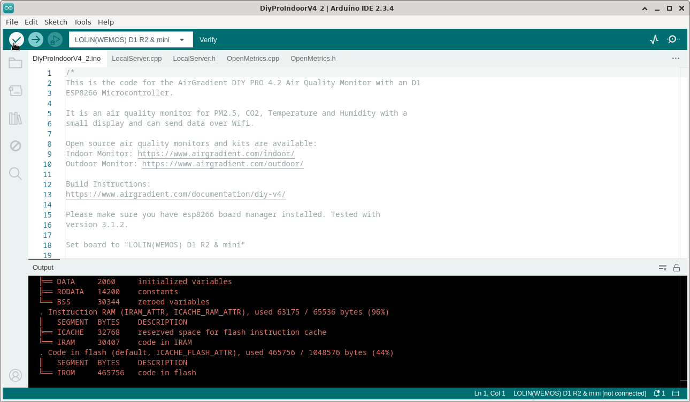

I've purchased two AirGradient ONE indoor quality monitors to measure air quality in my home. AirGradient devices are open-source, so you can flash your own custom firmware and collect your air data locally rather than sending it to AirGradient's proprietary cloud dashboard.

{{}}

The existing documentation for flashing firmware requires you to use the Arduino IDE, a clunky GUI program:

{{}}

I couldn't find instructions for flashing AirGradient devices using the command-line, and it took me several hours to figure out, so I've included the steps below.

## Aside: I don't get the hype about AirGradient

Every time I see AirGradient come up on forum discussions, everyone sounds excited about their products. I've found my AirGradient ONE to be mediocre. The software is extremely buggy and the documentation is sparse. But they're the only company I've found that sells pre-made air quality monitors that are open-source, so I bought a second AirGradient monitor.

For years, AirGradient never bothered to publish instructions for flashing software onto the AirGradient ONE. I learned how to do it from these blog posts:

- ["Monitoring my home's air quality (CO2, PM2.5, Temp/Humidity) with AirGradient's DIY sensor"](https://www.jeffgeerling.com/blog/2021/airgradient-diy-air-quality-monitor-co2-pm25) by Jeff Geerling
- ["AirGradient ONE Kit Review – An open-source indoor air quality monitor"](https://www.cnx-software.com/2023/11/29/airgradient-one-kit-review-an-open-source-indoor-air-quality-monitor/) by CNX Software

This year finally, AirGradient [published official flashing instructions](https://github.com/airgradienthq/arduino/blob/eb8378adfa1faaf18fa04738ae460bcf542fef85/docs/howto-compile.md), but they're still [a bit hidden](https://github.com/airgradienthq/arduino/issues/335).

## Environment

I tested these steps on Debian 13.0, but they should work on any Debian/Ubuntu-like system.

## Install packages

First, I install the base packages I need:

```bash
sudo apt update && \
  sudo apt install -y \
    git \
    curl \
    python3 \
    python3-serial
```

## Install arduino-cli

Next, I install the Arduino CLI tool:

```bash
ARDUINO_CLI_VERSION='1.2.2'
ARDUINO_BIN_DIR="${HOME}/.local/arduino-cli"

mkdir -p "${ARDUINO_BIN_DIR}" && \
  curl -fsSL https://raw.githubusercontent.com/arduino/arduino-cli/master/install.sh \
  | BINDIR="${ARDUINO_BIN_DIR}" sh -s "${ARDUINO_CLI_VERSION}"
export PATH="${PATH}:${ARDUINO_BIN_DIR}"
```

To verify the install was successful, I print out the version string for `arduino-cli`:

```bash
$ arduino-cli version
arduino-cli  Version: 1.2.2 Commit: c11b9dd5 Date: 2025-04-22T13:51:01Z
```

## Download ESP32 libraries

AirGradient ONE depends on the ESP32 Arduino libraries. As of this writing, AirGradient is not yet compatible with the 3.x versions of Arduino, so I have to use the latest stable 2.x version.

```bash
ARDUINO_ESP32_VERSION='2.0.17'

arduino-cli config init \
  --additional-urls https://espressif.github.io/arduino-esp32/package_esp32_index.json && \
  arduino-cli core install "esp32:esp32@${ARDUINO_ESP32_VERSION}"
```

## Find the path to my device

Next, I need the device path to my AirGradient ONE. The simplest way to find the device path is:

1. Run `dmesg --follow`
1. Plug my AirGradient ONE into my system via USB
1. Look for the device path to appear in the `dmesg` output

Here's what it looks like on my system:

```bash
$ sudo dmesg --follow
[517021.978880] usb 1-4: New USB device found, idVendor=303a, idProduct=1001, bcdDevice= 1.01
[517021.978884] usb 1-4: New USB device strings: Mfr=1, Product=2, SerialNumber=3
[517021.978894] usb 1-4: Product: USB JTAG/serial debug unit
[517021.978896] usb 1-4: Manufacturer: Espressif
[517021.978898] usb 1-4: SerialNumber: D8:3B:DA:1A:EE:C4
[517022.017678] cdc_acm 1-4:1.0: ttyACM0: USB ACM device
                                 ^^^^^^^
                                 Path name
```

Given this output, the path on my system to my AirGradient ONE is `/dev/ttyACM0`:

```bash
AIRGRADIENT_PATH='/dev/ttyACM0'
```

## Make device path writeable

Next, I ensure that I can write to the AirGradient file path:

```bash
sudo chmod a+rw "${AIRGRADIENT_PATH}"
```

The AirGradient path should now have these permissions:

```bash
$ ls -l "${AIRGRADIENT_PATH}"
crw-rw-rw- 1 root dialout 166, 0 Aug 10 10:34 /dev/ttyACM0
 ^^^^^^^^
```

I also add myself to the `dialout` group so I can write to the path:

```bash
sudo adduser "$(whoami)" dialout
```

## Get AirGradient source

Next, I check the [AirGradient factory flashing page](https://www.airgradient.com/documentation/factory/) to find out the latest production release.

```bash
# Current production release, as of this writing.
AIRGRADIENT_RELEASE='3.3.8'
```



**Warning**: The latest version on AirGradient's website does not match the latest release tag on [AirGradient's GitHub repo](https://github.com/airgradienthq/arduino/releases/tag/3.3.9). When I tested 3.3.9, both of my devices failed to measure CO2 and temperature, so I'm not sure if 3.3.9 is a known-buggy release.



With the version number in hand, I grab the AirGradient source code from AirGradient's GitHub repo:

```bash
git clone --recurse-submodules \
  --branch "${AIRGRADIENT_RELEASE}" \
  --depth 1 \
  https://github.com/airgradienthq/arduino.git \
  ~/airgradient-one
```

## Flash firmware onto AirGradient ONE device

Finally, it's time to flash the software to my device:

```bash
cd ~/airgradient-one && \
  arduino-cli compile \
    --verbose \
    --fqbn esp32:esp32:esp32c3:CDCOnBoot=cdc,PartitionScheme=min_spiffs,DebugLevel=info \
    --library . \
    --port "${AIRGRADIENT_PATH}" \
    --verify \
    --upload \
    examples/OneOpenAir/OneOpenAir.ino
```


**Note**: To erase persistent data on the AirGradient ONE device (i.e., a hard reset, including configuration data), add `,EraseFlash=all` to the end of the `--fqbn` flag.


If flashing was successful, I see my device reboot and this output at the end of the process:

```text
Wrote 1753792 bytes (967231 compressed) at 0x00010000 in 14.7 seconds (effective 952.3 kbit/s)...
Hash of data verified.

Leaving...
Hard resetting via RTS pin...
```

## Optional: View serial log output

While my AirGradient is connected to my computer, I can view its log output through the serial port by using the `arduino-cli monitor` command:

```bash
$ arduino-cli monitor --port "${AIRGRADIENT_PATH}"
Using default monitor configuration for board: esp32:esp32:heltec_wifi_kit_32_V3
Monitor port settings:
  baudrate=9600
  bits=8
  dtr=on
  parity=none
  rts=on
  stop_bits=1

Connecting to /dev/ttyACM0. Press CTRL-C to exit.
[1] Standard Particle PM 2.5 = 7.00 ug/m3
[1] Particle Count 0.3 = 1298.5
[1] Particle Count 0.5 = 383.5
[1] Particle Count 1.0 = 39.7
[1] Particle Count 2.5 = 2.0
[1] Particle Count 5.0 = 2.0
[1] Particle Count 10 = 0.0
```

## Alternative: Nix flake

If you're a Nix nerd, you might want to do this the Nix way. I've created a Nix flake to automate all the above steps:

- [My AirGradient ONE dev Nix flake](https://github.com/mtlynch/airgradient-arduino/blob/6c22d4d5f617d13492a573d5f74541328af89550/flake.nix)

When I want to flash my repo, I just run:

```bash
nix run .#flash
```

And when I want to view serial output, I run:

```bash
nix run .#monitor
```

I'm not sure how well my Nix flake works across systems, so you'll probably have to tinker a little bit to get it to work for your system.

## Conclusion

I hope these instructions make it easier for you to flash your AirGradient ONE device and customize your firmware as you see fit.
