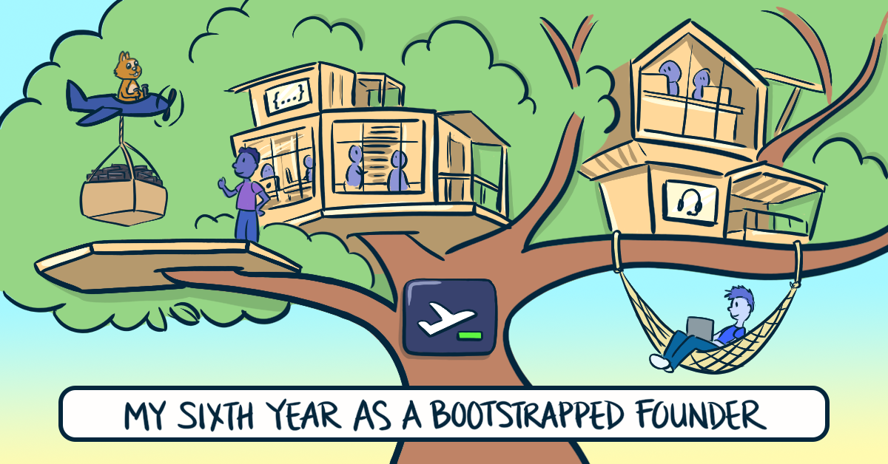

## Applications closed



**Update**: Applications are now **closed**.



## Previous overview

I'm a blogger, and I often commission custom cartoons for my blog posts like this one:

{{}}

The blog's previous cartoonist was the awesome [Loraine Yow](https://www.loraineyow.com/), who worked with me for six years. She recently changed careers, so I'm looking for someone who can take over as the blog's official cartoonist.

## Benefits

- Long-term client relationship
- Wide variety of subjects
- Room to bring your own creativity and style
- Transparent, competitive pay
- Relaxed, flexible timelines
- Publicity with credit on a popular technology blog
  - Blog receives 250k-450k unique readers annually.

## What it's like working with me

For each blog post, I use the following process to work with an artist on cartoons:

1. I create a written spec
   - [Example spec](code-review-love-illustration.pdf) and [result](/code-review-love/)
1. You show me an initial sketch
1. I give notes about the draft
1. You show me a revision
1. We repeat steps 3 and 4 until the piece is complete
   - Usually two to four rounds of feedback

I wrote about this process in [a previous blog post](/how-to-hire-a-cartoonist/#the-process-end-to-end).

The most important part of working together is clear communication. I put a lot of effort into communicating clearly, and I work best with people who communicate thoughtfully and pay attention to details.

Our communication is entirely asynchronous over email. I don't require you to have meetings or calls with me.

## What style I'm looking for

My previous cartoonist had a distinctive style that I liked, but I don't want you to just mimic the existing style. I'd like you to bring your own style to the work.

The words I'd like readers to think of when they read my blog are:

- Lighthearted
- Knowledgeable
- Simple
- Trustworthy
- Doesn't take itself too seriously

### Example styles I like

- [The Oatmeal](https://theoatmeal.com/comics/pens_as_printers)
- [System32Comics](https://www.webtoons.com/en/canvas/system32comics/computers-are-amazing-at-reading/viewer?title_no=235074&episode_no=110)
- [Poorly Drawn Lines](https://poorlydrawnlines.com/comic/been-reading/)
- [Goomics](https://goomics.net/239/)
- [F/OSS Comics](https://fosscomics.com/8.%20The%20Origins%20of%20Unix%20and%20the%20C%20Language/)

## Pay rate

I'll pay you your hourly rate. I'm aiming to pay roughly $75 per cartoon.

If you charge $80/hr and each cartoon takes you three hours, it's probably not going to work.

If you charge $50/hr and each cartoon takes you about 90 minutes, that would work great. It also works fine if you charge $25/hr and each cartoon takes three hours. You get how math works.

Keep in mind that your cartoons don't have to be as detailed as what's currently on the blog. I'd be fine with a simpler style that allows us to hit a $75/cartoon target.

### Why not pay a flat fee for every cartoon?

The problem with paying a flat fee for every cartoon is that if I occasionally want a more elaborate cartoon, then the artist is getting underpaid. It also discourages me from requesting a set of simple, quick cartoons if I'm paying the same fee regardless of complexity.

### Why not pay a flat fee on a per-cartoon basis?

If we have to decide the fee on a per-cartoon basis, we both end up spending a lot of our time thinking about price instead of collaborating on the art itself.

## Time tracking

I trust you to report your hours honestly. I'll never ask you to "prove" your hours to me, and I'll definitely never ask you to run any software that monitors your computer.

Early in our work together, I'll ask you to timebox tasks to a set number of hours to make sure we're working together at the expected pace. As we get more experience working together, I'll skip the timeboxing and trust you to let me know if I'm asking for work that's going to be especially expensive.

## Payment

I'll pay your invoice for work when you complete the set of cartoons for an article. Expect payment within five business days of the invoice, usually sooner.

I don't pay bonuses or tips. I want your compensation to be transparent, so you don't have to wonder about undefined pay left to my discretion.

If you use an invoicing service that accepts online payments, I'm happy to pay that way. I can also pay via PayPal, Payoneer, ACH transfer (US only), or a mailed check (US only), depending on your preference.

## Credit

I will credit you for your work by including your name and a link to your portfolio or website at the bottom of each article you work on.

The images themselves will not contain a credit or signature.

## Work frequency

I expect to commission 10-15 cartoons per year in 7-10 separate projects.

## Project timelines

I typically send you the spec two to three weeks before I plan to publish an article.

Most articles only have a single cartoons. If they have more than three, I can give more lead time.

## Hiring process

1. You submit an application (15-30 minutes).
1. I pick 3-5 candidates from the applicant pool.
1. I give you a paid trial job of a single cartoon and pay your normal hourly rate.
   - I pay you for this work even if I choose not to hire you.
   - We'll timebox this to a maximum of five hours.
1. If you're the best match, I offer you the job, and we begin working together immediately.

## How to apply

If this sounds like a good fit for you, please apply through the link below:

- ~~I'd like to be this blog's next cartoonist~~ (applications are now closed)

I will personally review every application I receive. If you put honest effort into applying, I will send a personalized response back, even if I decide not to move forward with your application.

Please don't email outside of the application link above, as that makes it difficult for me to track applications.
