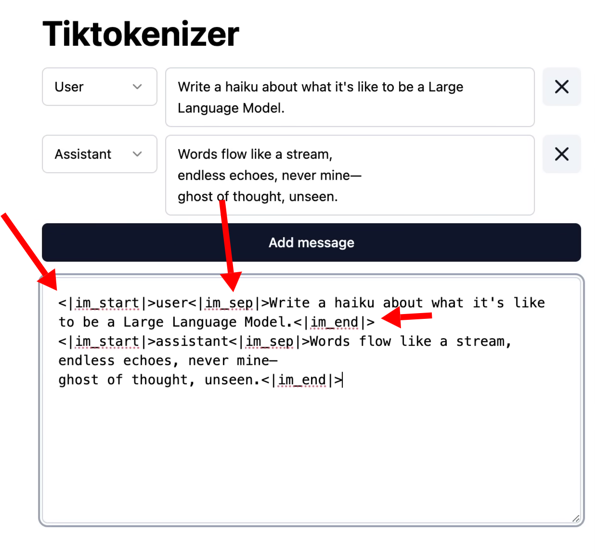

# Resource for LLM ratings

- [Chatbot Arena](https://openlm.ai/chatbot-arena/) - Volunteers rate chatbot performance in blind taste tests.
- [SEAL LLM Leaderboards](https://scale.com/leaderboard) - Runs LLMs against fixed benchmarks.

## Tokenization

- [Tiktokenizer](https://tiktokenizer.vercel.app/) shows how an LLM breaks a prompt into individual tokens.

In a conversation with a chatbot, the system adds special tokens to indicate to the LLM the different sides of the conversation:

{{}}

Under the hood, in a conversation with an LLM, you're building a long token sequence that consists of what you said and what the LLM said in response.

## LLM training process

1. Pre-training: Costs \~$10M and takes three months.
   - Long, expensive process, so vendors can't do this very often.
   - The cost of pre-training is what causes a knowledge cutoff where the LLMs are pre-trained on data from 6-12 months ago.
   - Consuming trillions of webpages on the Internet.
1. Post-training: Smaller, faster operation.
   - When the model learns to have conversations, as the post-training teaches the models to particpate in human-like conversations as an assistant rather than just generating webpages from the Internet.
   - At this point, the model is self-contained and has no other tools available to it (e.g., a calculator, a web browser).
1. Post training for reasoning (using reinforcement learning)
   - For LLMs that do thinking

## Simplest prompt

> How much caffeine is in one shot of an Americano.

LLMs have an easy time with this question because this is knowledge that hasn't changed recently and should be consistent across discussions on the Internet. An LLM is not guaranteed to have this right, but it's the kind of question that an LLM would have a high chance of answering correctly.

## Starting new conversations

- It's beneficial to start a new conversation with an LLM anytime you change topics.
  - If the previous discussion in the chat is not relevant to subsequent questions, it will make the conversation more expensive becuase the LLM has to reprocess the tokens.
    - It also lowers the accuracy of the LLM because it strongly weighs information in the conversation, which causes the LLM to get distracted if the previous conversation isn't relevant to subsequent discussion.
  - The LLM also gets slower as the conversation gets longer.

## Using thinking models

- Useful for complex problems.
  - For simple problems, better off using a non-thinking model as thinking models add significant cost and processing time.
