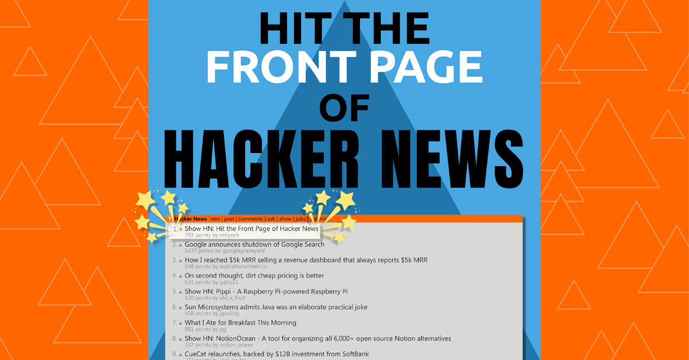
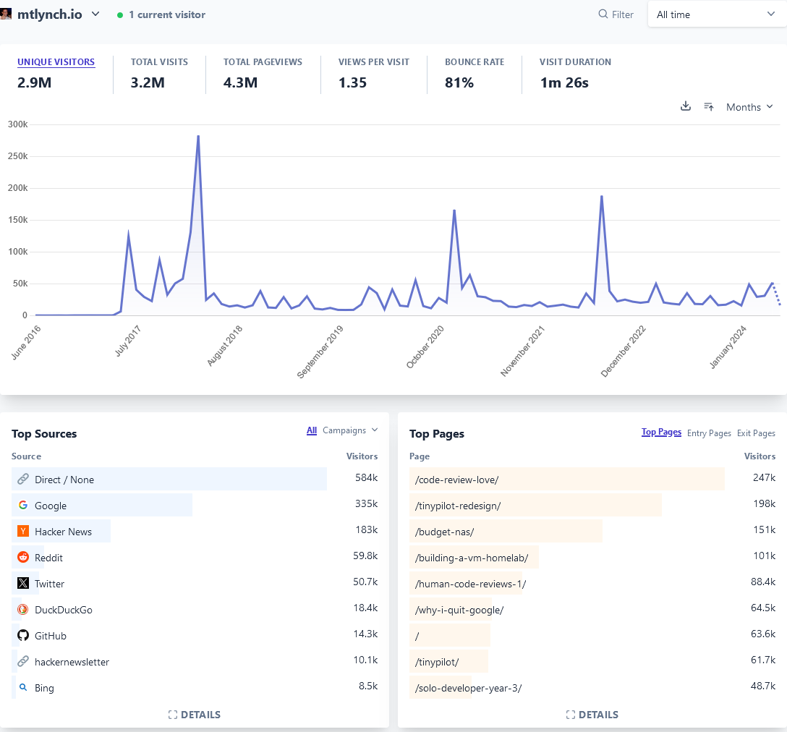

I'm teaching a small-group, live course about attracting readers to your blog through Hacker News. [Sign up](#sign-up) by Monday (June 24th) to reserve your slot.

{{}}

## Why take a class with me?

My blog receives 300k-500k unique readers per year. After Google, Hacker News is the primary way that new readers find my writing.

{{}}

In the past five years, [40+ of my posts](https://hn.algolia.com/?dateRange=all&page=0&prefix=true&query=mtlynch.io&sort=byPopularity&type=story) have reached the front page of Hacker News. Seven of them have landed in the #1 spot.

It wasn't always this way. I [started blogging in 2016](/sia-via-docker/), and it took me years of sending my articles into the void before I figured out how to connect my writing with large audiences.

I frequently see smart, talented writers who struggle to find an audience for their writing, so I want to teach you what I've spent the last eight years learning.

## Curriculum

### Lesson 1: Understanding Hacker News

- _Thursday, June 27th, 2024 at 10 AM ET_

Hacker News has its own distinctive culture. Before you can succeed there, it's important to understand its rules, etiquette, and conventions.

In this lesson, I'll explain the culture of Hacker News, why it's a great platform for sharing certain types of writing, and how to avoid missteps that will get you banned.

### Lesson 2: Choosing the Right Topics

- _Wednesday, July 3rd, 2024 at 10 AM ET_ (alternate session option due to holiday)
- _Thursday, July 4th, 2024 at 10 AM ET_

It doesn't matter how good your article is if you pick a topic that's a poor match for Hacker News.

In this lesson, I'll share article topics that work well on Hacker News and show you how to avoid wasting time on articles that have a low probability of success.

### Lesson 3: Finding a Plan B

- _Thursday, July 11th, 2024 at 10 AM ET_

If your only plan for sharing your writing is submitting it to Hacker News, you're going to get your heart broken a lot.

In this lesson, I'll show how to find other channels for your articles if they don't receive attention on Hacker News.

### Lesson 4: Elevate Your Writing

- _Thursday, July 18th, 2024 at 10 AM ET_

Want an unfair advantage over everyone else on Hacker News? Invest in your writing.

In this lesson, I'll talk about simple techniques to make your writing more engaging, how to avoid common writing pitfalls, and how to continually improve your writing.

### Lesson 5: Submission Day

- _Thursday, July 25th, 2024 at 10 AM ET_

There's an art unto itself of submitting to Hacker News and participating in discussions there. You don't want to invest hours into an excellent article only to fumble your opportunity for a wide audience with a careless mistake on submission day.

In this lesson, I'll walk you through the process of submitting your post to Hacker News, how to make the most out of your time on the front page, and how to keep the comment thread civil and friendly. I'll also show you how you can recover if your Hacker News submission fails to gain traction.

### Lesson 6: My Process from Start to Finish

- _Thursday, August 1st, 2024 at 10 AM ET_

I've been developing an effective writing and publishing workflow for my blog over the past eight years.

In this lesson, I'll show you all the tools I use in my writing process. I'll share my entire creative process, showing real examples of how my blog posts evolved from idea to first draft to front page success.

## What's not covered: Grammar

While I do love grammar and try to obey its maddening rules, this is not a course about grammar.

In lesson four, I'll cover techniques to strengthen your writing and catch careless errors, but this course is more about connecting your writing with an audience rather than the craft of writing itself.

## Class size

I'm aiming to have classes of 10-20 students. If there's enough demand, I may add additional sections so that no class gets uncomfortably large.

## Venue

The classes will meet online on Jitsi Meet. You don't need to be on camera during the class, but you're welcome to be.

## Structure

The classes will be lecture-style lessons in 90-minute slots.

I'll present slides for 30-60 minutes, and I'll reserve 20-30 minutes for questions.

## Who should take this course?

The type of writing that succeeds on Hacker News is technical topics like software and hardware or about running a business related to those domains.

This course is likely a good match for you if you fall into any of the following categories:

- You're interested in writing articles about software, hardware, or entrepreneurship.
- You've submitted articles to Hacker News in the past and can't understand why they didn't get attention when similar articles from other authors succeeded.
- You want to write articles to bring attention to your startup, side project, or small business.
- You work in DevRel and want to write content that will appeal to smart developers.

## Who shouldn't take this course?

If you're a marketer, influencer, VP, or "thought leader" with lots of brilliant theories to share about what other people are doing without doing anything yourself, your writing probably won't succeed on Hacker News.

If you've become a LinkedIn sensation by writing [amazing broetry](https://www.buzzfeednews.com/article/ryanmac/why-are-these-posts-taking-over-your-linkedin-feed-because), I can't help you translate that skill to Hacker News.

## Requirements

There is no homework for this class, so most of the work is attending classes and actively participating.

Specifically, you need to:

- Show up
  - I want to teach people who are interested in all of the topics. I expect you to show up to at least five of the six sessions, preferably all of them.
- Give feedback
  - I'll send out surveys after each session asking for feedback. I'll use the feedback to guide the course material and teach in a way that best connects with you.

## Cost

The course is $180 per attendee ($30 per session).

I accept credit payments via PayPal or cryptocurrency payments through Ethereum or USDC.

If you need a certificate of completion or some other documentation to request reimbursement from your employer, I'm happy to work with you in getting whatever you need.

## Downloadable copy

After the course ends, I'll record a downloadable video course covering the same material. It will be an updated version of [_Hit the Front Page of Hacker News_](https://hitthefrontpage.com/), which I published in 2020.

When I publish the full downloadable course, you'll get a free copy of the highest-tier package.

## Refund policy

If you decide after the first class that this course isn't right for you, I can offer a 100% refund. After that, I won't offer refunds for leaving the course.

## Heads up: Babies make things unpredictable

My wife and I are expecting our first child at the end of August.

The class is scheduled to end well before the baby's due date, but if the baby arrives early, I'll need to cancel the remaining classes. If that happens, I'll refund your tuition at $30 per session that was not fulfilled.

## Sign up

If you're interested in the class, sign up below. Sign ups close Wednesday, June 26th at 12pm ET.

- [Sign up for this course](https://www.paypal.com/ncp/payment/BGC864F7TWTC4)
