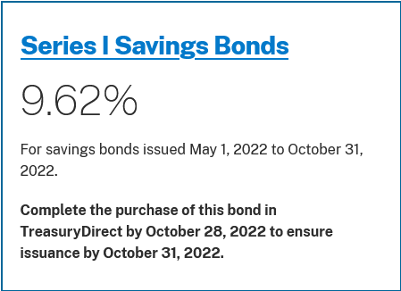
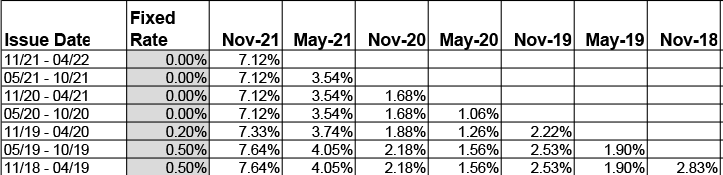
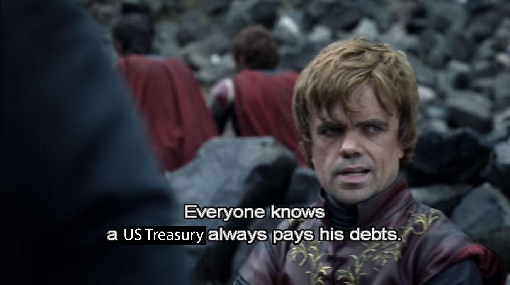

In a recent [Hacker News thread](https://news.ycombinator.com/item?id=33040211) about preparing financially for a possible recession, a commenter suggested investing in iBonds.

iBonds are one of those investments I've seen in passing every time I read a personal finance book, but I've never paid much attention to them.

When I saw that iBonds are currently paying 9.62% interest, I decided to give them a closer look.

{{}}

## What are iBonds?

iBonds are the colloquial name for [Series I Treasury savings bonds](https://www.treasurydirect.gov/savings-bonds/i-bonds/). They're a savings bond whose rate of return is based on the current rate of inflation.

Anyone with a US social security number or EIN can buy iBonds. You can invest as little as $25 in iBonds, and you don't need any special brokerage account beyond a standard checking account. There are no fees or commissions for purchasing iBonds.

iBonds differ from other types of investments in that there are a few more restrictions on when you cash them in, and you can't resell them to other investors.

## Understanding iBonds' interest rate

The total rate of return on iBond is the sum of two rates:

- **Fixed rate**: This is the minimum annual rate the bond pays for the lifetime of the bond. This rate never changes.
- **Inflation rate**: This is set to match the [consumer price index (CPI)](https://www.bls.gov/news.release/cpi.t01.htm), which is meant to approximate the rate of inflation nationally. This rate changes every six months.

An iBond's total return is the fixed rate plus the inflation rate. For example, if the fixed rate is 2% and inflation is 2% 4%, then the iBond will pay 2% + 4% = 6% for the subsequent six months. After six months, the Treasury might recalculate inflation to be 3%, at which point the rate of return will be 2% + 3% = 5%.

During periods of low inflation, the Treasury increases the fixed rate to make iBonds more appealing. The inflation portion of the return fluctuates with inflation, but the fixed rate lasts the life of the bond, which is 30 years. If the fixed rate is 2%, the iBond will always pay at least 2% per year, even when inflation is 0% or lower.

Currently, inflation is very high, so the fixed rate is 0%. If you buy iBonds now, the rate of return will just match the rate of inflation.

The Treasury publishes [an (enormous) table](https://www.treasurydirect.gov/files/savings-bonds/i-bond-rate-chart.pdf) of historical fixed + inflation rates for all iBonds ever sold. It's helpful in understanding how the fixed rate and inflation rate combine and how iBonds have performed historically.

{{}}

## Pros

### Returns are currently high

The current rate of return on iBonds is 9.62%, which is looking stronger than almost any other low-risk investment right now.

CDs from major banks and brokerages are only paying around 4%, and AAA-rated corporate bonds are in the 2-5% range.

Vanguard's total bond market index is [down 16%](https://finance.yahoo.com/quote/VBTLX/performance?p=VBTLX) in the last year. The S&P 500 is [down 18%](https://finance.yahoo.com/quote/VFIAX/performance?p=VFIAX).

### iBonds are backed by the federal government

Like other Treasury bonds, iBonds are backed by "the full faith and credit" of the US treasury. In other words, the US Treasury would have to default on its debt in order for you to lose the principal you invested in the bond. Historically, the US has never defaulted on its debt.

{{}}

If you were to buy a corporate bond, one of the risks you weigh is whether that corporation goes bankrupt and can't pay back the principal you invested in the bond. When you buy a bond from the US Treasury, the risk of default is extremely low.

Typically, investors have to accept a lower interest rate to lend to a more reliable borrower. In the current market, safe investments like bank CDs and AAA-rated corporate bonds offer much lower interest rates than iBonds, so iBond investors get the best of both worlds: a low-risk, high-yield investment.

### Returns are pegged against inflation

The US Treasury adjusts the inflation rate portion of iBonds every six months to match the rate of inflation. In times of high inflation, this is a major advantage over other bonds, as the investor has a guarantee that their investment will keep up with inflation.

Even if inflation goes negative, the interest rate portion of the iBond has a floor of 0%. At worst, an investor can experience periods in which they receive no interest payments on their bond, but they can never experience negative interest.

### Gains incur no state or municipal taxes

Gains from iBonds aren't taxed at the state or municipal level. The investor is still responsible for federal taxes on gains from iBonds.

## Cons

### You can't cash iBonds within the first 12 months

If you buy iBonds, you can't cash them in for the first 12 months.

Often investments that have time restrictions allow you to violate the restrictions if you pay a penalty, but this is not the case with iBonds. No matter what, you're unable to sell iBonds within the first year.

If you invest in iBonds, you need to be confident that you won't need that money for at least 12 months.

### If you cash in iBonds within the first five years, you forfeit three months of interest

You can cash in your iBonds starting 12 months after you purchased it, but there's still a penalty for selling in the first five years. If you sell before five years, you forfeit three months of interest payments.

This isn't such a bad penalty. It means that if interest rates on iBonds were 8% for the last year and you sell before the five-year mark, you get an effective return of 6%, sacrificing a 2% gain. If interest rates are 4%, you sacrifice only a 1% gain.

### You can invest a maximum of $10k\* in iBonds

The Treasury limits your purchases of iBonds to $10k per year per individual. Depending on the size of your portfolio, $10k per year might be too small to be worth the trouble.

\* There's an odd rule for iBonds that says you can buy [an extra $5k in iBonds](https://www.treasurydirect.gov/savings-bonds/buy-a-bond/#buying-paper) if you use money from your federal tax refunds. See [below](#the-irs-overpayment-hack) for details.

### You have to buy iBonds on Treasury Direct

To buy iBonds, you need to purchase them through the Treasury's website, [Treasury Direct](https://www.treasurydirect.gov/).

You can't buy through any other brokerage platforms because the Treasury doesn't allow brokers to purchase iBonds on behalf of their clients. And because of the $10k/year limit, there are no mutual funds that invest in iBonds the way there are for other Treasury bonds.

I've never used Treasury Direct. From what I've read, it's a bit clunkier than modern brokerage platforms, but it's still easy enough to use.

### There's no secondary market for iBonds

With most bonds, you have the right to sell the bond to another investor before the bond matures. With iBonds, you can't transfer or sell them to another investor. You can either hold an iBond until its 30-year maturity and continue receiving interest payments or cash it in for the amount you paid.

The lack of a secondary market is a shame, as an investor who purchased $10k of iBonds in 2000 (when the fixed rate was 3.6%) is currently earning interest payments of 13.22% per year. If they were allowed to sell the bond to another investor, the market price would be far higher than $10k. Instead, their only options are to cash it in for $10k or continue receiving interest payments. Earning 13.2% every year is an enviable position to be in, but it might be frustrating for an investor who'd prefer to cash out their investment at market value.

### The interest rate changes every six months

It's an advantage that iBonds adjust to meet inflation, but this is also a downside, as the interest rate may go down after you've purchased an iBond.

Most other bonds have only a fixed rate, so you can more accurately predict your earnings over time. With iBonds, the interest rate is only guaranteed for six months at a time. In theory, the interest rate could drop to the fixed rate six months after your purchase.

For example, if you purchase an iBond today, the total interest rate can drop to 0% in May 2023, as the fixed rate on iBonds is 0%. That scenario assumes that inflation also drops to zero or becomes negative within the next six months, either of which seems fairly unlikely.

## iBond purchase considerations

### The end-of-month interest rate hack

If you purchase iBonds on the last day of the month, you still receive interest payments as if you held the bonds for the full month. Because of this, most investors time their purchases of iBonds for the last few days of the month.

Treasury Direct recommends purchasing iBonds at least three days before the end of the month to ensure that you receive your iBonds within the same month.

### The IRS overpayment hack

Because the Treasury allows investors to purchase an extra $5k in iBonds every year if they use money from their federal tax refund, some investors deliberately overpay their federal taxes by $5k in estimated tax payments just before tax time. This guarantees them a $5k refund, which they can use to buy the extra $5k of iBonds.

You're only allowed to purchase "paper" iBonds with your federal tax refund. I'm not clear on the distinction between paper iBonds and electronic iBonds that you purchase through Treasury Direct, but it sounds straightforward to [convert paper bonds to electronic bonds](https://www.treasurydirect.gov/savings-bonds/manage-bonds/convert-paper-to-electronic/).

## Conclusion

Overall, I find iBonds a highly appealing investment right now.

I plan to invest up to the maximum this month, and I'll likely purchase more in early 2023 unless the market drastically changes.
