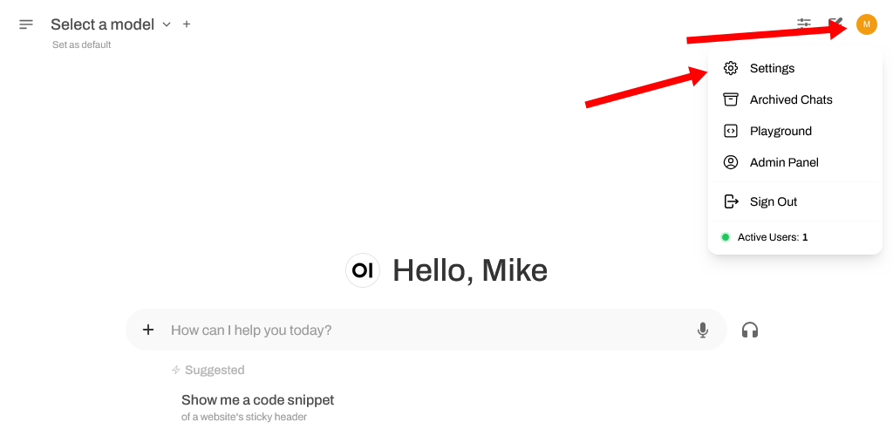
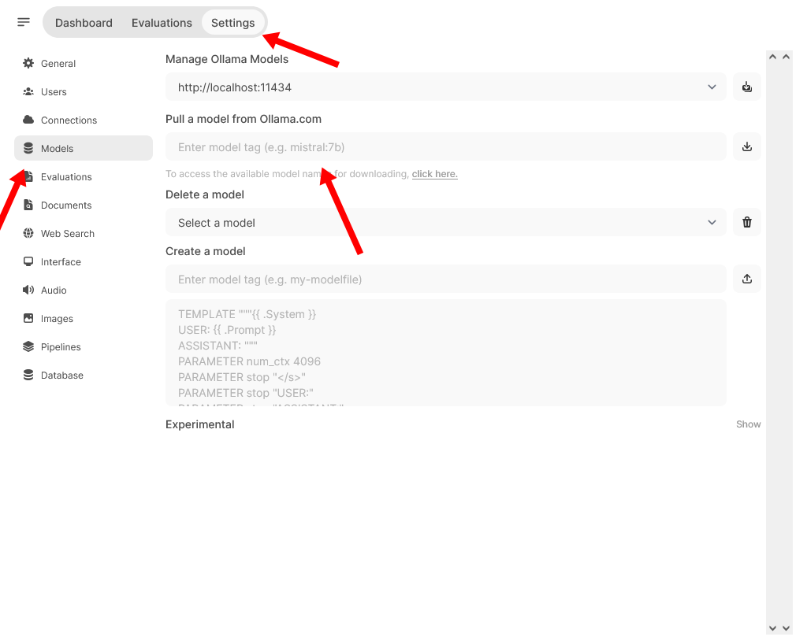
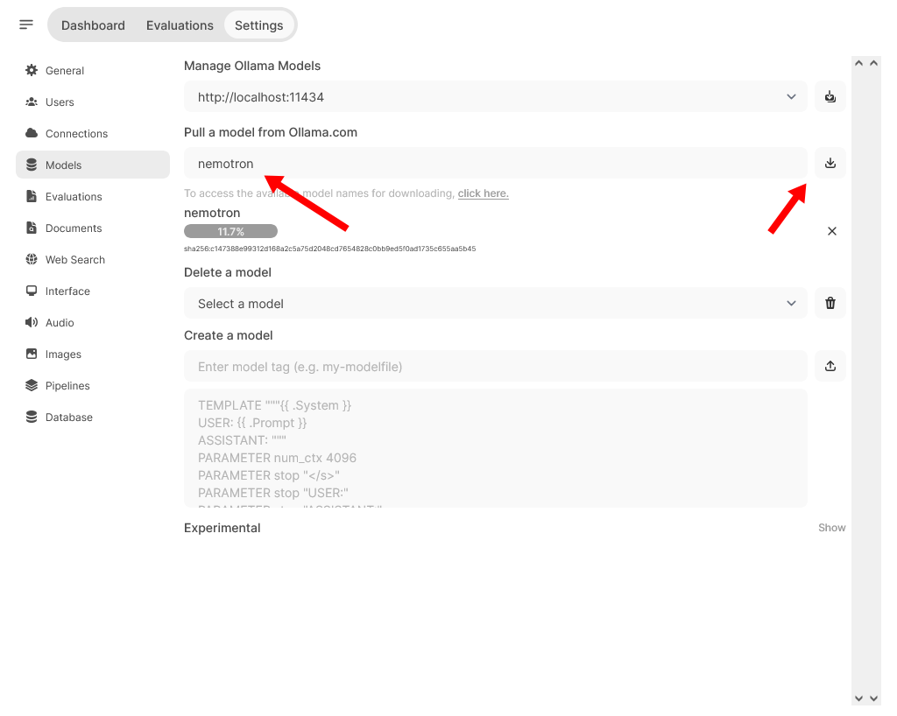

---
<<<<<<< HEAD
title: "An Unsuccessful Experiment with Nemotron"
date: 2024-10-29T00:00:00-04:00
tags:
  - llama
  - chatbots
  - ai
---

A few weeks ago, NVIDIA released Nemotron, a large language model that they derived from Meta's Llama 3.1 70B.

NVIDIA claimed at release that Nemotron outperformed GPT-4o and Claude 3.5 Sonnet in certain benchmarks. That was exciting news, as my experience with self-hostable AI models is that they trail commercial models by about a year in terms of accuracy and quality.

# I decided to test out Nemotron with a few simple coding tasks to see how it compared to commercial models like Claude 3.5 Sonnet.

title: "How Close is Llama3.1 Nemotron Ollama"
date: 2024-10-26T11:37:26-04:00

---

I saw NVIDIA claimed that it [beat Claude 3.5 Sonnet and GPT-4o on a bunch of benchmarks](https://huggingface.co/nvidia/Llama-3.1-Nemotron-70B-Instruct-HF).

> > > > > > > 673978d35ce81057b0035940dd46bbde7319a1ea

## Provisioning a cloud server with a GPU

I initially tried to run Nemotron on my local workstation, but my 9-year old GTX 970 GPU said, "Haha, funny joke!" Ollama refused to even install the Nemotron model.

Instead, I provisioned the following server on [Scaleway](https://scaleway.com):

- Server instance type: H100-1-80G
- OS: Debian 12
- Disk size: 200 GB (needed because the model is large)

To SSH in, I ran the following command with port forwarding because I'll need access to the web interface that will run on the server's `localhost` interface.

```bash
TARGET_IP='51.159.150.3' # Change to your server's IP.
REMOTE_PORT='8080'
LOCAL_PORT='8080'

# SSH in and port-forward a port to access the Open-WebUI web interface.
ssh "${TARGET_IP}" -L "${REMOTE_PORT}:localhost:${LOCAL_PORT}"
```

## Install Docker

Next, I installed Docker so that I can run Ollama under the Open-WebUI web interface:

```bash
sudo apt-get update && \
   sudo apt-get install ca-certificates curl && \
   sudo install -m 0755 -d /etc/apt/keyrings && \
  sudo curl -fsSL https://download.docker.com/linux/debian/gpg \
    -o /etc/apt/keyrings/docker.asc && \
  sudo chmod a+r /etc/apt/keyrings/docker.asc &&\
  echo \
  "deb [arch=$(dpkg --print-architecture) signed-by=/etc/apt/keyrings/docker.asc] https://download.docker.com/linux/debian \
  $(. /etc/os-release && echo "$VERSION_CODENAME") stable" | \
  sudo tee /etc/apt/sources.list.d/docker.list > /dev/null && \
  sudo apt-get update && \
  sudo apt-get install docker-ce docker-ce-cli containerd.io docker-buildx-plugin docker-compose-plugin && \
  sudo usermod -aG docker "${USER}" && \
  newgrp docker
```

To test everything is working, run the following command:

```bash
docker run hello-world
```

## Start Ollama and Open-WebUI

Since my last Ollama experiment, the install process has gotten even easier.

You can now install Ollama and Open-WebUI in a single Docker container, which is easier than having to deal with Docker Compose:

```bash
docker run \
  -d \
  -p 8080:8080 \
  --gpus=all \
  -v ollama:/root/.ollama \
  -v open-webui:/app/backend/data \
  --name open-webui \
  --restart always \
  ghcr.io/open-webui/open-webui:ollama
```

Once the server is up and running, visit the following URL in your browser:

- <http://localhost:8080>

You'll first see a page prompting for a login. Click "Sign up."

{{}}

Then enter any details. You don't really need a valid email, as far as I can tell.

{{}}

From here, you need to download a model to use. Click the settings button:

{{}}

Click where it says `Pull a model from Ollama.com`:

{{}}

For the model, enter `nemotron` and hit the download button:

{{}}

It's a large file, so it's going to take a few minutes to download. The download progress sits at 100% for a while, but it's not done until you see a popup announcing the model is fully downloaded.

## Test 1: Refactoring code to use `sql.Named`

I recently discovered the [`sql.Named` function](https://pkg.go.dev/database/sql#Named) in the Go standard library. So, instead of writing SQL queries with the `?` placeholder like this:

```go
db.Exec(`
    INSERT INTO
        downloads
    (
        entry_id,
        download_timestamp,
        client_ip,
        user_agent
    )
    VALUES(?,?,?,?)`, // Ugly placeholders!
        id.String(),
        formatTime(r.Time),
        r.ClientIP,
        r.UserAgent,
    )
```

That's ugly because the reader has to carry a lot of context in their head to remember what each `?` represents, and it's easy to screw things up when rewriting queries.

Instead, you can write more readable queries with named parameters like this:

```go
db.Exec(`
	INSERT INTO
		downloads
	(
		entry_id,
		download_timestamp,
		client_ip,
		user_agent
	)
	VALUES(@entry_id, @download_timestamp, @client_ip, @user_agent)`,
		sql.Named("entry_id", id.String()),
		sql.Named("download_timestamp", formatTime(r.Time)),
		sql.Named("client_ip", r.ClientIP),
		sql.Named("user_agent", r.UserAgent),
	)
```

This is one of my favorite coding tasks for an LLM, as it's easy to describe to an LLM but tedious for a human to fix manually.

To test Nemotron, I had it try to re-do a refactoring I'd already done in Picoshare [to replace `?` placeholders with `sql.Named`](https://github.com/mtlynch/picoshare/pull/560).

### Prompt

> Refactor this code to replace the `?` placeholders in the SQL query with `sql.Named` arguments:

```go
package sqlite
import (
    "database/sql"
    "log"
    "github.com/mtlynch/picoshare/v2/picoshare"
)
func (d DB) InsertEntryDownload(id picoshare.EntryID, r picoshare.DownloadRecord) error {
    log.Printf("recording download of file ID %s from client %s", id.String(), r.ClientIP)
    if _, err := d.ctx.Exec(`
    INSERT INTO
        downloads
    (
        entry_id,
        download_timestamp,
        client_ip,
        user_agent
    )
    VALUES(?,?,?,?)`,
        id.String(),
        formatTime(r.Time),
        r.ClientIP,
        r.UserAgent,
    ); err != nil {
        log.Printf("insert into downloads table failed: %v", err)
        return err
    }
    return nil
}

func (d DB) GetEntryDownloads(id picoshare.EntryID) ([]picoshare.DownloadRecord, error) {
    rows, err := d.ctx.Query(`
    SELECT
        download_timestamp,
        client_ip,
        user_agent
    FROM
        downloads
    WHERE
        entry_id=?
    ORDER BY
        download_timestamp DESC`, id)
    if err == sql.ErrNoRows {
        return []picoshare.DownloadRecord{}, nil
    } else if err != nil {
        return []picoshare.DownloadRecord{}, err
    }
    downloads := []picoshare.DownloadRecord{}
    for rows.Next() {
        var downloadTimeRaw string
        var clientIP string
        var userAgent string
        if err := rows.Scan(&downloadTimeRaw, &clientIP, &userAgent); err != nil {
            return []picoshare.DownloadRecord{}, err
        }
        dt, err := parseDatetime(downloadTimeRaw)
        if err != nil {
            return []picoshare.DownloadRecord{}, err
        }
        downloads = append(downloads, picoshare.DownloadRecord{
            Time:      dt,
            ClientIP:  clientIP,
            UserAgent: userAgent,
        })
    }
    return downloads, nil
}
```

### Output

```go
package sqlite

import (
    "database/sql"
    "log"
    "github.com/mtlynch/picoshare/v2/picoshare"
)

func (d DB) InsertEntryDownload(id picoshare.EntryID, r picoshare.DownloadRecord) error {
    log.Printf("recording download of file ID %s from client %s", id.String(), r.ClientIP)
    params := []sql.NamedArg{
        {Name: "entry_id", Value: id.String()},
        {Name: "download_timestamp", Value: formatTime(r.Time)},
        {Name: "client_ip", Value: r.ClientIP},
        {Name: "user_agent", Value: r.UserAgent},
    }
    if _, err := d.ctx.Exec(`
    INSERT INTO
        downloads
    (
        entry_id,
        download_timestamp,
        client_ip,
        user_agent
    )
    VALUES(:entry_id, :download_timestamp, :client_ip, :user_agent)`,
        params...,
    ); err != nil {
        log.Printf("insert into downloads table failed: %v", err)
        return err
    }
    return nil
}

func (d DB) GetEntryDownloads(id picoshare.EntryID) ([]picoshare.DownloadRecord, error) {
    params := []sql.NamedArg{
        {Name: "entry_id", Value: id},
    }
    rows, err := d.ctx.Query(`
    SELECT
        download_timestamp,
        client_ip,
        user_agent
    FROM
        downloads
    WHERE
        entry_id=:entry_id
    ORDER BY
        download_timestamp DESC`,
        params...,
    )
    if err == sql.ErrNoRows {
        return []picoshare.DownloadRecord{}, nil
    } else if err != nil {
        return []picoshare.DownloadRecord{}, err
    }
    downloads := []picoshare.DownloadRecord{}
    for rows.Next() {
        var downloadTimeRaw string
        var clientIP string
        var userAgent string
        if err := rows.Scan(&downloadTimeRaw, &clientIP, &userAgent); err != nil {
            return []picoshare.DownloadRecord{}, err
        }
        dt, err := parseDatetime(downloadTimeRaw)
        if err != nil {
            return []picoshare.DownloadRecord{}, err
        }
        downloads = append(downloads, picoshare.DownloadRecord{
            Time:      dt,
            ClientIP:  clientIP,
            UserAgent: userAgent,
        })
    }
    return downloads, nil
}
```

### Commentary

So, Nemotron is off to a poor start. This code does not compile, as the `sql` APIs don't accept `sql.NamedArg` as parameters:

```text
store/sqlite/downloads.go:28:3: cannot use params (variable of type []sql.NamedArg) as []any value in argument to d.ctx.Exec
store/sqlite/downloads.go:51:3: cannot use params (variable of type []sql.NamedArg) as []any value in argument to d.ctx.Query
```

But even if they did, it's not as readable as what Claude 3.5 Sonnet produces for the same prompt. Instead of declaring an unnecessary array, it just creates the `sql.Named` arguments inline, which is much easier to understand:

```go
// Excerpt of output from claude-3-5-sonnet-20241022

    if _, err := d.ctx.Exec(`
    INSERT INTO
        downloads
    (
        entry_id,
        download_timestamp,
        client_ip,
        user_agent
    )
    VALUES(@entryID, @timestamp, @clientIP, @userAgent)`,
        sql.Named("entryID", id.String()),
        sql.Named("timestamp", formatTime(r.Time)),
        sql.Named("clientIP", r.ClientIP),
        sql.Named("userAgent", r.UserAgent),
    ); err != nil {
//      ...
```

Still, Nemotron understood what I wanted and sort of had the right idea about how to implement it.

## Test 2: Create unit tests

### Prompt

## Test 1: Create unit tests for a Go function

For the first test, I asked Nemotron to write unit tests for a function in PicoShare:

### Prompt

Create unit tests for this code:

```go
package parse

import (
	"errors"
	"strings"

	"github.com/mtlynch/picoshare/v2/picoshare"
)

// MaxFilenameBytes is the maximum number of bytes allowed for uploaded files
// There's no technical reason on PicoShare's side for this limitation, but it's
// useful to have some upper bound to limit malicious inputs, and 255 is a
// common filename limit (in single-byte characters) across most filesystems.
const MaxFilenameBytes = 255

var ErrFilenameEmpty = errors.New("filename must be non-empty")
var ErrFilenameTooLong = errors.New("filename too long")
var ErrFilenameHasDotPrefix = errors.New("filename cannot begin with dots")
var ErrFilenameIllegalCharacters = errors.New("illegal characters in filename")

func Filename(s string) (picoshare.Filename, error) {
	if s == "" {
		return picoshare.Filename(""), ErrFilenameEmpty
	}
	if len(s) > MaxFilenameBytes {
		return picoshare.Filename(""), ErrFilenameTooLong
	}
	if s == "." || strings.HasPrefix(s, "..") {
		return picoshare.Filename(""), ErrFilenameHasDotPrefix
	}
	if strings.ContainsAny(s, "\\/\a\b\t\n\v\f\r\n") {
		return picoshare.Filename(""), ErrFilenameIllegalCharacters
	}
	return picoshare.Filename(s), nil
}
```

Match the style conventions of this file:

```go
package parse_test

import (
	"fmt"
	"strings"
	"testing"

	"github.com/mtlynch/picoshare/v2/handlers/parse"
	"github.com/mtlynch/picoshare/v2/picoshare"
)

func TestGuestLinkLabel(t *testing.T) {
	for _, tt := range []struct {
		description string
		input       string
		output      picoshare.GuestLinkLabel
		err         error
	}{
		{
			description: "accept valid label",
			input:       "For my good pals",
			output:      picoshare.GuestLinkLabel("For my good pals"),
			err:         nil,
		},
		{
			description: "allow empty label",
			input:       "",
			output:      picoshare.GuestLinkLabel(""),
			err:         nil,
		},
		{
			description: "reject labels that are too long",
			input:       strings.Repeat("A", parse.MaxGuestLinkLabelLength+1),
			output:      picoshare.GuestLinkLabel(""),
			err:         parse.ErrGuestLinkLabelTooLong,
		},
	} {
		t.Run(fmt.Sprintf("%s [%s]", tt.description, tt.input), func(t *testing.T) {
			label, err := parse.GuestLinkLabel(tt.input)
			if got, want := err, tt.err; got != want {
				t.Fatalf("err=%v, want=%v", err, want)
			}
			if got, want := label, tt.output; got != want {
				t.Errorf("label=%v, want=%v", label, want)
			}
		})
	}
}
```

### Output

```go
package parse_test
import (
    "fmt"
    "strings"
    "testing"
    "github.com/mtlynch/picoshare/v2/picoshare"
    "github.com/mtlynch/picoshare/v2/parse"
)

func TestFilename(t *testing.T) {
    for _, tt := range []struct {
        description string
        input       string
        output      picoshare.Filename
        err         error
    }{
        {
            description: "accept valid filename",
            input:       "example.txt",
            output:      picoshare.Filename("example.txt"),
            err:         nil,
        },
        {
        (description: "reject empty filename",
            input:       "",
            output:      picoshare.Filename(""),
            err:         parse.ErrFilenameEmpty,
        },
        {
            description: "reject filename too long",
            input:       strings.Repeat("A", parse.MaxFilenameBytes+1),
            output:      picoshare.Filename(""),
            err:         parse.ErrFilenameTooLong,
        },
        {
            description: "reject filename with dot prefix (single dot)",
            input:       ".hidden",
            output:      picoshare.Filename(""),
            err:         parse.ErrFilenameHasDotPrefix,
        },
        {
            description: "reject filename with dot prefix (double dots)",
            input:       "..parentdir",
            output:      picoshare.Filename(""),
            err:         parse.ErrFilenameHasDotPrefix,
        },
        {
        (description: "reject filename with illegal characters (slash)",
            input:       "example/file.txt",
            output:      picoshare.Filename(""),
            err:         parse.ErrFilenameIllegalCharacters,
        },
        {
            description: "reject filename with illegal characters (backspace)",
            input:       "example\x08.txt", // \x08 represents a backspace character
            output:      picoshare.Filename(""),
            err:         parse.ErrFilenameIllegalCharacters,
        },
    } {
        t.Run(fmt.Sprintf("%s [%s]", tt.description, tt.input), func(t *testing.T) {
            filename, err := parse.Filename(tt.input)
            if got, want := err, tt.err; got != want {
                t.Fatalf("err=%v, want=%v", err, want)
            }
            if got, want := filename, tt.output; got != want {
                t.Errorf("filename=%v, want=%v", filename, want)
            }
        })
    }
}
```

### Commentary

Nemotron did okay here, but it made some obvious mistakes:

- Nemotron created the wrong path to import the `parse` package.
  - It should have figured out from the example tests that the path to the `parse` package is `.../handlers/parse` rather than `.../parse`.
- Nemotron introduced loud syntax errors by sometimes bizarrely emitting a `(` instead of a tab character before the `description` field.
- Nemotron misunderstood the rules around filenames with a leading dot.
  - It created a test saying that leading dots in a filename like `.hidden` should be rejected, but the implementation actually says that a single leading dot is okay.

It otherwise created valid tests that have decent coverage of the behavior. I compared it with `claude-3-5-sonnet-20241022`, and Claude created similar tests but without Nemotron's errors.

## Final thoughts

I found Nemotron disappointing at the few coding tasks I offered. I view these as easy to medium difficulty challenges, so it's disappointing to see Nemotron fail.

In both cases, output from Claude 3.5 Sonnet was strictly better than output from Nemotron.

Still, it's always exciting to see activity in self-hostable LLMs, so I hope they continue catching up to commercial models.
