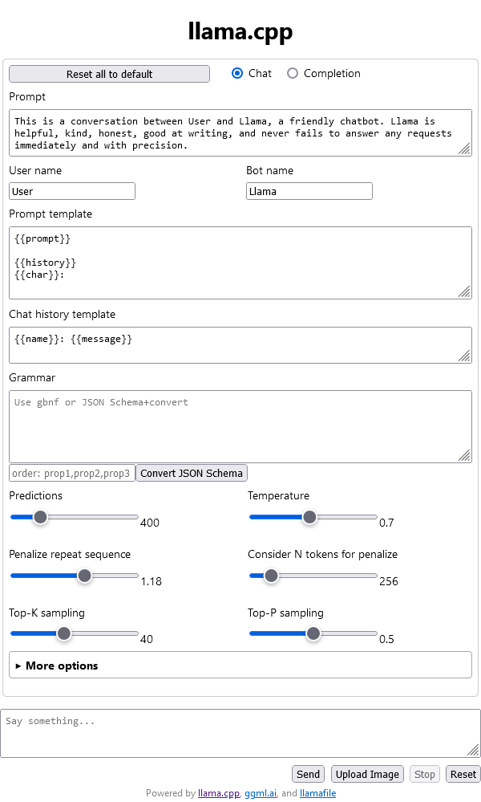
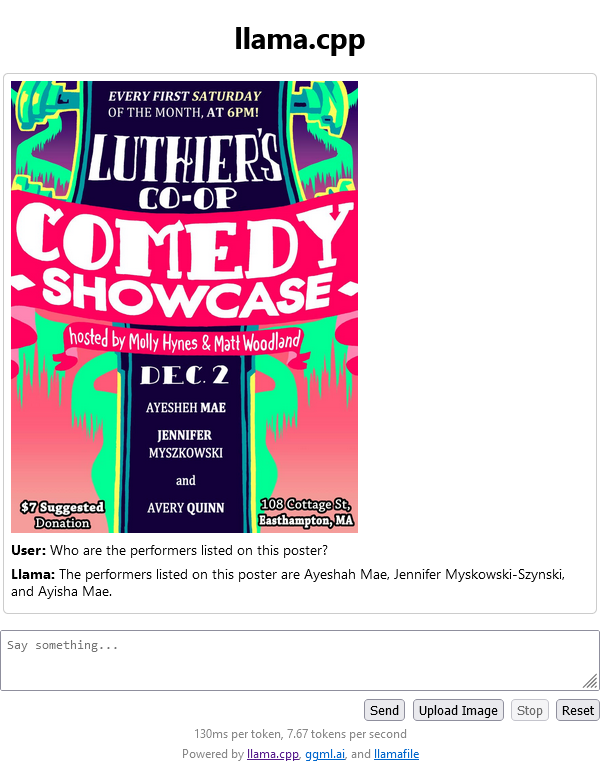
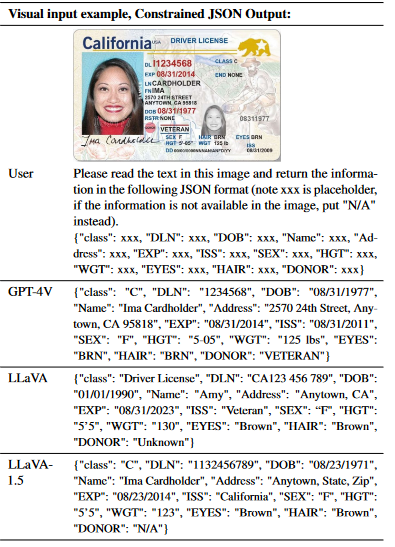

I read [Simon Willison's post](https://simonwillison.net/2023/Nov/29/llamafile/) about using Llamafile to experiment with open-source chatbots / LLMs. He made it sound so easy, so I decided to try it out.

One of my longtime hobby projects is [WanderJest](https://wanderjest.com), a site for finding live comedy. One of the challenges of that site is that the canonical information about an upcoming show is often the poster for it. Here's an example:

{{}}

I've been scraping this information by hand, but that's tedious and time-consuming.

Simon mentioned that Llamafile makes it easy to run [LLaVA 1.5](https://llava-vl.github.io/), which allows you to ask a chatbot questions about an image. If I could get LLaVA to tell me all the information I wanted from a poster, then that could automate away my problem on WanderJest.

## CPU-based LLaVA 1.5

To start, I tried spinning up a Scaleway PRO2-S VM instance running Debian Bookworm. Any VM will work, but I just chose this because I have infrastructure to spin up Scaleway servers conveniently.

I SSH'ed in to the server with port forwarding enabled so I could access Llamafile's web interface:

```bash
ssh mike@$MY_SCALEWAY_IP -L 8080:localhost:8080
```

Per Simon's instructions, I downloaded the binary for running the server:

```bash
curl -LO https://huggingface.co/jartine/llava-v1.5-7B-GGUF/resolve/main/llava-v1.5-7b-q4-server.llamafile && \
  chmod 755 llava-v1.5-7b-q4-server.llamafile
```

And then I spun up my server:

```bash
./llava-v1.5-7b-q4-server.llamafile --nobrowser
```

That worked, and I saw the web interface in my browser:

{{}}

I tried uploading the show poster, and nothing happened. It turned out that I had to upload the poster _and_ ask it a question.

{{}}

So, a bit of a rough start. It gets all three names incorrect, hallucinating variations on the actual names.

> **User**:Who are the performers listed on this poster?
>
> **Llama**:The performers listed on this poster are Ayeshah Mae, Jennifer Myskowski-Szynski, and Ayisha Mae.

It took about a minute to produce this answer. Stats were listed as:

> 130ms per token, 7.67 tokens per second

> **User**:Where will this show take place?
>
> **Llama**:The comedy showcase will take place at Luthier's Co-op in Rathmell, Pennsylvania.

Again, it's getting something, but it's only about 70% accurate.

I was also curious if I could get the information in JSON format, but I had a hard time convincing LLaVA to speak JSON. I'd say "Respond in JSON to the following question," and it would ignore me. In the [research paper](https://arxiv.org/abs/2310.03744), they showed an example of convincing LLaVA to respond in JSON:

{{}}

I tried repeating the format from the paper, and it just gave back nothing:

> **User**:Please read the text in this image and return the information in the following JSON format (note xxx is placeholder, if the information is not available in the image, put "N/A" instead).
> {"title": xxx, "date": xxx, "time": xxx, "performers": xxx, "hosts": xxx, "location": { "address": xxx, "city": xxx, "state": xxx, "zipCode": xxx}}

I could tell from the server logs that it finished processing the request, but nothing came back. I tried again, and it successfully generated JSON, though it still hallucinated a lot of the information:

> **User**:Please read the text in this image and return the information in the following JSON format (note xxx is placeholder, if the information is not available in the image, put "N/A" instead).
> {"title": xxx, "date": xxx, "time": xxx, "performers": xxx, "hosts": xxx, "location": { "address": xxx, "city": xxx, "state": xxx, "zipCode": xxx}}
>
> **Llama**:{"title": "Luther's Coop Comedy Showcase", "date": "December 2nd", "time": "7:00 PM - 9:30 PM", "performers": ["Ayisha M. Quinn", "Jennifer Myskowski-Szczykowski"], "hosts": ["Molly Hyne & Matt Woodland"], "location": { "address": "109 Court St, Framingham, MA", "city": "Framingham", "state": "MA", "zipCode": "01702"}}

It got a few things right:

- It correctly scraped the name "Matt Woodland"
- It correctly identified the date as December 2nd
- It correctly identified the state as MA

But everything else was minorly to majorly wrong. Interestingly 01702 is a Framingham, MA zip code, so it must have pulled that information from elsewhere because it wasn't on the poster. But that's because the show isn't in Framingham.

## Unsuccessfully using CUDA for GPU-based LLaVA 1.5

I don't know anything about LLM parameters, but I wanted to try adjusting some of the settings to see if that resulted in better output. The problem was that with CPU-based processing, each question took about a minute to answer, so it was too slow to make experimenting interesting.

I decided to spin up a Scaleway GPU-3070-S instance. That has an NVIDIA 3070 GPU with 8 GB of GPU VRAM, so I figured it should be much faster than CPU-based processing I was doing.

To make Llama file use the GPU, I needed to install CUDA on Linux, which turned out to be surprisingly hard. NVIDIA has [official instructions](https://docs.nvidia.com/cuda/cuda-installation-guide-linux/index.html), but they're extremely convoluted.

After several false starts, I tweaked NVIDIA's instructions to the following, which installed CUDA on Scaleway's Ubuntu 22.04 GPU-optimized OS:

```bash
sudo apt-get install linux-headers-$(uname -r) && \
  sudo apt-key del 7fa2af80 && \
  echo "deb [signed-by=/usr/share/keyrings/cudatools.gpg] https://developer.download.nvidia.com/compute/cuda/repos/ubuntu2204/x86_64/ /" | sudo tee /etc/apt/sources.list.d/cuda-ubuntu2204-x86_64.list && \
  wget https://developer.download.nvidia.com/compute/cuda/repos/ubuntu2204/x86_64/cuda-ubuntu2204.pin && \
  sudo mv cuda-ubuntu2204.pin /etc/apt/preferences.d/cuda-repository-pin-600 && \
  sudo apt-get update && \
 sudo apt-get install -y cuda-toolkit
```

And then, again, I downloaded Llamafile:

```bash
curl -LO https://huggingface.co/jartine/llava-v1.5-7B-GGUF/resolve/main/llava-v1.5-7b-q4-server.llamafile && \
  chmod 755 llava-v1.5-7b-q4-server.llamafile
```

And then I spun up my server:

```bash
./llava-v1.5-7b-q4-server.llamafile --nobrowser
```

Everything worked, and the server logs showed it was using the VM's GPU. I tried uploading an image and asking a question, and the server crashed with this error:

```text
CUDA error 2 at /home/mike/.llamafile/ggml-cuda.cu:6006: out of memory
```

I thought

I read somewhere that it indicates too large a batch size, so I tried re-running like this:

```bash
./llava-v1.5-7b-q4-server.llamafile --nobrowser --batch-size 1
```

But I got the same result.

I tried again using Scaleway's beefier RENDER-S instance, which has double the GPU VRAM, but I got the same crash.

## Wrap up

That was the end of my experiment. It doesn't seem like LLaMA 1.5 with the default settings works with my problem of parsing information from show posters, but I've only experimented with it for a few hours. I'm hopeful that open-source AI models will continue improving and becoming more accessible over the next year.
