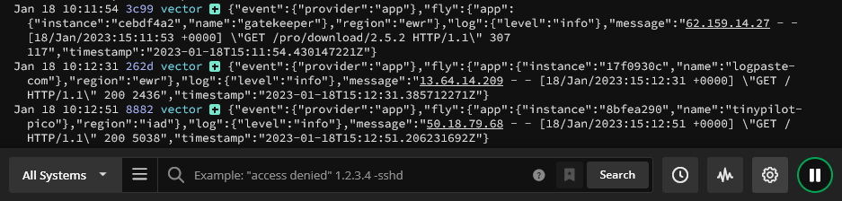

My apps generate &lt;10MB of logs per month. Want a log solution that provides high retention (1 year), searches for at least a month (year is better) at a price &lt;=$50/mo.

Mainly want it for searching web app logs, viewing logs. Don't care about graphs, alerts.

## Axiom

90-day retention (lowest-cost plan) costs $99/month.

## Datadog

"Contact us" pricing for log retention beyond 30 days.

## Honeycomb

Max retention is 60-days.

Lowest-cost paid plan is $130/mo.

Much broader than just logging.

## Humio

Is now FalconLogScale. Huge platform, no published pricing.

## LogDNA

Is now mezmo

Feels very Enterprise focused.

No published pricing.

## Logflare

Heavily optimized for graphing.

Can show a max of 100 matching lines. Difficult to shift to an earlier time window because it requires non-trivial adjustments to their custom query language.

Lots of papercut bugs in the web UI.

Seem to be in a transition period where they're merging with Supabase, and Supabase is doing their support (badly).

Lets you bring your own BigQuery. Only costs $10/mo instead of $15 for using one of their BigQuery tables. Good if your BigQuery usage will be low.

Nice: Gives you the BigQuery query so you can run the command directly.

Web UI is ugly.

## Logtail

$30/mo

Processes events well.

Max retention is 30 days, regardless of your log volume.

Pretty web UI.

Web UI is slow.

Focused on logging.

Immediately deletes all of your logs as soon as you say you want to cancel your subscription (doesn't let you keep it until the end of your subscription period).

Can archive beyond retention to S3-compatible storage or Backblaze. Might be easier to just send a copy from Fly directly to a cloud storage bucket.

## Loki

Part of Grafana

Open-source

Hosted version is $8/mo for max of 30-day log retention

<https://grafana.com/pricing/>

## New Relic

"Data Plus" plan has 90+ day retention, but no published pricing for it.

## Papertrail

Lets you customize volume and search duration. Doesn't let you customize retention, but a year is decent. I think you can also archite to S3.

Aimed at large companies. Owned by Solarwinds, who was subject of famous hack.

Insecure by default. Accepts logs from any host with no authentication as long as they guess the easily-guessable endpoint. Hard to tighten this up on Fly.io since the VMs are ephemeral, and Fly doesn't have support for authenticating to Papertrail. Would probably be straightforward to add, though, since fly-log-shipper is open-source.

Bad at integrating with fly.io's vector format.

{{}}

## Sematext

Standard paid plan has 15 days of retention and costs $95/mo.

1-year retention costs $450/mo

## Uptrace

Maximum log retention is 30 days.

Doesn't seem very good at searching logs.

## EraSearch

30-day retention by default

1-year retention "with annual contract"

Couldn't find any information about annual contract, even after signing up.

Couldn't figure out how to connect it to fly.io. I see access tokens but none of the settings Fly wants: `ERASEARCH_URL`, `ERASEARCH_AUTH`, `ERASEARCH_INDEX`

Seems very bloated, not very focused on logs.
