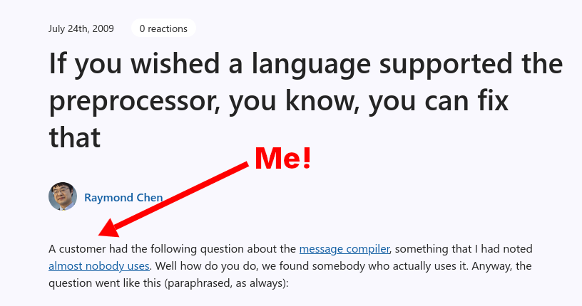

I'm a pretty humble guy, so most people aren't aware of this extremely impressive fact about me: I was once [mentioned](https://devblogs.microsoft.com/oldnewthing/20090724-00/?p=17373) on Raymond Chen's classic Windows blog, _The Old New Thing_.

No, he didn't mention me by name nor did he provide any way to identify me as the subject of the post, but it's amazing nonetheless. I deserve a great deal of credit for how little I boast about this achievement.

{{}}

## Some background

Raymond described me in the post as "a customer," but I was actually his fellow Microsoft employee at the time.

I worked on BitLocker, the part of Windows that does full drive encryption. We were starting development on Windows 8, and my project was to make BitLocker's group policy settings less confusing.

BitLocker had a strangely high number of knobs and switches that admins could configure through Group Policy, so they could say things like, "Everyone's BitLocker passphrase has to be at least 12 characters long."

One of the problems was that the error messages were bad. So, if the admin tried to say that every employee's BitLocker passphrase had to be at least 1000 characters long, BitLocker would throw an error like, "No, that's too long," but it wouldn't tell you what the limit was.

On Windows, at least on my team, you couldn't have user-facing messages in your C++ code because then the localization team couldn't translate the messages to other languages. So, all user-facing messages were in `.mc` files that looked like this:

```text
SymbolicName=ERROR_BITLOCKER_PASSPHRASE_MINIMUM_TOO_LONG
The BitLocker minimum passphrase length is too high.
.
SymbolicName=...
```

And then somewhere in the C++ code, we'd have a check that was like this:

```c++
#define MAX_PASSPHRASE_MINIMUM 20

int minimumPassphraseLength = readGroupPolicy(GP_BITLOCKER_MINIMUM_PASSPHRASE_LENGTH);
if (minimumPassphraseLength > MAX_PASSPHRASE_MINIMUM) {
  return ERROR_BITLOCKER_PASSPHRASE_MINIMUM_TOO_LONG
}
```

So, I wanted the user to see an error message like this:

> The BitLocker minimum passphrase length cannot exceed **20**.

But I didn't want to just copy the value of `20` from the C++ code because then the error message could go out of sync if we ever changed the value.

## How Raymond Chen got involved

I couldn't figure out how to reference C++ constants or preprocessor directives in a `.mc` file, but I thought there had to be some solution, so I emailed some internal Windows development mailing list to ask if that I could write the `.mc` file like this:

```text
SymbolicName=ERROR_BITLOCKER_PASSPHRASE_MINIMUM_TOO_LONG
The BitLocker minimum passphrase length cannot exceed ${MAX_PASSPHRASE_MINIMUM}.
```

If I recall correctly, Raymond Chen replied to the thread just saying, "There's no law saying you can't use the precompiler," and an example of generating the `.mc` file with the precompiler command.

It took me a while to figure out what he was even trying to tell me because I didn't even know you could run a C++ compiler in "just the preprocessor" mode.

## I still wouldn't know to do this

It's funny looking back on this exchange because at the time I felt like, "Wow, I'm dumb for not knowing I could use the preprocessor like this." But 16 years later, Raymond's solution to run the C preprocessor on a non-C/C++ file still strikes me as unexpected/hacky.

If it weren't for this exchange, I'd never even know you could tell Visual C++ (or any C compiler for that matter) to run only the preprocessor step.

## This wouldn't happen at Google

It's also weird looking back on this and seeing that this was a problem I was trying to solve myself. But, why? This doesn't at all feel like an unusu

## How I've grown

I'd like to say that the Michael of today wouldn't be so surprised becuase I'd be more familiar with my tools and my build system, but I'm actually still not.
