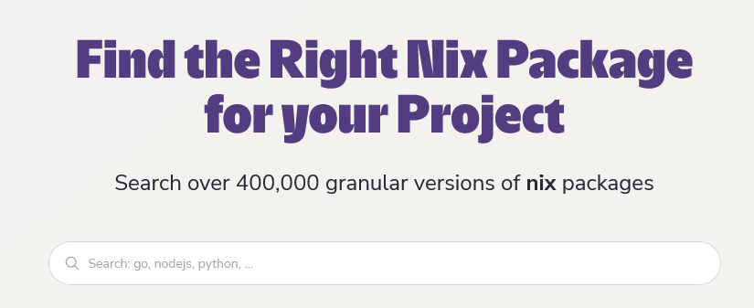
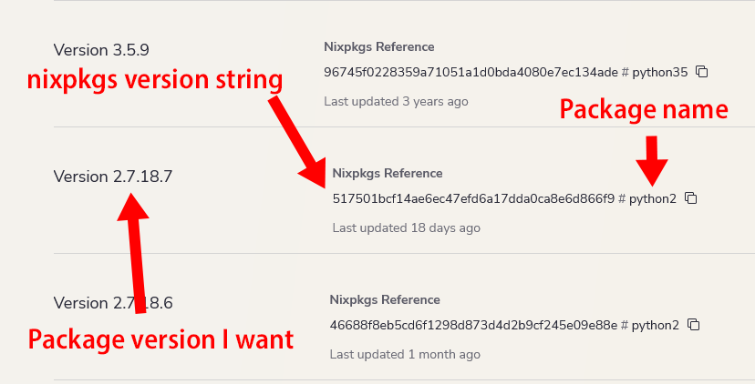

[Nix](https://nixos.org/) is a broad product with a steep learning curve. It's capable of everything from installing a single package to managing every file and application on your OS.

One useful thing you can do with Nix, even as a complete beginner, is manage your dev environments.

Nix lets me have multiple projects on the same system that each have their own independent view of what dependencies are available. I can have one legacy project running Python 2.7 and Node.js 4.x alongside a modern project running Python 3.11 and Node.js 20, and they won't interfere with each other.

Even if you have no experience with Nix, you can use Nix-managed dev environments with about 20 minutes of work.


**Note**: I'm still a Nix beginner, so I'm not sure if what I'm doing is the optimal solution. If more experienced Nix readers have suggestions for improvements, let me know, and I'll update the post.


## Why not manage development environments with Docker?

I like Docker, and I use it for deployment and certain DevOps tasks, but I haven't found it helpful for managing development environments.

I do my development in VS Code over SSH, and Docker makes that a pain. I know there are workarounds, but I've never found them appealing.

## Why not manage development environments with Ansible?

For the past six years, [I've managed my development environments with Ansible](/notes/nix-first-impressions/#the-problems-with-ansible), and that's worked okay.

For every software project I have, I create a dedicated virtual machine and associated Ansible playbook for configuring the VM with all of my dependencies.

The problem is that when I want to experiment with something for a few minutes, I'm not that excited to spin up a whole VM, write a playbook, and then wait 10-20 minutes for Ansible to provision the server.

I'm slowly migrating all of my projects to use Nix rather than Ansible, as Nix is much lighter weight. Upgrading my dependencies through Ansible usually takes me about 20 minutes per dependency, whereas I can do the same thing in Nix in about two minutes.

## Creating a simple Nix development environment

To demonstrate how Nix development environments work, I'm going to start with a Debian 11 system with nothing installed.

### Install Nix

First, install Nix. I'm using the third-party [Determinate Systems installer](https://zero-to-nix.com/start/install) rather than the official Nix installer, as the Determinate Systems one makes some opinionated configuration decisions that are useful for what I'm showing here.

```bash
curl \
  --proto '=https' \
  --tlsv1.2 -sSf -L https://install.determinate.systems/nix \
  | sh -s -- install && \
  . /nix/var/nix/profiles/default/etc/profile.d/nix-daemon.sh
```

### Create a simple Python 2.7 application

To show Nix development environments in action, I'm going to create a simple application that runs under Python 2.7, the legacy version of Python that was officially deprecated in 2020.

To begin, I create a new directory for the project.

```bash
mkdir example && cd example
```

Next, download or copy this Nix flake, the file that defines the Nix development environment:



```bash
curl \
  --show-error \
  --fail \
  /notes/nixos-dev-environment/flake.nix \
  > flake.nix
```

If you're not familiar with Nix, the `flake.nix` file looks like a lot of confusing syntax, but it's mostly simple boilerplate. I'll explain it in more detail [below](#finding-version-strings).

Finally, it's time to spin up my Nix development environment. Note that the first time you run the command, it will take a few minutes to initialize everything, but subsequent initializations will complete in a few seconds.

```bash
# We need NIXPKGS_ALLOW_INSECURE and --impure because Python 2.7 is past end of
# life.
$ NIXPKGS_ALLOW_INSECURE=1 nix develop --impure
Python 2.7.18.7
```

It worked! I have a Python 2.7 environment available.

Note that I haven't installed Python 2.7 anywhere outside of this specific Nix environment. If I open a new terminal without running `nix develop`, I see the following error message that Python is not installed:

```bash
$ python  --version
-bash: python: command not found
```

Back to my Python 2.7 Nix environment, let me try running a simple Python script using the evil, deprecated `print` syntax that doesn't work in Python 3:

```bash
$ echo 'print "hello, world!"' > main.py && \
  python main.py
hello, world!
```

Cool! I can run legacy Python 2.7 code in this environment.

## Finding version strings

So, how does my `flake.nix` file work?

One of the first lines in the `flake.nix` file declares the exact version of the Python package I want:

```nix
# 2.7.18.7 release
python_dep.url = "github:NixOS/nixpkgs/517501bcf14ae6ec47efd6a17dda0ca8e6d866f9";
```

The line `# 2.7.18.7 release` is just a comment for my own reference. Nix ignores it. The part that's doing the heavy lifting is the `python_dep` line.

`NixOS/nixpkgs` is a [Github repo](https://github.com/NixOS/nixpkgs), and [`517501bcf14ae6ec47efd6a17dda0ca8e6d866f9`](https://github.com/NixOS/nixpkgs/tree/517501bcf14ae6ec47efd6a17dda0ca8e6d866f9) is the version of the repo where the `python2` package corresponded with Python 2.7.18.7.

How did I know that long version string? I used [Nixhub](https://www.nixhub.io/).

{{}}

Nixhub is a free package search service created by [Jetpack](https://www.jetpack.io), a company that sells developer tooling on top of Nix.

Nixhub was only released [three months ago](https://www.jetpack.io/blog/introducing-nixhub/), and it's made my life in Nix so much easier. If I want to find the version hash for a particular version of a package, I search it in Nixhub and find the commit ID.

So, to find the version string for Python 2.7.18.7, I [searched Nixhub for `python`](https://www.nixhub.io/packages/python) and then scrolled down the list of results for the latest available Python 2.7.x version:

{{}}

Pinning exact package versions is, honestly, a huge pain. I hope that Nix tooling evolves to the point where you can just specify that you want version `2.7.18.7` rather than go through this roundabout dance of looking up the git commit hash that corresponds to the version you want. But for now, this is the best way I know of for
pinning versions.

## Understanding the `flake.nix` file

Okay, I told you I'd go into more detail about the `flake.nix` file I showed above.

I'm not going to explain everything about Nix flakes because I don't have a deep understanding myself. I'm just going to explain the minimum you need to understand to make your own dev environments. For a deeper dive into Nix flakes, see ["Practical Nix Flakes."](https://serokell.io/blog/practical-nix-flakes)

The `inputs` section is where you put the versions of different Nix sources you want in your environment. I'm using a special syntax for github repos, but you can import from other source repositories or URLs.

```nix
  inputs = {
    flake-utils.url = "github:numtide/flake-utils";

    # 2.7.18.7 release
    python_dep.url = "github:NixOS/nixpkgs/517501bcf14ae6ec47efd6a17dda0ca8e6d866f9";
  };
```

`devshells.default` defines the development environment for the Nix shell. `packages` includes a list of all the packages I want available in my environment.

```nix
devShells.default = python_dep.mkShell {
        packages = [
          python_dep.python2
        ];
```

For most packages, the package name doesn't have a version. For packages like `htop` or `vim`, the package name is always the same, but certain packages, like Python, have multiple versions available within the same Nixpkgs version, so you have to specify `python2` as opposed to `python` to avoid confusion with Python 3.

The last relevant bit is the `shellHook` section.

```nix
shellHook = ''
  python --version
'';
```

Nix runs the commands in `shellHook` just before dumping you into your shell. You can put any shell commands there.

I like to put commands that print the versions of my dependencies so that I can easily see whether my Nix flake is working correctly.

## Upgrading to Python 3

Okay, let's say that I'm ready to do the hard work of porting my one-line Python app from Python 2.7 to modern Python 3. I just need to update these two snippets:

```nix
    # 3.12.0 release
    python_dep.url = "github:NixOS/nixpkgs/e2b8feae8470705c3f331901ae057da3095cea10";
```

```nix
        packages = [
          python_dep.python312
        ];
```

My new Python 3 flake looks like this:

```nix
{
  description = "Demo Nix dev environment";

  inputs = {
    flake-utils.url = "github:numtide/flake-utils";

    # 3.12.0 release
    python_dep.url = "github:NixOS/nixpkgs/e2b8feae8470705c3f331901ae057da3095cea10";
  };

  outputs = { self, flake-utils, python_dep }@inputs :
    flake-utils.lib.eachDefaultSystem (system:
    let
      python_dep = inputs.python_dep.legacyPackages.${system};
    in
    {
      devShells.default = python_dep.mkShell {
        packages = [
          python_dep.python312
        ];

        shellHook = ''
          python --version
        '';
      };
    });
}
```

I exit my original Nix shell by hitting Ctrl+D or typing `exit`, and I initialize my new Python 3 environment by running:

```bash
$ nix develop
warning: updating lock file '/home/mike/example/flake.lock':
• Updated input 'python_dep':
    'github:NixOS/nixpkgs/517501bcf14ae6ec47efd6a17dda0ca8e6d866f9' (2023-09-27)
  → 'github:NixOS/nixpkgs/e2b8feae8470705c3f331901ae057da3095cea10' (2023-10-03)
Python 3.12.0
```

Conveniently, I can skip the `NIXPKGS_ALLOW_INSECURE` options I needed for Python 2.7, as modern versions of Python are not considered insecure.

I should now be in a Python 3 environment. To prove it, I'll try to run my Python 2-style `main.py`, and see if Python 3 appropriately screams in horror:

```bash
$ python main.py
  File "/home/mike/example/main.py", line 1
    print "hello, world!"
    ^^^^^^^^^^^^^^^^^^^^^
SyntaxError: Missing parentheses in call to 'print'. Did you mean print(...)?
```

Looks like Python 3 is working as intended. I'll update my syntax for Python 3 and try again:

```bash
$ echo 'print("hello, world!")' > main.py && \
  python main.py
hello, world!
```

Everything is good again. I just updated my environment from Python 2.7 to Python 3.12 by changing a few lines of my Nix flake!

## Adding a new dependency

Okay, I showed how to update a package, but what about adding a new dependency?

I'm going to add a new bash script that automatically runs my Python file.

```bash
(cat <<EOF
#!/usr/bin/env bash

set -eux

readonly MAIN_SCRIPT="main.py"
python \$MAIN_SCRIPT
EOF
) > run.sh && \
  chmod +x run.sh && \
  ./run.sh
```

You should see the following output:

```bash
+ readonly MAIN_SCRIPT=main.py
+ MAIN_SCRIPT=main.py
+ python main.py
hello, world!
```

I'm a weak bash developer, so static analysis tools could probably improve my `run.sh` script.

[`shellcheck`](https://www.shellcheck.net/) is an excellent linter for bash scripts, and I use it anywhere I write bash code. I want to pull `shellcheck` into my dev environment and get its advice about potential bash gotchas, so I update my Nix flake:

```nix
{
  description = "Demo Nix dev environment";

  inputs = {
    flake-utils.url = "github:numtide/flake-utils";

    # 3.12.0 release
    python_dep.url = "github:NixOS/nixpkgs/e2b8feae8470705c3f331901ae057da3095cea10";

    # 0.9.0 release
    shellcheck_dep.url = "github:NixOS/nixpkgs/8b5ab8341e33322e5b66fb46ce23d724050f6606";
  };

  outputs = { self, flake-utils, python_dep, shellcheck_dep }@inputs :
    flake-utils.lib.eachDefaultSystem (system:
    let
      python_dep = inputs.python_dep.legacyPackages.${system};
      shellcheck_dep = inputs.shellcheck_dep.legacyPackages.${system};
    in
    {
      devShells.default = python_dep.mkShell {
        packages = [
          python_dep.python312
          shellcheck_dep.shellcheck
        ];

        shellHook = ''
          python --version
          echo "shellcheck" "$(shellcheck --version | grep '^version:')"
        '';
      };
    });
}
```

Again, I exit my original Nix shell by hitting Ctrl+D or typing `exit` and instantiate a new shell with:

```bash
$ nix develop
warning: updating lock file '/home/mike/example/flake.lock':
• Added input 'shellcheck_dep':
    'github:NixOS/nixpkgs/8b5ab8341e33322e5b66fb46ce23d724050f6606' (2023-09-19)
Python 3.12.0
shellcheck version: 0.9.0
```

Everything's looking good. `shellcheck` reports version 0.9.0, the version I requested.

Now, it's time to run `shellcheck` against my `run.sh` script.

```bash
$ shellcheck -o all run.sh
In run.sh line 6:
python $MAIN_SCRIPT
       ^----------^ SC2248 (style): Prefer double quoting even when variables don't contain special characters.
       ^----------^ SC2250 (style): Prefer putting braces around variable references even when not strictly required.

Did you mean:
python "${MAIN_SCRIPT}"

For more information:
  https://www.shellcheck.net/wiki/SC2248 -- Prefer double quoting even when v...
  https://www.shellcheck.net/wiki/SC2250 -- Prefer putting braces around vari...
```

Hey, it worked!

This feels small, but it solves a major problem I've had in the past. I like running `shellcheck` as a git pre-commit hook in all of my projects, but I've always had to depend on a single, system-wide version of `shellcheck`. If I see that `shellcheck` has new rules I want to apply to one of my projects, my pre-commit hooks will potentially start failing for _all_ of my projects.

Nix allows me to bind each project to the version of the linter I want to run. That means I can upgrade to new linters on a per-project basis rather than sharing a single version globally.

## Using `direnv` to automatically load the Nix development shell

I have my Nix dev shell working, but it means that every time I open a new terminal window, I have to type `nix develop` to enter my shell.

Can I automate this? It turns out I can by using [`direnv`](https://direnv.net/).

`direnv` automatically loads your Nix shell whenever you `cd` into your project's directory. When you `cd` out of it, `direnv` automatically unloads the shell.

`direnv` is available as a normal `apt` package, but, annoyingly, on Debian Bullseye and earlier, the latest available package is 2.25.0.

Since I'm using Nix flakes, I need `direnv` [2.29.0](https://github.com/direnv/direnv/releases/tag/v2.29.0) or later, so I'll use the official `direnv` installer instead:

```bash
curl -sfL https://direnv.net/install.sh \
  | sudo bin_path=/usr/local/bin bash && \
  echo 'eval "$(direnv hook bash)"' >> ~/.bashrc && \
  . ~/.bashrc
```

Running `direnv` with the `--version` flag indicates I'm using the latest version available:

```bash
$ direnv --version
2.32.3
```

To enable `direnv` for my project, I need go to the directory where I have my Nix flake, and run the following commands:

```bash
echo 'use flake .' > .envrc && \
  direnv allow
```

Now, `direnv` will automatically load my Nix environment anytime I `cd` into my project directory and unload it when I exit the directory.

## Every new dependency makes initialization slower

The biggest downside I've found with Nix dev environments is that the environment load times are slow. `cd`ing into a directory is normally something that happens in milliseconds, but if I need to load my Nix environment, it can take 5-10 seconds.

Worse, the more dependencies you have, the slower the load time becomes. Nix has to maintain [a separate instance of `nixpkgs`](https://zimbatm.com/notes/1000-instances-of-nixpkgs) for each dependency, so every new dev tool I want available means I have to pay a penalty in directory load time.

Unfortunately, I haven't found a workaround for this issue.

## I don't have a good solution for Nix in CI

Since I'm doing all this work to create an independent, reproducible development environment for my project, I naturally want to reuse this environment when I run my code in continuous integration (CI). Unfortunately, I haven't found a practical way of integrating Nix into my CI workflows.

The problem with Nix in CI is that Nix has to do a lot of work up front to create its own environment. On my local development systems, Nix takes 60-180 seconds to initialize its environment for the first time, usually downloading multiple gigs of data from package servers.

The slow initialization is annoying but tolerable on my local system because the initialization only has to happen once. On CI, it's a bigger problem because it means that simple CI steps that used to run in 10 seconds now balloon to 2 minutes of initializing Nix plus 10 seconds of doing the thing I care about.

I tried using [Cachix](https://www.cachix.org/), a Nix-specific cloud cache. It [maybe helped](https://github.com/cachix/cachix/issues/579#issuecomment-1737809187), but I never found a way to reduce the initial load time below 90 seconds per CI step.

There are a few CI solutions built specifically around Nix ([Garnix](https://garnix.io/), [Hercules](https://hercules-ci.com/), and [smithy](https://smithy.build/)), but I haven't tried them. I'm hoping to use Nix in the CircleCI environment I already know well rather than have to learn a whole new CI system.

## My dream feature: Nix manages language-specific dependencies

One thing that Nix _seems_ capable of doing but I haven't figured out how, is managing language-specific dependencies.

For example, if I use Nix to create a Python 3 project with a list of pip dependencies in a `requirements.txt` file, I'd love for Nix to say, "Hey, your `requirements.txt` changed! I'll update your environment to match." Ditto for Node.js and my `package.json` file. But so far, I don't see a way to make Nix monitor files like that.

I've seen [poetry2nix](https://github.com/nix-community/poetry2nix), but I haven't tried it, as I don't use Poetry in my Python projects. But if any readers have suggestions of how to achieve the functionality I'm imagining, let me know in the comments.

**Update (2023-10-28)**: I discovered that [pyproject.nix supports plain `requirements.txt` files](https://nix-community.github.io/pyproject.nix/use-cases/requirements.html), so I'm now [using that](https://github.com/mtlynch/python3_seed/blob/81998e07eaafa8e64f39e771402d2d11c2eeb4e4/flake.nix).

## Gotchas

As with every Nix adventure, there are a ton of gotchas to Nix dev environments. I've listed below the ones that I've encountered so far.

### Nix needs `flake.nix` to be in git

One strange quirk of Nix flakes is that if they're in a directory that's under git source control, but you haven't `git add`ed the `flake.nix` file to your repo, you'll see a confusing error like this:

```text
error: getting status of '/nix/store/66snibk6a9y3dbam1ww7fj0bdrh0ylw6-source/flake.nix': No such file or directory
```

If this happens, you can fix it with `git add flake.nix`. You don't even have to commit the change &mdash; just adding the flake is enough.

### Go: Failure to link to libc

In my Go projects that depend on CGO, I've encountered this error when I try to compile my code from a Nix dev environment:

```text
runtime.gcdata: missing Go type information for global symbol .dynsym: size 72
runtime/cgo(.text): relocation target stderr not defined
runtime/cgo(.text): relocation target fwrite not defined
runtime/cgo(.text): relocation target vfprintf not defined
```

It looks like Go is failing to link my binary against libc. It's similar to [this issue](https://github.com/golang/go/issues/44695) that affects Zig users.

I tried adding `libc` and `musl` to my Nix environment's list of packages, but they have no effect.

The only thing that fixes the linking issue is compiling my Go app with `-tags=netgo,osusergo`. I have no idea why that works.

See my [PicoShare](https://github.com/mtlynch/picoshare/blob/1.4.0/flake.nix) flake and [build script](https://github.com/mtlynch/picoshare/blob/1.4.0/dev-scripts/build-backend) for a complete example of building multiplatform Go binaries in a Nix environment.

### Golang: version X does not match go tool version Y

On some of my systems, I started seeing these errors when I ran my build scripts:

```text
compile: version "go1.18.4" does not match go tool version "go1.19.6"
```

It turned out that my `GOROOT` environment variable pointed to a version of the Go compiler outside of my Nix environment.

The quick fix was to run this command:

```bash
unset GOROOT
```

The permanent fix was to search [all the files on my system that set environment variables](https://unix.stackexchange.com/a/249922/152974) and locate the one that was setting `GOROOT`. After I deleted the line that was assigning a value to `GOROOT`, I had to reboot my system &mdash; starting a new shell was not enough.

### Old package versions don't work

I've tried certain older versions of packages, and they flat-out don't work.

For example, if I choose nixpkgs version `b4e193a23a1c5d8794794e65cabf1f1135d07fd9` for `python39`, it not only breaks Python, but it breaks `shellcheck` as well:

```text
• Updated input 'python_dep':
    'github:NixOS/nixpkgs/e2b8feae8470705c3f331901ae057da3095cea10' (2023-10-03)
  → 'github:NixOS/nixpkgs/b4e193a23a1c5d8794794e65cabf1f1135d07fd9' (2021-02-19)
environment:2863: python: command not found
environment:2864: shellcheck: command not found
```

My best guess is that a nixpkg version that old predates compatibility with Nix flakes, a new and still not officially supported feature of Nix.

## Some of my Nix dev flakes

Here are a couple of Nix dev flakes I've made so far:

- [PicoShare](https://github.com/mtlynch/picoshare/blob/1.4.0/flake.nix) - A Go web app
- [mtlynch.io](https://github.com/mtlynch/mtlynch.io/blob/97c748f8b3900e74fff98a7c06842dcfe457b38e/flake.nix) - A hugo-based blog with Node.js dependencies
- [python3_seed](https://github.com/mtlynch/python3_seed/blob/81998e07eaafa8e64f39e771402d2d11c2eeb4e4/flake.nix) - A basic Python app with `requirements.txt` dependencies

## References

I had a hard time figuring out how to get Nix development environments working, as I couldn't find many documented examples.

The piece that finally made Nix environments click for me was [Attila Gulyas's detailed guide](https://gist.github.com/toraritte/62e53be9e6d88d8b6b97391eb3c6558b#22-pin-nixpkgs-in-a-nix-expression).
