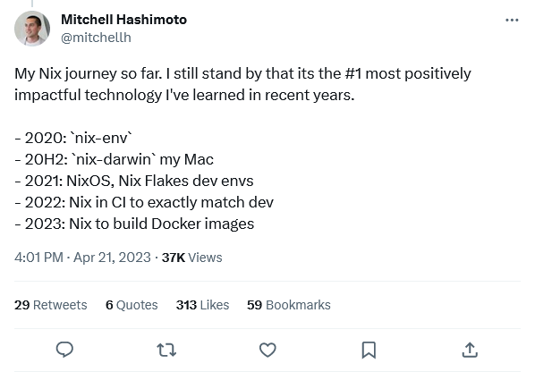
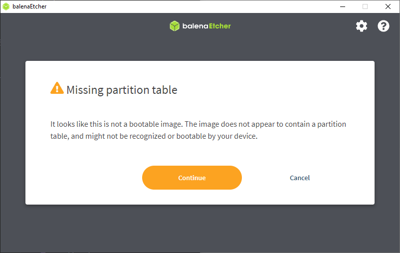
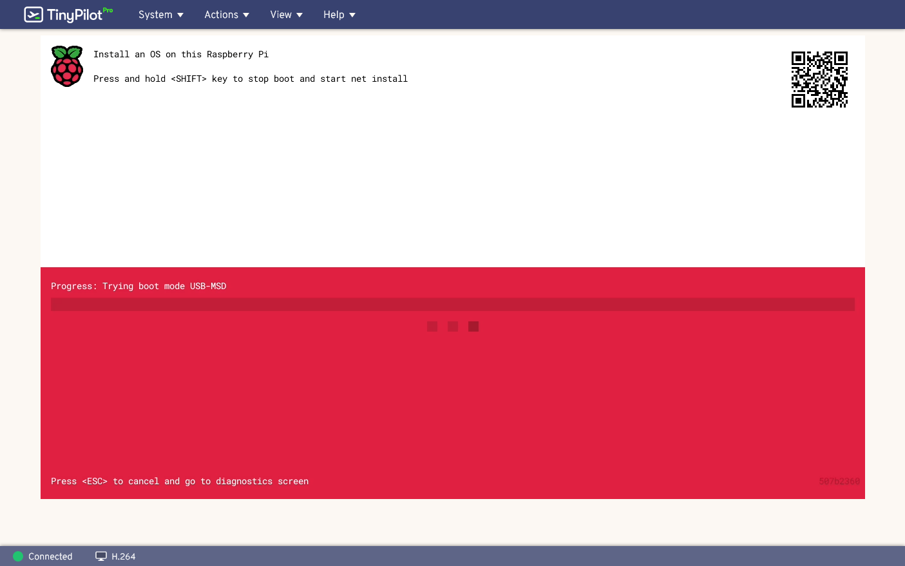
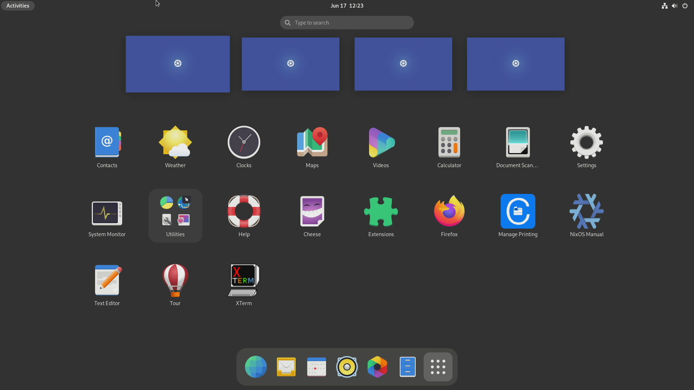

Nix is a tool for configuring software environments according to source files. I've been hearing more and more about Nix on Hacker News and Twitter. The idea of it appeals to me, so I've been tinkering with it over the past few weeks.

## My history with infrastructure as code

Ten years ago, I discovered [Salt](https://github.com/saltstack/salt), a tool that allows you to define a computer system's configuration in source code. I loved the idea of a git repo that defined what services were installed on my computers and VMs. I could blow away the computer, re-run the configuration tool, and get it back to the same state.

I messed around with Salt for a few years until discovering [Ansible](https://github.com/ansible/ansible), which I felt like executed the same idea better.

I do all of my development on [my homelab VM server. I have a separate VM for each of my projects. And I manage each VM with Ansible.

## The problems with Ansible

Ansible's biggest problem is that it's painfully slow. To run the full Ansible configuration on a VM takes 10-15 minutes.

Suppose I want to install a new apt package `foo`. Do I just run `sudo apt install --yes foo` and have the package in 5 seconds? Or do I pull up my Ansible role, edit the configuration to add a step to install `foo`, then run the playbook, then wait 15 minutes? Obviously, I end up doing more of the former, so my environments drift from the Ansible files that are supposed to represent them.

The other issue is that Ansible's changes aren't backwards-compatible. So, if I want to update a playbook to take advantage of a new feature, I have to update *all* of my playbooks to be compatible. But I never feel inspired to just rewrite and retest all of my playbooks, so I'm still on Ansible 2.9, which was released three years ago.

## The appeal of Nix

I'm seeing more and more people talk about Nix and NixOS. A lot of the developers I find interesting are talking about their experiments with Nix.

The most impactful endorsement I've seen was from Mitchell Hashimoto, co-founder of Hashicorp, the company responsible for creating a lot of widely-used open-source infrastructure tools like Vagrant, Packer, Consul, and Terraform. He called Nix, "the #1 most positively impactful technology I've learned in recent years."

{{}}

The idea of Nix feels a lot like Ansible. Nix lets you define a configuration in code, and then it brings the system into that state.

## Nix vs. Ansible

Nix differs from Ansible in a few important ways that I find interesting.

### Nix is faster than Ansible

Ansible has no concept of the "state" of the system it's configuring. If it takes 15 minutes to run Ansible on one of my VMs, running the same playbook a minute later would take about 10 minutes.

Ansible never says, "Oh, I just configured that machine, so there's nothing for me to do now." Ansible has to perform every configuration again because anything could have happened since the last time it ran.

Nix, on the other hand, does have a concept of state. If you make a one-line change to a 200-line Nix configuration, it doesn't have to re-execute all 200 lines. It can evaluate the state of the system against the configuration file and recognize that it just has to apply the one-line change. And that change usually happens in a few seconds.

### Nix optimizes for local configuration

Ansible is designed to configure remote systems. You can still specify `localhost` as the target on Ansible and configure the same system Ansible is running on, but that's not the scenario that Ansible is optimized for.

Nix is designed to configure the environment it's in. With Nix, you define what should be in the environment, and then Nix creates that environment for you in place. With NixOS, you defined the entire operating system, and NixOS gets the operating system into that state. You can change low-level things like the filesystem, the Linux kernel, or the bootloader.

This solves the problem I had with Ansible where I can't upgrade one Ansible playbook without upgrading all of my Ansible playbooks. You can have many Nix systems running different versions of Nix, and they work fine. If I have some Ansible files that require Ansible 2.9, some that require 2.10, and some that require 2.14, then it's a big pain to juggle them all.

### Nix makes atomic changes

With Ansible, it's easy to fail halfway through a configuration, leaving the system in an undefined state.

With Nix, changes are atomic. Nix either gets your system into the desired state or it rolls back to the state before you tried changing the configuration.

## Nix resources that have been helpful

One of the biggest complaints I see about Nix is that it's underdocumented, incorrectly, or poorly documented. My experience is that the documentation feels like it's aimed at experienced Nix users. There's a lot of, "Add these lines to your configuration file!" Which configuration file? Where in the file do I add those lines?

Here are the best resources I've found so far:

* [Zero to Nix](https://zero-to-nix.com/): This is the best set of introductory Nix tutorials I've found. It's written by [Determinate Systems](https://determinate.systems), who also writes beginner-friendly [blog posts](https://determinate.systems/#blog) about using Nix.
* [NixOS for the Impatient](https://borretti.me/article/nixos-for-the-impatient): I'd tried to install NixOS a couple of times before this, but this post finally convinced me it was easier than I thought, and it gave me the final push to push through the process.
* ["Some notes on using nix" by Julia Evans](https://jvns.ca/blog/2023/02/28/some-notes-on-using-nix/): Julia's also a newcomer to Nix, so it was helpful seeing the blockers she ran into and how she worked around them even though there's a lot about the ecosystem that's still new and unfamiliar to her.

## Failed attempt #1: NixOS in a VM

I followed the "NixOS for the Impatient" tutorial on a Proxmox VM, and everything worked at first. Then, I got to the point in the tutorial where you change the hostname, and then I rebooted for it to take effect. But the VM got into a weird state where it seemed like it could boot but not log in. After I entered the password in the login screen, the screen just froze.



## Failed attempt #2: NixOS on the Raspberry Pi 4

Since a VM didn't work, I wanted to try installing on bare metal. I had a spare Raspberry Pi 4 on hand, and I thought the Pi would be fun hardware to experiment on.

I found two different official-looking tutorials for installing NixOS on the Raspberry Pi 4:

* [NixOS Wiki: NixOS on ARM/Raspberry Pi 4](https://nixos.wiki/wiki/NixOS_on_ARM/Raspberry_Pi_4)
* [nix.dev: Installing NixOS on a Raspberry Pi](https://nix.dev/tutorials/nixos/build-and-deploy/installing-nixos-on-a-raspberry-pi)

The problem with both of these tutorials was they assumed that you're already running a Nix environment. I'm trying to prepare the microSD from my main computer, which is a Win10 system, so I don't have Nix.

The [NixOS download page](https://nixos.org/download.html#nixos-iso) lists a 64-bit ARM image. The Raspberry Pi 4 supports 64-bit ARM, so I thought I'd try that.

I loaded up Balena Etcher, my preferred tool for flashing microSDs. The first red flag was when Etcher basically said, "Hey, what are you thinking? That's not even a bootable image."

{{}}

I continued on anyway! But when I tried booting from the microSD, the Pi agreed that this was not a bootable image, so it just got stuck.

{{}}

I tried flashing the same image using the official Raspberry Pi Imager utility, but I got the same results.

## Success: NixOS on a Dell Mini computer

I do most of my testing for TinyPilot against a Dell XX mini computer. It was the only bare-metal machine I had available that I could blow away, so I tried on that.

Everything worked exactly like in . I skipped encryption since this is just a test device and I wanted to eliminate a password-entry step on every reboot.


## Failed attempt #3: NixOS on the Raspberry Pi 4 (again)

Now that I had a working NixOS machine, I could try building the microSD image from that system. I followed the [nix.dev tutorial](https://nix.dev/tutorials/nixos/build-and-deploy/installing-nixos-on-a-raspberry-pi). This time, I got a little farther, but I couldn't boot. The Pi would just reach a stage of showing a multicolored screen and then hang:



## Task 1: Getting SSH access

I needed to SSH in to the NixOS system from my main machine. To do that, I'd need to get my SSH keys on the system. But without SSH, I didn't want to type my entire SSH public key, so I needed a few tools to pull down my keys from Github.

I opened the Console application and then typed `sudo nano /etc/nixos/configuration.nix`. Then, I went to the `environment.systemPackages` and added these lines:

```text
  environment.systemPackages = with pkgs; [
    vim
    curl
  ];
```

To make the changes take effect, I ran:

```bash
sudo nixos-rebuild switch
```

```bash
sudo mkdir -p /etc/nixos/ssh

GITHUB_USERNAME="mtlynch"
curl "https://github.com/${GITHUB_USERNAME}.keys" | \
  sudo tee --append /etc/nixos/ssh/authorized_keys
```

Next, I ran `sudo vim /etc/nixos/configuration.nix` and added these lines:

```text
  # Enable the OpenSSH daemon.
  services.openssh.enable = true;
  users.users.mike.openssh.authorizedKeys.keyFiles = [
    /etc/nixos/ssh/authorized_keys
  ];
```

Finally, I rebuilt and rebooted. I'm not sure if the reboot was strictly necessary:

```bash
sudo nixos-rebuild switch && sudo reboot
```

And it worked! After that, I could ssh into my NixOS system from my main computer.

## Task 2: Removing Gnome clutter

The first thing that struck me about the OS was that there was lots of clutter. It had a bunch of built-in apps I didn't want, like a contact list and a weather app:

{{}}

I searched for how to get rid of them and discovered that [they're default applications as part of the Gnome shell](https://discourse.nixos.org/t/howto-disable-most-gnome-default-applications-and-what-they-are/13505). You can disable them by adding this line to your `/etc/nixos/configuration.nix`:

```text
services.gnome.core-utilities.enable = false;
```

Or you can remove each utility one-by-one:

```bash
 environment.gnome.excludePackages = with pkgs.gnome; [
    baobab      # disk usage analyzer
    cheese      # photo booth
    eog         # image viewer
    epiphany    # web browser
    gedit       # text editor
    simple-scan # document scanner
    totem       # video player
    yelp        # help viewer
    evince      # document viewer
    file-roller # archive manager
    geary       # email client
    seahorse    # password manager

    gnome-calculator
    gnome-calendar
    gnome-characters
    gnome-clocks
    gnome-contacts
    gnome-font-viewer
    gnome-logs
    gnome-maps
    gnome-music
    gnome-screenshot
    gnome-system-monitor
    gnome-weather
    gnome-disk-utility
    pkgs.gnome-connections
  ];
```

I went with the "disable everything" option and rebuilt:


```bash
sudo nixos-rebuild switch
```

And voila! All of the clutter disappeared:

{{}}

## Task 3: Bringing back the System Monitor (failed)

The one Gnome tool I did think was worth keeping was System Monitor. I tried adding it to my list of `environment.systemPackages`, but then rebuilding failed:

```bash
$ sudo nixos-rebuild switch
building Nix...
building the system configuration...
error: undefined variable 'gnome-system-monitor'

       at /etc/nixos/configuration.nix:130:5:

          129|     curl
          130|     gnome-system-monitor
             |     ^
          131|   ];
(use '--show-trace' to show detailed location information)
```

I tried other possible names like `gnome-shell-system-monitor`, but I couldn't figure out how to install it.

## Next task: VS Code on NixOS

I do all of my development in VS Code over remote SSH. When I try remoting into my NixOS system from VS Code, the install fails. I'm assuming it's because VS Code has to install a minimal server on the target system, and it doesn't know how to install.

There's a [nixos-vscode-server](https://github.com/nix-community/nixos-vscode-server) git repo, and that's probably the solution, but I haven't figured out how to use it yet. It seems like what I want to do is install home manager, then use home manager to install VS Code Server.
