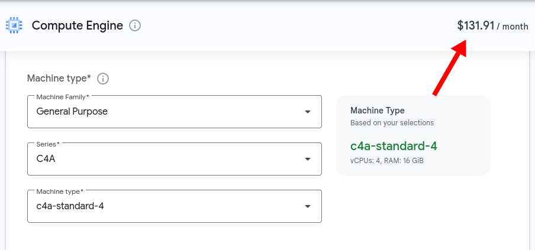
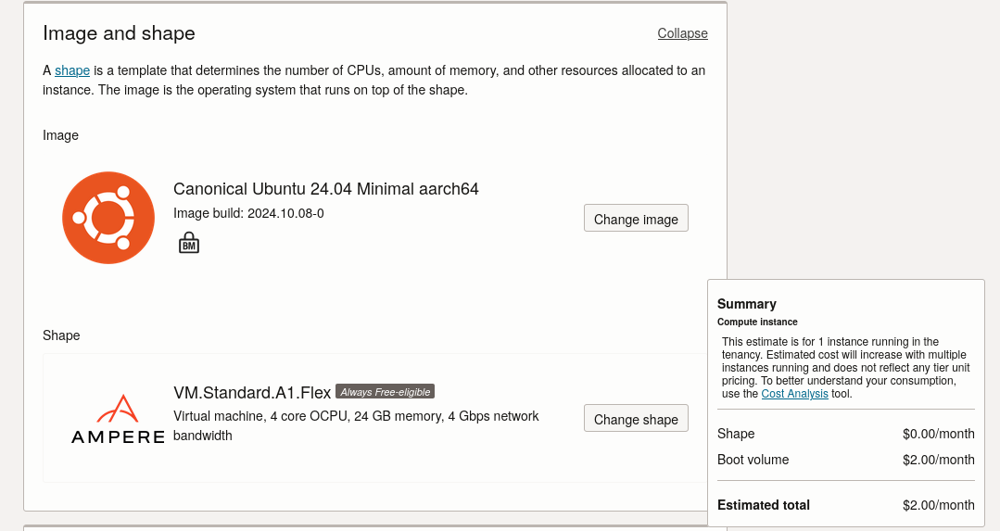
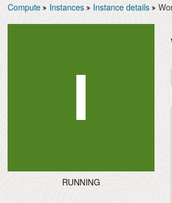
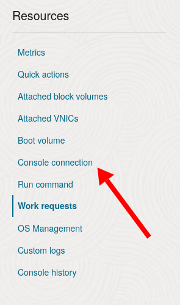
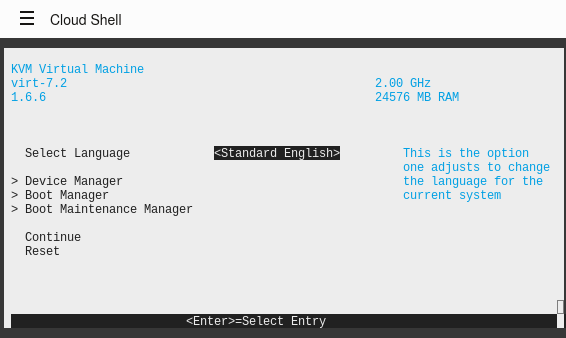
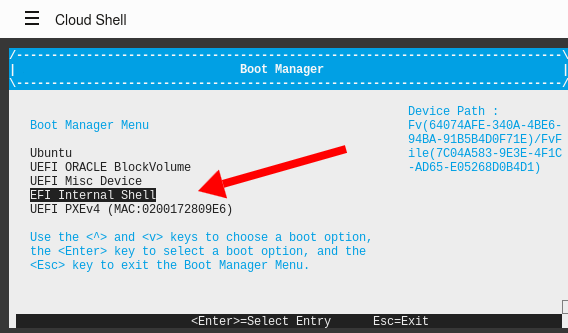

Oracle is not a very popular cloud hosting service, but they have an unusually attractive [free tier offering](https://docs.oracle.com/en-us/iaas/Content/FreeTier/freetier_topic-Always_Free_Resources.htm). You can run the following two VMs for free 24/7:

- 4 CPU / 24 GB RAM Ampere A1 ARM VM
- 1 CPU / 1 GB RAM AMD CPU

The AMD one is not that exciting, but a 4-CPU / 24 GB system is more powerful than you'll find in the free tier of any other cloud vendor.

GCP's price for an equivalent 4-CPU ARM VM is $132/month and it has 30% less RAM than Oracle's.

{{}}

## The challenge: Install NixOS on an Oracle Cloud VM

Oracle doesn't offer NixOS as one of the OS options for its VMs, and I've read reports that uploading a NixOS image doesn't work either.

I've found [several](https://mdleom.com/blog/2021/03/09/nixos-oracle/) [tutorials](https://mdleom.com/blog/2021/03/09/nixos-oracle/) about installing NixOS on Oracle's ARM VM, but they all seemed complicated and involved a lot of manual steps.

Prithu Goswami figured out [a clever shortcut](https://prithu.dev/notes/installing-nixos-on-oracle-cloud-arm-instance/) by using the NixOS installer through netboot, which simplifies things. Prithu's explanation was pretty terse, so I thought I'd share my complete walkthrough of his method.

## Requirements

There are no pre-requisites except that you'll need an SSH client on your local system.

- `ssh`

## Step 1: Get an Oracle Cloud account

I unfortunately can't help much with this step, as I did it several months ago and don't remember the process.

I do know that Oracle kept closing my account for opaque reasons before I even tried any of the cloud services, and I had to email support to get my account restored.

Note that you can only create free-tier VMs in your home region, and I'm not sure which regions have the most capacity.

I chose a home region of US-ASHBURN, which has free-tier VMs.

## Step 2: Create a free-tier VM

Once you're logged in to your Oracle Cloud account, create your free VM:

1. Go to [Create compute instance](https://cloud.oracle.com/compute/instances/create).
1. Change the name to whatever you want.
1. Under "Image and shape," choose the image Ubuntu > `Canonical Ubuntu 24.04 Minimal aarch64`.
1. Under "Image and shape," choose the shape `VM.Standard.A1.Flex` and increase the number of OCPUs to `4`. RAM should auto-update to `24` GB.

The image and shape screen should look like this:

{{}}

Under "Add SSH keys," upload your SSH public key.

Finally, hit "Create" to create the VM.

## Step 3: Log in over SSH

Wait until your VM shows as running:

{{}}

Once your VM is running, open a terminal on your local system.

Copy your VM's public IP address:

```bash
VM_IP='1.2.3.4' # Replace with your VM's IP.
```

SSH into your newly-created VM with your SSH keys:

```bash
ssh "ubuntu@${VM_IP}"
```

## Step 4: Download netboot

From your SSH session to your VM, download [netboot](https://netboot.xyz/), a minimal meta-OS for installing other OSes.

To begin, elevate to the `root` user:

```bash
sudo su
```

Download the netboot ARM64 image to `/boot/efi/netboot.efi`:

```bash
wget https://boot.netboot.xyz/ipxe/netboot.xyz-arm64.efi && \
  sudo install \
    --owner=root \
    --group=root \
    --mode=664 \
    netboot.xyz-arm64.efi \
    /boot/efi/netboot.efi
```

## Step 5: Boot into EFI boot manager using Cloud Shell

Go back to the VM page for your instance on Oracle Cloud in your web browser.

Scroll down to the "Resources" section at the bottom of the VM page and click "Console connection"

{{}}

From there, click "Launch Cloud Shell connection."

When the Cloud Shell is initialized, you should see this line:

```text
Instance Console Connection reached state: ACTIVE
```



**Note**: The next two steps have to happen quickly in succession. If you miss it, you can just SSH in and try again, though.



From your SSH session, reboot your VM:

```bash
reboot
```

Quickly, switch over to Cloud Shell in your browser. Click on the remote screen and then keep hitting the Escape key on your keyboard as the system reboots.

If you do it correctly, you should see the EFI boot manager:

{{}}

From the boot screen, go to Boot Manager > EFI Internal Shell.

{{}}

Press any key to skip `startup.nsh`.

From the EFI Shell prompt, type:

```bash
fs0:netboot.efi
```

When netboot launches, choose the following options:

1. Distributions > Linux Network Installs (arm64)
1. `NixOS`
1. `NixOS nixos-24.11`

netboot will then load you into the NixOS live installer.

## Step 7: Configure SSH access for the NixOS installer

After choosing NixOS from netboot, the system should automatically log you in as user `nixos` with no password prompt.

You can theoretically do the remaining steps through the Cloud Shell, but it's probably easier if you can SSH in with your standard terminal utility.

The NixOS installer unfortunately does not konw about the SSH public key you uploaded when you created the VM, so you'll need to get your SSH key on the VM again.

If you have your SSH keys registered with Github, an easy way to provision SSH keys is by running the following commands:

```bash
GITHUB_USERNAME='your-github-username'
```

```bash
mkdir -p ~/.ssh && \
  curl "https://github.com/${GITHUB_USERNAME}.keys" > ~/.ssh/authorized_keys
```

Alternatively, you can just paste any of you SSH public keys into `~/.ssh/authorized_keys`.

Once your SSH keys are in place, go back to your standard terminal, and SSH in again, this time to the NixOS install environment:

```bash
ssh "nixos@${VM_IP}"
```

## Step 8: Repartition the cloud VM's disk

At this point, you're in the NixOS installer, but the disk still has Ubuntu installed on it. You need to wipe and repartition the disk for NixOS.

From your SSH session to the VM, elevate to root.

```bash
sudo su
```

Next, change to a temporary directory:

```bash
cd "$(mktemp --directory)"
```

From here, download the [disk configuration file](disk-config.nix) I've created. It reserves 500 MB for a boot partition and uses the rest of the disk for NixOS.

```bash
curl \
  --show-error \
  --fail \
  notes/nixos-oracle-cloud/disk-config.nix \
  > disk-config.nix
```

Next, use [disko](https://github.com/nix-community/disko) to apply the disk partitioning configuration to the VM's disk:

```bash
nix \
  --experimental-features 'nix-command flakes' \
  run \
  github:nix-community/disko/v1.11.0 \
  -- \
  --mode destroy,format,mount \
  disk-config.nix
```

When prompted, say "yes" to deleting all data.

## Step 9: Install NixOS

At this point, you have a freshly-partitioned disk. It's time to install NixOS.

To begin, generate a placeholder configuration:

```bash
nixos-generate-config --no-filesystems --root /mnt
```

Move the disk configuration you created [in the previous step](#step-8-repartition-the-cloud-vms-disk) to `/mnt/etc/nixos/` with the rest of your NixOS configuration files:

```bash
mv disk-config.nix /mnt/etc/nixos/
```

Next, download the Nix configuration files I prepared for this Oracle Cloud VM:

```bash
curl \
  --show-error \
  --fail \
  notes/nixos-oracle-cloud/configuration.nix \
  > /mnt/etc/nixos/configuration.nix && \
  curl \
    --show-error \
    --fail \
    notes/nixos-oracle-cloud/vars.nix \
    > /mnt/etc/nixos/vars.nix
```

I split out all the values you're likely to change into a file called `vars.nix`:



Open `vars.nix` and change the settings to match your desired values.

```bash
nano /mnt/etc/nixos/vars.nix
```

Feel free to tinker with `configuration.nix` as well, but you can also change the files after you complete the initial install.

Once you've customized your `configuration.nix` and `vars.nix`, start the NixOS install:

```bash
nixos-install --no-root-password
```

When the install completes, reboot the VM:

```bash
shutdown --reboot now
```

## Step 10: Log in to your new NixOS system

The first boot will take about a minute. When it's ready, go to your terminal, and SSH in using the same IP address you used earlier:

```bash
ssh "${VM_IP}"
```

You're done! You now have a free 4-CPU VM running on Oracle's cloud with NixOS installed.

## Step 11: (optional) Install a package

At this point, everything's done, but you may want to test something to make sure your NixOS configuration is in a healthy state.

Open your `configuration.nix` in a text editor:

```bash
sudo nano /etc/nixos/configuration.nix
```

Find the `environment.systemPackages` setting, and try adding `ffmpeg` to the list:

```bash
curl
ffmpeg  # Add this line
git
vim
```

Next, apply the configuration with `nixos-rebuild`:

```bash
sudo nixos-rebuild switch
```

Now, you should see that ffmpeg is available on your system:

```bash
$ ffmpeg -version | head -n 2
ffmpeg version 7.1 Copyright (c) 2000-2024 the FFmpeg developers
built with gcc 13.3.0 (GCC)
```
