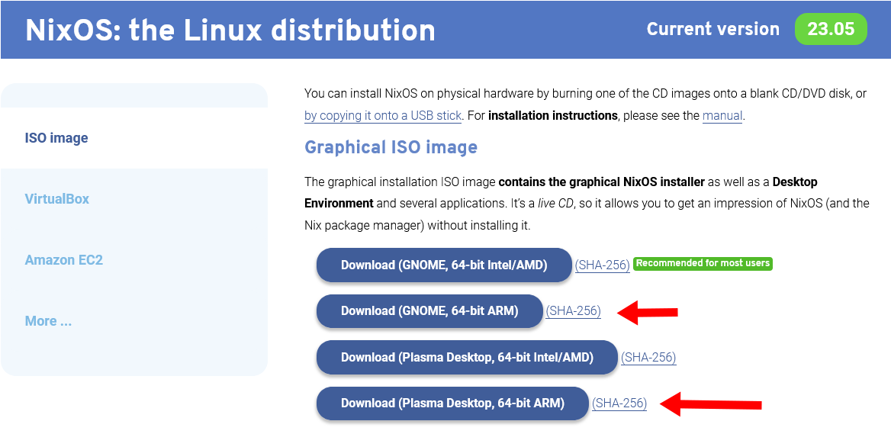

In creating the tutorial, ["Installing NixOS on Raspberry Pi 4,"](/nixos-pi4/) I ran into a ton of paths that didn't work.

I've collected them here for the sake of saving others time retrying the same steps.

## The standard NixOS aarch64 image doesn't work

When I checked the NixOS download page, I saw that they offered 64-bit ARM images.

{{}}

"Wonderful!" I thought to myself, as the Pi 4 has a 64-bit ARM CPU. But then the Pi [couldn't boot the image at all](/notes/nix-first-impressions/#failed-attempt-2-nixos-on-the-raspberry-pi-4).

{{}}

I learned later that NixOS's main pre-built 64-bit ARM images require the system to have UEFI, which the Raspberry Pi 4 does not support.

## The latest NixOS (23.05) microSD doesn't work on Raspberry Pi 4

NixOS still publishes microSD images for single-board computers like the Raspberry Pi. I tried flashing `nixos-sd-image-23.05.1123.aaef163eac7-aarch64-linux.img` to a microSD, but I got this error when I tried to apply my `configuration.nix`:

```text
Applying overlay rpi4-vc4-fkms-v3d-overlay to bcm2711-rpi-cm4-io.dtb...
Failed to apply '/nix/store/22l342jmwsaazvnz1zd5qq5m3b3ppsbd-rpi4-vc4-fkms-v3d-overlay-dtbo': FDT_ERR_NOTFOUND
error: builder for '/nix/store/cgv9mmkhwy6gc4y48pfmxnjam46404kr-device-tree-overlays.drv' failed with exit code 1
error: 1 dependencies of derivation '/nix/store/w77gh3p4wzbildmmr2dh1c254qlm3nv4-nixos-system-pinix-23.05.1123.aaef163eac7.drv' failed to build
```

That error led me to [a bug](https://github.com/NixOS/nixos-hardware/issues/631) in the `nixos-hardware` repo, but there's no fix available at the time of this writing.

I can work around the bug by deleting this line from the `configuration.nix` file`:

```text
hardware.raspberry-pi."4".fkms-3d.enable = true;
```

But then the install then fails later on:

```text
installing the boot loader...
removing user ‘nixos’
setting up /etc...
removing obsolete symlink ‘/etc/hostid’...
removing obsolete symlink ‘/etc/systemd/pstore.conf’...
removing obsolete symlink ‘/etc/zfs/zpool.d’...
...
umount: ???: umount failed: No such file or directory.
```

If I power cycle the Pi at that point, it successfully boots into the new NixOS install, but there's no desktop GUI, just a terminal:



**Update (2023-08-18)**: This is [now fixed](https://github.com/nixos/nixos-hardware/issues/631).

## NixOS 22.05 and 22.11 can't boot on a Pi 4

After failing to configure NixOS's microSD image using version 23.05, I tried again with `nixos-sd-image-22.11.4604.fc95eb4fc3c-aarch64-linux.img`, but it failed to boot. I tried a few times, and it always either drops the signal entirely or displays a green screen:



I tried again with `nixos-sd-image-22.05.4694.380be19fbd2-aarch64-linux.img` and got the same result.

## `reboot` command doesn't work

I found that after applying my initial `configuration.nix` file with `sudo nixos-rebuild boot`, the `reboot` and `shutdown` commands fail:

```text
[nixos@nixos:~]$ reboot
Failed to set wall message, ignoring: Transport endpoint is not connected
Failed to reboot system via logind: Transport endpoint is not connected
Failed to talk to init daemon.

[nixos@nixos:~]$ shutdown -h now
Failed to set wall message, ignoring: Transport endpoint is not connected
Failed to power off system via logind: Transport endpoint is not connected
Failed to talk to init daemon.
```

I was able to work around this by running `sudo poweroff --reboot`.

## The latest Pi hardware version doesn't work

You may have noticed that [my `configuration.nix` file](nixos-pi4/configuration.nix) depends on the [NixOS/nixos-hardware](https://github.com/NixOS/nixos-hardware) repository, but not the latest version:

```nix
nixosHardwareVersion = "ad1114ee372a52aa0b4934f72835bd14a212a642";
...
imports = ["${fetchTarball "https://github.com/NixOS/nixos-hardware/archive/${nixosHardwareVersion}.tar.gz" }/raspberry-pi/4"];
```

I [reported this bug](https://github.com/NixOS/nixos-hardware/issues/651), and Alex Groleau from the NixOS docs team [let me know](https://github.com/NixOS/nixos-hardware/issues/651#issuecomment-1630066858) that on current versions of NixOS, the `nixos-hardware` repo isn't necessary at all. I haven't tested whether NixOS 21.11 can install without it, so I've left it in for now.

## Updating to a later NixOS version doesn't work

Even though [installing from the 23.05 NixOS disk image failed](#the-latest-nixos-2305-microsd-doesnt-work-on-raspberry-pi-4), I thought I'd work around the issue by doing an in-place upgrade of NixOS from 21.11 to 23.05. Unfortunately, that failed, too.

I tried installing 21.11 through my process above then rebuilding for 23.05 with the following commands:

```bash
TARGET_RELEASE="23.05"

sudo nix-channel \
  --add "https://nixos.org/channels/nixos-${TARGET_RELEASE}" nixos && \
  sudo nix-channel --update && \
  sudo nixos-rebuild --upgrade boot && \
  sudo reboot
```

That process ultimately failed with the [same error](https://github.com/NixOS/nixos-hardware/issues/631) as installing from the 23.05 disk image:

```text
Failed to apply '/nix/store/22l342jmwsaazvnz1zd5qq5m3b3ppsbd-rpi4-vc4-fkms-v3d-overlay-dtbo': FDT_ERR_NOTFOUND
building '/nix/store/w052x98nzkbvmxcmb8wdgmfgqrf8vzv4-smb-dummy.conf.drv'...
error: builder for '/nix/store/cgv9mmkhwy6gc4y48pfmxnjam46404kr-device-tree-overlays.drv' failed with exit code 1
error: 1 dependencies of derivation '/nix/store/5hbkqaz7ldjf5565zakjqxx4xrk5dvn9-nixos-system-pinix-23.05.1156.ad157fe26e7.drv' failed to build
```
