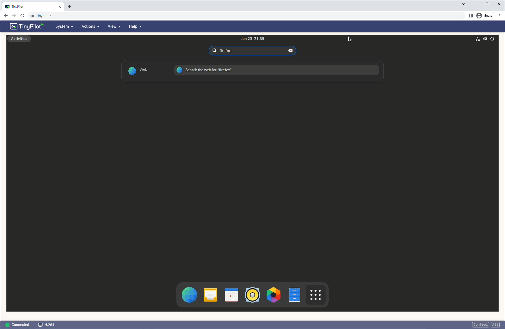

I recently started experimenting with Nix and NixOS. Nix allows you to define your software environment from code, and NixOS allows you to define your entire operating system in code.

The Raspberry Pi is a good system for experimenting with new technology, so I decided to install NixOS on my Raspberry Pi 4. I found the process a bit bumpy. Most of the guides for installing NixOS on a Raspberry Pi 4 are incomplete or out of date.

I wrote this tutorial so that it's easy for newcomers to NixOS.

## Requirements

* Raspberry Pi 4
* A microSD card with at least 8 GB of storage
* A separate computer to prepare the microSD card.

## Flashing the NixOS microSD

### Flashing from a Windows system

Download this file:

https://hydra.nixos.org/build/213143754/download/1/nixos-sd-image-21.11.337977.2766f77c32e-aarch64-linux.img.zst

The file is encrypted with Facebook's ZSTD compression tool, so you'll need to download that

https://github.com/facebook/zstd/releases/latest


```powershell
zstd -d "nixos-sd-image-21.11.337977.2766f77c32e-aarch64-linux.img.zst"
```

Any tool for flashing a microSD. I like Balena Etcher.

## Flashing from a Linux or OS X system

The easiest way to do is to install a Nix environment.

```bash
curl \
  --proto '=https' \
  --tlsv1.2 \
  --show-error \
  --silent \
  --fail \
  --location https://install.determinate.systems/nix | sh -s -- install && \
  . /nix/var/nix/profiles/default/etc/profile.d/nix-daemon.sh
```

```bash
$ nix --version
nix (Nix) 2.13.3
```

```bash
# This will take a few minutes.
nix-shell -p curl zstd

URL='https://hydra.nixos.org/build/213143754/download/1/nixos-sd-image-21.11.337977.2766f77c32e-aarch64-linux.img.zst'

IMG_FILE="${URL##https:/*/}"
curl \
  --proto '=https' \
  --show-error \
  --fail \
  --location "${URL}" \
  | unzstd --decompress - > "${IMG_FILE}"
```


To find the device path of your USB key, run `lsblk`, and you'll see output like the following:

```bash
$ lsblk -o NAME,SIZE,VENDOR,MODEL,LABEL,UUID
NAME     SIZE VENDOR   MODEL                           LABEL   UUID
sda    238.5G ATA      SanDisk X600 2.5 7MM SATA 256GB
├─sda1   512M                                                  8BCC-19F0
├─sda2 229.2G                                                  f6dfd4c3-d57b-49d7-aa50-c3b0ddc4e12a
└─sda3   8.8G                                          swap    763a1454-8c6e-460a-af35-5cca07139fbb
sdb        0B Generic- USB3.0 CRW -SD
sdc     14.8G Generic- USB3.0 CRW -SD
├─sdc1   100M                                          gokrazy F3F3-7B84
├─sdc2   500M
├─sdc3   500M
└─sdc4  13.8G
```

In my case, the microSD device is `sdc`.

Warning: Be sure you picked the right device name, as picking the wrong one will cause data loss.

```bash
# Change to the microSD drive path you found above.
OUTPUT_DEVICE='/dev/sdc'

sudo dd \
  if="${IMG_FILE}" \
  of="${OUTPUT_DEVICE}" \
  bs=4096 \
  conv=fsync \
  status=progress
```

## Boot your NixOS system

If everything went well, you should see a boot sequence like the following:



## Enable SSH access (optional)

I find it helpful

### Add a password

```bash
passwd
```

```bash
ssh nixos@nixos.local
```

### Add an SSH key

Once your Pi 4 is up and running with NixOS, you'll only have local access.

```bash
# Change to your Github username.
GITHUB_USERNAME="mtlynch"

mkdir -p ~/.ssh && \
  curl "https://github.com/${GITHUB_USERNAME}.keys" > ~/.ssh/authorized_keys
```

If you see an error that says `certificate is not valid yet`, it means that your Pi hasn't yet sync'ed its time to time servers. Wait 60 seconds and try the command again.

```bash
ssh nixos@nixos.local
```

## Write the NixOS configuration file



```bash
curl \
  --show-error \
  --fail \
  notes/nixos-pi4/configuration.nix \
  | sudo tee /etc/nixos/configuration.nix
```

You can make changes to `/etc/nixos/configuration.nix` at this point using `nano` or `vim`.

```bash
nano /etc/nixos/configuration.nix
```

TODO: Try with gnome settings instead

When you're happy with your `configuration.nix`, run these commands:

```bash
sudo nixos-rebuild boot && \
  echo "install complete, rebooting..." && \
  sudo poweroff --reboot
```

## Logging in

TODO: change

If you used the default `configuration.nix` above, your username is `foo` and your password is `bar`:

## Make changes (optional)

When you log in, you'll notice you don't have a web browser.

{{}}

In 2023, we have to have a web browser!

Add Firefox browser to `configuration.nix`:

```bash
sudo nixos-rebuild switch
```

## Upgrade to latest NixOS release that's compatible with the Pi 4

The 21.11 image doesn't install cleanly on the Pi 4, but you can install 21.05 and upgrade to 21.11 cleanly. Builds after 21.11 fail to install on the Pi 4.

```bash
TARGET_RELEASE="21.11"

sudo nix-channel \
  --add "https://nixos.org/channels/nixos-${TARGET_RELEASE}" nixos && \
  sudo nix-channel --update && \
  sudo nixos-rebuild --upgrade boot && \
  sudo reboot
```

TODO: Do we have to update `configuration.nix` with `TARGET_RELEASE`? Or does Nix do that for us?

Updating to 23.05 fails:

```text
Failed to apply '/nix/store/22l342jmwsaazvnz1zd5qq5m3b3ppsbd-rpi4-vc4-fkms-v3d-overlay-dtbo': FDT_ERR_NOTFOUND
building '/nix/store/w052x98nzkbvmxcmb8wdgmfgqrf8vzv4-smb-dummy.conf.drv'...
error: builder for '/nix/store/cgv9mmkhwy6gc4y48pfmxnjam46404kr-device-tree-overlays.drv' failed with exit code 1
error: 1 dependencies of derivation '/nix/store/5hbkqaz7ldjf5565zakjqxx4xrk5dvn9-nixos-system-pinix-23.05.1156.ad157fe26e7.drv' failed to build
```

## Gotchas

### Gotcha 1: The standard NixOS aarch64 image doesn't work

Designed for UEFI systems, and Raspberry Pi doens't support UEFI.

### Gotcha 4: The Pi's second HDMI port doesn't work

I actually

### Gotcha 3: The latest NixOS (23.05) microSD doesn't work on Raspberry Pi 4

Tried with `nixos-sd-image-23.05.1123.aaef163eac7-aarch64-linux.img`.

Gets an error:

```text
Applying overlay rpi4-vc4-fkms-v3d-overlay to bcm2711-rpi-cm4-io.dtb...
Failed to apply '/nix/store/22l342jmwsaazvnz1zd5qq5m3b3ppsbd-rpi4-vc4-fkms-v3d-overlay-dtbo': FDT_ERR_NOTFOUND
error: builder for '/nix/store/cgv9mmkhwy6gc4y48pfmxnjam46404kr-device-tree-overlays.drv' failed with exit code 1
error: 1 dependencies of derivation '/nix/store/w77gh3p4wzbildmmr2dh1c254qlm3nv4-nixos-system-pinix-23.05.1123.aaef163eac7.drv' failed to build
```

I can work around it by deleting this line from configuration.nix:

```nix
hardware.raspberry-pi."4".fkms-3d.enable = true;
```

The install then fails later on:

```text
installing the boot loader...
removing user ‘nixos’
setting up /etc...
removing obsolete symlink ‘/etc/hostid’...
removing obsolete symlink ‘/etc/systemd/pstore.conf’...
removing obsolete symlink ‘/etc/zfs/zpool.d’...
...
umount: ???: umount failed: No such file or directory.
```

If I power cycle the Pi at that point, it successfully boots into the new NixOS install, but there's no XFCE desktop GUI, just a terminal:



## Gotcha: The previous stable NixOS (22.11) can't boot on a Pi 4

Tried with `nixos-sd-image-22.11.4604.fc95eb4fc3c-aarch64-linux.img`, but it doesn't boot.



* `nixos-sd-image-22.05.4694.380be19fbd2-aarch64-linux.img` same thing
* `nixos-sd-image-21.11.337977.2766f77c32e-aarch64-linux.img`:

```text
[nixos@nixos:~]$ sudo reboot
sudo: you do not exist in the passwd database

[nixos@nixos:~]$ reboot
Failed to set wall message, ignoring: Transport endpoint is not connected
Failed to reboot system via logind: Transport endpoint is not connected
Failed to talk to init daemon.

[nixos@nixos:~]$ shutdown -h now
Failed to set wall message, ignoring: Transport endpoint is not connected
Failed to power off system via logind: Transport endpoint is not connected
Failed to talk to init daemon.
```

But if you power cycle it, the resulting system seems okay. Thought it was due to `rebuild switch`, but I got the same results with `rebuild boot`.

* `nixos-sd-image-21.05.4737.022caabb5f2-aarch64-linux.img`: Same as 21.11

### Gotcha: `reboot` command doesn't work

After the initial install with `sudo nixos-rebuild boot`

```text
[nixos@nixos:~]$ reboot
Failed to set wall message, ignoring: Transport endpoint is not connected
Failed to reboot system via logind: Transport endpoint is not connected
Failed to talk to init daemon.

[nixos@nixos:~]$ shutdown -h now
Failed to set wall message, ignoring: Transport endpoint is not connected
Failed to power off system via logind: Transport endpoint is not connected
Failed to talk to init daemon.
```

Workaround was to use `sudo poweroff --reboot`.

### Gotcha 5: The latest Pi hardware version doesn't work

https://github.com/NixOS/nixos-hardware/issues/651

## Troubleshooting: Upgrade to the latest bootloader

Install the latest bootloader:

```bash
sudo raspi-config nonint do_boot_rom E1 && \
  sudo reboot
```

Install the latest Raspberry Pi EEPROM:

```bash
sudo apt update && \
  sudo apt install --yes rpi-eeprom && \
  sudo rpi-eeprom-update -a && \
  sudo reboot
```
