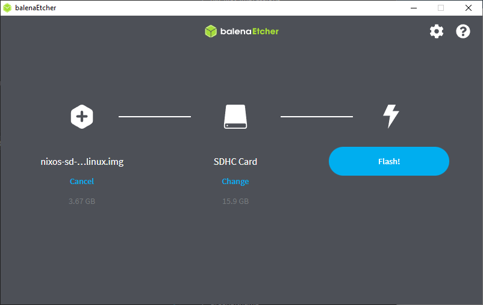
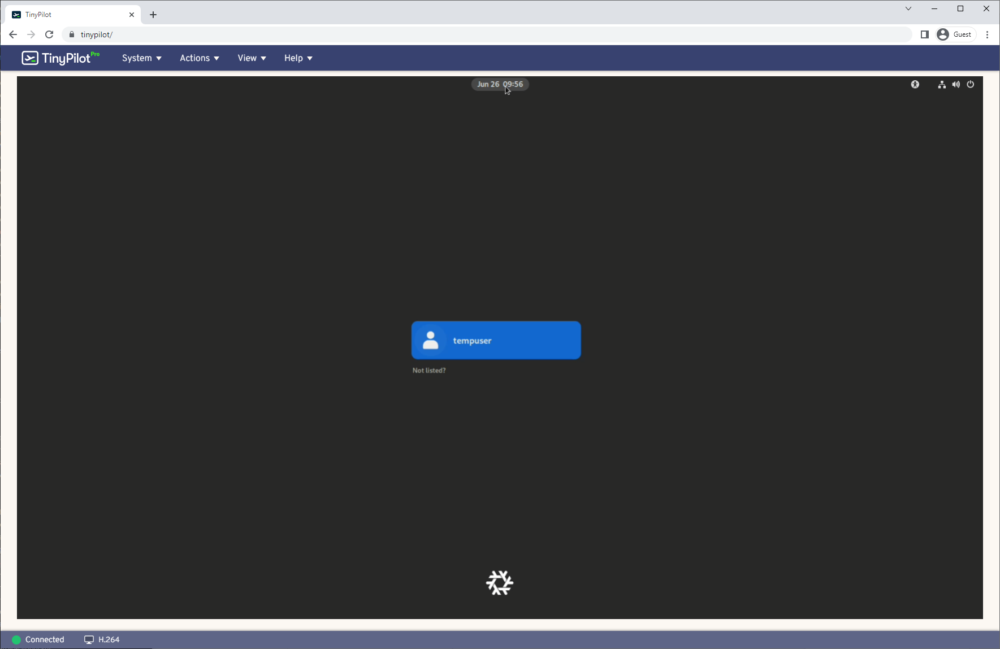
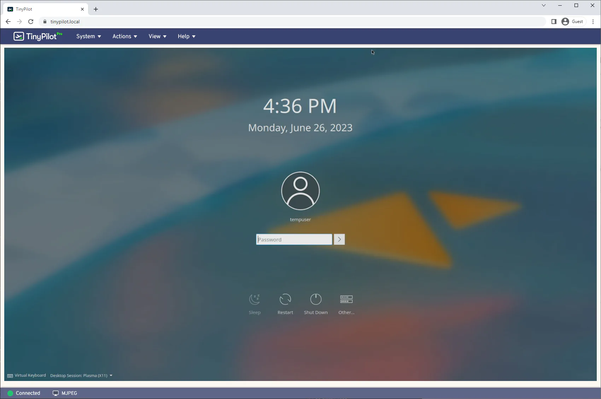
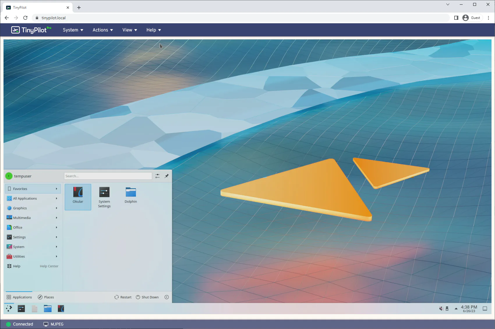

I recently started experimenting with Nix and NixOS. Nix is a tool that allows you to define your software environment from code, and NixOS allows you to define your entire operating system configuration in code.

The Raspberry Pi is a good hardware for experimentation, so I decided to install NixOS on my Raspberry Pi 4. Most of the tutorials for installing NixOS on a Raspberry Pi 4 are incomplete or out of date, so I decided to write one that works as of 2023.

I'm a newcomer to NixOS, so this guide is for Nix beginners, but I assume you have basic familiarity with Raspberry Pi and Linux.

## Requirements

To follow this tutorial, you'll need:

* Raspberry Pi 4
* A microSD card with at least 8 GB of storage
* A separate computer to prepare the microSD card.

## Download the NixOS microSD image

First, you'll need to flash the NixOS disk image onto a microSD card.

As of this writing, the latest NixOS image that works on the Raspberry Pi 4 is NixOS 21.11, which is almost two years old. I'll explain why that is [later in this post](#the-future-of-nixos-on-the-raspberry-pi), but for now, I'm going to show the simplest thing that gets you a working NixOS system on the Pi

Download the NixOS microSD image from the link below:

* [nixos-sd-image-21.11.337977.2766f77c32e-aarch64-linux](https://hydra.nixos.org/build/213143754/download/1/nixos-sd-image-21.11.337977.2766f77c32e-aarch64-linux.img.zst)

## Decompress the NixOS microSD image

NixOS microSD images are compressed with an uncommon compression format called ZSTD, an open-source format from Facebook. To decompress the image, download the latest ZSTD release for your platform:

* [ZSTD releases](https://github.com/facebook/zstd/releases/latest)

Once you have both the ZSTD tool and the NixOS microSD image, decompress the `.img.zst` file with the following command:

```bash
zstd --decompress "nixos-sd-image-21.11.337977.2766f77c32e-aarch64-linux.img.zst"
```

## Flash the NixOS microSD image

After you've decompressed the image, flash it to a microSD using your favorite microSD flashing utility. If you don't know what to use, I recommend [balenaEtcher ](https://etcher.balena.io/), as it's user-friendly and works on any major OS.

{{}}

When you flash the microSD, choose the `.img` file rather than the `.img.zst` file, as most flashing tools won't understand the ZSTD format.

## Insert the microSD card into your Pi

TODO

## Connect a display and keyboard to your Pi

Unlike most Pi OS images, there doesn't seem to be a way to a fully headless setup of the NixOS system, so you'll need to at least temporarily connect a keyboard and monitor to see what's happening.

I'm using a [TinyPilot](https://tinypilotkvm.com) to manage my Pi, as it's a networking tool [I created for situations just like this](/tinypilot/). But you can do the set up with a regular monitor and keyboard.


**Note**: NixOS only sends display output to the Pi's XX HDMI port. If you connect the HDMI cable to the other port, you won't see anything after the rainbow screen.


## Boot your NixOS system

If everything went well, you should see a boot sequence like the following:



The boot is complete when you see the NixOS command prompt:

```bash
[nixos@nixos~:]$
```

If the boot failed, try [updating your Pi's bootloader](#troubleshooting-upgrade-to-the-latest-bootloader) to the latest available version.

## Enable SSH access (optional)

When I'm working with a Raspberry Pi system, I find it helpful to set up SSH so I can access the Pi from my normal desktop rather than typing on a separate keyboard or using TinyPilot.

You have two options for enabling SSH access.

### SSH option 1: Add a password

On the NixOS system, you can set a password on the `nixos` user account by running the following command:

```bash
passwd
```

Once you've set a password, you can SSH into your NixOS system like normal:

```bash
ssh nixos@nixos.local
```

### SSH option 2: Add an SSH key

You can also add your SSH public key as an authorized key on the system. If you authenticate to Github with SSH keys, Github offers a convenient way to download your SSH key to your device:

```bash
GITHUB_USERNAME="your-github-username" # Replace this.

mkdir -p ~/.ssh && \
  curl "https://github.com/${GITHUB_USERNAME}.keys" > ~/.ssh/authorized_keys
```

If you see an error that says `certificate is not valid yet`, it means that your Pi is still synchronizing its clock. Wait 60 seconds and try the command again.

Once you've added your public SSH key to the NixOS system, you can SSH in like normal:

```bash
ssh nixos@nixos.local
```

## Write the NixOS configuration file

You're now in NixOS!

There's not much you can do yet because it's a minimal NixOS environment with nothing installed.

To make this more interesting, you can install a desktop GUI and a few applications. To begin, download the configuration file I've customized for the Raspberry Pi 4:

```bash
curl \
  --show-error \
  --fail \
  notes/nixos-pi4/configuration.nix \
  | sudo tee /etc/nixos/configuration.nix
```

You can make changes to `/etc/nixos/configuration.nix` at this point using `nano` or `vim`. You might want to change the `hostname`, `user`, or `password` values at the top. The nice thing about Nix is that it's easy to change those values at any point in the future.

```bash
sudo nano /etc/nixos/configuration.nix
```

When you're happy with your `configuration.nix`, run these commands to apply the configuration to your system and reboot:

```bash
sudo nixos-rebuild boot && \
  echo "install complete, rebooting..." && \
  sudo poweroff --reboot
```

When the reboot completes, you should see a screen that looks like this:

{{}}

Your Pi is now running a NixOS install with a Gnome desktop environment.

## Logging in

TODO: change

If you used the default `configuration.nix` above, your username is `tempuser` and your password is `somepass`:

## Make changes (optional)

In the `configuration.nix` I provided, I chose the Gnome desktop environment, but maybe you prefer a different one. There's another one called Plasma that you might like better.

To change your NixOS system to use the Plasma, open the your `configuration.nix` file in a text editor:

```bash
sudo nano /etc/nixos/configuration.nix
```

Find these lines in the file:

```nix
    displayManager.gdm.enable = true;
    desktopManager.gnome.enable = true;
```

And replace them with these lines:

```nix
    displayManager.sddm.enable = true;
    desktopManager.plasma5.enable = true;
```

To apply the changes, tell NixOS to apply them on next boot, and then reboot your system.

```bash
sudo nixos-rebuild boot && sudo reboot
```


  {{}}
  {{}}


https://nixos.wiki/wiki/Category:Desktop_environment

## Gotchas

In creating this tutorial, I ran into a ton of paths that didn't work. I've collected them here for the sake of saving others time retrying the same steps.

### Gotcha 1: The standard NixOS aarch64 image doesn't work

Designed for UEFI systems, and Raspberry Pi doens't support UEFI.

### Gotcha 4: The Pi's second HDMI port doesn't work

TODO: Figure out which HDMI port

### Gotcha 3: The latest NixOS (23.05) microSD doesn't work on Raspberry Pi 4

Tried with `nixos-sd-image-23.05.1123.aaef163eac7-aarch64-linux.img`.

Gets an error:

```text
Applying overlay rpi4-vc4-fkms-v3d-overlay to bcm2711-rpi-cm4-io.dtb...
Failed to apply '/nix/store/22l342jmwsaazvnz1zd5qq5m3b3ppsbd-rpi4-vc4-fkms-v3d-overlay-dtbo': FDT_ERR_NOTFOUND
error: builder for '/nix/store/cgv9mmkhwy6gc4y48pfmxnjam46404kr-device-tree-overlays.drv' failed with exit code 1
error: 1 dependencies of derivation '/nix/store/w77gh3p4wzbildmmr2dh1c254qlm3nv4-nixos-system-pinix-23.05.1123.aaef163eac7.drv' failed to build
```

https://github.com/NixOS/nixos-hardware/issues/631

I can work around it by deleting this line from configuration.nix:

```nix
hardware.raspberry-pi."4".fkms-3d.enable = true;
```

The install then fails later on:

```text
installing the boot loader...
removing user ‘nixos’
setting up /etc...
removing obsolete symlink ‘/etc/hostid’...
removing obsolete symlink ‘/etc/systemd/pstore.conf’...
removing obsolete symlink ‘/etc/zfs/zpool.d’...
...
umount: ???: umount failed: No such file or directory.
```

If I power cycle the Pi at that point, it successfully boots into the new NixOS install, but there's no XFCE desktop GUI, just a terminal:



## Gotcha: The previous stable NixOS (22.11) can't boot on a Pi 4

Tried with `nixos-sd-image-22.11.4604.fc95eb4fc3c-aarch64-linux.img`, but it doesn't boot all the way. It either drops the signal entirely or displays a green screen:



I tried again with `nixos-sd-image-22.05.4694.380be19fbd2-aarch64-linux.img` and got the same result. NixOS 21.11 is the latest version I found that can run on the Raspberry Pi 4.

### Gotcha: `reboot` command doesn't work

After the initial install with `sudo nixos-rebuild boot`

```text
[nixos@nixos:~]$ reboot
Failed to set wall message, ignoring: Transport endpoint is not connected
Failed to reboot system via logind: Transport endpoint is not connected
Failed to talk to init daemon.

[nixos@nixos:~]$ shutdown -h now
Failed to set wall message, ignoring: Transport endpoint is not connected
Failed to power off system via logind: Transport endpoint is not connected
Failed to talk to init daemon.
```

Workaround was to use `sudo poweroff --reboot`.

### Gotcha 5: The latest Pi hardware version doesn't work

https://github.com/NixOS/nixos-hardware/issues/651

### Gotcha 6: Updating to a later NixOS version doesn't work

Even though installing the 23.05 NixOS disk image doesn't work, I thought I'd try upgrading from 21.11, but it didn't work.

Here's what I tried:

```bash
TARGET_RELEASE="23.05"

sudo nix-channel \
  --add "https://nixos.org/channels/nixos-${TARGET_RELEASE}" nixos && \
  sudo nix-channel --update && \
  sudo nixos-rebuild --upgrade boot && \
  sudo reboot
```

Updating to 23.05 fails:

```text
Failed to apply '/nix/store/22l342jmwsaazvnz1zd5qq5m3b3ppsbd-rpi4-vc4-fkms-v3d-overlay-dtbo': FDT_ERR_NOTFOUND
building '/nix/store/w052x98nzkbvmxcmb8wdgmfgqrf8vzv4-smb-dummy.conf.drv'...
error: builder for '/nix/store/cgv9mmkhwy6gc4y48pfmxnjam46404kr-device-tree-overlays.drv' failed with exit code 1
error: 1 dependencies of derivation '/nix/store/5hbkqaz7ldjf5565zakjqxx4xrk5dvn9-nixos-system-pinix-23.05.1156.ad157fe26e7.drv' failed to build
```


## Troubleshooting: Upgrade to the latest Pi bootloader

The Pi 4 devices I tested worked out of the box, but if you're running into boot issues with NixOS, you can try installing the latest bootloader with these commands:

```bash
sudo raspi-config nonint do_boot_rom E1 && \
  sudo reboot
```

You can also update to the latest Raspberry Pi EEPROM with these commands:

```bash
sudo apt update && \
  sudo apt install --yes rpi-eeprom && \
  sudo rpi-eeprom-update -a && \
  sudo reboot
```

## The future of NixOS on the Raspberry Pi

I suspect the reason that NixOS builds after November 2021 fail to install on a Raspberry Pi is due to this October 2021 post on the Nix forums:

* [Planning for a better NixOS on ARM (and other non-x86_64 systems)](https://discourse.nixos.org/t/planning-for-a-better-nixos-on-arm-and-other-non-x86-64-systems/15346)
