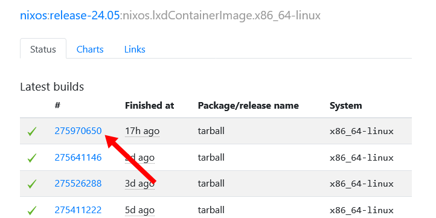

One of the stumbling blocks I ran into when trying out NixOS was that I couldn't run it under [Proxmox](https://www.proxmox.com/en/), my preferred virtual machine server.

Through some trial and error, I figured out how to install NixOS as a Proxmox container.

## Download the NixOS container image

First, download the latest [NixOS container image](https://hydra.nixos.org/job/nixos/trunk-combined/nixos.lxdContainerImage.x86_64-linux) (for other hardware architectures, see [this Github comment](https://github.com/NixOS/nixpkgs/issues/43781#issuecomment-1707132209)).

At the time of this writing, the latest is build [235933548](https://hydra.nixos.org/build/235933548).

{{}}

From the build result page, click the link labeled `nixos-system-x86_64-linux.tar.xz` to download the image:

{{}}

## Rename the NixOS container image (optional)

For some reason, the NixOS container image download doesn't include any version or date information. I renamed my image file to:

- `nixos-2023-09-21-lxdContainerImage.x86_64-linux.tar.xz`

The benefit of renaming the file is that it will help you identify which version of NixOS this is when you see it later in Proxmox.

## Upload the image to Proxmox

Now it's time to upload the image to Proxmox. Scroll down to one of your Proxmox storage nodes.

Click the storage node you'd like to use. The default is called `local`, but you may have others.

{{}}

From the storage node, click "CT Templates," and then click "Upload."

{{}}

In the upload dialog, click "Select File..." and select the NixOS container image you downloaded above, and click "Upload."

{{}}

## Create a NixOS container

Now that your Proxmox server has the NixOS image available, you can create your first NixOS container.

Scroll up to your Proxmox node, right click it, and select "Create CT":

{{}}

In the "Hostname" field, select any hostname you'd like, such as `nixos1`.

{{}}

The password fields are required, but they have no effect in NixOS, so you can put in any value you want.

Ignore the SSH public key field, as it has no effect within NixOS.

On the Template tab, choose the NixOS image you uploaded above:

{{}}

Proceed through the container creation wizard normally, choosing your preferred values for disk, CPU, memory, and network.

On the last page, leave "Start after created" unchecked and click "Finish."

{{}}

The output will contain these warnings, which are safe to ignore:

```text
Architecture detection failed: open '/bin/sh' failed: No such file or directory

Falling back to amd64.
Use `pct set VMID --arch ARCH` to change.
unknown ID 'nixos' in /etc/os-release file, trying fallback detection
/etc/os-release file not found and autodetection failed, falling back to 'unmanaged'
```

## Enable nesting

For NixOS to work properly under Proxmox, you need to enable the "Nesting" feature of the container. Navigate to the NixOS container you just created, then click the Options tab, and click "Features."

{{}}

Click the box next to "Nesting" and then hit "OK."

{{}}

## Start NixOS

Your NixOS container is now configured!

You can start your container normally. At the Console, you should see a standard NixOS prompt:

{{}}

## Configure system

I've created a basic configuration for a NixOS server system as a Proxmox container. You can apply this configuration by running the following command:

```bash
curl \
  --show-error \
  --fail \
  /notes/nixos-proxmox/configuration.nix \
  | sudo tee /etc/nixos/configuration.nix
```

Then, apply the new configuration by running the following commands:

```bash
sudo nixos-rebuild boot && \
  echo "install complete, rebooting..." && \
  sudo poweroff --reboot
```

## References

- https://nixos.wiki/wiki/Proxmox_Linux_Container
- https://blog.xirion.net/posts/nixos-proxmox-lxc/
