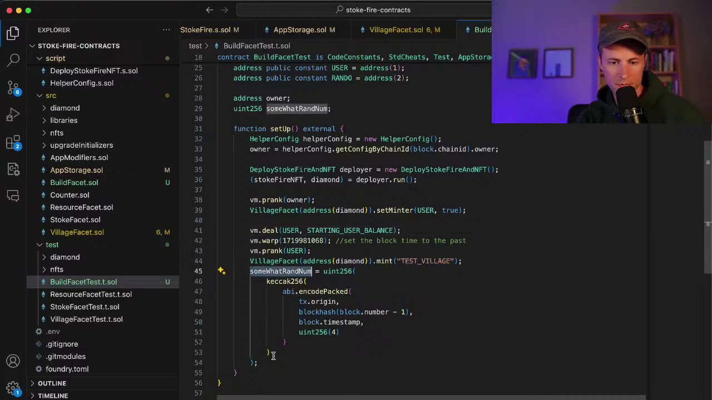
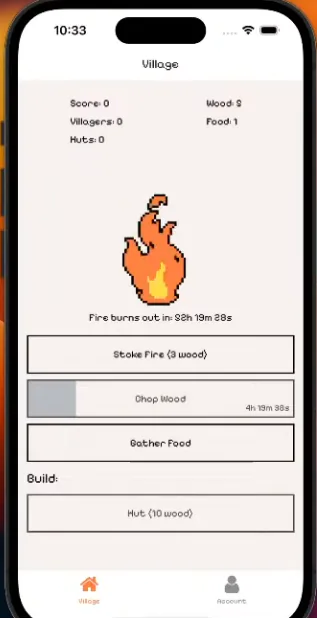
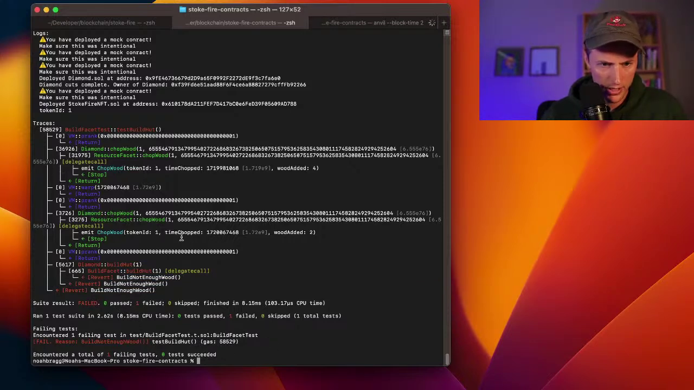
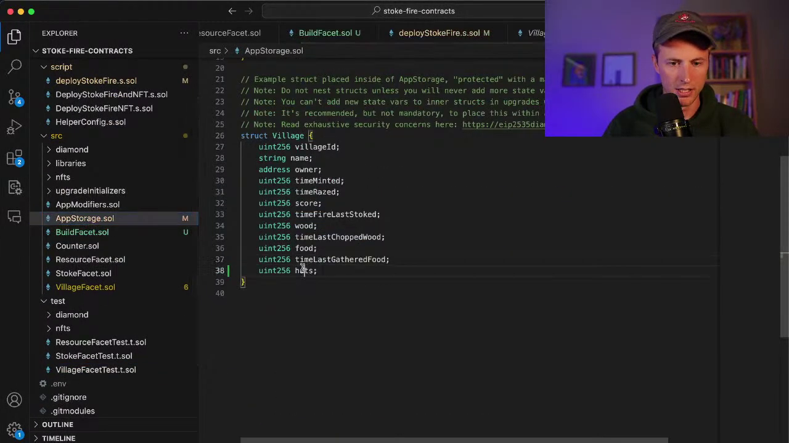
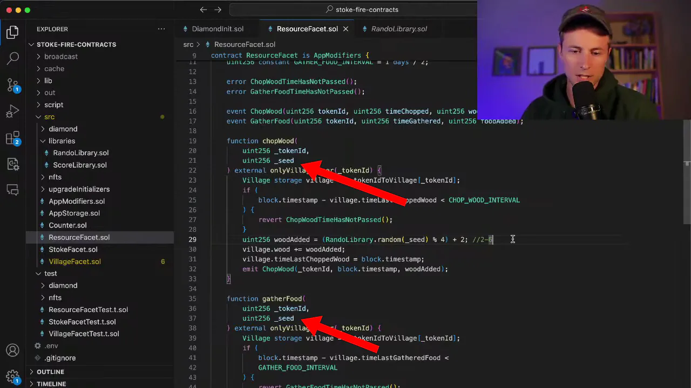

I've been interested in Ethereum the past year, especially the [Base](https://www.base.org/) ecosystem. The problem is that after hours of reading about Base, I still don't get what Base is.

Every few months, I check back in on the Base website's developer section to see if there's a path to building on Base for a beginner, and the path seems to be "here are some disparate tutorials for very specific things, and if you have questions, come ask us on Discord."

So, I was excited to see that [Noah Bragg](https://noahbragg.com/), an indie founder I follow on Twitter, has started livestreaming his process of building a simple game on top of the Base ecosystem.

{{}}

I watched [Noah's first stream](https://www.youtube.com/watch?v=iwYNWwHg_tY), and I've shared my takeaways below.

## The game: Stoke Fire

- Stoke Fire is a resource management game where you chop wood in your village to stoke an ongoing fire to keep the village warm.
  {{}}
- Inspirations
  - Age of Empires II, which Noah played as a kid.
  - [A Dark Room](https://adarkroom.doublespeakgames.com/), a text-based web game.
  - Manor Lords, a total war simulation built by a solo dev over the past six years.
- Game will be free to play to encourage participation.
- Game will save state in NFTs to make it easier to transfer between wallets, but Noah doesn't anticipate people trading their game state NFTs the way they do with art NFTs.
- He's building on the Base blockchain because he expects consumers to be there due to Coinbase's investment.

### Early access

- Early access to Stoke Fire is available via Noah's [I Must Build](https://www.hypersub.xyz/s/i-must-build-qytohm9l69s) subscription on [Hypersub](https://hypersub.xyz).
  - Hypersub is like Patreon for on-chain.

## What happened on the stream

- Noah added support in the game for using wood to build huts.
- He started to implement functionality to attract villagers based on what resources are available in the village, but he ultimately paused work midway through because he was mentally exhausted.

## Solidity

- Noah is using [Solidity](https://soliditylang.org/) for smart contract development.
  - He's heard of [Vyper](https://docs.vyperlang.org/). He hasn't used it because the ecosystem around Solidity is so much more mature than anything else.
  - He's never heard of [Huff](https://docs.huff.sh/).

_**Note from Michael**: Solidity continues to gross me out. In a domain where correctness and readability is critical, Solidity introduces tons of needless footguns and gotchas. It's like they studied C++ and JavaScript tirelessly in order to adopt the absolute worst features from those languages._

## Diamond

- [Diamond](https://eips.ethereum.org/EIPS/eip-2535) is a framework for deploying smart contacts that are mutable after publication.
  - Normally, Ethereum smart contracts are immutable once they're deployed.
  - Diamonds offer "upgradeable" smart contracts, so you can change them after they're deployed.
- Diamonds weakens guarantees of smart contract, but it facilitates iteration for projects like Stoke Fire.
- "Facets" are (I think) the modifiable parts of the smart contract.

_**Note from Michael**: Managing facets [seems tedious](https://www.youtube.com/live/iwYNWwHg_tY?feature=shared&t=3160) and is the most brittle part of the code Noah showed. He has to manually declare several different arrays and then manually index into them when adding new facets, at one point struggling for a while to match the facet count to the array size in a buried declaration. Commenters in the chat said you can use helpers to get facets automatically, so maybe there's an easier way of achieving this._

## Forge

- Noah is testing his smart contract logic using [Forge](https://book.getfoundry.sh/reference/forge/forge).
- Noah felt positively about Forge.
  - He likes that Forge allows him to write tests in Solidity because he can share a lot of code with his production smart contracts.
  - Forge makes it easy to test different blockchain conditions like timestamps and wallet balance.
- Noah had trouble parsing Forge's output at times, and I personally found it extremely noisy and difficult to read.
  {{}}
  - When an assert fails in Forge, it doesn't print the line number that caused the failure. At [one point in the stream](https://www.youtube.com/live/iwYNWwHg_tY?feature=shared&t=5055), the failure Forge prints is just `5 != 4`, and it's on the developer to figure out where the assertion is in source. I've never seen a test framework _not_ print out the line number of where an assertion failed.
- In order to assert that Noah's production code threw a particular error, he [has to redefine the error in his test code](https://www.youtube.com/live/iwYNWwHg_tY?feature=shared&t=5473), which I found strange.

## Warpcast has a web app

- Farcaster is like the Ethereum equivalent of Twitter or Mastodon.
- Farcaster makes it look like Warpcast is mobile-only, but I realized from Noah's stream that Warpcast has [a web app](https://warpcast.com/).
  - I think you still need the mobile app to create your account.

## Streaming

- Noah had a peak of 250 viewers.
  - At the end, it turns out he's not sure if this is concurrent viewers or the total aggregate count that tuned into the stream at any point.
- Most viewers came from Twitter.
- He was admittedly rusty at livestreaming and had a lot of dead air during the stream.

## Opportunities for improvement

### Convenience dev scripts

Noah at one point got stuck for several minutes trying to remember how to run tests for a single test rather than executing his full test suite every time. He eventually found the syntax, with help from users in the chat:

```bash
forge test --match-contract BuildFacetTest -vvvv
```

For difficult-to-remember command-line syntax, I suggest writing a convenience script and storing it in the repo. Instead of remembering the right syntax for running a single test across the many tech stacks you work on, you'd run a command like this:

```bash
./dev-scripts/run-single-test BuildFacetTest
```

I [do this](https://github.com/mtlynch/picoshare/blob/master/dev-scripts/run-single-test) with several of my repos.

Noah is already using `make`, so these could instead be `make` commands.

### Make tests more maintainable

Noah's final integration test for the build hut feature looks like this:

```solidity
function testBuildHut() public {
  vm.prank(USER);
  ResourceFacet(address(diamond)).chopWood(1, someWhatRandNum);
  vm.warp (1719981068 + 1 days); //set the block time to the future so I can chop wood again

  vm.prank(USER);
  ResourceFacet(address(diamond)).chopWood(1, someWhatRandNum);

  vm.prank(USER);
  BuildFacet(address(diamond)).buildHut(1);

  Village memory village = VillageFacet(address(diamond)).getVillage(1);
  assertEq(village.timeLastChoppedWood, block.timestamp);
  assertGe(village.wood, 4); //at minimum 2 wood per chop.
  assertLe(village.wood, 12); //at maximun 6 wood per chop.
  assertEq(village.huts, 1);
}
```

I see a few opportunities for improvement with this test.

First, the test depends on a pseudorandom number generator (PRNG) that makes the logic really confusing. For the tests, Noah has seeded the PRNG to a fixed value so that the random sequences repeat from test to test, but it still makes the test logic difficult to follow.

In the stream, Noah had to keep blindly adding wood chops to the test to see when it would pass. He finally just changed the random seed to a different value so that the test would pass with only two chops. And that's why the test can't assert the exact amount of remaining wood; it's just guessing that it's within some range. It's impossible to [verify the correctness of this test](/good-developers-bad-tests/#test-code-is-not-like-other-code) without actually executing it.

If I were working on the code, I'd probably mock out the wood chopping functionality for a test implementation that lets me define the exact amount of wood to emit per chop. Or, if we wanted to exercise the real wood emitting code, use a fake random number generator that emits a specific sequence of numbers rather than hardcoding a seed.

The other issue is that a lot of the function parameters are unreadable at the callsite. Like `buildHut(1)` or `chopWood(1, ...)`, it's unclear what the `1` represents and whether the several `1` magic numbers in the test refer to the same value or just happen to all equal 1.

## Unanswered questions

### Why blockchain?

My biggest question at the end of the stream was: why blockchain?

Noah mentioned that he wanted to try something more original on the blockchain, and that's what got me interested, but I still can't figure out how the blockchain helps.

So far, it seems like the blockchain is making everything 10x more complicated and doesn't offer any benefit over just sticking everything in a single-instance SQLite database.

Similarly, I don't yet have an answer to the question I was hoping to answer of, "What the heck is Base?" I'm still not sure why Noah is building on Base rather than directly on Ethereum or some other chain. He mentioned Coinbase's investment, but I don't understand what that means for developers like Noah.

### My, what large ints you have!

I noticed that Noah frequently uses `uint256` in places where it seems like massive overkill, like timestamps or counts of wood. When the game currently awards 2-4 pieces of wood per "chop" action, it's hard to imagine needing to store the result in a `uint256`.

{{}}

From working on [my own EVM implementation](https://github.com/mtlynch/zenith), I know the Ethereum network charges for data that has to be processed, so pushing a 256-bit value onto the stack is 8x more expensive than pushing a 32-bit word.

I'm not sure if this is just an oversight, or if the gas fees are actually less than I imagine.

### Why the underscores?

Noah is using a naming convention where he prepends all function parameter names with underscores.

{{}}

I recognize this convention from Python and JavaScript to hint to the reader that the variable is private/protected, but aren't function argments already private? I've never seen this convention before in my admittedly limited reading of Solidity code.

## Update (2024-09-07): Noah's response

Noah was kind enough to record [a video response](https://www.loom.com/share/1f2bd594f3af4249a703bc403ae2338f?sid=8655e0f9-7f43-42ad-8271-c698048aa7d6) addressing some of my questions and suggestions in this post.
