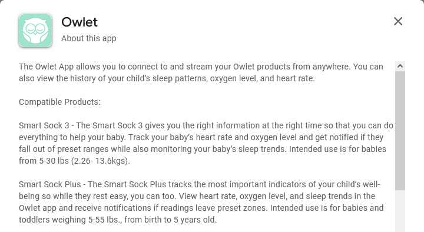
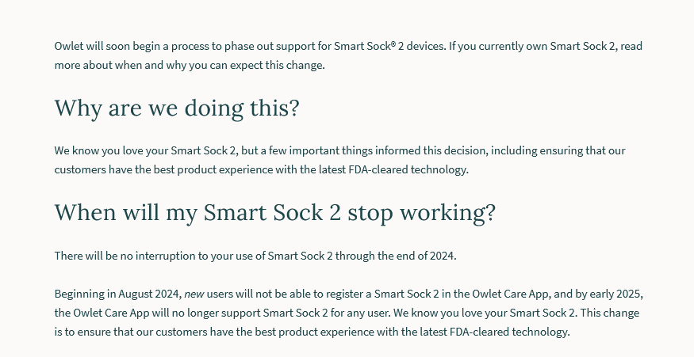
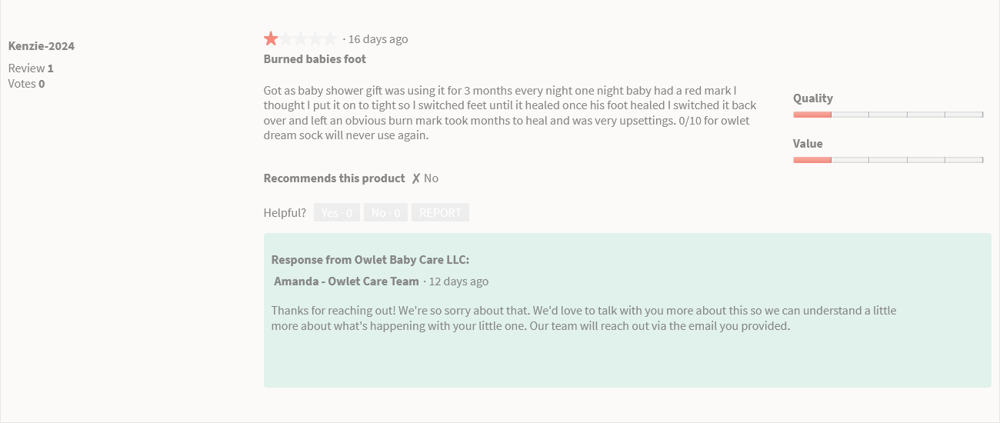
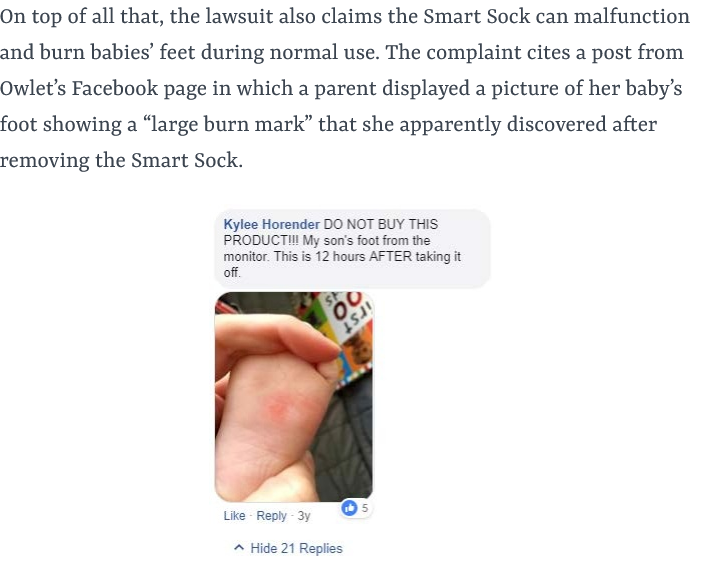

I recently became a new parent. I was talking to friends with kids that are a little older, and they mentioned that this product called "Owlet." It's a little sock that goes on your baby's foot and alerts you if the baby's heart rate or respiration drops to dangerous levels.

From hearing about the product, I had mixed feelings. It's comforting to get an immediate alert if there's something wrong with your baby, but it also feels like obsessive over-monitoring.

When I looked up the Owlet at home, I saw that it was $300, which felt pretty steep. I checked prices on used devices on eBay and found that they were available for as little as $50, which seemed much more reasonable. But then after a bit more research, it seems like Owlet has dropped support for all but the latest hardware version, leaving previous customers with degraded or maybe totally non-existent functionality.

I ultimately decided not to buy the Owlet and wanted to share what I discovered in researching the product.

## Reasons to buy the Owlet

### It might prevent a disaster

The nightmare scenario for me as a parent is that my son dies of something preventable while I'm sleeping or not monitoring him closely enough. So, there's definitely appeal in something that can alert me to a potentially fatal problem while it's early enough to intervene.

Owlet's website includes several testimonials from parents who say that they experienced situations where their child was approaching suffocation or heart failure, and the Owlet gave them early warning to provide life-saving interventions.

### It's non-invasive

From looking at photos, it seems pretty close to a sock, so it likely wouldn't bother our child if we attached it.

### It claims to have healthy sleep recommendations

The app claims to do some kind of pattern recognition in a baby's sleep pattern and makes recommendations for helping the baby have optimal sleep, which is appealing.

## Reasons to not buy the Owlet

### It's unclear if the benefits outweigh the risks

From reading up on it, Owlet feels like a product that primarily preys on parental anxiety rather than providing any tangible benefit.

It's $300 and a thing you have to constantly keep attached to your child, but what does that get you?

Owlet positions itself as preventing [SIDS](https://en.wikipedia.org/wiki/SIDS), but I couldn't find any study showing that it's at all effective at doing that. The only evidence are a handful of anonymous testimonials on Owlet's website.

The NIH says of monitoring devices like the Owlet:

> Avoid using heart, breathing, motion, or other monitors to reduce the risk of SIDS. These types of monitors are not effective at detecting or preventing SIDS.

### Monitoring depends on Owlet servers being reachable

One of the wildest things I learned about Owlet is that their app stopped working entirely for all customers because of [a server outage](https://www.nytimes.com/2020/04/17/parenting/owlet-baby-monitor.html) in 2020. It's unclear from reporting whether alerts failed during the outage window, but it sounds like they did, which is terrible for a device that presents itself as safety critical monitoring.

### Owlet aggressively drops software support for its products

As I mentioned, I was about to buy a used Owlet for $55, which felt much more reasonable. But I was confused why some eBay listings titled their product "Dream Sock 2" when the current product that Owlet sells is just called the Owlet "Dream Sock®" with no version number.

The mobile app claims to only be compatible with "Smart Sock 3" and "Smart Sock Plus":

{{}}

This is confusing because it seems like the FDA [forbid Owlet from selling Smart Sock 1, 2, and 3 and the Smart Sock Plus](https://www.fda.gov/inspections-compliance-enforcement-and-criminal-investigations/warning-letters/owlet-baby-care-inc-616354-10052021)

In 2024, they announced that Smart Sock 2 would just stop working and you can't register socks within the mobile app starting in August 2024.

{{}}

It's unclear how long the Smart Sock 3 will continue to be supported, but it's a red flag that they haven't even bothered to update the compatibility listing for their Android app.

### The Android app has poor reviews

I looked through recent reviews for the Owlet app on the Google Play store and they seemed a mixture of very negative reviews and glowing-but-fake-sounding reviews.

Also, a product review I read (it was a fluffy affiliate review, so I'm not linkng) mentioned that Owlet actually requires customers _two different_ to install two different mobile apps. Some of the reviews also mention that the Android app is missing features from the iOS app.

Basically every hardware product I've ever used has an awful app. If the app is something you can't try out or meaningfully evaluate until you've already handed over your money, the company has no incentive to make it good. I don't really want something that's supposedly safety critical relying on some terrible mobile app.

### It has false negatives and false positives

False postives seem relatively harmless relative to the value of catching a life-threatening situation early, but false positives can be harmful as well. A [2017 JAMA paper](https://www.ncbi.nlm.nih.gov/pmc/articles/PMC5310844/) warned:

> Overdiagnosis occurs when the accurate detection of abnormalities fails to benefit the patient. This is because a single abnormal test—such as a self-resolving desaturation can trigger a cascade of events. For example, a low pulse oximetry alarm from a consumer monitor could prompt an emergency department visit with blood tests, x-rays, and hospital admission. Rather than reassuring parents, these experiences may generate anxiety and a false assumption that their infant is at risk of dying. These considerations introduce the prospect that using a monitor could indirectly result in harm to infants and their families.

There was a [class action suit](https://www.classaction.org/blog/class-action-owlet-smart-sock-baby-monitors-give-false-alarms-fail-to-work-as-promised) against Owlet, which included a customer report of two false alarms that caused her to call paramedics for her daughter only to find out nothing was wrong at all:

> The first named plaintiff in the suit says she received the Owlet Smart Sock 2 as a gift around August 2018. Within the first two weeks of using the product, it gave her two “red” alerts, the case says, which are the most “critical and immediate” of the Smart Sock alarms. The first alert reported low oxygen and the second showed both low oxygen and an abnormal heart rate, the suit says.
>
> After each alert, the plaintiff called 911, the case goes on, but the paramedics found her baby’s oxygen levels and heart rate to be within the normal range both times.

So, that's obviously undesirable, but I'd obviously have a false alarm than a false negative.

### Some parents report burns

In the product reviews and in the class action lawsuit, some parents report that their babies feet have received burns from this product.

{{}}
{{}}

### It seems inconvenient to use in the winter

For warm months, it seems easy to slip on this sock, but it would likely be tough to fit under

### Owlet's Privacy Policy seems to give your baby's health information out freely

### Owlet solicits security reports from researchers but refuses to pay them

Their vulnerability disclosure policy starts with this warm and fuzzy:

> In line with our dedication to transparency, collaboration, and user safety, we invite the security community to assist us in identifying and addressing potential vulnerabilities. This Vulnerability Disclosure Policy serves as a framework for responsible security researchers to report any discovered vulnerabilities, ensuring a coordinated and swift response. By fostering an open dialogue and partnership with the security community, we aim to continually strengthen the security of our products and uphold the trust placed in us by our users.

It unfortunately ends with:

> We do not have a formal bug bounty program and do not currently reward reporters for their findings.

So, Owlet invites researchers to dedicate a lot of time to helping Owlet but Owlet can't be bothered to pay them.

### It's expensive

At $300, it's pretty pricey.

## My conclusion

I decided not to buy the Owlet.

I might feel differently if my son had more risk factors for SIDS or if I was suffering from so much anxiety about his health that I couldn't sleep or relax, but I think my money and efforts are better spent elsewhere, like ensuring we're practicing [safe sleep hygiene](https://safetosleep.nichd.nih.gov/reduce-risk/reduce).
