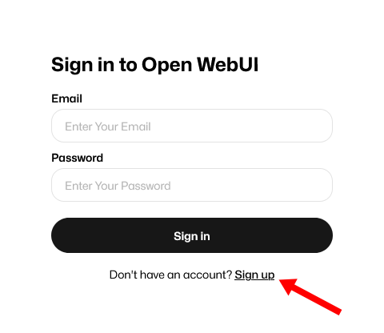
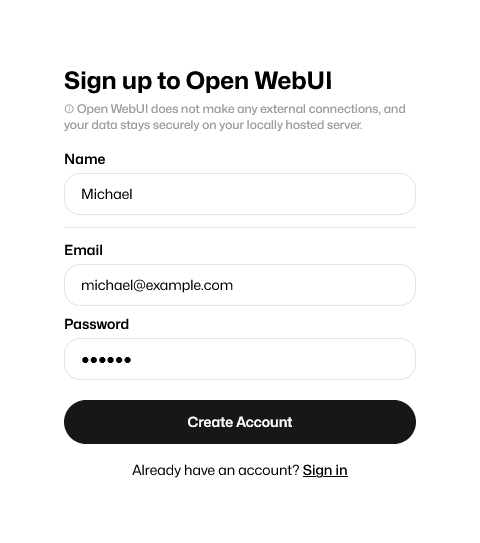
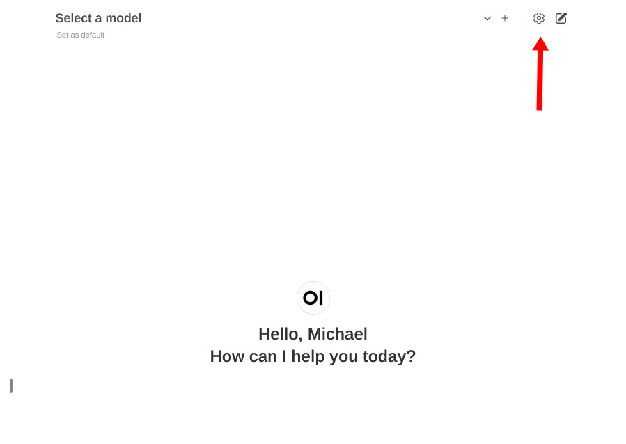
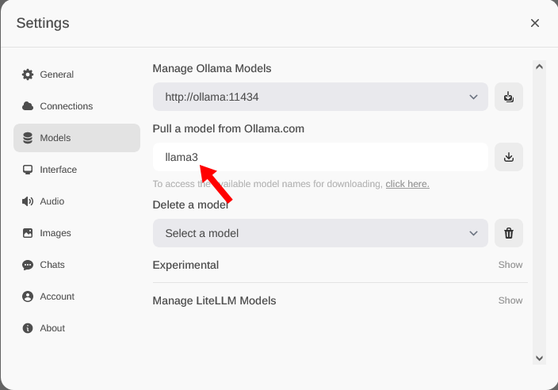

I saw that Meta [released the Llama 3](https://llama.meta.com/llama3/) AI model, and people seem excited about it, so I decided to give it a try.

I don't have much experience running open-source AI models, and I didn't see a lot of documentation about how to run them. I tinkered with it for a few hours and got Llama 3 working with [Ollama](https://ollama.com/), so I wanted to share my instructions.

### Provisioning a cloud server with a GPU

To run this experiment, I provisioned the following server on [Scaleway](https://scaleway.com):

- Server: GPU-3070-S
- OS: Ubuntu Focal
- Disk size: 100 GB (needed because the model is large)

To SSH in, I ran the following command with port forwarding because I'll need access to the web interface that will run on the server's `localhost` interface.

```bash
TARGET_IP='51.159.184.186' # Change to your server's IP.
REMOTE_PORT='8080'
LOCAL_PORT='8080'

# SSH in and port-forward a port to access the Open-WebUI web interface.
ssh "${TARGET_IP}" -L "${REMOTE_PORT}:localhost:${LOCAL_PORT}"
```

## Install CUDA

First, install CUDA to enable Ollama to use the GPU:

```bash
sudo apt-get install linux-headers-$(uname -r) && \
  sudo apt-key del 7fa2af80 && \
  echo "deb [signed-by=/usr/share/keyrings/cudatools.gpg] https://developer.download.nvidia.com/compute/cuda/repos/ubuntu2204/x86_64/ /" | sudo tee /etc/apt/sources.list.d/cuda-ubuntu2204-x86_64.list && \
  wget https://developer.download.nvidia.com/compute/cuda/repos/ubuntu2204/x86_64/cuda-ubuntu2204.pin && \
  sudo mv cuda-ubuntu2204.pin /etc/apt/preferences.d/cuda-repository-pin-600 && \
  sudo apt-get update && \
 sudo apt-get install -y cuda-toolkit nvidia-container-toolkit ca-certificates curl
```

## Install docker

Next, install Docker so that you can run ollama under the Open-WebUI web interface for Ollama:

```bash
sudo install -m 0755 -d /etc/apt/keyrings && \
  sudo curl -fsSL https://download.docker.com/linux/ubuntu/gpg -o /etc/apt/keyrings/docker.asc && \
  sudo chmod a+r /etc/apt/keyrings/docker.asc && \
  echo \
    "deb [arch=$(dpkg --print-architecture) signed-by=/etc/apt/keyrings/docker.asc] https://download.docker.com/linux/ubuntu \
    $(. /etc/os-release && echo "$VERSION_CODENAME") stable" | \
    sudo tee /etc/apt/sources.list.d/docker.list > /dev/null && \
  sudo apt-get update && \
  sudo apt-get install docker-ce docker-ce-cli containerd.io docker-buildx-plugin docker-compose-plugin && \
  sudo usermod -aG docker "${USER}" && \
  newgrp docker
```

To test everything is working, run the following command:

```bash
docker run hello-world
```

## Start Ollama and Open-WebUI

I adapted the standard [Open-WebUI](https://github.com/open-webui/open-webui) Docker Compose file to make one for Ollama, which you can download and run with the following command:

```bash
wget ollama-llama3/docker-compose.yml && \
  docker-compose up
```

Once the server is up and running, visit the following URL in your browser:

- <http://localhost:8080>

You'll first see a page prompting for a login. Click "Sign up."

{{}}

Then enter any details. You don't really need a valid email, as far as I can tell.

{{}}

From here, you need to download a model to use. Click the settings button:

{{}}

I don't know the differences between the models, but Llama 3 is the newest one that just came out a few days ago, so I decided to try that. It says on ollama.com that `llama3:70b` is optimized for chatbot use cases, so I initially went with that one, but it was incredibly slow. I switched to `llama3` and that performed decently:

{{}}

It's going to sit at 100% for a while, but it's not done until you see..

`llama3:70b` was too slow, so I had to switch to `llama3`.
