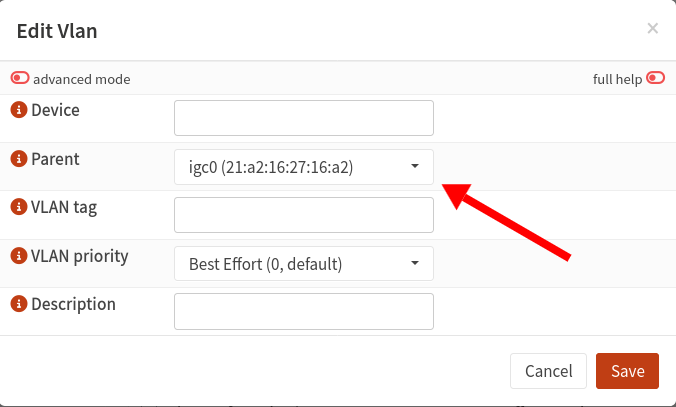
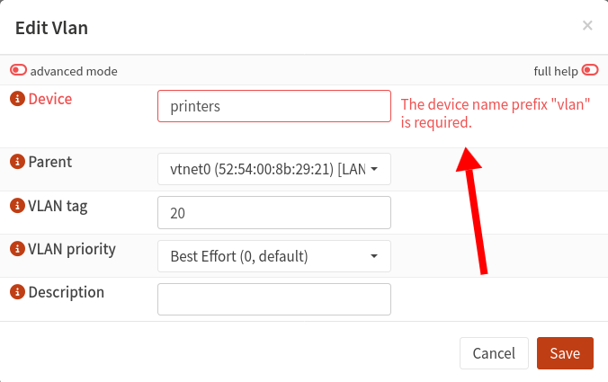
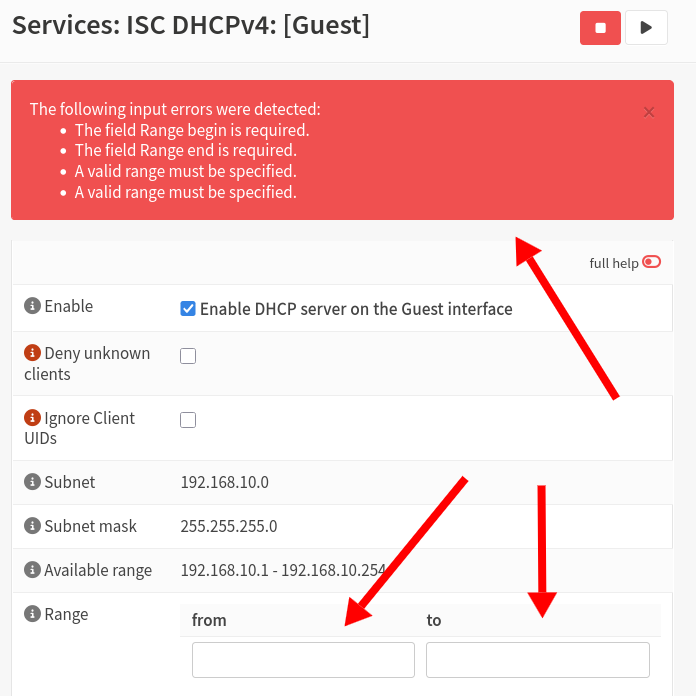
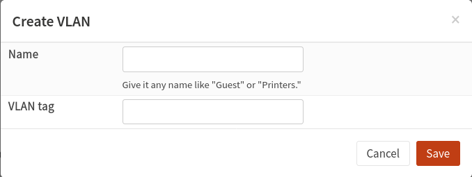

How many clicks does it take to add a new VLAN to an OPNsense firewall?

Nothing fancy. Just your regular, basic VLAN with its own IPv4 range.

How many clicks should that take? Maybe two or three? Five if we're real wild?

Every time I add a new VLAN to OPNsense, the process feels strangely tedious, so I decided to [measure exactly how many clicks](https://codeberg.org/mtlynch/count-clicks) it takes to add a simple VLAN to my firewall.



The result was:

- 26 clicks
- 71 keystrokes
- 6 distinct screens / dialogs
- 3 distinct workflows

And that's before I even assign any firewall rules!

I could have traded some of those clicks for keystrokes with the Tab key, but I tried to match my everyday process.

## Why is this so tedious?

There are so many steps in the process where I just want to ask OPNsense, "Why couldn't you have figured this out on your own?"

Every time I add a VLAN to my OPNsense router, I have to say, "Actually, I'd like it on my _LAN interface_, not the random, disconnected interface you chose by default because its name is first alphabetically":

{{}}

### Don't make me type prefixes for you

If I dare enter an arbitrary VLAN name, OPNsense whines and insists I prefix the name with `vlan`:

{{}}

You gave me an arbitrary input field, OPNsense! If you want a special prefix, add that on your end. Don't conscript me to type your prefixes for you.

And speaking of typing prefixes for you, when we get to DHCP assignments, if I try to leave the start and end range blank, you give me **four** separate errors:

{{}}

And again, in both the "from" and "to" fields, I have to type out `192.168.10.` even though OPNsense knows that's the only valid prefix I can enter. Why can't you do that for me, OPNsense? Better yet, default to the full subnet range so I don't have to type anything.

### Why is this three separate workflows?

If you didn't have the patience to sit through the whole video, I actually have to go through three separate workflows to create one standard VLAN:

1. Create the VLAN device.
1. Create a VLAN _interface assignment_ for that device.
1. Configure DHCP for that interface.

But it's all the same VLAN? Why isn't it just one screen? Or at the very least, a single, continuous flow rather than forcing me to go scour the whole OPNsense settings tree for the next workflow.

## What is my ideal VLAN creation flow?

Why can't the VLAN creation flow just be a single dialog with two questions?

{{}}

And then OPNsense can:

- Assume I want to enable the VLAN I just created.
- Assume that the VLAN is for my LAN port.
- Assume I want to create a static IP range for it where the tag number is the third octet (e.g. 192.168.**10**.0/24).
- Assume that I want to enable DHCP and use all available IPs in the /24.

I'm happy for all the other options to be under an "Advanced" section, but why not just use sensible defaults?

Every guide I can find for setting up VLANs in OPNsense uses these settings, so why not just default to them?

## Is the web UI helping at this point?

OPNsense is meant to be a friendly UI wrapper around FreeBSD utilities, most notably the [pf firewall](https://www.openbsd.org/faq/pf/filter.html) and the [Unbound DNS server](https://nlnetlabs.nl/projects/unbound/about/).

I'm grateful to OPNsense for helping me escape the ecosystem of closed-source, buggy home firewalls that Linksys puts out, and I've been a [paying licensee](https://shop.opnsense.com/product/opnsense-business-edition/) for four years.

But I'm thinking it might be time for me to leave the nest and run OpenBSD or FreeBSD directly with some simple scripts to do what I want. It doesn't seem too hard to run one of those OSes and create a script like this:

```bash
$ ./add-vlan --name='guest' --tag=10
Created VLAN "guest" with tag 10 and IP range 192.168.10.1 to 192.168.10.254
```
