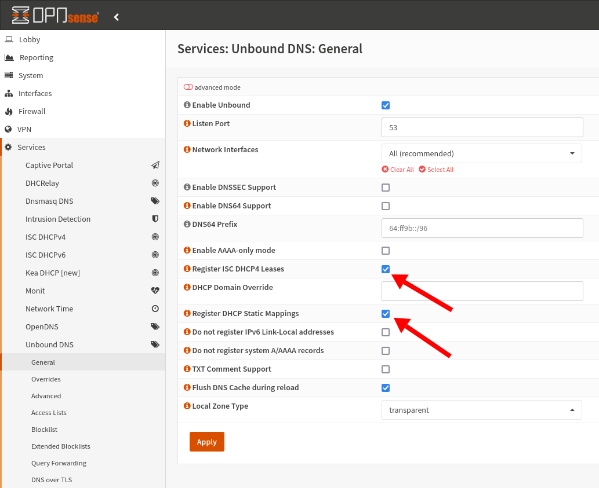

My router runs OPNSense Business. I like having an open-source router, but I have a few gripes with it.

My biggest issue is that, by default, OPNsense can't resolve hostnames on my local network.

## Why can't OPNsense resolve local hostnames?

For every other router I've owned in my life, if there's a computer on my network named `foo123` and I run `ping foo123` from my main desktop, then everything just works. My desktop successfully pings `foo123`.

With OPNsense, I can't ping `foo123` from my desktop. OPNsense seems to not resolve local hostnames by default, and I don't understand why.

I've found workarounds that improve the situation somewhat, but it's still not perfect.

## Tell Unbound to resolve local hostnames

Go to Services > Unbound DNS > General.

Check these options:

- Register ISC DHCP4 Leases
- Register DHCP Static Mappings

{{}}

Click Apply to apply the changes.

## Manually specify hostnames

Despite configuring Unbound, I find that OPNsense still doesn't always resolve local hosts, and I don't know why.

In situations where I just need OPNsense to resolve, I force the mappings manually.

### Create a static mapping for the host

1. Go to Services > ISC DHCPv4 > Leases
1. Find the host in the list of hosts that you want OPNsense to resolve.
1. Click the `+` icon at the right end of the table row. This should bring you to the Static DHCP Mapping dialog.
1. Enter a local IP address in the `IP address` field.
1. Click "Save" to save the static IP mapping.

### Create a manual override for the hostname

1. Go to Services > Unbound DNS > Overrides.
1. Under "Host Overrides", click the orange "+" button to add a new override.
1. Under "Host" enter the hostname you specified in the static mapping.
1. Under "Domain" enter `local`.
1. Under "IP address" enter the IP address you chose in the static mapping.
1. Click "Save".

## Specifying hosts with the `.local` domain suffix

Sometimes, when OPNsense fails to resolve host `foo123`, it successfully resolves `foo123.local`, so I always try adding the domain suffix if the bare hostname doesn't work.

I'm not sure why OPNsense needs the suffix, as the lack of domain name should make it obvious that I'm talking about a host on the local network, but the `.local` domain sometimes makes a difference.

## Other improvements?

If you have suggestions for making OPNsense's hostname resolution less brittle and more reliable, let me know in the comments.
