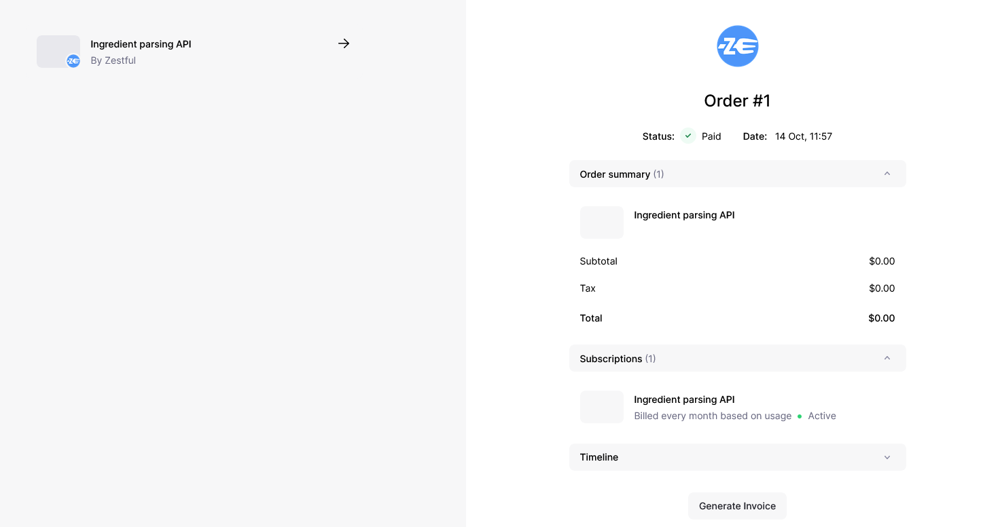
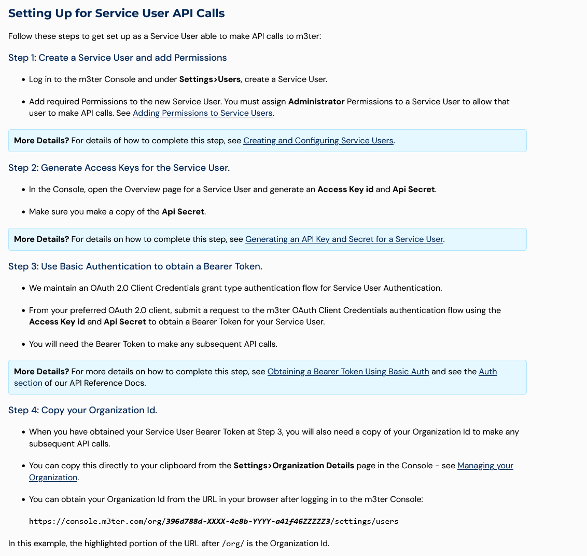

Supports usage based billing / metered billing

Acts as merchant of record

## Overview

| Provider     | Fees | Support for metered billing | Onboarding experience | Overall experience |
| ------------ | ---- | --------------------------- | --------------------- | ------------------ |
| RapidAPI     | 23%  | C                           | A-                    | D                  |
| LemonSqueezy | 5%   | B                           | C                     | XX                 |
| Paddle       | 5%   | B-                          | C+                    | XX                 |

## LemonSqueezy

Seems indie friendly.

I contacted them through their support portal asking about payment thresholds, and they said they'd get back to me in a few hours, and I never heard back.

Setup was pretty straightforward. Requires manual review before my store can be approved.

I like the automatic subscription management portal and that I can host on a custom domain.

{{}}

Doesn't make it obvious to the user that they're paying for usage. It tells them they have a $0 bill.

{{}}

Email confirmation is better:

{{}}

No language SDKs, but their APIs do confirm to json:api, so it's a little easier to use them.

Not seeing usage thresholds, but you can manually invoice a customer midway through a billing cycle or set billing to weekly.

{{}}

No dev support in the web dashboard. Stripe is very dev-oriented and shows API identifiers for customers and subscriptions, but LemonSqueezy doesn't show that anywhere in the UI, so I'd have to write custom code to find these identifiers.

JSONAPI is ugly

Was able to make usage based API calls okay.

Currently trying to figure out if user can see their usage anywhere or if I'm responsible for showing that. Would be no worse than RapidAPI.

## Paddle

Several indie services I use use Paddle.

Sandbox is a totally separate account rather than a mode?

I like that there's direct email support rather than a support web UI where my message just disappears.

They seem to have acquired m3ter, but m3ter is super complicated. Four steps including custom code before you even call an API? No thanks.

{{}}

The subscription modifier seems easy enough because I can just add $0.02 to the customer's next bill:

https://developer.paddle.com/classic/api-reference/dc2b0c06f0481-create-modifier

Shows API IDs in the dashboard.

No SDK but this third-party one looks decent:

https://github.com/Fakerr/go-paddle

I like his product and I've used it in the past.

https://jasminek.net/blog/post/paddle-problems/
https://jasminek.net/blog/post/payment-solutions/

```bash
PADDLE_VENDOR_ID='15062' # Sandbox
PADDLE_AUTH_CODE='[redacted]' # Sandbox
PADDLE_SUBSCRIPTION_ID='sub_01hcq7a0e33vs9ct0thy0nrjg0' # Sandbox

curl \
  -X POST \
  -d "vendor_id=${PADDLE_VENDOR_ID}" \
  -d "vendor_auth_code=${PADDLE_AUTH_CODE}" \
  -d "subscription_id=${PADDLE_SUBSCRIPTION_ID}" \
  -d 'modifier_recurring=false' \
  -d 'modifier_amount=0.02' \
  -d 'modifier_description=Ingredient parse - 1 ingredient' \
  https://sandbox-vendors.paddle.com/api/2.0/subscription/modifiers/create
```

They don't know how to use HTTP status codes?

```text
HTTP/2 200
content-type: application/json
content-length: 100

{
  "success": false,
  "error": {
    "code": 107,
    "message": "You don't have permission to access this resource"
  }
}
```

New API docs but they don't seem to cover subscription modifiers.

No response from support after four days.

Had to do weird ID verification where I have to upload my ID and a video of me saying numbers and turning my head.

## Other providers that don't meet my criteria

### Stripe

They seem to have very nice support for metered billing, including a customer dashboard that shows metered usage and allowing you to set billing thresholds, but they're not a merchant of record.

### Lago

Not self-serve, need to book a demo with them. No published pricing for hosted version.

Not merchant of record, not even a payment gateway. They can integrate with Paddle and have Paddle act as merchant of record.

### FastSpring

Doesn't suport usage-based billing.

They kind of do in that you're allowed to bill the customer every time they use a service, but my service is $0.02 per parse, so they'd be charged thousands of times for smaller than the minimum probably.

### Chargebee

Doesn't say whether they're merchant of record, so they're probably not.

Docs say you have to figure out your own tax rate: https://www.chargebee.com/docs/2.0/us-sales-tax.html

### Reach

https://www.withreach.com/

Doesn't support metered billing.
