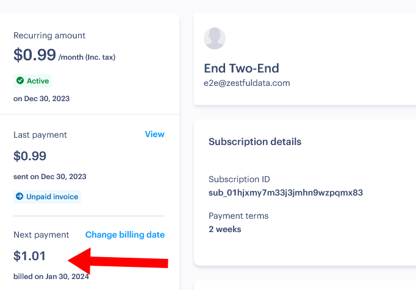

In 2018, I created [a simple API](https://zestfuldata.com) that converts plain recipe ingredients into software-friendly structured data. If you give it an ingredient like `"2 1/2 tablespoons finely chopped parsley"`, my API parses it into this:

```json
{
  "quantity": 2.5,
  "unit": "tablespoon",
  "product": "parsley",
  "preparationNotes": "finely chopped",
  "usdaInfo": {
    "fdcId": "170416",
    "matchMethod": "exact",
    "category": "Vegetables and Vegetable Products",
    "description": "Parsley, fresh"
  }
}
```

The API has generated $22k in total revenue (after platform fees) over the past six years. I put it into maintenance mode back in 2020, but the API still brings in about $150/month of passive income.

Customers purchase access to my API through a platform called RapidAPI, which has always disappointed me. Their user interface is atrocious, they do a terrible job at preventing abuse, and their customer service is rarely helpful.

In September 2023, RapidAPI allowed a user to rack up [$14k in usage fees](/retrospectives/2023/10/#i-need-to-migrate-away-from-rapidapi-for-spite) against my service but didn't try to bill them at all until two months later. Naturally, they collected nothing at all from the user. Worse, RapidAPI didn't even ban the abusive user or deactivate their account.

RapidAPI's terrible handling of the abuse situation prompted me to search for alternative payment processors that are compatible with a paid API service. I sadly couldn't find any attractive alternative, but I'm sharing my the results of my investigation in case they're helpful to other indie API vendors.

## What I want from a payment processor

### Must-haves

- Provider acts as a merchant of record for tax purposes.
  - Otherwise, I'm responsible for filing taxes in potentially hundreds of tax jurisdictions.
  - If the provider is a merchant of record, they are responsible for paying all sales tax, and you're just responsible for paying income tax on the revenue they collect for you.
- Provider supports usage-based billing ("metered billing").
  - Some customers want to make hundreds of API calls per day, and others want to make hundreds of thousands, so I want to let customers pay for exactly what they use.
- Provider publishes their pricing.
  - No "call us for pricing."
- Provider allows you to use their services in a self-serve flow.
  - No "contact us to book a demo."

### Nice-to-haves

- Provider offers a built-in sign-up flow for end-users, so I don't have to implement it.
- Provider can proxy my API and do usage calculations and authentication for me.

## Summary

### Providers who meet my criteria

| Provider     | Fees | Support for metered billing | Onboarding experience | Overall experience |
| ------------ | ---- | --------------------------- | --------------------- | ------------------ |
| Paddle       | 5%   | B-                          | C+                    | C                  |
| RapidAPI     | 23%  | C                           | A-                    | D                  |
| LemonSqueezy | 5%   | B                           | C                     | D-                 |

### Payment providers who don't meet my criteria

- [Stripe](https://stripe.com/)
  - They're not a merchant of record.
  - I wish they were because they seem to meet all my other criteria well.
  - They can [calculate and collect sales tax](https://stripe.com/tax) for you and show you what you owe, but you're still responsible for filing and paying sales tax in every jurisdiction where you have customers.
- [Lago](https://www.getlago.com/)
  - They're not a merchange of record.
  - They're not even a payment gateway, but they can integrate with other payment gateways.
  - They have no published pricing for their product. You have to book a demo with them.
- [FastSpring](https://fastspring.com/)
  - They don't support suport usage-based billing.
  - I theoretically could force usage-based billing in that FastSpring allows me to bill the customer every time they use my service, but my service is $0.02 per parse, so I'd have to charge my customers' credit cards hundreds or thousands of times per month for tiny amounts.
- [Chargebee](https://www.chargebee.com/)
  - I couldn't find anything on their website saying whether they are or are not a merchant of record, which means they're probably not.
  - Their [docs say](https://www.chargebee.com/docs/2.0/us-sales-tax.html) you have to figure out your own tax rate, which strongly implies they're not a merchant of record.
- [Reach](https://www.withreach.com/)
  - They don't support metered billing.

## LemonSqueezy

LemonSqueezy initially seemed like they'd be a great match for me. They cater to small-scale vendors, and they have simple options to match my simple needs.

### Onboarding

LemonSqueezy requires manual review before they could approve my account for accepting real payments due to KYC laws, but every payment provider has that limitation. LemonSqueezy's verification process was straightforward and just involved me answering a few questions over email. I was activated within a day.

### Confusing support for metered billing

LemonSqueezy's UI seemed to support metered billing exactly how I want. It took me a few tries to figure out how to map my intended usage onto LemonSqueezy's UI semantics.

I eventually figured out that I could do what I want by choosing a "Subscription" pricing mode with "Volume pricing" as my model. Then I selected "$0.02" as the price for each unit, which would be the price for each ingredient conversion through my API.

{{}}

The problem with LemonSqueezy is that they're bad at conveying to end-users that my service is billed by usage. When a customer signs up for my API through LemonSqueezy, the checkout page erroneously tells them that the cost is $0.00:

{{}}

LemonSqueezy sends customers an email confirmation after they sign up, and that makes it clearer that the bill depends on usage and is not always $0:

{{}}

When I signed up as an end-user through LemonSqueezy, I couldn't find anything in the user portal to show me what my usage charges were, so I think the API provider is responsible for creating that UI for their end users.

### Slow response from customer support

I contacted LemonSqueezy through their support portal asking about payment thresholds, and they said they'd get back to me in a few hours.

I didn't hear back for a full month, though when I did, it was from Gilbert Pellegrom, LemonSqueezy's CTO and co-founder.

### Billing thresholds

LemonSqueezy's CTO confirmed that they don't support billing thresholds (i.e., charge the customer's card every $500), but you can manually invoice a customer midway through a billing cycle or set billing to weekly.

{{}}

### Developer experience

LemonSqueezy's main focus is as a simple checkout for digital goods. If you have a PDF or a video you want to sell, LemonSqueezy

LemonSqueezy's support for developer-focused products (e.g., paid API services) is much less mature. And you see it very distinctly in the admin UI. If you've used a dev-oriented service like Stripe or Paddle, you're used to a UI that shows you programmatic identifiers for everything you can see in the admin UI.

In LemonSqueezy's admin UI, certain identifiers are just not available. LemonSqueezy will show you customers and subscriptions in the admin UI, but there's no way to find out a customer's subscription ID from the


{{}}
{{}}


To work around LemonSqueezy omitting identifiers in the web UI, to get customer's subscription IDs, I have to do it programmatically, like this:

```bash
curl "https://api.lemonsqueezy.com/v1/subscriptions" \
  -H 'Accept: application/vnd.api+json' \
  -H 'Content-Type: application/vnd.api+json' \
  -H "Authorization: Bearer ${LEMONSQUEEZY_API_KEY}" | python3 -m json.tool
```

LemonSqueezy's API is also a bit awkward. With most other vendors, to bill customer `12345` for 25 units of service, I'd expect to POST something like `{ "subscriptionID": 12345, "usage": 25}`.

Here's what the API call looks like in LemonSqueezy:

```bash
curl "https://api.lemonsqueezy.com/v1/usage-records" \
     -H 'Accept: application/vnd.api+json' \
     -H 'Content-Type: application/vnd.api+json' \
     -H "Authorization: Bearer ${LEMONSQUEEZY_API_KEY}" \
     -d '{
  "data": {
    "type": "usage-records",
    "attributes": {
      "quantity": 25,
      "action": "increment"
    },
    "relationships": {
      "subscription-item": {
        "data": {
          "type": "subscription-items",
          "id": "12345"
        }
      }
    }
  }
}'
```

I found LemonSqueezy's REST API semantics to be extremely unintuitive. The only way I could get them to work was to find a close example in their documentation of what I wanted. Simply reading the API spec was not enough.

### LemonSqueezy summary

- Pros
  - Their web interface is less complicated than most other vendors.
  - They seem to be rapidly iterating and adding functionality.
  - I did get a response directly from their CTO, albeit a month late.
- Cons
  - Their focus is on one-time sales and not subscriptions or metered billing.
  - They don't show end-users what usage they've accrued on their bill. In some places, they incorrectly tell customers their bill is $0.
  - Their developer experience for vendors is a bit weak.

## Paddle

Several indie services I use use Paddle.

### Learning from a previous bootstrapper's experience

Michal Mazurek wrote two articles about his experience as a bootstrapped SaaS founder working with payment vendors.

- [Paddle.com Woes with Solutions](https://jasminek.net/blog/post/paddle-problems/)
- [Which Subscription Payment Service Should A Bootstrapping SaaS Choose?](https://jasminek.net/blog/post/payment-solutions/)

### An intense and confusing onboarding process

Paddle's KYC process was one of the most invasive of any vendor I've seen. I had to upload my driver's license and then record a video of me saying random numbers while turning my head from side to side.

Finally, I got an email saying they'd verified my account, but a few hours later, I received a follow up saying that they verified my account by mistake, and they still need me to provide a utility bill. I provided a copy of my most recent Internet bill with my address on it, and they told me that it had to be a gas, electric, or water bill, so I sent an electic bill instead.

Bizarre bank payout process where they need my bank's address rather than auto-populating. Can only pay out above $100.

### Support

Sent a second email, got a response from a bot who couldn't answer any questions.

Had to send to different email address specifically for sellers.

I like that there's direct email support rather than a support web UI where my message just disappears.

### Dev experience is never-ending gotchas

#### Gotcha: Paddle Classic is secretly disabled

I could see users in my web interface, but if I queried through "Paddle Classic" APIs, the requests would succeed but return confusingly empty responses:

```bash
$ curl --request POST --url https://sandbox-vendors.paddle.com/api/2.0/subscription/users --header 'Accept: application/json' --header 'Content-Type: application/x-www-form-urlencoded' --data vendor_id=15062 --data vendor_auth_code=redacted
{"success":true,"response":[]}
```

```bash
$ curl --request POST --url https://sandbox-vendors.paddle.com/api/2.0/subscription/plans --header 'Accept: application/json' --header 'Content-Type: application/x-www-form-urlencoded' --data vendor_id=15062 --data vendor_auth_code=redacted
{"success":true,"response":[]}
```

I reached out to support to ask what was going on, and they said that Paddle Classic is deprecated, so it was disabled in my account.

It was bizarre and a huge waste of Paddle customers' time that if an API is disabled, it gives reports success with incorrect results rather than failing with an error.

#### Gotcha: Sandbox is a totally separate account

Sandbox is a totally separate account rather than a mode?

#### Gotcha: Minimum charge is $0.70

My API costs $0.02 per API call.

Even though calling the API seems to work, it doesn't do anything, at least in Sandbox. Only the preview announces the problem.

```bash
$ curl \ --request POST \
  --url "https://sandbox-api.paddle.com/subscriptions/${SUBSCRIPTION_ID}/charge/preview" \
  --header "Authorization: Bearer ${PADDLE_AUTH_CODE}" \
  --header 'Content-Type: application/json' \
  --header 'Accept: application/json' \
  --data '{
    "items": [
      {
        "price_id": "pri_01hd7srv3h2gfccs19c7dy92f0",
        "quantity": 1
      }
    ],
    "effective_from": "next_billing_period"
    }' | python3 -m json.tool
{
    "error": {
        "type": "request_error",
        "code": "subscription_update_transaction_balance_less_than_charge_limit",
        "detail": "Unable to charge for Subscription update: Transaction balance is less than what we can charge. Transaction balance: 2, Minimum payment amount: 70, Currency code: USD",
        "documentation_url": "https://developer.paddle.com/v1/errors/subscriptions/subscription_update_transaction_balance_less_than_charge_limit"
    },
    "meta": {
        "request_id": "f020a3ce-d207-476a-ae20-0bc88256c73e"
    }
}
```

If I called the non-preview API with the exact same data, everything worked as expected. I could see in my management portal that Paddle correctly incremented the customer’s bill from $0.99 to $1.01:

{{}}

I reported the apparent bug to customer support to ask what was going on, and they said they'd confer with the team to make sense of the behavior I was seeing. I never heard back, and that was two months ago.

### Paddle summary

- Pros
  - Admin UI is nice, similar to Stripe's.
  - REST API semantics are intuitive.
- Cons
  - Dev experience is a minefield of gotchas.

## RapidAPI

### RapidAPI summary

- Pros
- Cons
  - No support for changing prices
  - The usage summary is delayed by up to 24 hours, causing several customers to mistakenly think they're not accruing charges.

## Conclusion: Begrudgingly stick with RapidAPI
