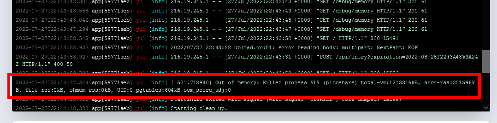
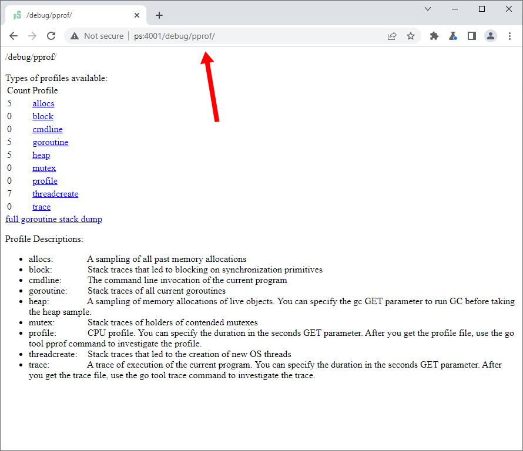
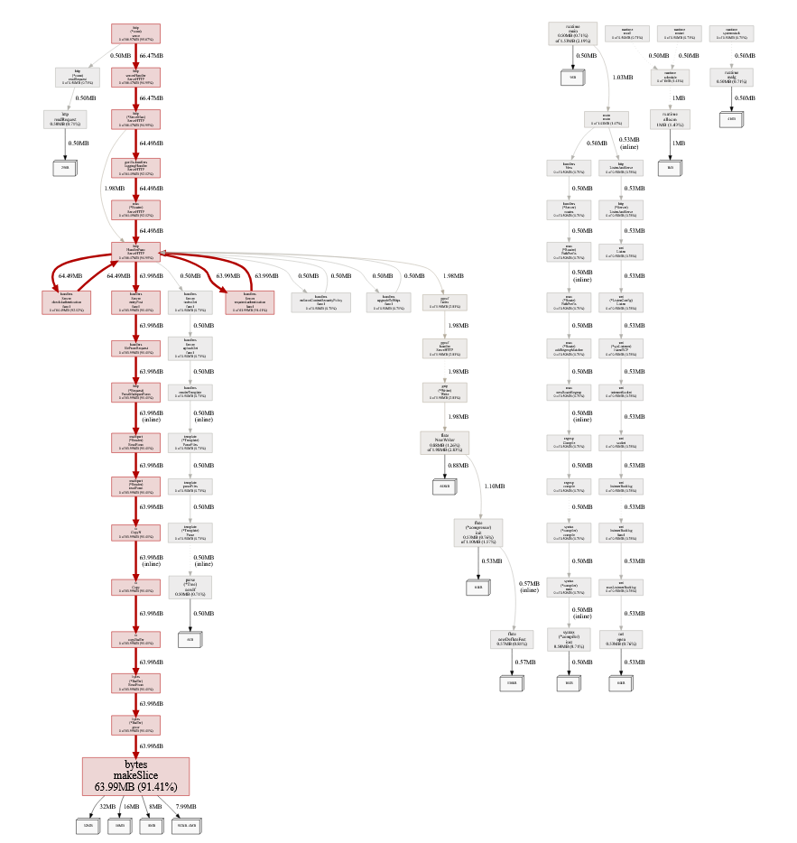
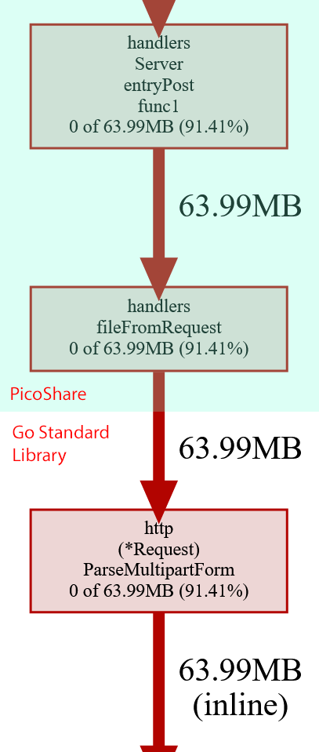
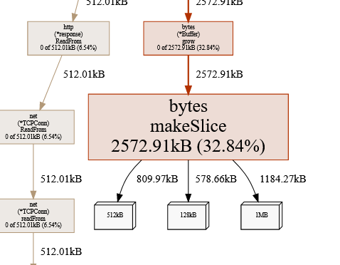
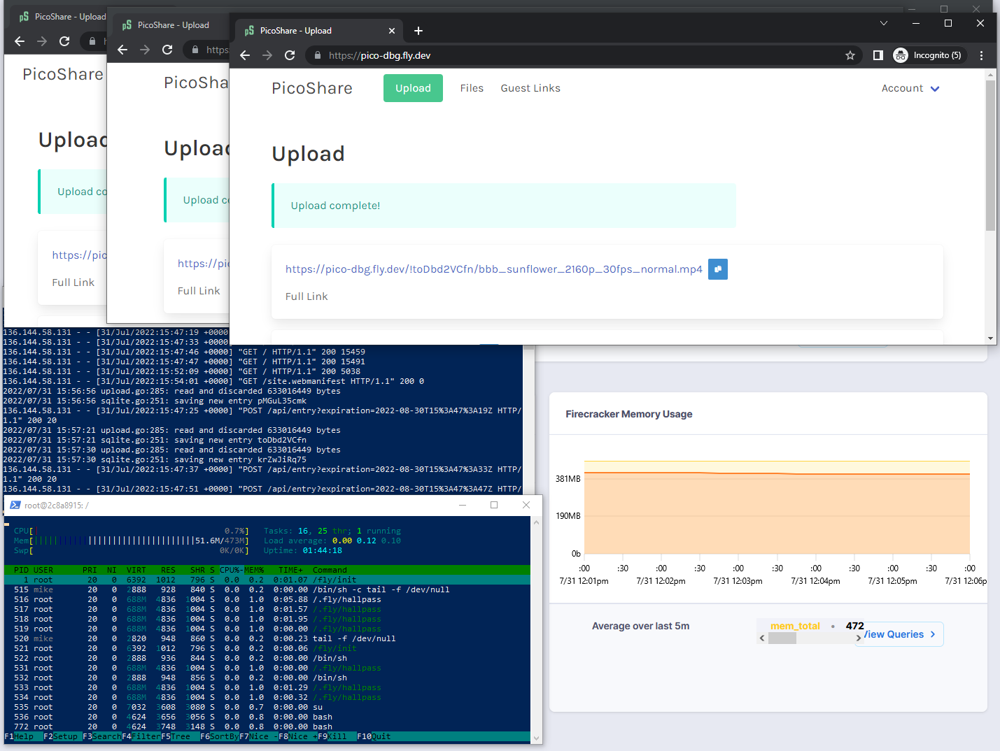
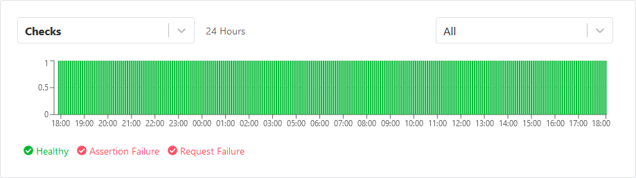

Earlier this year, I created an open-source web app called [PicoShare](https://pico.rocks). It's a small Golang app that lets you share files easily. I use it for sending files that are too large for email, but I don't want the recipient to deal with Dropbox or Google Drive.


A few months ago, I started seeing my PicoShare server die every few days. When I checked the logs, I saw an out of memory error:

{{}}

I didn't have time to debug the crash, so I just increased the VM's memory from 512 MB to 1 GB. And then I kept seeing crashes, so I increased it again to 2 GB.

Obviously, it's not very satisfying to fix a recurring crash by just throwing more RAM at the system, so when I had some spare time, I dug into it more. For the past two weeks, I've been debugging the crashes and sharing my progress on Twitter.



At this point, I've fixed all the issues that were causing crashes and learned some useful lessons along the way about Go, SQLite, and debugging.

If you want to see the story as it unfolded, check out the Twitter thread. If you'd like a cleaned up, condensed version of what I learned, read on.

## Preface: I use SQLite strangely

One of the strange architecture decisions I made with PicoShare was to store all file data in SQLite. This is an unusual choice, as web applications typically store file uploads directly on the filesystem, not in a database. This especially true in applications like PicoShare where file data can be arbitrarily large.

The advantage of writing file data to SQLite is that it means all of PicoShare's application state is in a single database. That's not so special itself, but I designed PicoShare to integrate with [Litestream](https://litestream.io), a tool for replicating SQLite databases to cloud storage. With Litestream managing SQLite's replication, I essentially get backup and restore "for free." By that I mean that I can completely blow away a server and then [redeploy it anywhere](/litestream/) (even another cloud hosting provider), and it will have the exact same state with all the same file uploads.

## Reproducing the error

I only saw PicoShare crash every few days, so my first step was to find a way to reproduce the crash consistently.

I managed to reproduce the error by deploying PicoShare on a Fly.io instance with only 256 MB of RAM and then uploading large files. For my large files, I used high-resolution versions of the short film [_Big Buck Bunny_](https://peach.blender.org/). The file sizes ranged from 269 MB to 618 MB.

TODO: Screenshots of BBB

TODO: Mirror for BBB

Uploading the 618 MB version in parallel across two tabs consistently exhausted memory and caused PicoShare to die with an out of memory error within a minute or so.

## Using profiling tools to identify RAM bloat

The first big break in the investigation came from [Ben Johnson](https://twitter.com/benbjohnson), the author of Litestream and a recent addition to the Fly team. Ben created [a detailed pull request](https://github.com/mtlynch/picoshare/pull/283) explaining how a single line of code was causing PicoShare to consume large amounts of RAM.

Ben has extensive experience with profiling, so he was able to reproduce the issue with a test. He later showed me a different way of getting the same information that I think is a bit more practical, so I'm going to show that, but you can find Ben's original technique in his pull request.

It turns out the Go standard library comes with kind of a magical tool for debugging issues. All you have to do is add this line to your imports:

```golang
_ "net/http/pprof"
```

Now, when you run your app, there will be a `/debug/pprof/` route with lots of useful debugging information about your app.

{{}}

I was surprised at how easy this was to add. There's a lot of interesting debugging information in this web interface, but the one that I used was `heap`. To use it, run this command from the command-line:

```bash
go tool pprof \
  -http=:8081 \
  -alloc_space \
  call_tree \
  http://localhost:4001/debug/pprof/heap
```

That pops up a web interface and renders a graph that looks like this:

{{}}

At the bottom, you can see a large red block labeled `bytes makeSlice 63.99 MB`, meaning that 64 MB of RAM is being consumed by allocations from Go's `makeSlice` function.

`makeSlice` is in the Go standard library, not my code. To find what code in PicoShare is causing these allocations, I traced up the graph until I found a PicoShare function name:

{{}}

The last PicoShare function in this chain is [`handlers.fileFromRequest`](https://github.com/mtlynch/picoshare/blob/1.1.7/handlers/upload.go#L242), which calls the Go standard library function [`*Request.ParseMultipartForm`](https://pkg.go.dev/net/http@go1.18.4#Request.ParseMultipartForm). That function is responsible for parsing multipart HTTP data, which is the most common way to upload file data to a web server.

`ParseMultipartForm` accepts a `maxMemory` parameter, documented as follows:

> The whole request body is parsed and up to a total of maxMemory bytes of its file parts are stored in memory, with the remainder stored on disk in temporary files.

PicoShare's call looked like this:

```golang
r.ParseMultipartForm(32 << 20) // 32 MB
```

Even though we were specifying a limit of 32 MB, Go was allocating 64 MB of RAM.

Ben tried reducing the `maxMemory` paramter to `1 << 20` (1 MB), and the RAM usage from `ParseMultipartForm` dropped to only 2.5 MB:

{{}}

This was a huge reduction in memory, so I thought for sure Ben had solved it.

Unfortunately, I deployed a test version with Ben's fix to Fly, and it still crashed.

Ben's fix made the crash harder to reproduce, so it did seem to make a difference, but when I uploaded three large files in parallel, the server died with the same out of memory error.

## Freeing resources after calling `ParseMultipartForm`

From Googling, I discovered another gotcha with `ParseMultipartForm`.

The documentation doesn't explain it, but the caller is responsible for calling `r.MultipartForm.RemoveAll()` to free the resources Go allocated during `ParseMultipartForm`. So, I was leaking memory every time I called `ParseMultipartForm`.

To fix the leak, I rewrote my code to call `ParseMultipartForm` like this:

```golang
multipartMaxMemory := 1 << 20 // 1 MiB
if err := r.ParseMultipartForm(multipartMaxMemory); err != nil {
  return err
}
// Free form resources before returning from function.
defer func() {
  if err := r.MultipartForm.RemoveAll(); err != nil {
    log.Printf("failed to free multipart form resources: %v", err)
  }
}()
```

This fix looked promising, as I saw huge reductions in RAM usage on Fly after freeing resources explicitly:

{{}}

Sadly, even with this fix, the crashes continued.

## Optimizing downloads

[Dan Wilhelm](https://danwilhelm.com/) started following the thread, and even though he's never written Go code, he rolled up his sleeves and started experimenting with the code.

Dan noticed that [RAM usage shot up when he downloaded files](https://github.com/mtlynch/picoshare/issues/284). That was strange, as downloads shouldn't consume much RAM. Parsing a multipart form is complex, so there are many factors that could be bloating RAM, but there's a lot less complexity to serving files.

PicoShare stores all of its file data in SQLite in [328 KB chunks](https://github.com/mtlynch/picoshare/blob/1.1.7/store/sqlite/sqlite.go#L22). That shouldn't be RAM intensive because we should be able to just read some chunks into RAM, send them to the client, then free the memory.

Dan found a bug in the code responsible for reading PicoShare's file data from the database. See if you can spot it:

```golang
func (fr *fileReader) populateBuffer() error {
	if fr.offset == int64(fr.fileLength) {
		return io.EOF
	}

	startChunk := fr.offset / int64(fr.chunkSize)
	stmt, err := fr.db.Prepare(`
			SELECT
				chunk
			FROM
				entries_data
			WHERE
				id=? AND
				chunk_index>=?
			ORDER BY
				chunk_index ASC
			`)
	if err != nil {
		log.Printf("reading chunk failed: %v", err)
		return err
	}
	defer stmt.Close()

	var chunk []byte
	err = stmt.QueryRow(fr.entryID, startChunk).Scan(&chunk)
	if err != nil {
		return err
	}

	// Move the start index to the position in the chunk we want to read.
	readStart := fr.offset % int64(fr.chunkSize)

	fr.buf = bytes.NewBuffer(chunk[readStart:])
	fr.offset += int64(len(chunk)) - readStart

	return nil
}
```

The bug is in the SQL query:

```sql
WHERE
    id=? AND
    chunk_index>=?
```

The query is only supposed to retrieve a single chunk of file data. Instead, it reads the target chunk and everything after.

The fix was simply to change the `>=` to `=`:

```sql
WHERE
    id=? AND
    chunk_index=?
```


**Sidenote**: Reading this code, I also realized I was using prepared statements [when I didn't need to](https://github.com/mtlynch/picoshare/pull/286), though I don't think this had much effect on RAM.


Dan's change was on the download side, so I didn't expect it to fix out of memory crashes I saw during upload. And indeed it didn't, but there was a drastic performance improvement in file downloads. Especially with streaming content like videos or audio, PicoShare was much more responsive when I jumped to different positions in the file.

## Removing SQLite transactions

Within the Twitter thread, several people suggested that PicoShare's SQLite transactions were likely bloating RAM.

When PicoShare wrote file data into SQLite, I did it within a [transaction](https://www.sqlite.org/lang_transaction.html). The purpose was to ensure the database was always in a consistent state.

By using transactions, SQLite guaranteed that I would never reach a state where only part of the file was in the database if some writes failed. It also ensured that I couldn't accidentally write the file metadata without writing the file contents and vice-versa.

Some Googling indicated that large transactions can be a source of memory bloat, so I figured it was worth trying. I tested a basic implementation writing to SQLite immediately instead of using transactions, but it still bloated RAM immediately:

A few people pointed to transactions. I was hoping to avoid

## RAM bloat is fine, but crashes are not

At this point, I . I was examining RAM usage from three different angles, which disagreed with each other:

- Go's debug metrics for how much memory it had allocated
- `htop` within in the
- Fly's RAM metrics from the VM host

In particular, Fly's metrics would frequently show RAM maxed out when Go and `htop` showed barely any usage.

The gamechanging insight came from my Andrew Ayer:



Kurt Mackey, Fly's CEO, popped into the thread to confirm Andrew's hypothesis:

{{}}

So, Fly's memory metrics included memory that was being used for the page cache, but the VM should .

This was a huge realization. Because of the difficulty of reproducing out of memory crashes, I'd used RAM bloat as an easier approximation for reproducing the problem. But RAM bloat in itself is fine as long as the VM still has enough memory to keep my processes running.

I had to reevaluate everything now. When I dismissed other fixes, had it been because they caused harmless RAM bloat? Or did I observe actual crashes?

## Re-examining SQLite transactions

Given what Andrew Ayer said about RAM bloat, it was time to revisit SQLite transactions. When I tested eliminating them, did I see crashes or just RAM bloat? I couldn't remember.

I tried running the transactionless implementation again. Sure, enough, RAM bloated but PicoShare kept running. I uploaded three 618 MB files in parallel, and every upload succeeded with PicoShare continuing to serve HTTP requests.

{{}}

It worked! I'd finally gotten to the bottom of the performance issues.

Or so I thought...

I left my server running overnight, and when I checked it the next morning, it had failed with the same out of memory crash.

## Eliminating SQLite vacuuming

I immediately suspected that the crashes were related to the [SQLite `VACUUM` command](https://www.sqlite.org/lang_vacuum.html). Nobody was using the PicoShare server when it crashed, but it did line up with the scheduled database maintenance PicoShare runs every 7 hours, which includes vacuuming the database.

I was surprised to learn in developing PicoShare that when you delete data from SQLite, it doesn't give you back any disk space. Instead, SQLite just keeps disk blocks it was using and marks them internally as available for reuse. If you really want the disk space back, you have to explicitly make a `VACUUM` query, which forces SQLite to give back any unused disk space.

I tested running the `VACUUM` call on my server and saw that it did indeed reduce the size of my main `.db` file, but it was increasing the size of the [SQLite write-ahead log](https://sqlite.org/wal.html).

At this point, Ben asked me why I need to `VACUUM` at all:



Yeah, why _am_ I doing that?

When I first launched PicoShare, users complained that it wasn't giving back disk space on file deletes. It didn't affect me because I run PicoShare on a Fly VM with a fixed disk volume, so it doesn't matter how much of the disk I use. But it was easy enough to add in the periodic `VACUUM`, so I did.

After thinking it over, I decided to change behavior so that the `VACUUM` is off by default but users can enable it [with a command-line flag](https://github.com/mtlynch/picoshare#command-line-flags).

## PicoShare running on 256 MB of RAM

With `VACUUM` disabled by default, I was able to run PicoShare for 24 hours without any crashes on a Fly VM with just 256 MB of RAM.

{{}}

{{}}

## Other lessons

### Optimizing my build-deploy-test loop

It took a long time to test any theory.

I had originally tried running PicoShare in a Docker container with limited RAM, but it never crashed. I still don't understand why, but my best guess is that Docker isn't really restricting RAM usage as tightly as a real VM does.

I tried running PicoShare on my home VM server, but I couldn't cause the same effects.

What eventually worked was creating my own development environment on Fly.io. I created a Dockerfile that had the PicoShare source and some dev tools and deployed that to Fly. From there, I could use `fly ssh console` to open a shell on my server and then test code changes quickly.

It wasn't super fast because there's about 30 seconds of latency before the RAM updates on Fly.

### You can't see memory allocations in cgo



### Fly.io has a crazy fast disk performance

I thought it had to be measurement error, but Kurt Mackey, Fly.io's CEO, confirmed that the measurements were likely correct because Fly's local disks are Enterprise NVMe drives:



### Use descriptive git branches and commit messages to record notes

One of the useful things I did that I haven't done much before is how I recorded my experiments. When I wanted to test a new hypothesis, I'd create a new branch in git with a descriptive name and make the necessary changes. When I tested the code, I'd write a commit message explaining how I tested it and what the results were.

With so many different ideas flying around, it can be hard to keep track of what state the code was in when you tested which idea. For example, at one point, I was seeing crashes due to a new bug I had introduced



## Dead ends

### Blaming Litestream

This sort of worked because it got Ben's attention and then he started helping me.

### Blaming Fly.io

I couldn't reproduce the crashes on my local VMs or under Docker. I started to suspect that the problem was on Fly's end. It seemed unlikely because I wasn't doing anything very exotic, so it would be strange if none of Fly's other users had noticed their deployments dying from RAM starvation.

Still, I wanted to eliminate it as a possibility, so I deployed PicoShare to Amazon Lightsail. They don't have a 256 MB RAM option, so I deployed to a 512 MB instance. Within a few minutes, I was able to reproduce the crash there, eliminating Fly as the culprit:



### /tmp is not a RAMdisk

Thought that Fly was potentially mounting the `/tmp` path in the VM to a RAM disk, which would explain why writes to the disk were bloating RAM.

I don't have a great understanding of this, but I think the real explanation is that disk IO still passes through RAM, and RAM was still caching those disk blocks until it needed the memory for something else.

### Writing a hand-crafted multipart form reader

I tried my own that never wrote to disk and always wrote directly to SQLite. I had low expectations since it didn't seem much better to write to

It ended up not yielding any behavior from the standard library implementation, but it was kind of fun to play around with multipart forms at a lower level.

### Throttling uploads

I tried uploading from the client end by throttling Chrome to simulate 3G speeds, and I tried throttling at the server end to reduce speed of writing to disk, but neither worked.

It's surprisingly easy to throttle I/O in Go, though. If you're working with APIs that take an `io.Reader` interface, you can just wrap a `Reader` in a throttled reader like this:

```golang
import "github.com/juju/ratelimit"

...

throttleRate := 1 << 20 // 1 MB
bucket := ratelimit.NewBucketWithRate(float64(throttleRate), throttleRate)
throttledReader := ratelimit.Reader(reader, bucket)

w := file.NewWriter(tx, metadata.ID, d.chunkSize)
if _, err := io.Copy(w, throttledReader); err != nil {
  return err
}
```

## Acknowledgments

A big thanks to everyone who helped me investigate this issue, but a special thanks to a few people who went above and beyond:

- [Ben Johnson](https://twitter.com/benbjohnson)
- [Dan Wilhelm](https://danwilhelm.com/)
- [Andrew Ayer](https://www.agwa.name/)
- [James Tucker](https://twitter.com/raggi)
- [Kurt Mackey](https://twitter.com/mrkurt)
- [Andrew Johnston](https://billywhizz.io/)
