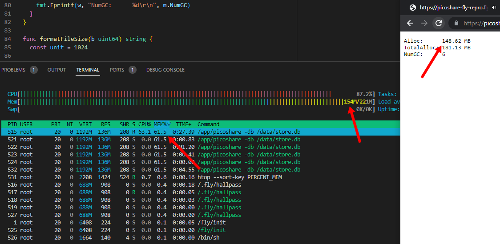
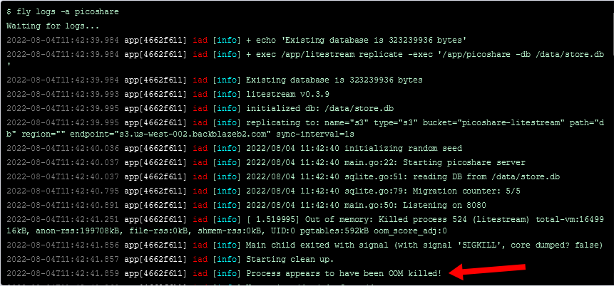
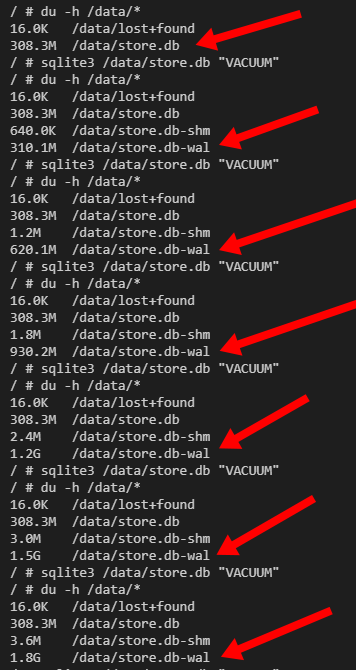
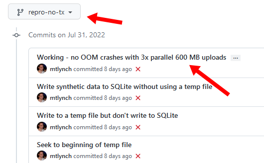

Earlier this year, I created an open-source app called [PicoShare](https://pico.rocks). It's a simple Golang web app for sharing files. I use it to send files that are too large to be email attachments, but I don't want the recipient to deal with Dropbox or Google Drive.


A few months ago, I started seeing my PicoShare server die every few days. When I checked the logs, I saw an out of memory error:

{{}}

I didn't have time to debug the crash, so I just increased the server's memory from 512 MB to 1 GB. And then I kept seeing crashes, so I increased it again to 2 GB.

It's unsatisfying to fix a crash by just throwing more RAM at the problems, so for the past two weeks, I've been debugging the crashes and sharing my progress on Twitter.



At this point, I've fixed all the issues that were causing crashes and learned some useful lessons along the way about Go, SQLite, and debugging.

If you want to see the story as it unfolded, check out the Twitter thread. If you'd like a cleaned up, condensed version of what I learned, read on.

## Contents

- [Background](#preface-i-use-sqlite-strangely)
- [The debugging process](#the-debugging-process)
- [Other lessons learned](#other-lessons-learned)
- [Dead ends](#dead-ends)

## Preface: I use SQLite strangely

One of the strange architecture decisions I made with PicoShare was to store all file data in SQLite. This is an unusual choice, as web applications typically store file uploads directly on the filesystem, not in a database. This especially true when the uploads can be arbitrarily large.

The advantage of writing file data to SQLite is that all of PicoShare's application state is in a single database. That's not so special itself, but I designed PicoShare to integrate with [Litestream](https://litestream.io), a tool for replicating SQLite databases to cloud storage. Litestream essentially gives PicoShare backup and restore "for free." I can completely blow away a server and then [redeploy it anywhere](/litestream/) (even another cloud hosting provider), and PicoShare will wake up with the exact same state, serving all the same files.

## The debugging process

### Reproducing the error

I only saw PicoShare crash every few days, so my first step was to find a way to force the crash more quickly.

I managed to reproduce the error by deploying PicoShare on a [Fly](https://fly.io) instance with only 256 MB of RAM and then uploading large files. I used [high-resolution versions](https://mirror.clarkson.edu/blender/demo/movies/BBB/) of the short film [_Big Buck Bunny_](https://peach.blender.org/) with sizes ranging from 269 MB to 618 MB.

{{}}

Uploading two copies of the 618 MB version in parallel consistently caused PicoShare to die with an out of memory error within a minute or so.

### Using profiling tools to identify RAM bloat

The first break in the investigation came from [Ben Johnson](https://twitter.com/benbjohnson), the author of Litestream and a recent addition to the Fly team. Ben created [a detailed pull request](https://github.com/mtlynch/picoshare/pull/283) explaining how a single line of code was causing PicoShare to consume large amounts of RAM.

Ben has extensive experience with profiling, so he was able to reproduce the issue by creating a new unit test and profiling memory after the test. Ben later showed me an easier way to get the same information, so I'm going to show that, but you can find Ben's original technique in his pull request.

It turns out the Go standard library comes with a magical tool for debugging issues in web applications. All you have to do is add this line to your imports:

```golang
_ "net/http/pprof"
```

Now, when you run your app, there will be a `/debug/pprof/` route with lots of useful debugging information.

{{}}

I was surprised at how easy this was to add. There's a lot of interesting data in this web interface, but the one that I used was `heap`. To use it, I uploaded a large file to PicoShare and then ran this the following command:

```bash
go tool pprof \
  -http=:8081 \
  -alloc_space \
  call_tree \
  http://localhost:4001/debug/pprof/heap
```

That popped up a web interface and rendered this graph:

{{}}

At the bottom, you can see a large red block labeled `bytes makeSlice 63.99 MB`, meaning that 64 MB of PicoShare's allocated RAM came from Go's `makeSlice` function.

`makeSlice` is in the Go standard library, not my code. To find what code in PicoShare caused this memory allocation, I traced up the graph until I found a PicoShare function:

{{}}

The last PicoShare function in this chain is [`handlers.fileFromRequest`](https://github.com/mtlynch/picoshare/blob/1.1.7/handlers/upload.go#L242), which calls the Go standard library function [`*Request.ParseMultipartForm`](https://pkg.go.dev/net/http@go1.18.4#Request.ParseMultipartForm). That function is responsible for parsing multipart HTTP data, which is how PicoShare accepts file uploads.

`ParseMultipartForm` accepts a `maxMemory` parameter, documented as follows:

> The whole request body is parsed and up to a total of maxMemory bytes of its file parts are stored in memory, with the remainder stored on disk in temporary files.

PicoShare's call looked like this:

```golang
r.ParseMultipartForm(32 << 20) // 32 MB
```

Even though we were specifying a limit of 32 MB, Go was allocating 64 MB of RAM.

Ben tried reducing the `maxMemory` parameter to `1 << 20` (1 MB), and the RAM usage from `ParseMultipartForm` dropped to only 2.5 MB:

{{}}

This was a huge reduction in memory, so I thought for sure Ben had solved it.

Unfortunately, I deployed a test version with Ben's fix, and it still crashed.

After Ben's fix, PicoShare could withstand more load before crashing, so it did seem to make a difference. Still, when I uploaded three large files in parallel, the server died with the same out of memory error.

### Freeing resources after calling `ParseMultipartForm`

From Googling, I discovered another gotcha with `ParseMultipartForm`.

The documentation doesn't warn the reader, but the caller is responsible for calling `r.MultipartForm.RemoveAll()` to free the resources Go allocated during `ParseMultipartForm`. So, I was leaking memory every time I called `ParseMultipartForm`.


**Update (2022-08-11)**: Damien Neil points out in the comments that Go should clean up these resources automatically. On Go's HTTP/1 implementation, it automatically cleans up resources, and Damien has [submitted a bugfix](https://go.dev/cl/423055) to make Go's HTTP/2 implementation behave consistently.


To fix the leak, I rewrote my code to clean up the multipart resources:

```golang
multipartMaxMemory := 1 << 20 // 1 MiB
if err := r.ParseMultipartForm(multipartMaxMemory); err != nil {
  return err
}
// Free form resources before returning from function.
defer func() {
  if err := r.MultipartForm.RemoveAll(); err != nil {
    log.Printf("failed to free multipart form resources: %v", err)
  }
}()
```

This fix looked promising, as I saw huge reductions in RAM usage on Fly after freeing resources explicitly:

{{}}

Sadly, even with this fix, the crashes continued.

### Optimizing downloads

At this point, [Dan Wilhelm](https://danwilhelm.com/) started following the Twitter thread. Even though he's never used Go a day in his life, he rolled up his sleeves and started experimenting with the code on his development machine.

Dan noticed that [RAM usage shot up when he downloaded files](https://github.com/mtlynch/picoshare/issues/284). That was strange, as downloads shouldn't consume much RAM. Parsing a multipart form is complex, so there are many factors that could be bloating RAM, but serving a file is pretty straightforward.

PicoShare stores all of its file data in SQLite in [328 KB chunks](https://github.com/mtlynch/picoshare/blob/1.1.7/store/sqlite/sqlite.go#L22). That shouldn't be RAM intensive because we should be able to just read some chunks into RAM, send them to the client, then free the memory.

Dan found a bug in the code responsible for reading PicoShare's file data from the database. See if you can spot it:

```golang
func (fr *fileReader) populateBuffer() error {
  if fr.offset == int64(fr.fileLength) {
    return io.EOF
  }

  startChunk := fr.offset / int64(fr.chunkSize)
  stmt, err := fr.db.Prepare(`
      SELECT
        chunk
      FROM
        entries_data
      WHERE
        id=? AND
        chunk_index>=?
      ORDER BY
        chunk_index ASC
      `)
  if err != nil {
    log.Printf("reading chunk failed: %v", err)
    return err
  }
  defer stmt.Close()

  var chunk []byte
  err = stmt.QueryRow(fr.entryID, startChunk).Scan(&chunk)
  if err != nil {
    return err
  }

  // Move the start index to the position in the chunk we want to read.
  readStart := fr.offset % int64(fr.chunkSize)

  fr.buf = bytes.NewBuffer(chunk[readStart:])
  fr.offset += int64(len(chunk)) - readStart

  return nil
}
```

The bug is in the `WHERE` clause of the SQL query:

```sql
WHERE
    id=? AND
    chunk_index>=?
```

The query is only supposed to retrieve a single chunk of file data. Instead, it reads the target chunk and everything after.

The fix was simply to change the `>=` to `=`:

```sql
WHERE
    id=? AND
    chunk_index=?
```


**Sidenote**: Reading this code, I also realized I was using prepared statements [when I didn't need to](https://github.com/mtlynch/picoshare/pull/286), though I don't think this affected RAM.


Dan's change was on the download side, so I didn't expect it to fix crashes I saw during upload. And indeed it didn't, but there was a drastic performance improvement in serving downloads. Especially with streaming content like videos or audio, PicoShare was much more responsive when I jumped to different positions in the file.

### Removing SQLite transactions

Within the Twitter thread, several people suggested that PicoShare's SQLite transactions were likely bloating RAM.

When PicoShare wrote file data into SQLite, I did it within a [transaction](https://www.sqlite.org/lang_transaction.html). The purpose was to ensure the database was always in a consistent state.

By using transactions, SQLite guaranteed that I would never reach a state where only part of the file was in the database if some writes failed. It also ensured that I couldn't accidentally write the file metadata without writing the file contents and vice-versa.

Some Googling indicated that [large SQLite transactions can be a source of memory bloat](https://stackoverflow.com/a/15305650/90388), so I figured it was worth trying. I tried committing changes to SQLite immediately instead of using transactions, but it still bloated RAM. It didn't seem like transactions were making any difference.

### RAM bloat is fine, but crashes are not

At this point, I was measuring RAM usage from three different angles that all disagreed with each other:

- Go's debug metrics for how much memory it had allocated
- `htop` within in the VM
- Fly's RAM metrics from the VM host


{{}}
{{}}


In particular, Fly's metrics would frequently show RAM maxed out when Go and `htop` showed barely any usage. It was frustrating to debug because the further I drilled down, the further RAM measurements diverged from the crash behavior I was observing.

The game-changing insight came from Andrew Ayer, who pointed out that RAM bloat was likely a red herring:



Kurt Mackey, Fly's CEO, popped into the thread to confirm Andrew's hypothesis:

{{}}

So, Fly's memory metrics included the page cache, but the VM should reclaim that RAM if running applications needed it.

This was a huge realization. Because of the difficulty of causing out of memory crashes, I'd used RAM bloat as an approximation for the crashes. But RAM bloat is fine as long as the VM still has enough memory to keep my processes running.

I had to reevaluate everything now. When I dismissed other fixes, had it been because they caused harmless RAM bloat? Or did I observe actual crashes?

### Re-examining SQLite transactions

Given what Andrew Ayer said about RAM bloat, I revisited PicoShare's SQLite transactions. When I tried the implementation with no transactions, did I see crashes or just RAM bloat? I couldn't remember.

I tried running the transactionless implementation again. Sure enough, RAM bloated but PicoShare kept running. I uploaded three 618 MB files in parallel, and every upload succeeded with PicoShare continuing to serve HTTP requests.

{{}}

It worked! I'd finally gotten to the bottom of the performance issues.

Or so I thought...

I left my server running overnight, and when I checked it the next morning, it had failed with the same out of memory crash.

{{}}

### Eliminating SQLite vacuuming

I immediately suspected that the overnight crash was related to the [SQLite `VACUUM` command](https://www.sqlite.org/lang_vacuum.html), which compresses the database file to reclaim unused disk space.

Nobody was using the PicoShare server when it crashed, but it did line up with PicoShare's scheduled database maintenance. Every seven hours, PicoShare removes expired entries from the database and performs a `VACUUM` to reclaim unused disk space.

I tested running the `VACUUM` command on my server and saw that it did indeed reduce the size of my main `.db` file, but it was increasing the size of the [SQLite write-ahead log](https://sqlite.org/wal.html).

{{}}

At this point, Ben asked me why I need to `VACUUM` at all:



Yeah, why _am_ I doing that?

When I first launched PicoShare, users complained that it wasn't giving back disk space after they deleted files. It didn't affect me because I run PicoShare on a Fly VM with a fixed disk volume, so it doesn't matter how much of the disk I use. But it was easy enough to add in the periodic `VACUUM`, [so I did](https://github.com/mtlynch/picoshare/pull/212).

After thinking it over, I decided to change PicoShare's behavior so that `VACUUM` is off by default, but users can enable it [with a command-line flag](https://github.com/mtlynch/picoshare#command-line-flags).

```golang
dbPath := flag.String("db", "data/store.db", "path to database")
vacuumDb := flag.Bool("vacuum", false, "vacuum database periodically to reclaim disk space")
flag.Parse()
```

### Success: PicoShare running on 256 MB of RAM

With `VACUUM` disabled by default and my other performance fixes in place, PicoShare was finally running stable with low RAM.

I ran PicoShare for 24 hours without any crashes on a Fly VM with just 256 MB of RAM.

{{}}

{{}}

## Other lessons learned

In addition to what I learned above, I also picked up some useful side lessons in this debugging quest.

### Optimize your build-test loop

One thing I wish I'd done earlier was to optimize my build-test loop. To test any hypothesis, my process was:

1. Deploy my changes to Fly (2-3 minutes)
1. Upload a large file (1-2 minutes)
1. Wait for Fly's RAM metrics to catch up (30-60 seconds)

So, that's up to six minutes just to test any change, and each step required manual work. And that's not even counting time to write the code changes.

I had originally tried running PicoShare in a Docker container with limited RAM, but it never crashed.

```bash
RAM_LIMIT="64m"
PORT=3001
PS_SHARED_SECRET="somesecretpass"

docker run \
  --memory "${RAM_LIMIT}" \
  --env "PORT=${PORT}" \
  --env "PS_SHARED_SECRET=${PS_SHARED_SECRET}" \
  --publish "${PORT}:${PORT}/tcp" \
  --name picoshare \
  mtlynch/picoshare:1.1.7
```

```bash
$ docker stats
CONTAINER ID   NAME        CPU %     MEM USAGE / LIMIT   MEM %     NET I/O         BLOCK I/O        PIDS
1ababd398113   picoshare   3.82%     63.68MiB / 64MiB    99.50%    278MB / 208MB   6.09GB / 7.1MB   21
```

I still don't understand why PicoShare behaves differently under Docker than a real VM, but my best guess is that Docker isn't really restricting RAM usage as tightly as a VM.

When Dan Wilhelm reported how much progress he'd made by running PicoShare locally and observing RAM usage, it made me realize how much time I was wasting by deploying to Fly for every change. I tried running PicoShare on my home VM server, but it never crashed or bloated RAM the way it did on Fly.

What eventually worked was [creating my own development environment on Fly](https://github.com/mtlynch/picoshare-fly-debug). I wrote a [Dockerfile](https://github.com/mtlynch/picoshare-fly-debug/blob/4779b55500e59ac984e9f9abc379bfd7f3ace43a/Dockerfile) that had the PicoShare source and some dev tools and deployed that to Fly. From there, I could use `fly ssh console` to open a shell on my server and then test code changes quickly.

It still wasn't super fast because there's about 30 seconds of latency before Fly's RAM metrics update, but it was a big improvement over having to deploy each change from scratch.

### Use descriptive git branches and commit messages to record notes

One useful technique I discovered during this investigation was to test each hypothesis in its own git branch and then record the results with a commit message:

{{}}

With so many different hypotheses flying around, it was difficult to remember what state the code was in when I tested each idea. For example, at one point, I was seeing crashes due to a new bug I had introduced while debugging:



Having a record of what state the code was in and what I did to test it helped me organize my thoughts and avoid duplicating effort.

### Go's measurement tools can't see memory allocations in cgo

One of my earliest debugging steps was adding a page to PicoShare that showed some of the RAM metrics from `runtime.ReadMemStats` (I later realized that `net/http/pprof` [did this better](#using-profiling-tools-to-identify-ram-bloat)).

{{}}

James Tucker pointed out that this measurement would exclude any resources I allocated through cgo:



I was indeed using SQLite via cgo. PicoShare uses [mattn/go-sqlite3](https://github.com/mattn/go-sqlite3), the most popular SQLite library for Go.

And it makes sense that using cgo prevents Go from showing accurate performance metrics. If you're using Go to call external C code, Go can't track resources in the external code.

To work around this, I tried using [modernc.org/sqlite](https://pkg.go.dev/modernc.org/sqlite), a pure Go implementation of SQLite. But for whatever reason, I couldn't see resource leaks with pure Go code either.

### Fly has a crazy fast disk performance

At one point, commenters on Twitter suggested that I might be exhausting RAM with disk writes. If PicoShare was writing to the Fly VM's disk faster than the disk could write the data to physical media, the data would get queued in RAM.

To test this theory, I used the `fio` disk benchmarking utility, which I'd never used before. I thought I was using the tool wrong, because it reported write speeds of 3353 MB/s, which seemed impossibly fast for a cloud VM. For context, that's about 30 times faster than when I tried the same test on [my home NAS server](/budget-nas/).

Kurt Mackey confirmed that the measurements were likely correct because Fly's local disks are Enterprise NVMe drives:



## Dead ends

As much as I wish my investigation was an exercise of strictly increasing progress, I took lots of wrong turns and followed hypotheses that led nowhere. Here are some of those dead ends.

### Blaming Litestream

The first rule of debugging is to assume the problem is in your code. But I broke that rule here, partially because I dreaded how much work it would be to chase down these bugs.

That said, there were legitimate reasons to suspect Litestream. Even though PicoShare uses SQLite in a strange way, storing 1 GB of data in SQLite isn't _that_ strange. Litestream is relatively new and uses SQLite in novel ways, so it wasn't too big a leap to imagine the crashes were coming from Litestream.

Even though I suspected Litestream, I didn't want to create more work for Ben Johnson, Litestream's maintainer. I knew PicoShare was an unusual use case for Litestream, and I didn't have a simple repro to isolate the problem.

But then in May, [Fly acquired Litestream](https://fly.io/blog/all-in-on-sqlite-litestream/) and hired Ben to maintain it. Now seemed like the perfect time to bother Ben with this as it concerned both Litestream and Fly!

I [filed a bug on Litestream](https://github.com/benbjohnson/litestream/issues/403) explaining what I'd tried and why I thought the problem was related to Litestream. And then 15 minutes later, I managed to crash PicoShare with Litestream disabled, so I closed the bug.

That said, filing the issue against Litestream was useful because it forced me to approach the problem rigorously enough to write a detailed bug report. And it also piqued Ben's curiosity, leading him to offer lots of useful advice even after it was clear Litestream wasn't the cause.

### Blaming Fly

When I couldn't reproduce the crashes on my local VMs or under Docker, I started to suspect that the problem was on Fly's end. It seemed unlikely because I wasn't doing anything very exotic, so it would be strange if none of Fly's other users had noticed their deployments dying from RAM starvation.

Still, I wanted to eliminate Fly as a possibility. I deployed PicoShare to [Lightsail](https://aws.amazon.com/lightsail/), Amazon's managed Docker container service. They don't have a 256 MB RAM option, so I deployed to a 512 MB instance. Within a few minutes, I was able to reproduce the crash there, eliminating Fly as the culprit:



### /tmp is not a RAMdisk

In the Twitter thread, a few commenters suggested that Fly might be mounting its temporary directory as a RAM disk. Go's `ParseMultipartForm` function keeps file uploads in the temporary directory, so if Fly mounted the temp directory as a RAM disk, that would explain why regular file uploads exhausted RAM.

But when I ran `lblk`, I didn't see any indications that `/tmp` or any other temp directory was a RAM disk. The system just seemed to have regular disks:

```bash
$ lsblk
NAME MAJ:MIN RM SIZE RO TYPE MOUNTPOINTS
vda  254:0   0  128M  0 disk
vdb  254:16  0    8G  0 disk /
$ du -h /tmp/*
149.3M /tmp/multipart-338465586
7.66 /tmp/test1
```

### Writing a hand-crafted multipart form reader

It was a red flag that the Go standard library `ParseMultipartForm` function seeming to consume more memory than its documented limit. I also noticed that if I called `ParseMultipartForm` and discarded the bytes, it also maxed out RAM.

To see if I could work around issues in `ParseMultipartForm`, I tried [writing my own artisanal hand-crafted multipart reader](https://github.com/mtlynch/picoshare/blob/850b9fa50b9c92c060c9267d22194badb15d11b6/handlers/upload.go#L247L322) for my specific scenario.

Sadly, my multipart reader performed no better than the standard library, but it was fun to play around with multipart data at a lower level.

### Throttling uploads

I was curious if uploading data more slowly would have any effect on RAM. I tried throttling uploads from the client end by setting Chrome to simulate 3G speeds, but PicoShare had the same behavior.

I also tried throttling at the server end to reduce speed of writing to disk, but that didn't do anything either.

I did learn how easy it is to throttle I/O in Go. If you're working with an [`io.Reader` interface](https://pkg.go.dev/io#Reader), you can just wrap a `Reader` with a throttled reader like this:

```golang
import "github.com/juju/ratelimit"

...

throttleRate := 1 << 20 // 1 MB
bucket := ratelimit.NewBucketWithRate(float64(throttleRate), throttleRate)
throttledReader := ratelimit.Reader(reader, bucket)

w := file.NewWriter(tx, metadata.ID, d.chunkSize)
if _, err := io.Copy(w, throttledReader); err != nil {
  return err
}
```

## PicoShare 1.2.0

Over the weekend, I published PicoShare's [1.2.0 release](https://github.com/mtlynch/picoshare/releases/tag/1.2.0), which includes fixes for all the performance issues I discovered through this investigation.

## Acknowledgments

A big thanks to everyone who helped me investigate this issue, but a special thanks to a few people who went above and beyond:

- [Ben Johnson](https://twitter.com/benbjohnson)
- [Dan Wilhelm](https://danwilhelm.com/)
- [Andrew Ayer](https://www.agwa.name/)
- [James Tucker](https://twitter.com/raggi)
- [Kurt Mackey](https://twitter.com/mrkurt)
- [Andrew Johnston](https://billywhizz.io/)
- [Phil Eaton](https://notes.eatonphil.com/)
