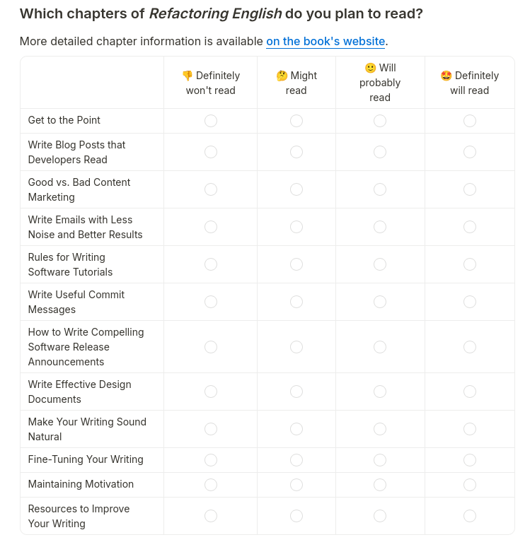

## The survey

I was curious about how well my planned chapters match what readers of my book are interested in learning. I sent a survey to 1,644 people who had either purchased early access or subscribed to my mailing list for free updates and previews of the book. 265 of the 1,644 (16%) had purchased early access.

Readers could rate each chapter on a scale from "Definitely won't read" to "Definitely will read":

{{}}

Here are the results:

  

    <canvas id="aggregateChart"></canvas>
  

  

    

      

        <label class="control-label" for="aggregateOrderBy">Order by:</label>
        <select id="aggregateOrderBy" class="styled-select">
          <option value="most-interested">Definitely will read</option>
          <option value="definitely-probably">Definitely will read + Will probably read</option>
          <option value="will-read-any">Will read (any confidence)</option>
          <option value="most-disinterested">Definitely won't read</option>
        </select>
      

    

  

## Paid readers only

  

    <canvas id="paidOnlyChart"></canvas>
  

  

    

      

        <label class="control-label" for="paidOrderBy">Order by:</label>
        <select id="paidOrderBy" class="styled-select">
          <option value="most-interested">Definitely will read</option>
          <option value="definitely-probably">Definitely will read + Will probably read</option>
          <option value="will-read-any">Will read (any confidence)</option>
          <option value="most-disinterested">Definitely won't read</option>
        </select>
      

    

  

## Unpaid readers only

  

    <canvas id="unpaidOnlyChart"></canvas>
  

  

    

      

        <label class="control-label" for="unpaidOrderBy">Order by:</label>
        <select id="unpaidOrderBy" class="styled-select">
          <option value="most-interested">Definitely will read</option>
          <option value="definitely-probably">Definitely will read + Will probably read</option>
          <option value="will-read-any">Will read (any confidence)</option>
          <option value="most-disinterested">Definitely won't read</option>
        </select>
      

    

  

But I noticed an interesting result when I segregated the result based on whether the reader had paid for early access or not:

  

    <canvas id="chapterFeedbackChart"></canvas>
  

  

    

      

        <label class="control-label" for="readerType">Reader type:</label>
        <select id="readerType" class="styled-select">
          <option value="both">Show both</option>
          <option value="paid">Show only paid early access readers</option>
          <option value="unpaid">Show only free mailing list subscribers</option>
        </select>
      

      

        <label class="control-label" for="sortOrder">Order by:</label>
        <select id="sortOrder" class="styled-select">
          <option value="chapter-order">Current chapter order</option>
          <option value="most-interested-paid">Most interested, paid readers</option>
          <option value="least-interested-paid">Most disinterested, paid readers</option>
          <option value="most-interested-unpaid">Most interested, unpaid readers</option>
          <option value="least-interested-unpaid">Most disinterested, unpaid readers</option>
        </select>
      

    

  

## Which chapters excite paid readers more than free readers?

  

    <canvas id="gapAnalysisChart"></canvas>
  

## Which chapters bore paid readers more than free readers?

  

    <canvas id="disinterestChart"></canvas>
  

