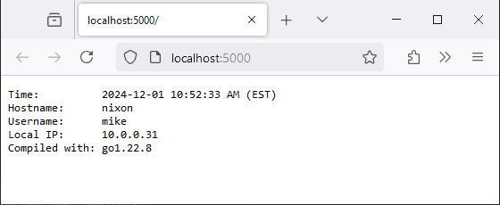

I have a few toy utility apps that I run 24/7 on cloud infrastructure. One example is [PicoShare](https://github.com/mtlynch/picoshare), a simple utility that makes it easy for me to share files with friends and teammates.

There are several convenience apps I _would_ run if it were easy to run them constantly. But there's enough friction to running even a simple app 24/7 that I don't do it.

I've tried running toy apps in the past. I've set up cron jobs and systemd services to run the services all the time, but inevitably something breaks, and I get tired of fixing it and just let the service die.

I think I've finally found a low-friction way of hosting personal apps that keeps them constantly available while minimizing my overhead in maintaining them: NixOS modules.

## What my solution lets me do

- I can create a new web service, and it's less than 15 minutes of work to run it 24/7 on my NixOS server.
- I can upgrade/downgrade or change configuration options by changing a line of code and running a rebuild command.
- I can run apps with conflicting dependencies (e.g., Python 2 and Python 3) on the same server and do zero work to avoid conflicts.

## Why NixOS?

NixOS let me define my entire system configuration in code, and it keeps the system in that state.

I can add a new service to any of my NixOS servers with just a few lines of code.

### But isn't Nix complicated?

Yes, Nix is complicated, but it's more approachable than you might think.

I've been learning little bits of Nix over the past year, and I've found that you can learn useful techniques for Nix without understanding the whole thing. For example, I use Nix to [set up per-project development environments](/notes/nix-dev-environment/), and I didn't have to understand a ton about Nix to make that work.

I'd put NixOS modules at intermediate difficulty, but I think once you've seen an example, it's relatively easy to replicate.

### Why not Ansible?

I used to think Ansible was a brilliant solution for running services 24/7.

For years, I maintained a set of VMs for various projects, and I used Ansible to configure them.

The first problem is that Ansible is slow. Every time you add a new service to a server, it takes longer to run Ansible against it. I had not-so-complicated servers where applying configuration took 10+ minutes every time. On Nix, minor configuration changes happen in seconds, and longer ones take about 30 seconds.

I also ran into version conflicts under Ansible. If one service depends on Python 2 and another depends on Python 3.7 and another depends on Python 3.10, you're going to have a hard time making sure each app uses the correct version of Python on the system, and the different versions will try to overwrite the same files (like `/usr/bin/python3`).

### Why not Docker?

I've tried running services under Docker, and it works okay.

One big disadvantage to Docker is that it's unfriendly to development. With NixOS and Ansible, you can mostly reuse the packaging code for your development work. There are ways that you can do development within a Docker container, but that's not what Docker is designed for, so you'd be fighting the tool a bit. Instead, I always end up defining my Docker image redundantly to how I set up my development environment.

I also find that Docker gets harder to use when you have more than one running process. For example, if you have a web app that depends on Postgres, now you have two Docker containers, and it gets a bit harder to manage.

I've seen solutions like Podman, Rancher, and k3s, but I've never used them. They seem like too much extra complexity, but maybe they're easier than I expect.

## NixOS requirements

To follow along, you'll need a NixOS system with flakes enabled. I used NixOS 24.05.

I wrote tutorials for installing NixOS [on a Raspberry Pi 4](/nixos-pi4/) or [under Proxmox as a VM](/notes/nixos-proxmox/).

## A basic demo microservice

Okay, with the explanation out of the way, I'll show how I created my first NixOS module and got it to run as a microservice on my home server.

Create a file called `main.go` that defines a simple Go web service:

```go
package main

import (
	"errors"
	"fmt"
	"log"
	"net"
	"net/http"
	"os"
	"os/user"
	"runtime"
	"time"
)

func handler(w http.ResponseWriter, r *http.Request) {
	hostname, err := os.Hostname()
	if err != nil {
		log.Fatalf("failed to get hostname: %v", err)
	}
	currentUser, err := user.Current()
	if err != nil {
		log.Fatalf("failed to get username: %v", err)
	}
	localIP, err := getLocalIP()
	if err != nil {
		log.Fatalf("failed to get local IP: %v", err)
	}

	fmt.Fprintf(w, "Time:          %s\n", getFormattedTime())
	fmt.Fprintf(w, "Hostname:      %s\n", hostname)
	fmt.Fprintf(w, "Username:      %s\n", currentUser.Username)
	fmt.Fprintf(w, "Local IP:      %s\n", localIP.String())
	fmt.Fprintf(w, "Compiled with: %s\n", runtime.Version())
}

func getLocalIP() (net.IP, error) {
	addrs, err := net.InterfaceAddrs()
	if err != nil {
		return net.IP{}, err
	}
	for _, addr := range addrs {
		if ipnet, ok := addr.(*net.IPNet); ok && !ipnet.IP.IsLoopback() {
			if ipnet.IP.To4() != nil {
				return ipnet.IP, nil
			}
		}
	}

	return net.IP{}, errors.New("no local IP address found")
}

func getFormattedTime() string {
	now := time.Now()
	zone, _ := now.Zone()
	return now.Format("2006-01-02 03:04:05 PM") + fmt.Sprintf(" (%s)", zone)
}

func main() {
	port := os.Getenv("PORT")
	if port == "" {
		port = "8080"
	}

	http.HandleFunc("/", handler)
	fmt.Printf("listening on :%s\n", port)
	log.Fatal(http.ListenAndServe(":"+port, nil))
}
```

I run the service like this:

```bash
$ nix-shell -p go --command 'PORT=5000 go run main.go'
listening on :5000
```

And from another terminal, I can call the service with `curl`:

```bash
$ curl http://localhost:5000
Time:          2024-12-01 10:51:34 AM (EST)
Hostname:      nixon
Username:      mike
Local IP:      10.0.0.31
Compiled with: go1.22.8
```

I can also view the service in a web browser:

{{}}

The service is deliberately simple and kind of boring because I want to focus on the NixOS packaging part.

## Create a simple Go module

Next, create a Go module for this app, as Nix will need it to build:

```bash
$ nix-shell -p go --command 'go mod init gitlab.com/mtlynch/basic-go-web-app'
go: creating new go.mod: module gitlab.com/mtlynch/basic-go-web-app
go: to add module requirements and sums:
        go mod tidy
```

That creates a file called `go.mod` with the following contents:

```bash
$ cat go.mod
module gitlab.com/mtlynch/basic-go-web-app

go 1.22.8
```

## Create a basic Nix flake

Now, I'm going to create a Nix flake that builds and runs this app under Nix. Add the following to a file called `flake.nix`:

```nix
{
  description = "Basic Go web app";

  inputs = {
    # 1.23.2 release
    go-nixpkgs.url = "github:NixOS/nixpkgs/4ae2e647537bcdbb82265469442713d066675275";

    flake-utils.url = "github:numtide/flake-utils";
  };

  outputs = { self, go-nixpkgs, flake-utils }:
    flake-utils.lib.eachDefaultSystem (system: let
      gopkg = go-nixpkgs.legacyPackages.${system};
    in {
      packages.default = gopkg.buildGoModule {
        pname = "basic-go-web-app";
        version = "0.1.0";
        src = ./.;
        vendorHash = null;
      };

      apps.default = {
        type = "app";
        program = "${self.packages.${system}.default}/bin/basic-go-web-app";
      };
    });
}
```

With the flake, I can how run my app under Nix:

```bash
$ PORT=5000 nix run
listening on :5000
```

Again, I can call my service using curl:

```bash
$ curl http://localhost:5000
Time:          2024-12-01 10:14:49 AM (EST)
Hostname:      nixon
Username:      mike
Local IP:      10.0.0.31
Compiled with: go1.23.2
```

Note that the flake version reports that it was compiled with `go1.23.2` whereas the `nix-shell` version reported `go1.22.8`. That's because in the `go-nixpkgs` line, I [specified the `gopkgs` version](/notes/nix-dev-environment/#finding-version-strings) that corresponds to go 1.23.2, as I like to pin exact versions.

## Add a NixOS module to the Nix flake

It would be a pain if I had to execute `nix run` for this service every time I restarted my NixOS system. My goal is for the service to run automatically in the background without me having to do anything or manage it. That's where the NixOS module comes in.

Adjust `flake.nix` to define a NixOS module:

```nix
{
  description = "Basic Go web app";

  inputs = {
    # 1.23.2 release
    go-nixpkgs.url = "github:NixOS/nixpkgs/4ae2e647537bcdbb82265469442713d066675275";

    flake-utils.url = "github:numtide/flake-utils";
  };

  outputs = {
    self,
    go-nixpkgs,
    flake-utils,
  }: let
    nixosModule = {
      config,
      lib,
      pkgs,
      ...
    }: {
      options.services.basic-go-web-app = {
        enable = lib.mkEnableOption "Basic Go web app service";

        port = lib.mkOption {
          type = lib.types.port;
          default = 8080;
          description = "Port to listen on";
        };
      };

      config = lib.mkIf config.services.basic-go-web-app.enable {
        systemd.services.basic-go-web-app = {
          description = "Basic Go Web App Service";
          wantedBy = ["multi-user.target"];
          after = ["network.target"];
          serviceConfig = {
            ExecStart = "${self.packages.${pkgs.system}.default}/bin/basic-go-web-app";
            Restart = "always";
            Type = "simple";
            DynamicUser = "yes";
          };
          environment = {
            PORT = toString config.services.basic-go-web-app.port;
          };
        };
      };
    };
  in
    (flake-utils.lib.eachDefaultSystem (system: let
      gopkg = go-nixpkgs.legacyPackages.${system};
    in {
      packages.default = gopkg.buildGoModule {
        pname = "basic-go-web-app";
        version = "0.1.0";
        src = ./.;
        vendorHash = null;
      };

      apps.default = {
        type = "app";
        program = "${self.packages.${system}.default}/bin/basic-go-web-app";
      };
    }))
    // {
      nixosModules.default = nixosModule;
    };
}
```

Now, there's a lot going on in this Nix flake. I'll break it down below.

### Defining NixOS module options

First, I defined the options for my NixOS module. There are only two:

```nix
{
  ...
  options.services.basic-go-web-app = {
    enable = lib.mkEnableOption "Enable basic-go-web-app service";

    port = lib.mkOption {
      type = lib.types.port;
      default = 8080;
      description = "Port to listen on";
    };
  };
```

That means that NixOS systems can import and turn this service on by adding lines like this to their NixOS config:

```nix
{
  services.basic-go-web-app = {
    enable = true;
    port = 3000;
  };
}
```

### Defining the systemd configuration

I use systemd to run my web app continuously in the background. When a NixOS system enables `basic-go-web-app`, it creates a systemd service for my app:

```nix
{
  ...
  config = lib.mkIf config.services.basic-go-web-app.enable {
    systemd.services.basic-go-web-app = {
      description = "Basic Go Web App Service";
      wantedBy = ["multi-user.target"];
      after = ["network.target"];
      serviceConfig = {
        ExecStart = "${self.packages.${pkgs.system}.default}/bin/basic-go-web-app";
        Restart = "always";
        Type = "simple";
        DynamicUser = "yes";
      };
      environment = {
        PORT = toString config.services.basic-go-web-app.port;
      };
    };
  };
```

The `ExecStart` line specifies the location of the `basic-go-web-app`

### Exporting the NixOS module

Finally, at the end, I export the NixOS module so that NixOS systems can import it:

```nix
{
  ...
  nixosModules.default = nixosModule;
```

## Install the NixOS module

Now, in my server's root `flake.nix`, I import the `basic-go-web-app` NixOS module and pass it to my host (`nixon`) like this:

```nix
{
  inputs = {
    nixpkgs.url = "github:nixos/nixpkgs/nixos-24.05";
    nixos-hardware.url = "github:NixOS/nixos-hardware";
    # Point this to wherever you placed basic-go-web-app's flake.nix.
    basic-go-web-app.url = "path:/home/mike/basic-go-web-app";
  };

  outputs = { nixpkgs, nixos-hardware, basic-go-web-app, ... }: {
    nixosConfigurations.nixon = nixpkgs.lib.nixosSystem {
      system = "x86_64-linux";
      specialArgs = {inherit inputs;};
      modules = [
        ./hosts/nixon
        basic-go-web-app.nixosModules.default
      ];
    };
  };
}
```

Then, in the Nix file for my host (located at `hosts/nixon/default.nix` in the same directory as my root flake), I have this:

```nix
{
  ...
}: {
  networking.hostName = "nixon";

  services.basic-go-web-app = {
    enable = true;
    port = 3000;
  };

  networking.firewall.allowedTCPPorts = [3000];

  system.stateVersion = "24.05";
}
```

Now, it's the moment of truth. It's time to rebuild my host with my `basic-go-web-app` NixOS module enabled:

```bash
sudo nixos-rebuild switch --flake ".#${HOSTNAME}"
```

That succeeded, so I'll check if my app is running:

```bash
$ curl localhost:3000
Time:          2024-12-01 10:28:46 AM (EST)
Hostname:      nixon
Username:      basic-go-web-app
Local IP:      10.0.0.31
Compiled with: go1.23.2
```

It's running! Note that now, it runs under the username `basic-go-web-app` instead of my dev username of `mike`.

```bash
$ journalctl -u basic-go-web-app
Dec 01 10:20:53 nixon systemd[1]: Started Basic Go Web App Service.
Dec 01 10:20:53 nixon basic-go-web-app[186195]: listening on :3000
```
