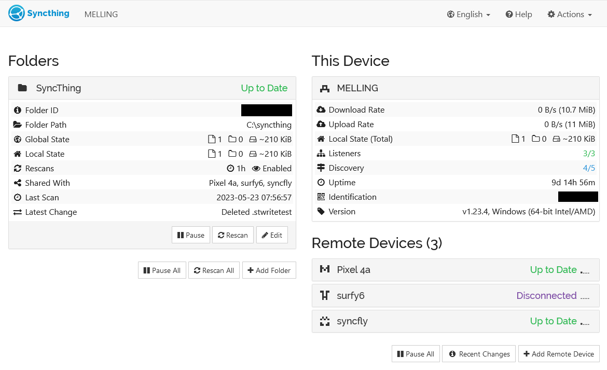
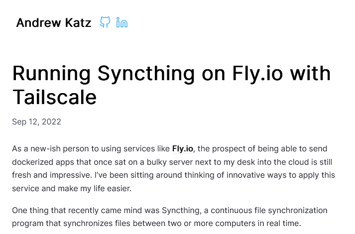
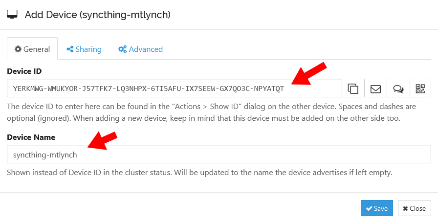
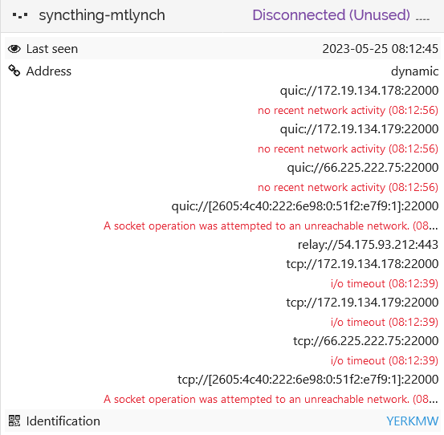
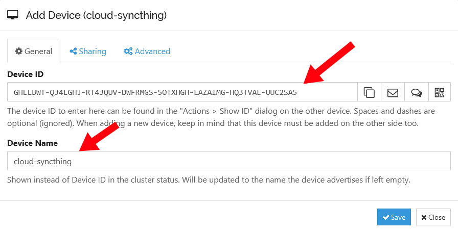
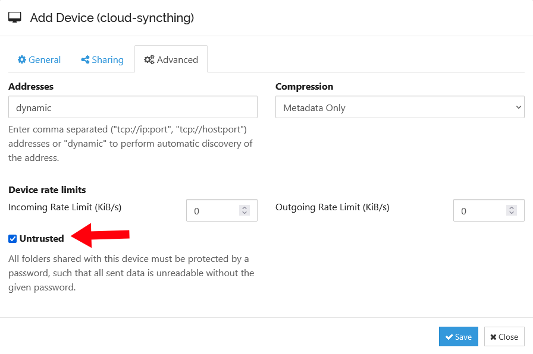
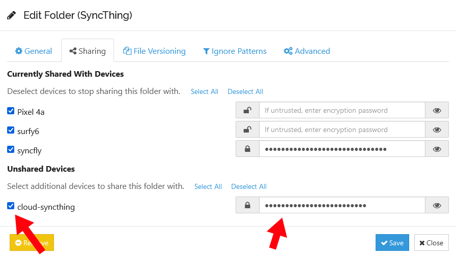
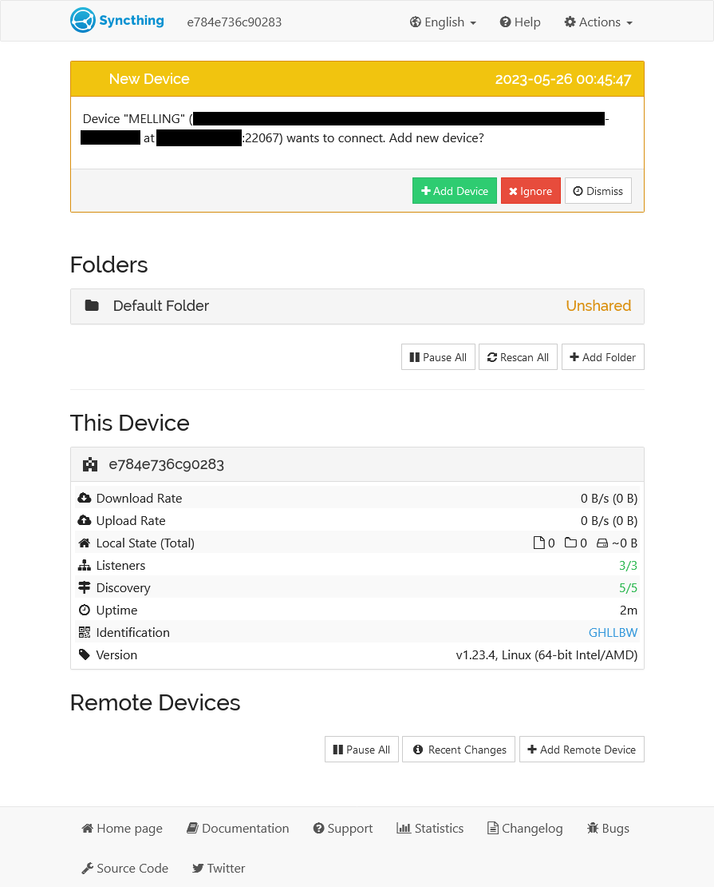

I recently discovered [Syncthing](https://syncthing.net/), an open-source tool for syncing files across multiple machines.

{{}}

Setting up Syncthing on my personal devices was easy, but I went on an interesting journey deploying it to a cloud server.

## Why run Syncthing in the cloud?

Syncthing synchronizes files peer to peer. That means that at least two of my devices have to be online and running Syncthing simultaneously to stay in sync. If I change a file on my desktop, shut down, and then take my laptop with me on a work trip, my laptop won't pick up the changes I made on my desktop.

If I had one Syncthing peer that was always online, then I'd never worry about my devices being out of sync because they weren't able to communicate directly.

## I don't want your life story &mdash; just tell me how to deploy Syncthing

I'm going to talk about some approaches that failed, but if you want to skip to the solution, see the section, ["How to deploy Syncthing to Fly"](#how-to-deploy-syncthing-to-flyio).

## Prior work: Syncthing + Tailscale on Fly

For the past two years, [Fly](https://fly.io) has been my preferred cloud hosting provider, so I checked if anyone had written about Syncthing on Fly. It turned out that [Andrew Katz had written a nice tutorial](https://akatz.org/posts/running-syncthing-on-flyio-with-tailscale/) less than a year ago.

{{}}

Andrew's tutorial was great news because it proved that my idea was feasible. One quibble I had was that Andrew's solution depended on Tailscale, a popular VPN solution. I love Tailscale, but it has some serious drawbacks in this context.

Combining Syncthing with Tailscale requires building and maintaining a custom Docker image that combines the two tools. And mixing together two applications in a single container is [a bit of a Docker no-no](https://docs.docker.com/develop/develop-images/dockerfile_best-practices/#decouple-applications).

All Fly servers include Wireguard VPN by default. I suspected that I could improve Andrew's solution by leaning on the Wireguard connection that was already there instead of mixing in Tailscale.

## The linuxserver Docker image doesn't work on Fly

When I searched for a Syncthing Docker image, I somehow overlooked the [official Docker image](https://hub.docker.com/r/syncthing/syncthing) and instead found the [unofficial LinuxServer.io version](https://hub.docker.com/r/linuxserver/syncthing).

So, I tried launching with the linuxserver.io version, but the server on Fly went into a crash loop:

```text
2023-05-23T12:44:17.247 [info] Preparing to run: `/init` as root
2023-05-23T12:44:17.258 [info] 2023/05/23 12:44:17 listening on [fdaa:0:20ad:a7b:cb:a9e9:30cd:2]:22 (DNS: [fdaa::3]:53)
2023-05-23T12:44:17.261 [info] s6-overlay-suexec: fatal: can only run as pid 1
```

I discovered a [Fly support thread](https://community.fly.io/t/deploying-grocy-image/6238?u=mtlynch) with the same issue:

> After some digging around I think I know what the issue is! Thanks to your last message with the error `s6-overlay-suexec: fatal: can only run as pid 1`
>
> I was able to do some digging and found that the image I’m using, uses a process manager that wants to run as pid 1 which, according to [Running Multiple Processes Inside A Fly.io App](https://fly.io/docs/app-guides/multiple-processes/#there-are-so-many-other-process-managers), isn’t possible.
>
> -[@mpaupulaire](https://community.fly.io/t/deploying-grocy-image/6238/6?u=mtlynch)

Looking at the linuxserver Docker source, their runtime image [depends on linuxserver/baseimage-alpine](https://github.com/linuxserver/docker-syncthing/blob/caf5ba87db5202e261215b807c03dc59c740de01/Dockerfile#L37). I pulled up the source for [that image](https://github.com/linuxserver/docker-baseimage-alpine/blob/07df980344f2b046c255bf9be5a391fe2f4a06f8/Dockerfile), and I don't know much about overriding the `init` process, but there were several lines in the file related to init, so it looked like the issue @mpaupulaire spotted explained my crash loop.

Instead of checking more rigorously for an official Syncthing Docker image, I spent three hours [making my own](https://github.com/mtlynch/docker-syncthing). And then when I sat down to write this tutorial, I realized I had overlooked [the official image](https://hub.docker.com/r/syncthing/syncthing) that I wouldn't have to maintain, so I'll skip to that.

## A basic Syncthing deployment on Fly

With the official Syncthing Docker image in hand, I was ready to deploy to Fly. To start, I created a new Fly app:

```bash
$ fly apps create --name syncthing-mtlynch
? Select Organization: Michael Lynch (personal)
New app created: syncthing-mtlynch
```

Synthing needs a place for Syncthing to store data, so I'll create a Fly persistent volume called `syncthing_data`:

```bash
SIZE_IN_GB=3 # This is the limit of fly.io's free tier as of 2023-05-24

fly volumes create syncthing_data \
  --size "${SIZE_IN_GB}" \
  --yes
```

Next, I'll make a minimal Fly config for Syncthing:

```toml
app = "syncthing-mtlynch"

[build]
  image = "syncthing/syncthing:1.23.4"

[mounts]
  source="syncthing_data"
  destination="/var/syncthing"
```

Now, the moment of truth. I'll launch the app:

```bash
$ fly deploy
==> Verifying app config
Validating /tmp/tmp.mezhLZdpSv/fly.toml
Platform: machines
✓ Configuration is valid
--> Verified app config
==> Building image
Searching for image 'syncthing/syncthing:1.23.4' remotely...
image found: img_98dgp8mlx504xw05

Watch your app at https://fly.io/apps/syncthing-mtlynch/monitoring

Updating existing machines in 'syncthing-mtlynch' with rolling strategy
  [1/1] Replacing 6e82ddd3ae5698 [app] by new machine
  [1/1] Machine 918570e1f96283 [app] update finished: success
  Finished deploying
```

And it works! From the logs, Fly is up and running.

```text
2023/05/25 12:09:52 INFO: My ID: YERKMWG-WMUKYOR-J57TFK7-LQ3NHPX-6TI5AFU-IX7SEEW-GX7QO3C-NPYATQT
2023/05/25 12:09:53 INFO: GUI and API listening on [::]:8384
2023/05/25 12:09:53 INFO: Access the GUI via the following URL: http://127.0.0.1:8384/
2023/05/25 12:09:53 INFO: My name is "918570e1f96283"
2023/05/25 12:09:53 INFO: Completed initial scan of sendreceive folder "Default Folder" (default)
2023/05/25 12:10:12 INFO: quic://0.0.0.0:22000 detected NAT type: Port restricted NAT
2023/05/25 12:10:12 INFO: quic://0.0.0.0:22000 resolved external address quic://66.225.222.75:22000 (2023/05/25 12:10:32 INFO: Joined relay relay://54.175.93.212:443
```

The logs showed the Syncthing server's device ID, so I can add it as a peer from my local Syncthing server:

{{}}

But once I've added the Syncthing server, my local Syncthing instance fails to connect to it.

{{}}

That's expected because I haven't configured Fly to allow any inbound traffic to Syncthing.

## Configuring firewall ports for Syncthing

At this point, Syncthing is up and running on Fly, but it isn't much use because it can't communicate with any of my other devices. Syncthing helpfully has clear documentation that explains how to configure your firewall to allow Syncthing to get the network traffic it needs [to communicate with peers](https://docs.syncthing.net/users/firewall.html#local-firewall):

> Port 22000/TCP: TCP based sync protocol traffic
>
> Port 22000/UDP: QUIC based sync protocol traffic
>
> Port 21027/UDP: for discovery broadcasts on IPv4 and multicasts on IPv6

And here's how I translate that into Fly's configuration.

```toml
[[services]]
  internal_port = 22000
  protocol = "tcp"

  [[services.ports]]
    port = 22000

  [[services.tcp_checks]]
    grace_period = "1s"
    interval = "15s"
    restart_limit = 0
    timeout = "2s"

[[services]]
  internal_port = 22000
  protocol = "udp"

  [[services.ports]]
    port = 22000

[[services]]
  internal_port = 21027
  protocol = "udp"

  [[services.ports]]
    port = 21027
```

I used port 22000 as a health check port for Fly. Fly will periodically poll that port, and if it can't connect, then it will know that Syncthing is not healthy.

Synthing's admin interface defaults to 0.0.0.0:8384, so it accepts connections on both private and public network interfaces. This shouldn't _really_ matter since my Fly config doesn't expose 8384, but for the sake of defense in depth, I'll configure Syncthing to listen only on the loopback interface.

Syncthing's [documentation](https://github.com/syncthing/syncthing/blob/v1.23.4/README-Docker.md#gui-security) explains that you can restrict access to the admin UI by unsetting the `STGUIADDRESS` environment variable.

```toml
[env]
  # Only listen for connections to admin GUI through localhost.
  STGUIADDRESS = ""
```

Putting it all together, my `fly.toml` file looks like this:

```toml
app = "syncthing-mtlynch"

[build]
  image = "syncthing/syncthing:1.23.4"

[env]
  # Only listen for connections to admin GUI through localhost.
  STGUIADDRESS = ""

[mounts]
  source="syncthing_data"
  destination="/var/syncthing"

[[services]]
  internal_port = 22000
  protocol = "tcp"

  [[services.ports]]
    port = 22000

  [[services.tcp_checks]]
    grace_period = "1s"
    interval = "15s"
    restart_limit = 0
    timeout = "2s"

[[services]]
  internal_port = 22000
  protocol = "udp"

  [[services.ports]]
    port = 22000

[[services]]
  internal_port = 21027
  protocol = "udp"

  [[services.ports]]
    port = 21027
```

## Configuring Syncthing without Tailscale

Now, I've got Syncthing running on Fly! I can grab the device ID from the logs and add my Fly Syncthing node as a peer.

But, there's still one problem. The Syncthing node still has to accept the peer relationship. There's no official Syncthing CLI, so I need to access Syncthing's admin interface.

I don't want to expose the Syncthing admin interface to the public Internet. I theoretically could expose it and set a really strong password, but I'd rather prevent access to my server at the network level.

Andrew Katz solved this by joining

```bash
fly ssh console
```

Unfortunately, the `fly ssh console` command doesn't have the feature of normal SSH where you can tunnel local ports to the other end of the SSH connection. But I did discover that fly has a `proxy` command, so I'll try that:

```bash
fly proxy 8384:8384
```

I found a Fly forum post called, ["Fly proxy seemingly doesn't work,"](https://community.fly.io/t/fly-proxy-seemingly-doesnt-work/7180?u=mtlynch) which described symptoms exactly like I was seeing:

> I’m trying to connect my local computer through fly proxy 8080 and tells me the following:
>
> `Proxying local port 8080 to remote [notion-to-calendar.internal]:8080`
>
> However, `curl localhost:8080` or `curl 0.0.0.0:8080` just hangs until I close the proxy.
>
> -[@bram-dingelstad](https://community.fly.io/t/fly-proxy-seemingly-doesnt-work/7180?u=mtlynch)

Yes! My thoughts exactly.

> only listeners bound on ipv6 are accessible via the `fly proxy` command.
>
> -[@jerome](https://community.fly.io/t/fly-proxy-seemingly-doesnt-work/7180/9?u=mtlynch)

I'd solved a similar issue once [when I used to maintain a popular Sia Docker image](/sia-nextcloud/#dockerfilesia). The solution then was to proxy connections using a tool called `socat`. I tried using `socat` to listen on IPv6 port 8386 and proxy the connection to IPv4 port 8384.

```bash
apk add socat && \
  socat TCP6-LISTEN:8386,fork,su=nobody TCP4:localhost:8384
```

Then I updated the `fly proxy` command to send traffic to the IPv6-friendly port:

```bash
fly proxy 8384:8386
```

And voila! It worked.

Advantage of Andrew Katz's solution is that he can access his Fly server's Syncthing admin interface at any time. I have to go through the ugly dance of setting up an ad-hoc proxy, but that's actually fine for me. I expect maintenance to be infrequent.

## Can I avoid the socat hack?

```toml
[env]
  STGUIADDRESS = "[::1]:8384"
```

Success! That let Syncthing run successfully. Now, I'll try the proxy command again:

```bash
fly proxy 8384:8384
```

And now, I'll try connecting

```bash
$ curl http://localhost:8384/
curl: (56) Recv failure: Connection reset by peer
```

```text
[UPMD6] 2023/05/25 11:41:16 INFO: Listen (BEP/tcp): TLS handshake: EOF
```

I tried

```bash
syncthing cli --home /var/syncthing/config config devices
```

## How to deploy Syncthing to Fly

If you want to deploy a Syncthing server to Fly, follow the steps below.

### Pre-requisites

Before you begin, you'll need:

- A Fly account (with billing activated)
- The `fly` CLI [installed](https://fly.io/docs/getting-started/installing-flyctl/) and authenticated on your machine

### Create your app

First, create a new Fly app. The snippet below names your app `syncthing-` plus a random suffix, but you can choose any app name that isn't already claimed on Fly.

```bash
RANDOM_SUFFIX="$(head /dev/urandom | tr -dc 'a-z0-9' | head -c 6 ; echo '')"
APP_NAME="syncthing-${RANDOM_SUFFIX}"

fly apps create --name "${APP_NAME}"
```

### Create Fly configuration file

Next, create a Fly configuration file for your deployment.

I prefer to know exactly what version I'm running, so I'm setting `SYNCTHING_VERSION` to the explicit `1.23.4` version image. If you want your Fly server to run the latest stable version on every new server deployment, set the version to `latest`. If you're feeling wild, you can choose `edge` or `nightly` for an unstable release with bleeding edge features.

For `REGION`, choose [a Fly region](https://fly.io/docs/reference/regions/) near you.

```bash
VOLUME_NAME="syncthing_data"
SYNCTHING_VERSION="1.23.4"
REGION="ewr"

cat <<EOF > fly.toml
app = "${APP_NAME}"
primary_region = "${REGION}"

[build]
  image = "syncthing/syncthing:${SYNCTHING_VERSION}"

[env]
  # Only listen for connections to admin GUI through localhost.
  STGUIADDRESS = ""

[mounts]
  source="${VOLUME_NAME}"
  destination="/var/syncthing"

[[services]]
  internal_port = 22000
  protocol = "tcp"

  [[services.ports]]
    port = 22000

  [[services.tcp_checks]]
    grace_period = "1s"
    interval = "15s"
    restart_limit = 0
    timeout = "2s"

[[services]]
  internal_port = 22000
  protocol = "udp"

  [[services.ports]]
    port = 22000

[[services]]
  internal_port = 21027
  protocol = "udp"

  [[services.ports]]
    port = 21027
EOF
```

### Create a persistent volume

You'll also need a persistent volume so that Syncthing doesn't lose your configuration and data on every server restart. You can choose any volume size, but Fly [offers 3 GB in the free tier](https://fly.io/docs/about/pricing/#free-allowances) as of this writing.

```bash
SIZE_IN_GB="3" # This is the limit of fly.io's free tier as of 2023-05-24

fly volumes create "${VOLUME_NAME}" \
  --region "${REGION}" \
  --size "${SIZE_IN_GB}" \
  --yes
```

### Deploy your server

Finally, it's time to deploy your app. There's no reason to purchase IPv4 addresses for Syncthing, so you can add the `--no-public-ips`.

```bash
fly deploy --no-public-ips
```

### Adding your Syncthing cloud server as a peer

```bash
$ fly logs | grep "My ID: "
2023-05-26T04:20:28Z app[e784e736c90283] ewr [info][GHLLB] 2023/05/26 04:20:28 INFO: My ID: GHLLBWT-QJ4LGHJ-RT43QUV-DWFRMGS-5OTXHGH-LAZAIMG-HQ3TVAE-UUC2SA5
```

{{}}

{{}}

{{}}

One neat feature of Syncthing is that you can treat certain Syncthing peers as untrusted. So they can replicate your data, but they can only access encrypted versions of it.

That's a great solution here because I don't ever need the data in plaintext on the Fly server. I just need the server to let the other peers sync changes.

### Access web UI

Open fly console:

```bash
fly ssh console
```

Use socat to proxy IPv4 to IPv6:

```bash
apk add socat && \
  socat TCP6-LISTEN:8386,fork,su=nobody TCP4:localhost:8384
```

Open a fly proxy to 8386:

```bash
fly proxy 8384:8386
```

Open web UI:

<http://localhost:8384>

###

{{}}

{{}}
