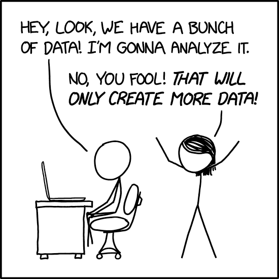

I recently learned a neat trick from [Marcus Buffett](https://mbuffett.com/): xkcd has an undocumented way to get images of the cartoons at double their normal resolution.

## The \_2x trick

For example, [xkcd #2582 "Data Trap"](https://xkcd.com/2582/) lists this URL as the direct link:

- <https://imgs.xkcd.com/comics/data_trap.png>

That leads to this 275x275px image, quite small by today's standards:

{{}}

But there's a trick! Add a `_2x` to the filename in the URL:

- <https://imgs.xkcd.com/comics/data_trap_2x.png>

That gives you a version that's 2x the original resolution, at 550x550px:

{{}}

I couldn't find the 2x versions documented ~~or linked anywhere~~ except for some [old](https://www.reddit.com/r/xkcd/comments/5huz2a/xkcd_comics_are_being_replaced_with_2xresolution/), [obscure](https://www.reddit.com/r/xkcd/comments/g23yqe/you_should_know_that_for_all_comics_after_xkcd/) reddit posts. I hope this knowledge saves you from [stretching out](https://xkcd.com/1683/) poor, low-resolution xkcd comics.

**Update (2025-10-02)**: My friend [Matthew Riley](https://bsky.app/profile/matt.dev) let me know that the `_2x` URL actually appears in xkcd's HTML in the image's [`srcset` attribute](https://developer.mozilla.org/en-US/docs/Web/API/HTMLImageElement/srcset):

```html

```

Matthew also did some sleuthing at the Internet Archive and noticed that Randall Munroe added the `2x` version for older cartoons recently, as #124 "Blogofractal" had no `srcset` attribute [in this 2023 snapshot](https://web.archive.org/web/20230328151746id_/https://xkcd.com/124/), but [this 2024 snapshot](https://web.archive.org/web/20240214232741id_/https://xkcd.com/124/) includes `srcset`.

## Which ones are available in 2x?

Not every xkcd is availble in 2x resolution.

I vibe-coded [a Python script](check_xkcd_2x.py) to check which cartoons have a 2x-resolution version and published the current list:

- [List of 2x-resolution xkcd Cartoons](/notes/xkcd-2x-resolution-list/)

The earliest version with 2x available is [#124, "Blogofractal"](https://xkcd.com/124/) ([2x version](https://imgs.xkcd.com/comics/blogofractal_2x.png)).

Starting with [#1084, "Server Problem"](https://xkcd.com/1084/) ([2x version](https://imgs.xkcd.com/comics/server_problem_2x.png)), almost every xkcd is available at 2x-resolution.

## Easter eggs

- [#1683 "Digital Data"](https://xkcd.com/1683/): The [2x version](https://imgs.xkcd.com/comics/digital_data_2x.png) is lower quality than [the original](https://imgs.xkcd.com/comics/digital_data.png).
