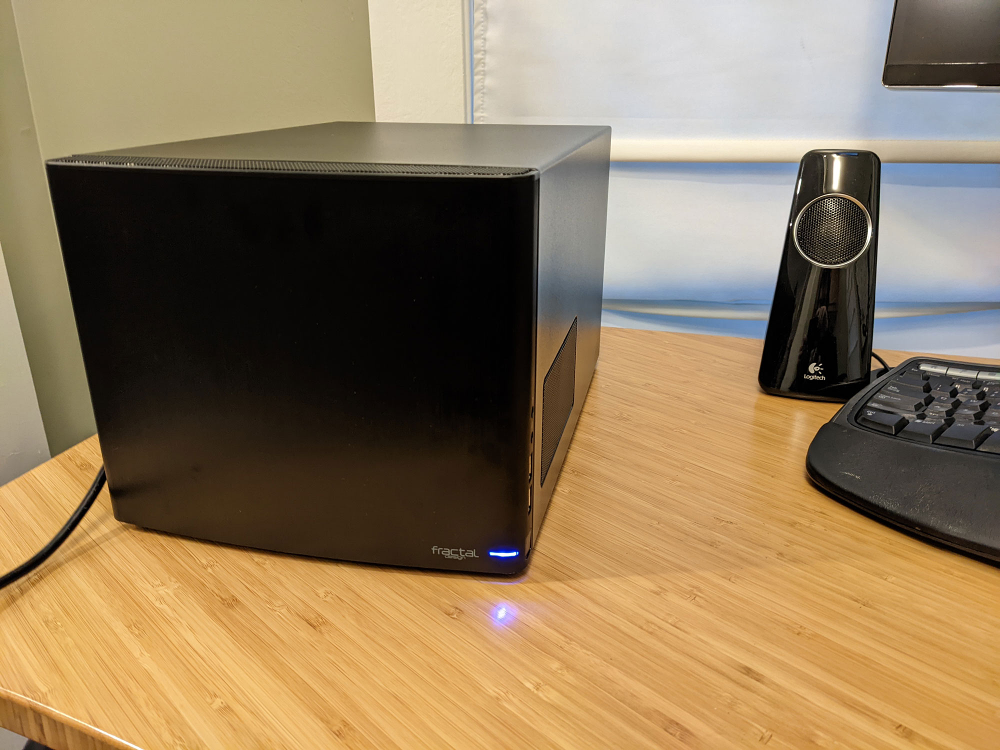
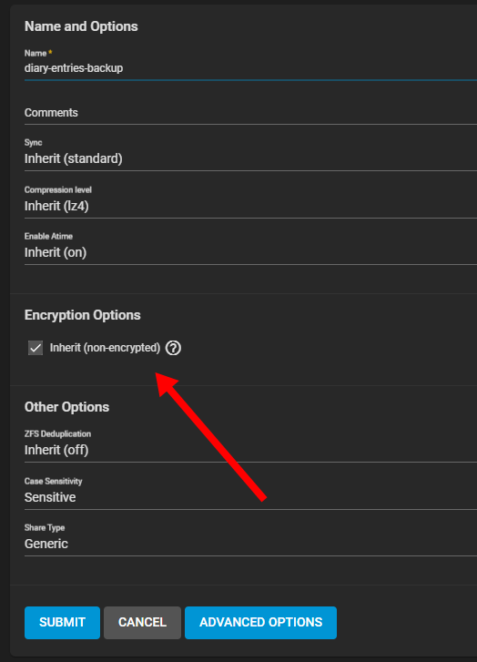
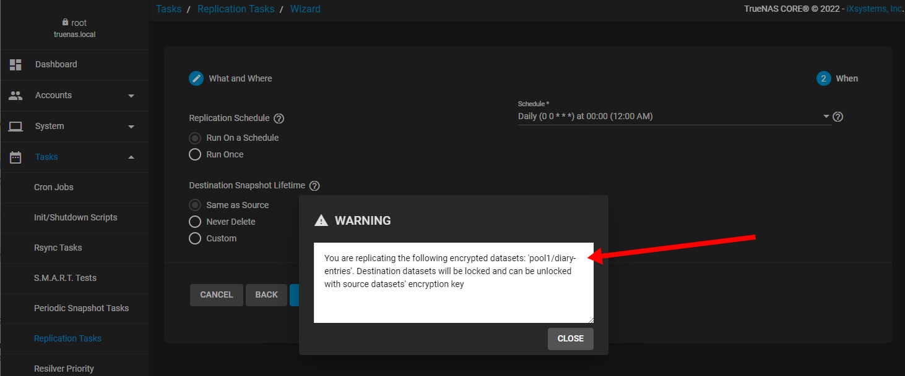
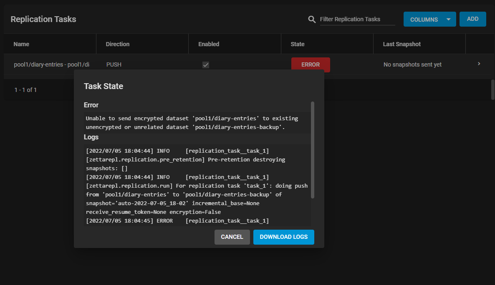
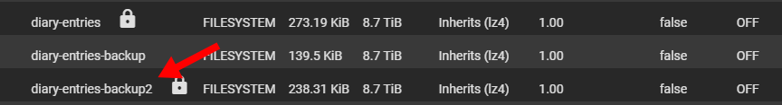
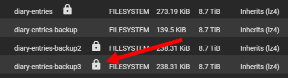
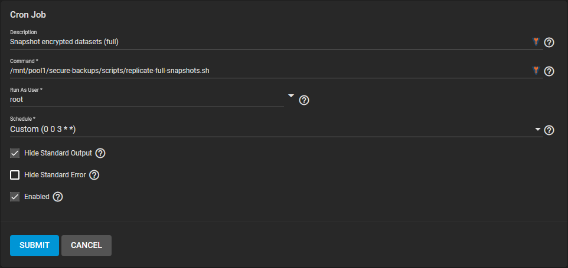

I recently built my first [TrueNAS server](/budget-nas/), and I've been learning more about TrueNAS and ZFS.


{{}}
{{}}


One of the neat features of ZFS is that you can make backups of encrypted data while it's still encrypted.

## Why back up encrypted data?

I have some files that I access rarely but I still want to keep on an encrypted dataset.

On my previous Synology NAS, there was no way to back up an encrypted volume. If files were on an encrypted volume, the data was completely inaccessible to anything until you unlocked it. That meant that whenever the drive is locked, I can't update my backups for that volume. For most of my data, that's okay, but what about volumes I access infrequently?

TrueNAS is better! You can take snapshots of an encrypted dataset and even replicate an encrypted dataset to another server without ever decrypting the data. This seemed like a great way for me to maintain backups of data I wanted to back up without having to decrypt it all the time.

It took a bit of tinkering and creating manual scripts, but I got it working.

## Trying to back up encrypted datasets through TrueNAS

To demonstrate what I'm trying to do, I created a dataset called `diary-entries`.

{{}}

Okay, let's put a file into this dataset:

```bash
echo "I enjoy Taylor Swift, but I don't want anyone to know" \
  > /mnt/pool1/diary-entries/2022-07-05.txt
```

And I'll need to create a new dataset to receive the backups. I don't want this dataset to be encrypted because then I'd just be going in circles trying to back up another encrypted dataset, so I've disabled encryption:

{{}}

Now, I'm ready to set up a replication task to back up encrypted snapshots of the `diary-entries` dataset to the unencrypted `diary-entries-backup` dataset. From there, my Windows machine can access the `diary-entries-backup` dataset and back it up to cloud storage.

When I create the replication task, TrueNAS warns me that I'm replicating an encrypted dataset. And that's fine because it's what I want. I want to take encrypted snapshots and back them up to the cloud while they're still encrypted:

{{}}

I start the replication task and... it fails:

{{}}

The error is:

```text
Unable to send encrypted dataset 'pool1/diary-entries' to existing unencrypted or unrelated dataset 'pool1/diary-entries-backup'.
```

Shucks!

It won't let me replicate an encrypted dataset to an unencrypted dataset. That seems a little silly because if the snapshot is encrypted and locked, why does it matter if it's sitting on a dataset that's also encrypted?

## Using ZFS through the command-line interface

To figure out what was going on, I decided to skip TrueNAS and use ZFS directly from the command-line.

The [ZFS CLI documentation](https://openzfs.github.io/openzfs-docs/man/8/zfs-send.8.html) gives an example command like this:

```bash
zfs send pool/fs@a | zfs receive poolB/received/fs@a
```

The `@a` represents a snapshot named `a`, so let's first take a snapshot:

```bash
zfs snapshot pool1/diary-entries@2022-07-05
```

And now let's try replicating `diary-entries` to `diary-entries-backup`:

```bash
$ zfs send pool1/diary-entries@2022-07-05 \
  | zfs receive pool1/diary-entries-backup@2022-07-05
cannot receive new filesystem stream: destination 'pool1/diary-entries-backup' exists
must specify -F to overwrite it
```

Okay, so I can't replicate into an existing dataset? Let's just specify a new dataset name `diary-entries-backup2`:

```bash
$ zfs send pool1/diary-entries@2022-07-05 \
  | zfs receive pool1/diary-entries-backup2@2022-07-05
warning: cannot send 'pool1/diary-entries@2022-07-05': dataset key must be loaded
cannot receive: failed to read from stream
```

So it's refusing to replicate unless `diary-entries` is decrypted? I thought I could replicate an encrypted dataset...

Revisiting the ZFS documentation, I see a `--raw` flag:

> `-w, --raw`
> For encrypted datasets, send data exactly as it exists on disk.

Okay, let me try that:

```bash
$ zfs send --raw pool1/diary-entries@2022-07-05 \
  | zfs receive pool1/diary-entries-backup2@2022-07-05
```

Success!

Let me go back to the TrueNAS dataset listing to see what I just created:

{{}}

Okay, that's no good. It created another encrypted dataset. I want an encrypted snapshot on an unencrypted dataset, and ZFS didn't seem to offer any way of doing that.

## Just save the snapshot to a file

Revisiting the command I was using, I noticed something:

```bash
$ zfs send --raw pool1/diary-entries@2022-07-05 \
  | zfs receive pool1/diary-entries-backup2@2022-07-05
```

Okay so there's a `zfs send` command that pipes its output to a `zfs receive` command. What if instead of piping output to `zfs receive`, I just write it to a file?

```bash
$ zfs send --raw pool1/diary-entries@2022-07-05 \
  > /mnt/pool1/diary-entries-backup/snapshot@2022-07-05
```

Hey, it worked! I created a 24 KB backup file on my unencrypted `diary-entries-backup` dataset:

```bash
$ du -h /mnt/pool1/diary-entries-backup/*
24K    /mnt/pool1/diary-entries-backup/snapshot@2022-07-05
```

Now that I have the backup as a file on an unencrypted dataset, I can mount the dataset over Samba from my Windows machine and back up the file to the cloud. But first, let's test that I can recreate the data in `diary-entries` just from this backup:

```bash
$ zfs receive pool1/diary-entries-backup3@2022-07-05 \
  < /mnt/pool1/diary-entries-backup/snapshot@2022-07-05
```

That succeeds and creates a new dataset in my pool:

{{}}

If I can decrypt `diary-entries-backup3` with the same password I used for `diary-entries` and it contains the same data, then I'll know that the file `diary-entries-backup/snapshot@2022-07-05` contains everything I need to recover the `diary-entries` dataset in case anything ever happens to the original copy. So, I decrypt `diary-entries-backup3` with the same password and check its contents:

```bash
$ cat /mnt/pool1/diary-entries-backup3/2022-07-05.txt
I enjoy Taylor Swift, but I don’t want anyone to know
```

Hooray! It worked.

I can back up an encrypted dataset to a file on an unencrypted dataset, then recreate the encrypted dataset from that snapshot.

## Creating incremental backups

One of the datasets I plan to back up this way is for video captures of my screencasts. That dataset is currently 12 GB and will likely grow. If I'm performing daily backups, I don't want a new 120 GB snapshot file every day.

Fortunately, ZFS supports incremental backups. If you snapshot a dataset on Monday and then again on Tuesday, you don't have to create a full backup file for both Monday and Tuesday. Instead, your Tuesday backup can just be the delta between the two snapshots.

To demonstrate, I'll add a little more to my `diary-entries` dataset:

```bash
echo "Upon reflection, I'm not ashamed of how much I enjoy Blank Space" \
  > /mnt/pool1/diary-entries/2022-07-06.txt
```

And now I'll create a new snapshot that includes the latest entry:

```bash
zfs snapshot pool1/diary-entries@2022-07-06
```

And now I'll create an incremental backup relative to the `2022-07-05` snapshot:

```bash
zfs send \
  --raw \
  --verbose \
  -i pool1/diary-entries@2022-07-05 \
  pool1/diary-entries@2022-07-06 \
  > /mnt/pool1/diary-entries-backup/snapshot@2022-07-06
```

Success! It created the new incremental backup:

```bash
$ du -h /mnt/pool1/diary-entries-backup/*
 24K    /mnt/pool1/diary-entries-backup/snapshot@2022-07-05
6.5K    /mnt/pool1/diary-entries-backup/snapshot@2022-07-06
```

It's a little silly on this demo because my files are tiny anyway, but you can still see that the second snapshot is substantially smaller than the first because it contains only the changes since the `2022-07-05` snapshot.

## Scripting backups

Now that I understand the mechanics, it's time to create a shell script so that I can set up TrueNAS to run this backup task on a regular schedule.

To start, I'll create a file called `settings.sh` to define everything that's specific to my system:

```bash
readonly POOL="mypool"
readonly BASE_DIR="/mnt/${POOL}/encrypted-backups"
readonly FULL_SNAPSHOTS_DIR="${BASE_DIR}/full-snapshots"
readonly INCREMENTAL_SNAPSHOTS_DIR="${BASE_DIR}/incremental-snapshots"

DATASETS=()
DATASETS+=("documents")
DATASETS+=("music")
DATASETS+=("emails")
readonly DATASETS
```

And now I'll make a script that creates full backups of my datasets:

```bash
#!/bin/bash

# Create full snapshots of datasets in DATASETS array.

set -eux

. settings.sh

mkdir -p "${FULL_SNAPSHOTS_DIR}"

TIMESTAMP="$(date -Iseconds | sed 's/://g' | sed 's/+0000/Z/g')"
readonly TIMESTAMP

for DATASET in "${DATASETS[@]}"; do
  # Take a snapshot.
  SNAPSHOT_NAME="${POOL}/${DATASET}@${TIMESTAMP}"
  zfs snapshot "${SNAPSHOT_NAME}"

  # Write the snapshot to a file.
  OUTPUT_FILENAME="${SNAPSHOT_NAME//${POOL}\//}"
  zfs send --raw --verbose "${SNAPSHOT_NAME}" > "${FULL_SNAPSHOTS_DIR}/${OUTPUT_FILENAME}"
done
```

The script iterates through each of the datasets I defined in `settings.sh`, creates a new snapshot, then creates a full backup of that dataset.

Next, I want a script that creates incremental backups:

```bash
#!/bin/bash

# Create incremental snapshots of datasets in DATASETS array relative to their
# last full snapshot.

set -eux

. settings.sh

mkdir -p "${INCREMENTAL_SNAPSHOTS_DIR}"

TIMESTAMP="$(date -Iseconds | sed 's/://g' | sed 's/+0000/Z/g')"
readonly TIMESTAMP

for DATASET in "${DATASETS[@]}"; do
  # Take a snapshot.
  INCREMENTAL_SNAPSHOT="${POOL}/${DATASET}@${TIMESTAMP}"
  zfs snapshot "${INCREMENTAL_SNAPSHOT}"

  # Find the most recent full snapshot.
  BASE_SNAPSHOT_FILENAME="$(basename "$(ls -tr "${FULL_SNAPSHOTS_DIR}/${DATASET}"* | tail -1)")"
  BASE_SNAPSHOT="${POOL}/${BASE_SNAPSHOT_FILENAME}"

  # Write the incremental snapshot to a file.
  OUTPUT_FILENAME="${INCREMENTAL_SNAPSHOT//${POOL}\//}"
  OUTPUT_PATH="${INCREMENTAL_SNAPSHOTS_DIR}/${OUTPUT_FILENAME}"
  zfs send --raw --verbose -i "${BASE_SNAPSHOT}" "${INCREMENTAL_SNAPSHOT}" \
    > "${OUTPUT_PATH}"
done
```

## Recovering a backup

I also created a convenience script called `snapshot-to-dataset.sh` that translates backup files back into a ZFS dataset:

```bash
#!/bin/bash
#
# Recover a dataset from an encrypted snapshot.
#
# Usage:
#   ./snapshot-to-dataset.sh new-dataset-name full-snapshot-path [incremental-snapshot-path]

set -ex

. settings.sh

NEW_DATASET_NAME="$1"
readonly NEW_DATASET_NAME

FULL_SNAPSHOT_PATH="$2"
readonly FULL_SNAPSHOT_PATH

INCREMENTAL_SNAPSHOT_PATH="$3"
readonly INCREMENTAL_SNAPSHOT_PATH

set -u

# Restore from base snapshot
zfs receive "${POOL}/${NEW_DATASET_NAME}" < "${FULL_SNAPSHOT_PATH}"

if [[ -n "${INCREMENTAL_SNAPSHOT_PATH}" ]]; then
  # Update dataset to latest incremental snapshot
  zfs receive "${POOL}/${NEW_DATASET_NAME}" < "${INCREMENTAL_SNAPSHOT_PATH}"
fi
```

Before, we just called `zfs receive`, but it gets a little complicated when we're working with incremental backups, so the convenience script simplifies things. To recover my `diary-entries` dataset using my full backup and incremental backup, I'd run the following command:

```bash
./snapshot-to-dataset.sh \
  diary-entries-backup4 \
  /mnt/pool1/diary-entries-backup/snapshot@2022-07-05 \
  /mnt/pool1/diary-entries-backup/snapshot@2022-07-06
```

And it works! It recovers a dataset using my full backup and incremental backup:

{{}}

```bash
zfs receive pool1/diary-entries-backup4 < /mnt/pool1/diary-entries-backup/snapshot@2022-07-05
zfs receive pool1/diary-entries-backup4 < /mnt/pool1/diary-entries-backup/snapshot@2022-07-06
```

## The clean solution

I've created a set of convenience scripts:

- [mtlynch/zfs-encrypted-backup](https://github.com/mtlynch/zfs-encrypted-backup)

## Scheduling backups

{{}}

Starting at 3 AM because sometimes I'm still awake and using my computer at midnight.

{{}}

```bash
tail /var/log/cron
```
