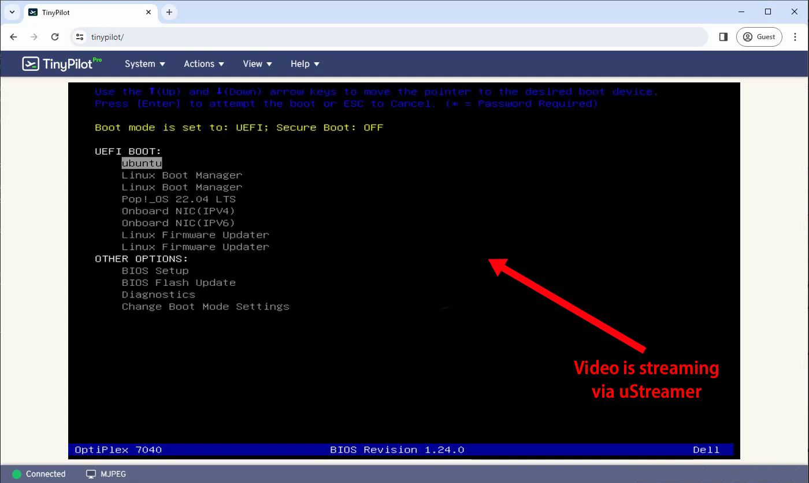

[Zig](https://ziglang.org/) is a new, independently developed low-level programming language. It's a modern reimagining of C that attempts to retain all of C's performance benefits while also taking advantage of improvements in tooling and language design from the last 30 years.

Because it's designed to replace C, Zig makes it easier than any other language I've used to call into C code from Zig. In [my previous Zig post](/notes/zig-call-c-simple/), I wrote a dummy library in C and then called it from Zig.

Today, I'd like to show a more practical example of using Zig to call C. I'm going to use Zig to call a real world C application that I use daily.

## Other examples of calling C code from Zig

In my previous post, I shared a few examples of good blog posts about using Zig to extend C applications:

- ["C/C++/Zig"](https://zig.news/kristoff/compile-a-c-c-project-with-zig-368j) by Loris Cro
- ["Extending a C Project with Zig" (2023)](https://nivethan.dev/devlog/extending-a-c-project-with-zig.html)

These resources were helpful, but to reproduce the results on a new codebase, you need to know how to port the entire C build system to Zig. As a Zig beginner, I have no idea how to do that. I want a shortcut that allows me to call just a piece of a C application from Zig without figuring out how to build the entire codebase in Zig.

## The real world C application: uStreamer

For the past three years, I've been working on [TinyPilot](https://tinypilotkvm.com), an open-source KVM over IP. TinyPilot allows your to [plug a Raspberry Pi into any computer](/tinypilot) and then control that computer remotely.

To stream the target computer's display, TinyPilot uses [uStreamer](https://github.com/pikvm/ustreamer), a video streaming app that's optimized for Raspberry Pi's hardware.

{{}}

I've been working with uStreamer for several years, but I find the codebase difficult to approach. It's all in C, and it doesn't have much in the way of documentation or tests.

I learn best by tinkering with code, so exercising uStreamer's C code through Zig feels like a good way to learn more about both uStreamer and Zig.

## Getting the uStreamer source code

To begin, I'll grab the uStreamer source code. The latest release as of this writing is `v5.45`, so I'll grab that version:

```bash
USTREAMER_VERSION='v5.45'
git clone \
  --branch "${USTREAMER_VERSION}" \
  https://github.com/pikvm/ustreamer.git
```

## What's the simplest C function in uStreamer?

For this exercise, the challenge is going to be using Zig, so I want the C part to be as simple as possible.

I want to find a dead simple function in uStreamer's C code &mdash; something that I can feed some input, and it gives me some output that I can inspect easily.

Scanning through the filenames, I noticed [`base64.c`](https://github.com/pikvm/ustreamer/blob/v5.45/src/libs/base64.c). That sounded promising. I know that [base64](https://en.wikipedia.org/wiki/Base64) is a scheme for encoding arbitrary binary data as a string with printable characters.

For example, if I read 10 bytes from `/dev/random` into my terminal, I get some unprintable bytes:

```bash
$ head -c 10 /dev/random > /tmp/output && cat /tmp/output
V�1A�����b
```

If I encode the data as base64, I get clean, printable charcters:

```bash
$ base64 < /tmp/output
Vo8xQbWmnsLQYg==
```

Here's the signature of uStreamer's base64 function:

```c
// src/libs/base64.h

void us_base64_encode(const uint8_t *data, size_t size, char **encoded, size_t *allocated);
```

From inspecting the function's implementation in [`base64.c`](https://github.com/pikvm/ustreamer/blob/v5.45/src/libs/base64.c), here's what I deduce about the semantics of `us_base64_encode`:

- `data` is input data to encode with the base64 encoding scheme.
- `size` is the length of the `data` buffer (in bytes).
- `encoded` is a pointer to an output buffer in which `us_base64_encode` stores the base64-encoded string.
  - `us_base64_encode` allocates memory for the output, and the caller is responsible for freeing the memory when they're done with it.
  - Technically, `us_base64_encode` allows the caller to allocate the buffer for `encoded`, but, for simplicity, I'm ignoring that functionality.
- `allocated` is a pointer that `us_base64_encode` populates with the number of bytes it allocated into `encoded`.

Here's a simple test program to call this function from C:

```c
// src/test.c

#include <stdio.h>

#include "libs/base64.h"

void main(void) {
  char *input = "hello, world!";
  char *encoded = NULL;
  size_t encoded_bytes = 0;
  us_base64_encode((uint8_t *)input, strlen(input), &encoded, &encoded_bytes);
  printf("input:        %s\n", input);
  printf("output:       %s\n", encoded);
  printf("output bytes: %lu\n", encoded_bytes);
  free(encoded);
}
```

I'll compile it with gcc, a popular C compiler:

```bash
$ gcc src/test.c src/libs/base64.c -o /tmp/b64test
In file included from src/libs/base64.h:31,
                 from src/test.c:3:
src/libs/tools.h: In function ‘us_signum_to_string’:
src/libs/tools.h:194:34: warning: implicit declaration of function ‘sigabbrev_np’ [-Wimplicit-function-declaration]
  194 |         const char *const name = sigabbrev_np(signum);
      |                                  ^~~~~~~~~~~~
```

Hmm, the code compiles, but I'm getting a lot of compiler warnings about a `tools.h` header that the uStreamer code includes.

If I look into `src/libs/tools.h`, I see that all the errors are around a single function: [`us_signum_to_string`](https://github.com/pikvm/ustreamer/blob/v5.45/src/libs/tools.h#L192-L210). Let me see if I can just comment out that function to get the build working.

```c

/*
DEBUG: Temporarily delete this function to get the build working again.
INLINE char *us_signum_to_string(int signum) {
...
	return buf;
}
*/
```

With the pesky `us_signum_to_string` function removed, I'll try to compile build again:

```bash
$ gcc src/test.c src/libs/base64.c -o /tmp/b64test && /tmp/b64test
input:        hello, world!
output:       aGVsbG8sIHdvcmxkIQ==
output bytes: 21
```

Hooray, no more compiler warnings. If I were trying to compile all of uStreamer, I'd have to figure out how to get `us_signum_to_string` to compile. Since I'm just trying to call `us_base64_encode` from Zig, I don't need `us_signum_to_string`.

If I compare my `test.c` program's output to my system's built-in `base64` utility, I can verify that I'm producing the correct result:

```bash
$ printf 'hello, world!' | base64
aGVsbG8sIHdvcmxkIQ==
```

The complete example at this stage [is on Github](https://github.com/tiny-pilot/ustreamer/tree/zig-00-c-test).

## Adding Zig to my uStreamer project environment

My favorite way of installing Zig is [with Nix](https://zero-to-nix.com/), as it allows me to switch Zig versions easily. Feel free to [install Zig](https://ziglang.org/learn/getting-started/) any way you prefer.

I added the following `flake.nix` file to my project, which pulls Zig 0.11.0 into my environment:

```nix
{
  description = "Dev environment for zig-c-simple";

  inputs = {
    flake-utils.url = "github:numtide/flake-utils";

    # 0.11.0
    zig_dep.url = "github:NixOS/nixpkgs/46688f8eb5cd6f1298d873d4d2b9cf245e09e88e";
  };

  outputs = { self, flake-utils, zig_dep }@inputs :
    flake-utils.lib.eachDefaultSystem (system:
    let
      zig_dep = inputs.zig_dep.legacyPackages.${system};
    in
    {
      devShells.default = zig_dep.mkShell {
        packages = [
          zig_dep.zig
        ];

        shellHook = ''
          echo "zig" "$(zig version)"
        '';
      };
    });
}
```

From here, I can run `nix develop`, and I see that Nix 0.11.0 is available in my project environment:

```bash
# There's a weird quirk of Nix flakes that they have to be added to your git
# repo.
$ git add flake.nix
$ nix develop
zig 0.11.0
```

## Creating a Zig executable

The Zig compiler's `init-exe` creates a boilerplate Zig application, so I'll use it to create a simple Zig app within the uStreamer source tree:

```bash
$ zig init-exe
info: Created build.zig
info: Created src/main.zig
info: Next, try `zig build --help` or `zig build run`
```

If I try compiling and running the boilerplate Zig application, I see that everything works:

```bash
$ zig build run
All your codebase are belong to us.
Run `zig build test` to run the tests.
```

The uStreamer C file I want to call [depends on the C standard library](https://github.com/pikvm/ustreamer/blob/v5.45/src/libs/base64.h#L25-L27), so I need to make a small adjustment to my `build.zig` file to link against that library. While I'm adjusting, I'll also replace the boilerplate binary name with `base64-encoder`:

```zig
    const exe = b.addExecutable(.{
        .name = "base64-encoder", // Change binary name.
        .root_source_file = .{ .path = "src/main.zig" },
        .target = target,
        .optimize = optimize,
    });
    exe.linkLibC();               // Link against C standard library.
    exe.addIncludePath(.{ .path = "src" });
```

## Calling uStreamer code from Zig

Now, I want to call the `us_base64_encode` C function from Zig.

As a reminder, here's the C function I'm trying to call from Zig, which I explained [above](http://blog.local:1313/notes/zig-unit-test-c/#whats-the-simplest-c-function-in-ustreamer):

```c
// src/libs/base64.h

void us_base64_encode(const uint8_t *data, size_t size, char **encoded, size_t *allocated);
```

Figuring out how to translate between C types and Zig types turned out to be the hardest part of this process, as I'm still a Zig novice.

Here was my first attempt:

```zig
// src/main.zig

const ustreamer = @cImport({
    @cInclude("libs/base64.c");
});

pub fn main() !void {
    const input = "hello, world!";
    var cEncoded: *u8 = undefined;
    var allocatedSize: usize = 0;
    // WRONG: This doesn't compile.
    ustreamer.us_base64_encode(&input, input.len, &cEncoded, &allocatedSize);
}
```

That yielded this compiler error:

```bash
$ zig build run
zig build-exe b64 Debug native: error: the following command failed with 1 compilation errors:
...
src/main.zig:17:32: error: expected type '[*c]const u8', found '*const *const [13:0]u8'
    ustreamer.us_base64_encode(&input, input.len, &cEncoded, &allocatedSize);
                               ^~~~~~
src/main.zig:17:32: note: pointer type child '*const [13:0]u8' cannot cast into pointer type child 'u8'
/home/mike/ustreamer/zig-cache/o/9599bf4c636d23e50eddd1a55dd088ff/cimport.zig:1796:43: note: parameter type declared here
pub export fn us_base64_encode(arg_data: [*c]const u8, arg_size: usize, arg_encoded: [*c][*c]u8, arg_allocated: [*c]usize) void {
```

I had trouble understanding this error at first because so much of it was unfamiliar.

The important bit of the compiler error above is `error: expected type '[*c]const u8', found '*const *const [13:0]u8'`. It's telling me that I tried to pass in a `*const *const [13:0]u8`, but Zig needs me to pass in `[*c]const u8`.

What does that mean?

### Understanding the type I used

Going from right to left:

`u8` is an unsigned byte, which is how Zig represents characters in a string.

`[13:0]` means a null-terminated array. The `13` is the length of the array, which Zig calculates at compile-time. `:0` means that the array has an extra byte with a value of `0` to indicate the end of the string. For more details about the mechanics of null-terminated string in Zig, see [my previous post](/notes/zig-strings-call-c-code/).

`*const` means a constant pointer. A pointer is an address in memory, and the `const` means that subsequent code may not reassign the variable.

`*const *const` means a constant pointer to a constant pointer. In other words, `input` is a constant pointer to a string, so that means `&input` is a constant pointer to a constant pointer.

### Converting a Zig type to a C type

Okay, now I understand how Zig views the string that I passed. What did Zig _want_ me to pass as the `input` type?

```text
expected type '[*c]const u8'
```

What the heck does `[*c]` mean? This was surprisingly hard to figure out. I eventually pieced it together from a few different sources.

Here's the official Zig documentation:

> ### C Pointers
>
> This type is to be avoided whenever possible. The only valid reason for using a C pointer is in auto-generated code from translating C code.
>
> When importing C header files, it is ambiguous whether pointers should be translated as single-item pointers (_T) or many-item pointers ([_]T). C pointers are a compromise so that Zig code can utilize translated header files directly.
>
> https://ziglang.org/documentation/0.11.0/#C-Pointers

I didn't understand this explanation, but more [Kagi](https://kagi.com)'ing led me to this explanation on reddit, which I found more accessible:

> `[*c]T` is just a C pointer to type T, it says that it doesn't know whether there are multiple elements in that pointer or not. There could be, there could not be. We also don't know the length of it (it's not a slice which has pointer+length, it's just a pointer). And if there are multiple elements, we don't know if it is say null-terminated or not.
>
> [-/u/slimsag on reddit](https://www.reddit.com/r/Zig/comments/11uqo84/comment/jcplxiz/)

Okay, that makes more sense.

It sounds like in Zig, the compiler "knows" more about pointer types, whereas C pointers carry less context. The `[*c]` type represents a pointer that Zig got from C, so Zig knows less about this pointer than it normally would for Zig-native pointers.

Through trial and error, I figured out that Zig wanted me to get a pointer to `input` by referencing `input.ptr` rather than using the address-of operator `&`.

This Zig snippet shows the difference between the `.ptr` and `&`:

```zig
const input = "hello, world!";
std.debug.print("input     is type {s}\n", .{@typeName(@TypeOf(input))});
std.debug.print("&input    is type {s}\n", .{@typeName(@TypeOf(&input))});
std.debug.print("input.ptr is type {s}\n", .{@typeName(@TypeOf(input.ptr))});
```

```text
input     is type *const [13:0]u8
&input    is type *const *const [13:0]u8
input.ptr is type [*]const u8
```

Okay, let me try calling `us_base64_encode` again:

```zig
const input = "hello, world!";
var cEncoded: *u8 = undefined;
var allocatedSize: usize = 0;
ustreamer.us_base64_encode(input.ptr, input.len, &cEncoded, &allocatedSize);
```

That gives me:

```bash
$ zig build run
zig build-exe b64 Debug native: error: the following command failed with 1 compilation errors:
...
src/main.zig:12:54: error: expected type '[*c][*c]u8', found '**u8'
    ustreamer.us_base64_encode(input.ptr, input.len, &cEncoded, &allocatedSize);
                                                     ^~~~~~~~~
```

Progress!

The code still doesn't compile, but Zig is now complaining about the third parameter instead of the first. That at least tells me that I've supplied the expected types for the first two parameters.

### Translating the output parameters into Zig

The compiler error also contains a helpful bit of information for calling into the C implementation of `us_base64_encode`:

```bash
pub export fn us_base64_encode(arg_data: [*c]const u8, arg_size: usize, arg_encoded: [*c][*c]u8, arg_allocated: [*c]usize) void {
```

That's the signature of the C function translated into Zig, so Zig is telling me exactly the types I need to pass in to call the function.

Alternatively, I can use the `zig translate-c` utility to translate this C function signature into Zig. This effectively gives the same results as the compiler error above, but it preserves the original parameter names, whereas the compiler error prefixes them with `arg_`.

```bash
# We add --library c to let Zig know the code depends on libc.
$ zig translate-c src/libs/base64.h --library c | grep us_base64
pub extern fn us_base64_encode(data: [*c]const u8, size: usize, encoded: [*c][*c]u8, allocated: [*c]usize) void;
```

From more trial and error, I eventually guessed my way to these semantics for calling `us_base64_encode` from Zig:

```zig
const input = "hello, world!";
var cEncoded: [*c]u8 = null;
var allocatedSize: usize = 0;
ustreamer.us_base64_encode(input.ptr, input.len, &cEncoded, &allocatedSize);
```

And it compiles successfully! Here's the full `src/main.zig` file:

```zig
// src/main.zig

const std = @import("std");

// Import the base64 implementation from uStreamer's C source file.
const ustreamer = @cImport({
    @cInclude("libs/base64.c");
});

pub fn main() !void {
    // Create a standard Zig string.
    const input = "hello, world!";

    // Create variables to store the ouput parameters of us_base64_encode.
    var cEncoded: [*c]u8 = null;
    var allocatedSize: usize = 0;

    // Call the uStreamer C function from Zig.
    ustreamer.us_base64_encode(input.ptr, input.len, &cEncoded, &allocatedSize);

    // Free the memory that the C function allocated when this function exits.
    defer std.c.free(cEncoded);

    // Print the input and output of the base64 encode operation.
    std.debug.print("input:       {s}\n", .{input});
    std.debug.print("output:      {s}\n", .{cEncoded});
    std.debug.print("output size: {d}\n", .{allocatedSize});
}
```

```bash
$ zig build run
input:       hello, world!
output:      aGVsbG8sIHdvcmxkIQ==
output size: 21
```

Great! That worked. And the results are identical to [my C implementation above](#whats-the-simplest-c-function-in-ustreamer).

The complete example at this stage [is on Github](https://github.com/tiny-pilot/ustreamer/tree/zig-10-simple-exe).

## Creating a Zig wrapper for the native C implementation

At this point, I can successfully call the C `us_base64_encode` function from Zig, but it would be cleaner if I abstracted away the C parts with a Zig wrapper function. That way, I could encapsulate all the Zig to C interop logic to that function, and callers of my wrapper wouldn't have to even know or care that I'm calling C.

What should my wrapper function look like?

It should accept arbitrary bytes, and it should give back a null-terminated string, so my Zig-native wrapper should look something like this:

```zig
fn base64Encode(data: []const u8) [:0]u8 {...}
```

I already know the start of my implementation because I did it in my `main()` function above:

```zig
fn base64Encode(data: []const u8) [:0]u8 {
  var cEncoded: [*c]u8 = null;
  var allocatedSize: usize = 0;

  ustreamer.us_base64_encode(data.ptr, input.len, &cEncoded, &allocatedSize);
  ...
```

### Who's responsible for freeing the memory C allocated?

There's a problem I haven't addressed yet. `us_base64_encode` allocated memory (`cEncoded`). Now, I, the caller, am responsible for either freeing that memory myself or telling all of _my_ callers that it's their responsibility to free the memory.

Normally, it's fine to tell a caller that they're responsible for freeing memory for a function result, but this case is a little trickier. This isn't a normal Zig-allocated memory buffer &mdash; it's a C-allocated buffer that requires a special free function (`std.c.free`).

My goal is to abstract away the C implementation details, so I don't want to ask my callers to use a C-specific memory freeing function. I use `defer std.c.free` to free the C-allocated memory before returning from my wrapper:

```zig
fn base64Encode(data: []const u8) [:0]u8 {
  var cEncoded: [*c]u8 = null;
  var allocatedSize: usize = 0;

  ustreamer.us_base64_encode(data.ptr, input.len, &cEncoded, &allocatedSize);

  // Free the C-allocated memory buffer before exiting the function.
  defer std.c.free(cEncoded);

  // TODO: Copy the contents of cEncoded into a [:0]u8 buffer.
}
```

### Converting a C string to a Zig string

At this point, I've got the string as a `[*c]u8` (C-pointer, unknown length buffer), but I want to return `[:0]u8` (null-terminated, length-counted Zig slice). How do I convert a C-style string to a Zig slice?

In [my previous post](/notes/zig-strings-call-c-code/#improving-the-wrapper-with-zig-managed-buffers), I converted a C string to a Zig string with this process:

1. Create a Zig slice of the C string using `std.mem.span`.
1. Allocate a Zig-managed memory slice with `allocSentinel`.
1. Use `@memcpy` to copy the contents of the C string into the Zig slice.

That process would work here, but I'd be doing a useless work in step (1). `std.mem.span` has to iterate the string to find the null terminator. In this code, I already know where the null terminator is because `us_base64_encode` stores that information in the `allocated` parameter.

In practice, I wouldn't worry about the extra string iteration unless this was a hot spot in my code. I still have to copy every character in the string, so it's [an `O(N)` operation](https://en.wikipedia.org/wiki/Time_complexity#Linear_time) no matter what. Still, part of the fun of Zig is fine-grained control over performance, so I'll try to do the conversion more efficiently.

Here's my conversion function:

```zig
fn cStringToZigString(allocator: std.mem.Allocator, cString: [*c]const u8, cStringLength: usize) ![:0]u8 {
    // Allocate a Zig-managed buffer to contain the contents of cString.
    const zigString = try allocator.allocSentinel(u8, cStringLength, 0);

    // If we can't return the result, free the memory we allocated.
    errdefer allocator.free(zigString);

    // Create a Zig slice of cString, and declare to Zig that the slice ends
    // with a null terminator.
    const cStringSlice = cString[0..cStringLength :0];

    // Copy the contents of the C string into the Zig slice.
    @memcpy(zigString.ptr, cStringSlice);

    return zigString;
}
```

At this point, I can complete the implementation of my wrapper function:

```zig
fn base64Encode(allocator: std.mem.Allocator, data: []const u8) ![:0]u8 {
    var cEncoded: [*c]u8 = null;
    var allocatedSize: usize = 0;

    ustreamer.us_base64_encode(data.ptr, data.len, &cEncoded, &allocatedSize);
    defer std.c.free(cEncoded);

    // The length of the string excludes the null-terminator, so subtract 1.
    const cEncodedLength = allocatedSize - 1;
    return cStringToZigString(allocator, cEncoded, cEncodedLength);
}
```

### Tying it all together

```zig
const std = @import("std");

// Import the base64 implementation from uStreamer's C source file.
const ustreamer = @cImport({
    @cInclude("libs/base64.c");
});

fn base64Encode(allocator: std.mem.Allocator, data: []const u8) ![:0]u8 {
    var cEncoded: [*c]u8 = null;
    var allocatedSize: usize = 0;

    ustreamer.us_base64_encode(data.ptr, data.len, &cEncoded, &allocatedSize);
    defer std.c.free(cEncoded);

    // The length of the string excludes the null-terminator, so subtract 1.
    const cEncodedLength = allocatedSize - 1;
    return cStringToZigString(allocator, cEncoded, cEncodedLength);
}

fn cStringToZigString(allocator: std.mem.Allocator, cString: [*c]const u8, cStringLength: usize) ![:0]u8 {
    const zigString = try allocator.allocSentinel(u8, cStringLength, 0);
    errdefer allocator.free(zigString);

    const cStringSlice = cString[0..cStringLength :0];
    @memcpy(zigString.ptr, cStringSlice);

    return zigString;
}

pub fn main() !void {
    var gpa = std.heap.GeneralPurposeAllocator(.{}){};
    const allocator = gpa.allocator();
    defer _ = gpa.deinit();

    const input = "hello, world!";
    const output = try base64Encode(allocator, input);
    defer allocator.free(output);

    std.debug.print("input:       {s}\n", .{input});
    std.debug.print("output:      {s}\n", .{output});
    std.debug.print("output size: {d}\n", .{output.len});
}
```

```bash
$ zig build run
input:       hello, world!
output:      aGVsbG8sIHdvcmxkIQ==
output size: 20
```

https://github.com/tiny-pilot/ustreamer/tree/zig-20-wrapper-fn

## Creating the first unit test

```zig
    const unit_tests = b.addTest(.{
        .root_source_file = .{ .path = "src/main.zig" },
        .target = target,
        .optimize = optimize,
    });
    unit_tests.linkLibC();                          // Link against libc.
    unit_tests.addIncludePath(.{ .path = "src" });  // Search src path for includes.
```

```zig
test "encode simple string as base64" {
    const allocator = std.testing.allocator;
    const actual = try base64Encode(allocator, "hello, world!");
    defer allocator.free(actual);
    try std.testing.expectEqualStrings("aGVsbG8sIHdvcmxkIQ==", actual);
}
```

```bash
$ zig build test --summary all
Build Summary: 3/3 steps succeeded; 1/1 tests passed
test success
└─ run test 1 passed 1ms MaxRSS:1M
   └─ zig test Debug native success 2s MaxRSS:211M
```

## Adding multiple unit tests

```zig
fn testBase64Encode(
    input: []const u8,
    expected: [:0]const u8,
) !void {
    const allocator = std.testing.allocator;
    const actual = try base64Encode(allocator, input);
    defer allocator.free(actual);
    try std.testing.expectEqualStrings(expected, actual);
}
```

```zig
test "encode simple data as base64" {
    try testBase64Encode("", "");
    try testBase64Encode("h", "aA==");
    try testBase64Encode("he", "aGU=");
    try testBase64Encode("hel", "aGVs");
    try testBase64Encode("hell", "aGVsbA==");
    try testBase64Encode("hello, world!", "aGVsbG8sIHdvcmxkIQ==");
    try testBase64Encode(&[_]u8{0}, "AA==");
    try testBase64Encode(&[_]u8{ 0, 0 }, "AAA=");
    try testBase64Encode(&[_]u8{ 0, 0, 0 }, "AAAA");
    try testBase64Encode(&[_]u8{255}, "/w==");
    try testBase64Encode(&[_]u8{ 255, 255 }, "//8=");
    try testBase64Encode(&[_]u8{ 255, 255, 255 }, "////");
}
```

---

_Excerpts from uStreamer are used under the GPLv3 license._
