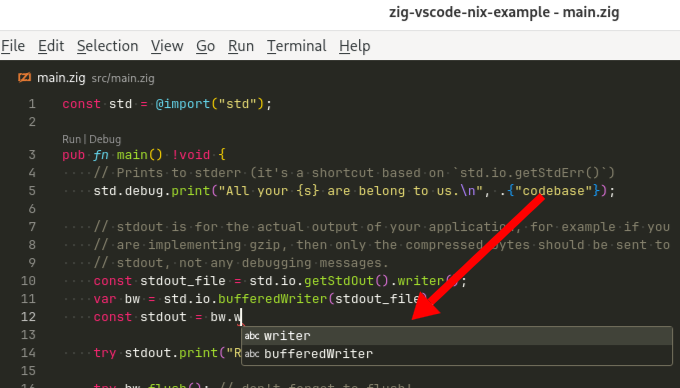

I switch between a few Zig projects that each depend on a different version of the Zig compiler. I manage Zig versions per-project using [Nix development shells](notes/nix-dev-environment/).

## The problem: VS Code can't find ZLS

When I open the project, VS Code helpfully prompts me to enable the Zig Language Server, but when I say yes, I get this error message:

{{}}

The issue is that I start VS Code before I launch my Nix dev environment, so the Zig VS Code plugin doesn't know where to find my local Zig compiler or the Zig Language Server binary, `zls`.

I found a solution to this so that I can switch Zig versions easily with Nix, and VS Code follows along and offers auto-complete and cross-referencing specific to the project's target Zig language.

## Just show me the solution

If you want to skip the process of how I got my solution working, you can [skip to the solution below](#working-solution).

I installed the [Zig VS Code extension](https://marketplace.visualstudio.com/items?itemName=ziglang.vscode-zig)

## Requirements

- Nix (I'm using 2.24.12)
  - with flakes enabled
- VS Code (I'm using 1.96.4)
- [Zig VS Code extension](https://marketplace.visualstudio.com/items?itemName=ziglang.vscode-zig) (I'm using 0.6.4)
- (optional) direnv
  - You don't strictly need it, but it auto-loads your environment when you enter your project directory, which is handy.

If you don't have Nix, I recommend the [Determinate Systems installer](https://zero-to-nix.com/start/install/), which automatically enables flakes:

```bash
curl \
  --proto '=https' \
  --tlsv1.2 -sSf -L \
  https://install.determinate.systems/nix \
  | sh -s -- install
```

## Attempt #1: Just make ZLS available

I started by doing the obvious: creating a Nix flake to install Zig 0.13.0 with the matching version of ZLS, the Zig Language Server. Here was my `flake.nix`:

```nix
{
  description = "Zig development environment";

  inputs = {
    nixpkgs.url = "github:NixOS/nixpkgs/nixos-24.11";
    flake-utils.url = "github:numtide/flake-utils";
    zig-overlay.url = "github:mitchellh/zig-overlay";
    # Keep in sync with zigVersion below.
    zls-overlay.url = "github:zigtools/zls/0.13.0";
  };

  outputs = {
    self,
    nixpkgs,
    flake-utils,
    ...
  } @ inputs:
    flake-utils.lib.eachSystem (builtins.attrNames inputs.zig-overlay.packages) (system: let
      pkgs = import nixpkgs {
        inherit system;
        overlays = [
          (final: prev: {
            zigpkgs = inputs.zig-overlay.packages.${prev.system};
          })
        ];
      };
      zigVersion = "0.13.0";
      zig = pkgs.zigpkgs.${zigVersion};
      zls = inputs.zls-overlay.packages.${system}.zls.overrideAttrs (old: {
        nativeBuildInputs = [zig];
      });
    in {
      devShells.default = pkgs.mkShell {
        packages = with pkgs; [
          zig
          zls
        ];

        shellHook = ''
          echo 'zls' "$(zls --version)"
          echo 'zig' "$(zig version)"
        '';
      };

      formatter = pkgs.alejandra;
    });
}
```

The Nix flake works in that it installs Zig and ZLS correctly in my shell:

```bash
$ zig version && zls --version
0.13.0
0.13.0
```

The problem is that VS Code doesn't pick up ZLS. When I view the sample `main.zig` in VS Code and try to use auto-complete, it just shows a dumb auto-complete based on variable names in the file:

{{}}

## Attempt #2: Use the direnv VS Code extension

I read a fasterthanlime post that said

## Attempt #3: Give VS Code a hardcoded path

From reading documentation, I figured out that the VS Code Zig extension allows me to override the default paths to Zig and ZLS with these VS Code settings:

- `zig.path`
- `zig.zls.path`

Okay, I can figure that out. I just ask the shell where the binaries are:

```bash
$ which zig && which zls
/nix/store/s3nq31mhm8gxkq691p5w6q61ficw1hvr-zig-0.13.0/bin/zig
/nix/store/rfy6amzrkimywfmlgr5mvka99b6yp3jk-zls/bin/zls
```

Have to completely close the window. Reloading doesn't work.

```bash
nix flake update zls-overlay
```

## Working solution

Note that you have to completely close the VS Code window and reopen it for the solution to work. Simply reloading the window is not sufficient.
