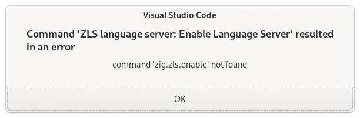

I know there's Zig Version Manager, but I prefer to use Nix to manage all of my project dependencies.

Nix works great for managing Zig versions, but the problem is that I start VS Code before I launch my Nix dev environment. So the Zig VS Code plugin doesn't know where to find my local Zig compiler or the Zig Language Server binary, `zls`.

When I open the project, VS Code helpfully prompts me to enable the Zig Language Server, but when I say yes, I get this error message:

{{}}

## Just show me the solution

If you want to skip the process of how I got my solution working, you can [skip to the solution below](#working-solution).

## My initial Nix flake

TODO: Show Nix flake

## Attempt #1: Hardcoding a fix

```bash
$ which zls
/nix/store/rfy6amzrkimywfmlgr5mvka99b6yp3jk-zls/bin/zls
```

```bash
$ which zig
/nix/store/s3nq31mhm8gxkq691p5w6q61ficw1hvr-zig-0.13.0/bin/zig
```

Have to completely close the window. Reloading doesn't work.

```bash
nix flake update zls-overlay
```

## Working solution

Note that you have to completely close the VS Code window and reopen it for the solution to work. Simply reloading the window is not sufficient.
