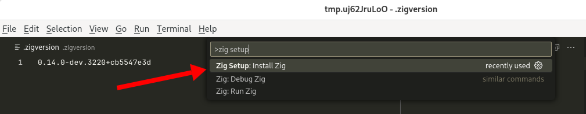

I finally found a solution that makes VS Code work consistently with Zig, so I'm sharing my setup in the hope that it saves someone else a headache.

{{}}

Before I landed on a working solution, I kept running into issues with Zig version mismatches or VS Code completely failing to recognize Zig semantics and failing over to naive autocomplete.

## Managing multiple Zig versions across projects

Zig has not yet reached a stable 1.0 release. If you're working on software written in Zig, you have to use the version of the Zig compiler that matches that project.

If you work on multiple projects, you need a way to juggle different versions of Zig on the same system.

The most popular method for managing Zig versions seems to be the [Zig Version Manager](https://www.zvm.app/), which I haven't tried, so I'm not sure how it plays with VS Code.

I personally manage Zig versions per-project using [Nix development shells](/notes/nix-dev-environment/), so that's what I'm sharing below.

## The problem: VS Code can't find ZLS

When I open a Zig project, VS Code helpfully prompts me to enable the Zig Language Server, but when I say yes, I get this error message:

{{}}

The problem is that I start VS Code before I launch my Nix dev environment, so the Zig VS Code plugin doesn't know where to find my local Zig compiler or the Zig Language Server binary, `zls`.

## The solution: Use the direnv VS Code extension


**Update** (2025-02-14): There's [a simpler solution](#update-the-simpler-non-nix-solution) that doesn't rely on Nix.


I initially came up with a wacky solution where my Nix flake [automatically rewrote my VS Code settings](https://codeberg.org/mtlynch/zig-vscode-nix-example/src/branch/03-dynamic-paths/flake.nix#L49-L69) every time I entered the dev shell. That way, VS Code would always have the latest path to the Zig and ZLS binaries.

Then, I read [a fasterthanlime post](https://fasterthanli.me/series/building-a-rust-service-with-nix/part-10#setting-up-direnv-in-vscode) and found out there's a simple solution.

There's a [direnv VS Code extension](https://marketplace.visualstudio.com/items?itemName=mkhl.direnv) that effortlessly syncs Zig paths with VS code. It also means that this solution works with VS Code using Remote SSH development.

## My complete working solution

I'm including an explanation of my solution, but if you want to just use it without the tour, I created a template that's easy to copy [below](#copying-my-template).

### flake.nix

My Nix flake is doing the heavy lifting here:



The Nix flake creates a dev shell that includes the Zig compiler and the Zig Language Server (ZLS).

I set it to Zig `0.13.0`, but you can change it to any tagged relase. To use the pre-release development version of zig, change both instances of `0.13.0` to `master`.

I tried several ways to eliminate the repetition of `0.13.0` so that there could be a single definition, but my Nix language skills were too weak to figure out a way to do it. If anyone has a solution, please let me know.

### .envrc

My solution relies on [direnv](https://direnv.net/) to start the Nix dev shell whenever I'm in the project directory. The definition is simple:

```bash
use_flake
```

### .vscode/extensions.json

To integrate VS Code with Zig, I need two VS Code extensions:



The first is the official [Zig VS Code extension](https://marketplace.visualstudio.com/items?itemName=ziglang.vscode-zig).

The second, less-obvious one is the [direnv VS Code extension](https://marketplace.visualstudio.com/items?itemName=mkhl.direnv), which lets VS Code see paths within my Nix dev shell.

### .vscode/settings.json

Finally, I need just one setting to tell VS Code to use the Zig Language Server:



## Copying my template

I created a Nix flake template to make it easy to replicate my setup.

### Requirements

- Nix (I'm using 2.24.12)
  - with flakes enabled
- [direnv](https://direnv.net/) (I'm using 2.35.0)
- VS Code (I'm using 1.96.4)

### A Zig VS Code Nix flake template

I created a [Nix flake template](https://codeberg.org/mtlynch/zig-vscode-flake) that captures my Zig + VS Code solution. You can use it by running the following command:

```bash
nix flake init \
  --template git+https://codeberg.org/mtlynch/zig-vscode-flake.git
```

After calling `nix flake init`, run `direnv allow`, which should show zig and zls available:

```bash
$ direnv allow
...
direnv: nix-direnv: Renewed cache
Alejandra 3.0.0
zls 0.13.0
zig 0.13.0
```

Finally, in VS Code, go to "Extensions: Show Recommended Extensions" and install the recommended extensions.

At this point, you can run `zig init` to create a new project, and you should find that the Zig VS Code extension works properly with Zig.

{{}}

### Changing Zig versions

My flake is set to Zig 0.13.0, the latest release as of this writing.

If you want to use a different tagged release, replace `0.13.0` with a different version:

```bash
EXISTING_ZIG_VERSION='0.13.0' # Set to whatever the version in the flake.nix is.
NEW_ZIG_VERSION='0.12.0'      # Set to your desired Zig version.
```

To use the bleeding edge, pre-release version of Zig, set the version to `master`:

```bash
NEW_ZIG_VERSION='master'      # Set if you want bleeding edge Zig.
```

Once you've updated the Zig version in the `flake.nix` file, run these commands to apply the changes:

```bash
sed \
  --in-place \
  "s/${EXISTING_ZIG_VERSION}/${NEW_ZIG_VERSION}/g" \
  flake.nix && \
  nix flake update zig zls-overlay && \
  nix develop
```

You may have to restart (not just reload) VS Code for the changes to take effect.

## Update: The simpler, non-Nix solution

One of the Zig VS Code extension developers [replied to this post](https://ziggit.dev/t/my-zig-vs-code-setup-for-multiple-zig-versions/8548/4?u=mtlynch) and said that I should be able to manage Zig versions with just the extension itself.

I didn't realize that the Zig VS Code extension could manage Zig installs, so I tried that. To install Zig through the VS Code extension, go to the VS Code command pallette and select:

- Zig Setup: Install Zig

{{}}

Then, choose the Zig version you want, and it should work. I had to [set my `settings.json` manually](https://github.com/ziglang/vscode-zig/issues/398) and reload VS Code for it to take effect.

I like Nix dev shells, so I'm going to keep using mine, but if you just want a simple setup, you're probably better off letting the Zig VS Code extension manage your Zig install.
