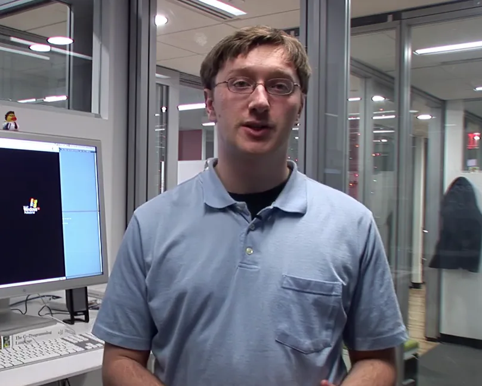

In 2005, Joel Spolsky's software company, Fog Creek, filmed a documentary about their summer internship program. The film is called _Aardvark'd: 12 Weeks with Geeks_, and it follows four college interns as they design, implement, and launch a completely new software product.

That's not the interesting part.

Looking back on this documentary 18 years later, it's striking how many interviews it captured with people who would go on to greater fame and success:

- Paul Graham and Jessica Livingston, months after they co-founded Y Combinator
- Steve Huffman, and Alexis Ohanian, months after they launched reddit
- Aaron Swartz, months before he joined reddit and years before he founded Demand Progress
- Joel Spolsky and Michael Pryor before their mega-hits like StackOverflow and Trello

_Aardvark'd_ sold about 5,000 copies on DVD, mostly to fans of Joel's blog, but it quickly faded from popular consciousness.

As a longtime Joel Spolsky fanboy, I've always been curious to watch _Aardvark'd_. I was delighted that the film's producer recently published it [for free on YouTube](https://www.youtube.com/watch?v=YbrkZ07LKbk) at 1080p resolution.

At the time of this writing, _Aardvark'd_ has only 41 views on YouTube, which is surprisingly low given the rarity of its interviews.

{{}}

## What was going on in 2005?

To understand what makes _Aardvark'd_ a fun watch, you need to understand what was going on with indie software in 2005.

### Fog Creek Software

At the time of filming, [Joel Spolsky](https://en.wikipedia.org/wiki/Joel_Spolsky) was 40 years old. He had co-founded Fog Creek in 2000 with Michael Pryor. Aside from the founders, Fog Creek had six employees. They sold two products: FogBugz, a bug-tracking application, and CityDesk, a web publishing tool. The company was profitable enough to get by without external investors, but they weren't experiencing any kind of exponential hypergrowth.

{{}}

### Y Combinator

[Paul Graham](<https://en.wikipedia.org/wiki/Paul_Graham_(programmer)>) and [Jessica Livingston](https://en.wikipedia.org/wiki/Jessica_Livingston) had just co-founded [Y Combinator](https://en.wikipedia.org/wiki/Y_Combinator), which would become one of the most successful startup accelerators in the world, launching companies like Airbnb, Dropbox, and Stripe.

{{}}

Graham was 41 years old, and Livingston was 34. Seven years prior, Graham had sold his startup [Viaweb](https://en.wikipedia.org/wiki/Viaweb) to Yahoo for $50M. He then became popular online for [his essays about startups and software](http://paulgraham.com/articles.html). Livingston was not active in the startup community at the time, having come from a career in marketing.

Graham and Livingston [had been dating for two years](http://paulgraham.com/worked.html) but weren't married yet. The documentary interviews them in the middle of Y Combinator's first batch of startups, which included a then-unknown social media platform called [reddit](https://en.wikipedia.org/wiki/Reddit).

### reddit

reddit had launched a few months before the documentary began filming, and it wasn't yet on anyone's radar.

At the time, reddit only allowed users to post links &mdash; there was no commenting. [Fark](https://en.wikipedia.org/wiki/Fark), [digg](https://en.wikipedia.org/wiki/Digg), and [slashdot](https://en.wikipedia.org/wiki/Slashdot) were still the dominant platforms for social link sharing.

{{}}

Early in 2005, college roommates Steve Huffman and Alexis Ohanian drove to Boston to attend one of Paul Graham's lectures about startups. After the talk, Graham had dinner with Huffman, Ohanian, and a few other attendees. The conversations inspired Graham to create Y Combinator, and reddit was in the first batch of investments.

{{}}

Aaron Swartz was 19 at the time of filming. He already impacted the early web as one of the authors of the [RSS specification](https://www.rssboard.org/rss-validator/docs/rss1.html) and a founding contributor to [Creative Commons](https://creativecommons.org/).

An undergrad at Stanford in 2005, Swartz was also accepted into Y Combinator's first batch. When his company stalled, Graham suggested he [merge with reddit](https://qz.com/594715/when-aaron-swartz-met-paul-graham-his-life-and-the-entire-internet-changed-forever).

## "Back when they were getting started, they were terrified"

As a documentary, _Aardvark’d_ is not very good. The filmmaker didn't have much experience, so the shots are always uncomfortably close to people's faces, often with harsh lighting and mediocre sound quality.

{{}}

The film flits from topic to topic without ever landing on a cohesive story. Is it about the interns' project? Or is it about the interns themselves? Or is it a story about Fog Creek as a company?

Still, I found it compelling.

Towards the end of the movie, Jessica Livingston captures so crisply what makes the film engaging:

> A lot of these tech startup founders who are extremely successful, back when they were getting started, they were terrified.
>
> They were very unsure of what they were doing. They questioned things, and I'm sure doubted themselves...
>
> And so to see these people as vulnerable people at one point in time is interesting to me.

This vulnerability is what makes the film's interviews with Steve Huffman so fascinating.

Huffman is currently the target of widespread ire for [cutting third-party clients out of the platform they helped build](https://techcrunch.com/2023/06/16/reddit-ceo-lashes-out-on-protests-moderators-and-third-party-apps/). But in 2005, Huffman was just a lovably doofy kid. In his interview, he admits that he had such intense nightmares about reddit having an outage that he slept with his laptop in bed with him.


{{}}
{{}}


## The infuriating launch day scene

There's one _Aardvark'd_ scene that drives me crazy.

The main storyline of the documentary is the interns' summer project. Originally codenamed Aardvark, the interns' app would eventually take the name Copilot.

No, not the AI coding assistant.

Fog Creek Copilot was a tool that let people provide remote computer assistance to friends, family, and co-workers.

{{}}

So, it's the end of the internship, and Fog Creek is finally launching Copilot. This is the make-or-break moment for all the work we've watched the interns do throughout the movie.

The interns and employees compete to predict when their first sale will come through. Some guessed it would happen within a minute of launch, while others thought it might take up to an hour.

{{}}

But the sale doesn't come. As each minute rolls by, the interns glumly cross out predictions that turned out to be too optimistic. You're watching the team grow increasingly worried that their product might be a complete flop.


{{}}
{{}}


As a founder, I found this moment extremely relatable. There have been so many times where I put weeks or months of work into something that I was sure people would love. Then, I launched it only to discover that I was completely wrong and nobody was interested.

But the thing about failed software launches is that the failure isn't a moment &mdash; it's the minutes then hours after launch as hope drains away. Even if you don't get the results you want immediately, there's a desperate possibility that it could land on the front page of Hacker News or fall into the lap of someone with a huge audience. But every minute that ticks by, you know your chances of success are creeping ever closer to zero.

The documentary does a great job of capturing that anxiously ambiguous time for the Fog Creek interns. And then it just... forgets what it was doing.

There's no resolution whatsoever! We cut to the next scene, and Joel is popping champagne. It's not even clear if there's been a sale or if they're just celebrating the launch. You never see anyone sighing in relief or admitting defeat.

{{}}

It would be like if you ended the story of Little Red Riding Hood by saying, "And then Little Red Riding Hood realized her grandmother was a wolf! Suddenly, the wolf threw her to the floor and bared his razor-sharp teeth inches from her neck. Anyway, she ended up being fine. The End."

## Quotable moments

The documentary's interviews are fun overall, but a couple of quotes delighted me.

### Paul Graham, on developers and businesspeople

> {{}}
>
> I think the relationship between hackers and business guys &mdash; at least in the beginning &mdash; is that you need hackers, and you don't need business guys.
>
> -Paul Graham

### Aaron Swartz, on schoolwork vs. hobby projects

> {{}}
>
> You don't have to be in this fake world of school doing some silly assignment that has no real purpose. You can build something that's actually useful. You can go put it up on your website, and people can really use it. If you can build something real, why spend your life doing stuff that's fake?
>
> -Aaron Swartz

## Fog Creek didn't finance the documentary

In researching the documentary, one of the big surprises was that Fog Creek didn't finance it.

I had remembered _Aardvark'd_ as essentially a vanity project that Fog Creek funded as advertising. Re-reading the [job posting](https://www.joelonsoftware.com/2005/03/23/documentary-filmmaker-wanted/), I realized it was more of an angel investor model:

> We’re looking for a filmmaker who will finance and make the film themselves and own the rights. We want someone who can promote the film to typical documentary outlets.

Spolsky said in his blog that he paid the filmmaker a $5k stipend and $5k for expenses. In [a later column](https://web.archive.org/web/20230712203549/https://www.inc.com/magazine/20080101/how-hard-could-it-be-the-four-pillars-of-organic-growth.html) he wrote for _Inc._ magazine, he says, "We ended up paying the filmmaker about $30,000."

Letting an external filmmaker assume ownership worked, apparently.

Fog Creek no longer cares about Copilot or _Aardvark'd_. They've taken [the interns' development blog](https://web.archive.org/web/20060208042202/http://www.projectaardvark.com/) offline, and Joel has let many of the Copilot links on his blog die, but the filmmaker still cared enough about _Aardvark'd_ to upload a high-def copy to YouTube 18 years later.

## The artifacts of Aardvark

After Fog Creek released Copilot, Joel Spolsky [published the original functional spec](https://www.joelonsoftware.com/2005/08/17/the-project-aardvark-spec/). The link to the actual PDF is now dead, but the Internet Archive [has a copy](https://web.archive.org/web/20051028171624/https://www.joelonsoftware.com/RandomStuff/copilot_spec.pdf).

{{}}

Fog Creek adapted open-source VNC code for the Copilot client, so they were required under the [GPL](https://en.wikipedia.org/wiki/GNU_General_Public_License) to publish their source code.

I unfortunately couldn't find the source code for the original version of Copilot that the interns wrote. The [earliest version I could find](https://web.archive.org/web/20150911071232/https://www.copilot.com/copilot_helper_src.zip/) was from 2011. By that point, they had rewritten the C# codebase in C++.

## What happened to the interns?

[Tyler Griffin Hicks-Wright](https://tghw.com) accepted a full-time position at Fog Creek after his internship and worked there for several years. He left in 2012 to start a photo backup startup called Snaposit. He sought funding from his _Aardvark'd_ co-star, Paul Graham, but [Y Combinator rejected Tyler's pitch](https://tghw.com/blog/well-that-sucks-what-else-you-got). Tyler shuttered the business a year later.

{{}}

In 2014, Fog Creek restructured to spin out [Trello](https://en.wikipedia.org/wiki/Trello), its ultra-successful project management app. As part of the restructuring, Fog Creek sold the Copilot product to Tyler [for an undisclosed sum](https://tghw.com/blog/copilot-coming-full-circle). He ran Copilot on the side for eight years before [shutting it down in April 2022](https://news.ycombinator.com/item?id=31192812).

[Michael Lehenbauer](https://twitter.com/mikelehen) took a job at Microsoft after his _Aardvark'd_ internship. He left in 2011 to join Firebase as employee #2, which I can only assume means he's now relaxing on a superyacht somewhere.

{{}}

[Ben Pollack](https://www.bitquabit.com/meta/about/) worked at Fog Creek for several years. He seems to have ~~never caught the startup bug~~ (**Edit**: Ben [responded](https://news.ycombinator.com/item?id=37435723) to say that he has worked mainly at startups, though not as early-stage as Fog Creek), mainly working at larger, more established companies. He has followed in Joel's footsteps in blogging, as he writes regularly about software, technology, and his passion for functional programming, sometimes engaging in [geeky online arguments with Tyler](https://web.archive.org/web/20090523175306/http://hicks-wright.net/blog/my-language-features-are-your-libraries/).

{{}}

[Yaron Guez](https://www.yaronguez.com/) worked for several medtech and enterprise-y SaaS businesses. He's the co-founder of [a buzzwordy consulting firm](https://www.trestian.com/#about) and a dev manager at [ServiceNow](https://www.servicenow.com).

{{}}

## Liz Gordon's satisfying career trajectory

One of the most affable characters in _Aardvark'd_ is Liz Gordon, Fog Creek's then recently-hired office manager.

Liz is presented in the film as the non-nerd outsider at Fog Creek. She ends up having to coddle and indulge a bunch of college interns, most of whom have somewhat inflated egos as subjects of a documentary.

{{}}

In one scene, she's being interviewed on her birthday. Nobody remembered, so she had to buy herself a birthday hat. While she's explaining this to the camera, one of her co-workers _shushes_ her for making too much noise. On her birthday!

{{}}

It turns out Liz stuck with Fog Creek and rose along with the company, eventually taking on the role of Head of People.

When Fog Creek spun out Trello into its own company, Liz became Trello's VP of People and retained the position when Atlassian acquired Trello.

She's now [Liz Hall](https://www.linkedin.com/in/elizabeth-hall-8939551b/) and is a C-suite executive at [Splash](https://splashthat.com), where I presume nobody tries to shush her on her birthday.

{{}}

**Edit**: According to [a comment from Ben Pollack](https://news.ycombinator.com/item?id=37435723) in response to this post, the sound was not actually a "shush":

> this coworker right here was starting to say "shit fuck shit dammit" on camera as he discovered that a stale precompiled header was getting picked up on the build box and then realized Lerone was rolling, so you're hearing me halt myself before saying a pile of profanity on camera.

## _Make Better Software: The Training Series_

Five years later, Fog Creek collaborated once again with _Aardvark'd_ producer, Boondoggle Media, on a video course called [_Make Better Software: The Training Series_](https://boondogglemedia.com/project/make-better-software/). Fog Creek [used to sell this course](https://web.archive.org/web/20110711014829/http://training.fogcreek.com/order.html) for $2,000, but now Boondoggle Media has released it [free on YouTube](https://www.youtube.com/playlist?list=PLcIkt5s7w8D0ywp0CBmNFWRTFZic3pWNn).

I'm watching it, and it's pretty good. It's kind of like a video version of Joel Spolsky's best blog posts. The series shows how Joel puts his many software philosophies into practice at Fog Creek.

Most of the Fog Creek characters from _Aardvark'd_ are still there. You get to see slightly more grown-up versions of Tyler and Ben, who had at that point had several years of real-world experience.


{{}}
{{}}


## Watch the films

Both movies are available for free on YouTube. If you're a fan of Joel Spolsky, Paul Graham, or Aaron Swartz, I think _Aardvark'd_ is worth a watch.

- [_Aardvark'd: 12 Weeks with Geeks_](https://www.youtube.com/watch?v=YbrkZ07LKbk)

And if you're a superfan of Joel Spolsky's blog, [Joel on Software](https://www.joelonsoftware.com/), you'll enjoy _Make Better Software_.

- [_Make Better Software: The Training Series_](https://www.youtube.com/playlist?list=PLcIkt5s7w8D0ywp0CBmNFWRTFZic3pWNn)


