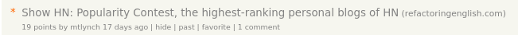
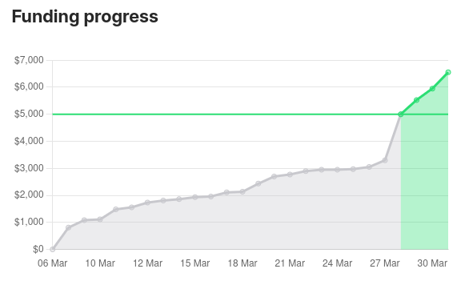

For the past few months, I've been working on a book called [_Refactoring English: Effective Writing for Software Developers_](https://refactoringenglish.com).

I didn't want to spend a year writing the book only to find out that nobody wanted to buy it, so at the beginning of March, I ran a one-month pre-sale on Kickstarter. I structured the project so that if I didn't hit $5k in pre-orders, the project would be canceled, and I'd walk away with nothing.

Over the weekend, I hit my goal. As of this writing, I've reached $6,000 in pre-orders from 174 customers with eight hours remaining in the sale.

{{}}

To the casual observer, it looks like I hit my goal comfortably.

In reality, for most of the month, I thought the book had failed, and I felt embarrassed about how poorly the pre-sale had gone.

Here's what pre-orders looked like just four days ago:

{{}}

Sales had long since plateaued. I'd already exhausted every idea I had for finding customers, and I was still $2,000 from my goal.

The thing that saved me was a lucky post on Hacker News.

{{}}

## Before the pre-sale

I started working on _Refactoring English_ back in 2021. As soon as I started, my main business grew unexpectedly, and I spent so much time managing my company that I [never had time to work on the book](/solo-developer-year-4/#refactoring-english).

Until 2025, all I had of the book was a rough table of contents and a signup form for email updates about the book.

{{}}

This year, I started working on the book again, and I published a couple of [sample chapters](https://refactoringenglish.com/chapters). I heard positive feedback from readers, but I wasn't sure if any developers would pay to read a book about improving their writing skills.

At the beginning of March, I decided the best way to see if this book was worth writing would be to do a one-month pre-sale of the book. I created [a Kickstarter project](https://www.kickstarter.com/projects/mtlynch/refactoring-english) for the book and let people pre-order the book for $25.

I set the project goal at $5k. I figured that would mean about 150 pre-orders plus some generous readers signing up for premium tiers to support the project.

## My underwhelming first blog post

I wanted to launch the pre-orders on Kickstarter right after I published a new sample chapter as a blog post. I hoped the blog post would be popular, and then readers would get to the end of the post and see that I'm working on a book and think, "I like this guy's ideas so much that I'd pay $25 for more of them."

So I published ["How to Write Useful Commit Messages"](https://refactoringenglish.com/chapters/commit-messages/) and put a little self-ad at the bottom for the pre-sale on Kickstarter:

{{}}

I emailed the book's mailing list to share the new chapter and announce the pre-sale on Kickstarter.

1,100 people had signed up for updates about the book, but when I offered pre-orders, only 49 people ordered. That didn't bode well. Maybe they weren't that interested after all? Or maybe they didn't like what I was writing?

{{}}

But that was okay. I still had other ideas for marketing my book.

## My secret weapon

Even though my book's pre-sale started slower than I'd hoped, I secretly had an ace up my sleeve.

A month earlier, I'd written a blog post called ["My Seventh Year as a Bootstrapped Founder."](/solo-developer-year-7/) I [submitted it to Hacker News](https://news.ycombinator.com/item?id=42932492), and it immediately shot to the #1 position on the front page. It had 45 upvotes and was growing quickly.

Sadly, within minutes, the Hacker News moderators removed my post.

I reached out to the Hacker News moderators, and they explained that I had submitted my annual retrospective too soon after my previous post, ["Lessons from my First Exit."](/lessons-from-my-first-exit/) They felt like the content was too similar, but I was welcome to try again after there had been two or three months of distance from the previous post.

The moderator's decision was a bit odd because the two posts don't overlap much, and it had _already_ been two months between posts. But I find Hacker News moderation extremely fair overall, so I figured I'd just wait a month.

So, now, the moderators removing my post actually worked in my favor. I had a post that I knew would succeed on Hacker News, and I could submit it during the pre-sale for my book to attract readers interested in pre-ordering.

I submitted my annual retrospective to Hacker News again, but, this time, it barely made a blip. It got a paltry two upvotes:

{{}}

I tried again on a weekend, as there's less competition outside of the work week, and it did even worse:

{{}}

How could Hacker News love this post so much in February and then completely ignore it a few weeks later?

## No longer my favorite git commit

But I had another idea. There was a 2019 blog post called ["My Favourite Git Commit"](https://dhwthompson.com/2019/my-favourite-git-commit) that was popular on [Hacker News](https://news.ycombinator.com/item?id=21289827) and [the /r/programming subreddit](https://www.reddit.com/r/programming/comments/djnp8k/my_favourite_git_commit/). While I was writing "How to Write Useful Commit Messages," I had an insight about that post that hadn't been part of the conversation before, so I thought that would make a good blog post.

I wrote a new blog post called ["No Longer My Favorite Git Commit"](/no-longer-my-favorite-git-commit/) and submitted it to Hacker News, but it flopped too.

{{}}

I was growing concerned, as Hacker News usually has a better response to my writing, and I now had two consecutive flops. Still, I was hopeful that I could get something to land by the end of the month.

## Unsuccessfully begging for sponsorships from companies

There are companies like [Digital Ocean](https://www.digitalocean.com/) and [LogRocket](https://logrocket.com/) that invest a lot into writing high-quality blog posts for developers, so I was curious to see if they'd sponsor my book, as it's about high-quality writing for developers.

I [had the sponsorship idea](/retrospectives/2025/03/#fundraising-how-its-going-so-far) from the start of the pre-sale, but I wanted to approach potential sponsors with some momentum behind me. I thought I'd approach companies right after a super popular blog post and show them how many readers would see their logo.

With only 10 days left in the sale, I hadn't had any hit posts, and my pre-sale had clearly stalled. I felt like my pitch came across like begging for pity or a bailout.

I reached out to ten companies, and here were the results:

- One offered $1k to buy a page in the book's acknowledgments section and a banner ad on the website.
  - I asked whether they'd be open to something time-limited, as I didn't want a "forever" obligation, and they stopped responding.
- One was interested but then stopped responding when they realized I wanted them to purchase the sponsorship through Kickstarter.
- One gave a quick, polite "no."
- Seven (the rest) never responded.

## What if I outright pander to Hacker News?

Last summer, I was curious who the most popular personal bloggers were on Hacker News, so I wrote some ugly Python scripts to crunch the data and show me the rankings. After another 5-10 hours of work, I polished my tool into a usable web app to promote my book.

{{}}

I was extremely confident this tool would be a hit on Hacker News.

Hacker News loves analyses of Hacker News itself, and they generally have a fondness for personal blogs. The tool also qualified for [Show HN](https://news.ycombinator.com/show), the special category for showing off things you built yourself, which gets a special advantage in reaching the front page.

As always, there are never guarantees on Hacker News, but I've never been more confident in a post reaching the top 10.

It didn't reach the top 10.

It barely even appeared on the front page at all.

{{}}

## Finally, a bit of Hacker News success

A few days later, I was browsing Hacker News and saw a post called "The highest-ranking personal blogs of Hacker News."

{{}}

What?!?

Someone had stolen my idea!

Oh, wait. It was a link to my site.

{{}}

Another Hacker News user had just submitted my tool (nothing wrong with that). For whatever reason, their submission caught on even though my previous attempt failed. My guess is that it was better without the "Popularity Contest" title.

But, finally, I was on the front page! From there, it got the attention of [John Gruber](https://en.wikipedia.org/wiki/John_Gruber) (co-inventor of Markdown), who wrote a [blog post about my tool](https://daringfireball.net/2025/03/the_website_hacker_news_is_afraid_to_discuss).

In two days, 20k people had visited the _Refactoring English_ website to try out my tool.

{{}}

I checked out how Kickstarter was doing: virtually no change.

{{}}

Between the day the tool was on Hacker News and the next day when John Gruber blogged about my tool, there were only four sales for a total of $100. The pre-orders were indistinguishable from days I wasn't on the front page at all.

So, that was yet another bad sign.

I got my book in front of my target audience, and none of them were interested in buying the book.

## The miraculous comeback

By this point, there were only five days left in the pre-sale, and I had only raised 60% of my $5k pre-sale goal.

I thought for sure my book was a failure. I was already debating between scrapping the project entirely or pivoting to a less ambitious book that I could finish in just a few more weeks of work.

I had one last hope: [a sample chapter about blogging](https://refactoringenglish.com/chapters/write-blog-posts-developers-read/). I'd been working on it for the past few weeks, and it was the last chapter I had time to finish by the end of the month.

The problem with writing about blogging is that there's so much low-quality, spammy advice that readers are skeptical, and a lot of the communities where you'd want to share your article have strict rules against self-promotion.

That's why I was unsurprised when I [posted the chapter to reddit](https://www.reddit.com/r/programming/comments/1jl3wgw/how_to_write_blog_posts_that_developers_read/), and users downvoted it to zero. The [top comment](https://www.reddit.com/r/programming/comments/1jl3wgw/how_to_write_blog_posts_that_developers_read/mk0elxt/) was someone complaining about the topic itself:

{{}}

I submitted the chapter to Hacker News, and it slowly accrued a few upvotes and comments but never got enough momentum to hit the front page.

{{}}

Because my "Popularity Contest" tool performed so much better with a different title, I tried submitting it the next day with the title, "What I Learned from Nine Years of Blogging." Hacker News immediately marked it as a duplicate.

Huh? Usually, you can resubmit a failed post a day later, and it doesn't count as a duplicate.

And then I looked on the front page, and my post was there! Another user had posted it on my behalf, and it had reached the #11 spot.

{{}}

And this time, readers were interested in the book. Within a few hours, there were $1,000 in new pre-orders. The chapter continued getting positive reactions on Hacker News, eventually reaching 581 upvotes and 154 comments:

{{}}

When I went to bed that night, the Kickstarter was less than $300 from its $5k goal with three days left.

When I woke up Saturday morning, I had reached my goal, and people continued pre-ordering.

{{}}

The pre-sale ended with $6,551 in sales from 191 customers.

{{}}

{{}}

## I get to write my book!

I never expected such a dramatic end to the pre-sale. The project came within a hair of failing, and the only thing that saved it was Hacker News picking up that longshot sample chapter.

I'm extremely thankful to everyone who supported the project.

I've wanted to write this book for the past four years, and I'm excited that people pre-ordered and gave me confidence that there are enough interested readers for me to invest the next several months into this book.

## Links

- [_Refactoring English_](https://refactoringenglish.com) - Sample chapters and additional information about the book.
- [Sign up for email updates about the book](https://buttondown.com/refactoring-english)
