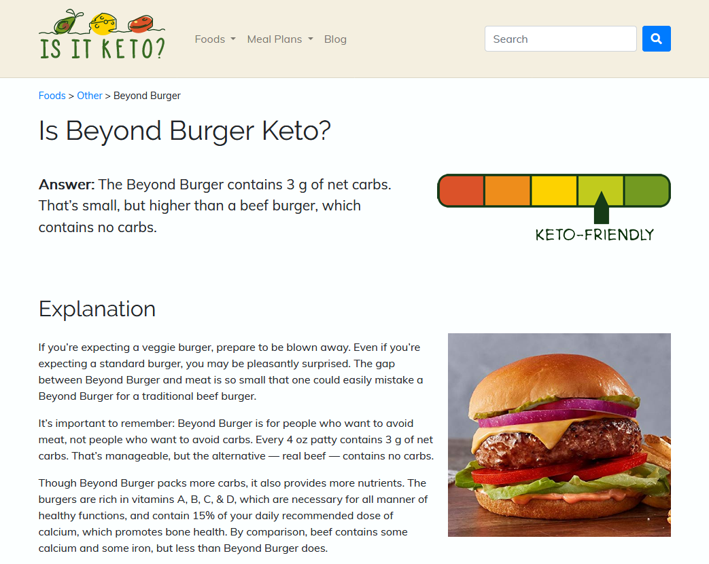

Eight years ago, I [quit my job as a developer at Google](/why-i-quit-google/) to create my own bootstrapped software company. Every year, I [post an update](/tags/annual-review/) about how that's going and what my life is like as an indie founder.

Last year, I [sold my first profitable business](/i-sold-tinypilot/) and [became a father](/bootstrapped-founder-year-7/#i-became-a-new-parent), so I've been trying to figure out what I can do to make money and balance my work with family time.

## How finances went

People are always most interested in how money works as an indie founder, so I'll start there. Here's what my revenue and profit looked like every month this year.

<canvas id="monthly-finances-chart"></canvas>

In total, I had $8.2k in profit on $16.3k in revenue. That was my total income for the year, which is obviously not enough to support a family, but my wife also works, and we have savings/investments.

My main source of revenue was [my book](https://refactoringenglish.com). I'm writing a book to teach developers to improve their writing. I did a Kickstarter for it in March, which gave me [$6k in pre-sales](/my-6k-advance/). As I wrote, I continued to sell discounted early access to the book. In total, 422 readers purchased early access to the book, for which I'm grateful. I also have an [old business](/bootstrapped-founder-year-1/#zestful) that makes $100-200/month without me touching it.

My main expenses were computer hardware ($2.1k) and LLMs ($1.9k). I don't use AI to write, but I use it for a lot of the accessory tasks like fixing rendering/layout and improving the website. I also use it for [my open-source projects](https://codeberg.org/mtlynch?tab=repositories).

Here's how 2025 compared to previous years:

<canvas id="annual-finances-chart"></canvas>

The years I was running TinyPilot dominate the chart. Still, 2025 was my fourth most profitable year as a founder.

My goal for the year was $50k in profit, so I fell quite short (more on that [below](#earn-50k-in-profit)).

## Why does it take so long to write a book?

When I tell other software developers that I'm writing a book, they usually say something like, "Oh, great!"

Then, they pause, a little confused, "To give you time for freelance dev work?" And I have to say, "No, I'm _just_ writing a book. That's my whole job."

When I tell friends and family I'm working on a book, they innocently ask, "Oh, so you're still on paternity leave?"

No! I'm writing a book. It's a real job!

But if I'm being honest, I understand their confusion. How can writing a book be my job? I'm not a novelist.

When I started the book, I thought I'd be done in six months. I typically write almost a book's worth of blog posts per year, and that's just from writing for an hour a day. If I focus exclusively on writing a book, I should be done in 1/8th the time!

It turns out that even when all I have to do is write, I can still only write for about an hour per day. After that, I feel drained, and my writing quality degrades rapidly.

I also can't _just_ write a book. I also need to find people to read the book, so I wrote blog posts and published chapter excerpts. I normally write 5-10 blog posts per year, but I ended up writing far more in the past year than I ever have before:

- 13 blog posts (8 on [my personal blog](/posts/) and 5 on [my book's blog](https://refactoringenglish.com/blog/))
- 12 [monthly retrospectives](/retrospectives/)
- 12 [notes](/notes/) (shorter, less polished blog posts)
- 150 pages of my book, including seven chapters I adapted into [free excerpts](https://refactoringenglish.com/chapters/)

I also started editing blog posts for other developers. That helped me discover other developers' writing pain points and what advice they found effective. I worked with seven clients, one of which was [Tyler Cipriani](https://tylercipriani.com/) on [a post](https://refactoringenglish.com/services/blog-editing/sample-future-of-git/) that reached [#1 on Hacker News](https://news.ycombinator.com/item?id=44916783).

And then there's just a bunch of administrative tasks around writing and selling a book like [setting up mailing lists](/retrospectives/2025/10/#the-hassle-of-sending-post-purchase-emails-with-stripe), [dealing with Stripe](/retrospectives/2026/01/#adding-regional-pricing-for-my-book), [debugging PDF/epub rendering issues](/retrospectives/2025/05/#asciidoctor-so-far-so-good), etc.

## Finding alignment with my business

This has been my favorite year of being a founder since I went off on my own eight years ago. There are a few factors, but one of the biggest is that I found a business that aligns with the things I care about.

When I first started as a founder, I didn't think the particulars of a business mattered. I just pursued any gap in the market, even if it was a market I didn't care about. I'd still get to write software, so wouldn't that be all I needed?

The problem is that most of my time as a bootstrapped founder is not writing code. Especially at the beginning, I have to find customers and talk to them, which is hard when I don't actually care about the product beyond the technical challenge of building it.

Over several years, I found that a business fulfills me most when it meets these five criteria:

1. I enjoy doing it
1. I do it well
1. It earns money
1. It facilitates work-life balance
1. It aligns interests between me and my users

As a concrete example, one of my first businesses back in 2019 was called Is It Keto. It was a simple website that explained whether certain foods fit the keto diet.

{{}}

Here's how Is It Keto scored on my rubric:

### Is It Keto

| Pillar                 | Score | Notes                                                                                                                                                                            |
| ---------------------- | ----- | -------------------------------------------------------------------------------------------------------------------------------------------------------------------------------- | --- |
| Enjoyment              | 🔴    | I didn't care about the keto diet.                                                                                                                                               |
| Competence             | 🔴    | I wasn't good at building websites, finding users, or convincing anyone to buy things.                                                                                           |
| Profitability          | 🔴    | The site was [not profitable](/retrospectives/2020/07/#is-it-keto).                                                                                                              |
| Work-life balance      | 🟢    | The site was easy to keep online 24/7. Even if there had been an outage, the stakes were so low that I'd only be losing a few dollars of ad revenue per day.                     |
| Founder-user alignment | 🔴    | I only made money if users clicked ads or ordered keto products online. They probably would have been better off buying [real food](https://realfood.gov/) at the grocery store. |     |

Now, let me compare Is It Keto to writing my book:

### _Refactoring English_ (my book)

| Pillar                 | Score | Notes                                                                                                                                                                                                                                                  |
| ---------------------- | ----- | ------------------------------------------------------------------------------------------------------------------------------------------------------------------------------------------------------------------------------------------------------ |
| Enjoyment              | 🟢    | I'm passionate about clear writing and enjoy teaching techniques to other developers.                                                                                                                                                                  |
| Competence             | 🟢    | I feel especially qualified to write about the topic, as I've been blogging for several years, and writing played a key role at every stage of my career.                                                                                              |
| Profitability          | 🟡    | I've made $11.8k from pre-sales, which feels good for a first-time author but is not yet profitable enough to be sustainable.                                                                                                                          |
| Work-life balance      | 🟢    | It's hard to beat an ebook in terms work-life balance. I can comfortably disappear and ignore emails for weeks without negatively impacting anyone. I've never been paged at 2 AM because my servers are down and users urgently need to read my book. |
| Founder-user alignment | 🟢    | My incentives are aligned with my readers because I [only make money if they enjoy the book](https://refactoringenglish.com/early-access/#satisfaction-guarantee), and the book only becomes popular if readers recommend it to friends.               |

The book doesn't check all my boxes perfectly, but it aligns better with my values than any business I've created before.

## Do I still love it?

At the end of [my first year as a founder](/bootstrapped-founder-year-1/), I wrote:

> As someone who has always valued independence, I love being a solo developer. It makes a world of difference to wake up whenever I want and make my own choices about how to spend my entire day.
>
> ...
>
> My friends with children tell me that kids won't complicate this at all.

When I wrote that in 2019, I was in my early thirties, single, and living alone.

A few weeks after writing that post, I had a first date with woman. We moved in together at the end of that year, married a few years later, and had our first child in 2024. Now, there are a lot more people in my house, as my wife and I work from home, and members of our extended family come over every weekday to help with childcare.

Despite all of those changes, my life is still how I described it seven years ago.

Okay, things aren't _exactly_ the same. My toddler decides when I wake up, and it's not always the time his independence-loving father would choose. But I still feel the joy of spending my work days on whatever I choose.

I joked back then how much kids would complicate my life as an indie founder, but it's actually less complicated than I expected. My workdays mostly look the same. Except they're more fun because anytime I want, I can take a break from work to go play with my son.

After several years of [just "enjoying" life](/bootstrapped-founder-year-6/#do-i-still-love-it) as a bootstrapped founder, I'm happy to say that I love it again. I still want to do it forever.

## Lessons learned

### Writing a book takes longer than I expect

I originally thought I'd finish the book in six months, but I'm [13 months in](/retrospectives/2026/01/) and still have about 20% left.

From reading about other developers' experience writing about books, underestimating time seems to be the norm. Teiva Harsanyi thought he'd be done in eight months, but it actually [took 20](https://www.thecoder.cafe/p/100-go-mistakes). Austin Henley started writing a book in 2023 and it dragged on for about two years before he got tired of working with his publisher and [canceled his book deal](https://austinhenley.com/blog/canceledbookdeal.html).

This is kind of an extension of [Hofstadter's law](https://en.wikipedia.org/wiki/Hofstadter%27s_law):

> It always takes longer than you expect, even when you take into account Hofstadter's law.

### I enjoy my work when it feels aligned with me

As much as I love writing code, programming alone isn't enough to make me enjoy my work. I need to find a business that matches my interests, ethics, and skills.

### I can be a bootstrapped founder and a parent

Before I became a parent, I . And in my first few months as a parent, I panicked that parenting takes up so much time that I [wouldn't have time for any work](/retrospectives/2024/10/#ill-be-okay-if-i-dont-work-for-a-bit), much less running my own business.

## Grading last year's goals

Last year, I set [three high-level goals](/bootstrapped-founder-year-7/#goals-for-next-year) that I wanted to achieve during the year. Here's how I did against those goals:

### Earn $50k in profit

- **Result**: I earned $8.2k in profit.
- **Grade**: D

I wasn't confident I'd earn $50k from the book, but I thought I'd have more time for side businesses as I wrote. I also expected to complete the book in just six months, giving me even more time for new business ideas in the second half of the year.

Instead, I spent the full year on the book. It made $11.8k, which feels good for a first-time author but is less than I hoped to earn this year.

I'm still not sure how the book is going to look financially once I complete it. The optimistic outcome is that completing the book increases sales, as there's more demand for a finished book than an almost-finished book. And if I've done my job well, developers will recommend this book to others as something that improved their writing.

### Publish a course or book

- **Result**: I'm about 80% done with my book.
- **Grade**: C

Okay, okay! I didn't finish the book! Enough of your cruel judgment, me from a year ago.

### Learn a new programming language

- **Result**: I experimented with Gleam but didn't reach competence
- **Grade**: D

I [played around with Gleam](/notes/gleam-first-impressions/) and appreciated some aspects of it, but I never got deep enough to feel productive in the language. I tend to learn new languages and technologies when I can match it to a project I'm excited about, but I couldn't think of any project where Gleam was a better fit than other languages I know well like Go or Python.

## Goals for next year

### Earn five book citations

I'd like to find at least five examples of readers who cite my book as a resource that helped them achieve something tangible (e.g., grow their blog readership, get a promotion).

### Earn $75k in profit

I earned $8.2k this year, so I just have to do 9x as well next year. But honestly, I think this is doable if I can keep finding new readers for the book and try a few business ideas.

### Create a profitable software business

I've enjoyed a year of writing, but I'd like to do more software development, as that's still what I find most exciting.



---

_Cover image by [Piotr Letachowicz](https://cartoony.eu)._
