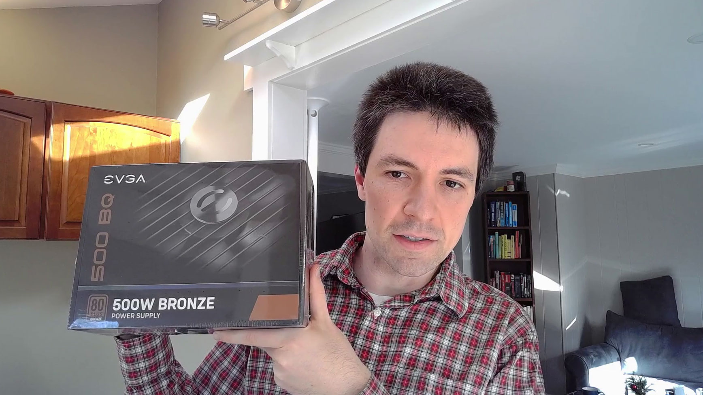

This year, I decided to build my first ever home storage server. It's a 32 TB server that stores all of my personal and business data using all open-source software.

The server itself cost $531, and I bought four disk drives for $732, bringing the total cost to $1,263. It's similar in price to off-the shelf storage servers, but it offers significantly more power and customizability.

In this post, I'll walk through how I chose the parts, what issues I ran into in the build, and my recommendations for anyone interested in building their own.

- [Background](#background)
- [Storage planning](#storage-planning)
- [How I chose parts](#how-i-chose-parts)
- [Build photos](#build-photos)
- [Benchmarking performance](#performance-benchmarks)
- [Final thoughts](#final-thoughts)


{{}}
{{}}


If you'd prefer a video explanation instead, I recorded one on YouTube.

## Background

### What's a NAS server?

NAS stands for network-attached storage. A NAS server is just a server you can keep whose purpose is to store data and make it available to computers within your home network.

But every computer stores data. Why have a whole dedicated server for data?

I like decoupling data storage from my computers. I upgrade my main workstation every two to three years, and moving my data was always a pain. Solid state drives continue to get faster, and that's usually one of the biggest bottlenecks, but it was a pain to move all of my data from

I also have a _lot_ of data. I'm a data hoarder, so I have every digital photo I've ever taken, all of my notes from college, and the source code for every personal project.

The biggest data source is my my DVD and Blu-Ray collection. I don't like relying on streaming services to keep good content available, so I still buy physical copies of movies and TV shows. As soon as I get a new disc, I rip it so that I have it available on my computer and can stream it to my TV. Between the raw ISO copy and the streamable MP4s, a single disc can take up around 60 GB of disk space.

{{}}

### What's a homelab?

"Homelab" is a colloquial term that's grown in popularity in the last few years. A homelab is a place in your home where you can experiment with hardware or software that people typically use in professional environments.

Many people use homelab servers as low-stakes practice environments before they use the technologies in their day jobs. I use my homelab for software development, as I keep [each project in its own virtual machine](/building-a-vm-homelab-2017/#why-vms).

### Why build your own NAS?

If you're new to the homelab world or you have no experience building PCs, I recommend that you **don't build your own NAS**.

There are off-the-shelf solutions that offer most of the same functionality and with a substantially better user experience.

Before building my own homelab NAS, I used a Synology DS412+ that I used for seven years. Honestly, I loved my Synology. It was one of the best purchases I ever made. It was a gentle introduction into the world of NAS servers, and it's where I'd recommend you start if you're not sure about the whole NAS thing.

As much as I love my Synology, I detest platform lock-in. I had configured my Synology using Synology Hybrid RAID, a proprietary storage format that allows you to mix disks of different sizes.

A few months ago, my Synology started to make a clicking noise. I started to worry that XX years in, it didn't have much time left. Synology devices are not user-repairable. If a part breaks and you're past warranty, you have to replace the whole server. And if you've short-sightedly used a Synology-proprietary storage format, you can't access the data on your disks unless you buy another Synology sytem.

Fortunately, my Synology's clicking went away, but it was a wake up call how dependent I'd let myself become on that NAS. I decided to switch to something open source and open standards, so I decided on TrueNAS.

### TrueNAS and ZFS

TrueNAS (formerly known as FreeNAS) is one of the most popular storage servers. I also see a lot of people talk about Unraid, and it looked nice, but I wanted something open-source.

TrueNAS uses [ZFS](https://docs.freebsd.org/en/books/handbook/zfs/), a filesystem designed specifically for storage servers. Most filesystems like NTFS on Windows or ext4 run on top of a separate disk volume system that manages low-level disk I/O. ZFS manages everything in the stack from the filesystem down to the disk I/O, which gives it more power and performance than other filesystems.

Some neat features of ZFS include:

- Aggregating multiple physical disks into a single filesystem
- Automatically repairing data corruption
- Creating point-in-time snapshots of data on disk (similar to OS X's Time Machine feature)
- Optionally encrypting or compressing data on disk

Before building this system, I had zero experience with ZFS, so I was excited to experiment with it.

## Storage planning

When building a storage server, the big question is storage, so before I began, I asked myself a few questions:

- How much disk space do I need?
- How will my storage needs grow over the lifetime of the server?
- How worried am I about disk failures and data loss?
- What am I willing to spend?

Here is how I thought about these concerns.

### Estimating my storage capacity needs

When I bought my Synology NAS, I initially installed three 4 TB drives and left the fourth drive bay empty. That gave me a total of 7 TB space with Synology Hybrid Raid. Three years later, I was running out of space, so I added a fourth drive, bringing my total usable space to about 10 TB.

I decided to apply the same strategy for my new build. I wanted to build a system that met my current needs and still offered room to grow. My rough target was to start with 20 TB of usable storage and capacity for up to 30 TB if I add disks later. ZFS doesn't let you add a new drive to an existing pool, but that feature is [under active development](https://github.com/openzfs/zfs/pull/12225). Hopefully by the time I need to exand storage, the feature is complete and available in TrueNAS.

### Many small disks or fewer large disks?

ZFS is designed to survive disk failures, so it stores each block of data redundantly. This feature makes capacity planning a bit more complicated because your total usable storage is no longer the sum of each disk's capacity.

ZFS creates filesystems out of "pools" of disks. The more disks in the pool, the more efficiently ZFS can use their storage capacity. For example, if you give ZFS two 10 TB drives, you [can only use 10 TB](https://wintelguy.com/zfs-calc.pl) out of your 20 TB capacity. If you instead use five 4 TB drives, ZFS could give you 14 TB of usable storage.

When you're building a NAS server, you need to decide whether to use a smaller quantity of large disks or a larger quantity of small disks. Smaller drives are usually cheaper in terms of $/TB, but they're more expensive to operate. It takes twice as much electricity to run two 4 TB drives than a single 8 TB drive.

I wanted to keep my server on the smaller side, so I opted for fewer, larger drives.

### raidz 1, 2, or 3?

There are a few different ZFS modes: raidz1, raidz2, and raidz3. The main difference is in robustness. raidz1 can survive one disk failure, but you'll suffer data loss if two disks fail at the same time. raidz2 can survive two disk failures without data loss, and raidz3 can survive three.

What you gain in robustness, you pay for in disk space. Given five 4 TB hard drives, here's how much usable storage you'd get from each ZFS mode:

| ZFS type | Usable storage | % of total capacity |
| -------- | -------------- | ------------------- |
| raidz1   | 15.4 TB        | 77.2%               |
| raidz2   | 11.4 TB        | 57.2%               |
| raidz3   | 7.7 TB         | 38.6%               |

I chose raidz1. I think the odds of two drives failing simultaneously in my NAS is fairly low, and I use [restic](https://restic.net) to back everything up to the cloud anyway.

When choosing which ZFS mode to use, don't think "how willing am I to lose data?" Instead ask, "how willing am I to spend several hours recovering my data?" [ZFS is not a backup strategy](https://www.raidisnotabackup.com/). ZFS can protect you against disk failure, but there are many threats to your data that ZFS won't mitigate, such as accidental deletion, malware, or physical theft.

To me, the value of ZFS is that I don't have to resort to my cloud backups if one drive dies. With raidz1, I'll have to recover from backups if two drives fail, which is a pain but not the end of the world. To me, it's not worth giving up 20+% of my server's usable storage for raidz2.

The more physical drives you have, the more defensive you should be about disk failure. If I had a pool of 20 disks, I'd probably use raidz2 or raidz3.

### Preventing concurrent disk failures

raidz1 protects me if one disk fails. If two or more drives fail at once, I'll suffer data loss.

Based on [Backblaze's stats](https://www.backblaze.com/blog/backblaze-hard-drive-stats-for-2020/), the average failure rate of each disk is 0.5-4% per year. Naively, the probability of two disks failing at once would seem vanishingly small. But disks aren't statistically independent. If one disk fails, the odds of another disk failing are much higher if it's the same model, from the same manufacturing batch, and it spent its life in the same environment processing a similar workload. Given this, I did what I could to reduce the risk of concurrent disk failures.

I chose two different models of disk from two different manufacturers. To reduce the chances of getting disks in the same manufacturing batch, I bought the disks from different vendors. I can't say how much this matters, but it didn't increase costs significantly, so why not?

## How I chose parts

### Motherboard

The first decision was motherboard size. My Synology DS412+ was nice and compact, and I liked that form factor. I've never built a computer with a mini-ITX motherboard before, and this seemed like a good opportunity.

I chose the [ASUS Prime A320I-K](https://www.newegg.com/asus-prime-a320i-k/p/N82E16813119200) for a few reasons:

- It has four SATA ports, which would allow me to connect four disks directly to the motherboard.
- It supports Radeon graphics, which would spare me from buying a separate graphics card

I also looked at the B450, which was very similar, but it was almost twice the price, and the main advantage seemed to be better overclocking support, which I didn't need.



**Warning**: I regret this choice of motherboard. See more discussion [below](http://blog:1313/budget-nas/#motherboard-1).



### CPU

From what I read, ZFS is not very CPU-intensive. I ran a basic test by installing TrueNAS on a cheap Dell OptiPlex 7040 mini PC. It barely used the CPU, so it seemed safe to go with a low-powered CPU.

The important thing to me was to find a CPU that supported Radeon graphics so that I could use my motherboard's onboard HDMI output.

{{}}

I settled on the AMD Athlon 3000G. At only $105 it's a good value, and it has decent [CPU benchmarks](https://www.cpubenchmark.net/cpu.php?cpu=AMD+Athlon+3000G&id=3614).

Normally, I'd buy a third-party CPU fan for more efficient cooling, but for this build, I just used the CPU's stock fan. I wasn't worried about the CPU absorbing heavy workloads, and I didn't want to worry about verifying that a larger fan would fit in a mini-ITX case.

### Case

When I built my last VM server, I [used a Fractal Design case](/building-a-vm-homelab/#case). It's my favorite computer case ever, so stuck with Fractal Design on this build.

I went with the [Fractal Design Node 304 Black](https://www.newegg.com/black-fractal-design-node-304-mini-itx-tower/p/N82E16811352027), a compact mini-ITX case. I liked the design because it's closer to a cube than a tower. It has six drive bays, which would let me start with enough drives now with room to grow in the future.

{{}}

### Disk (Data)

The biggest decision was the disk. I wanted to find quiet, high-performance disks with low probability of disk failure.

To limit failure rate, I checked average failure rate (AFR) [on Backblaze](https://www.backblaze.com/blog/backblaze-hard-drive-stats-for-2020/), to avoid especially failure-prone disks, but I didn't hyper-optimize for low failure rate. It's irrational to pay twice as much for a drive that has a failure rate of 0.5% rather than 1%. You're spending twice the money to reduce failure rate by only 0.5%.

The Fractal Design Node 304 has six drive bays, so I decided to start with four 8 TB disks. With raidz1, that would give me 22.5 TB of usable storage to start. When I need to expand in the future, a fifth disk will bring me to 30.9 TB, and a sixth would get me 37 TB.

In the 8 TB range, there aren't many drives below 7200 RPM, but you can go up to 10k RPM. For my NAS, speeds above 7200 RPM wouldn't make a difference because the bottleneck is the network. A 10k RPM drive would be louder and consume more power but offer no practical gain in performance.

The last pitfall to avoid is disks that use shingled magnetic recording (SMR) technology. ZFS [performs poorly on SMR drives](https://www.servethehome.com/wd-red-smr-vs-cmr-tested-avoid-red-smr/), so if you're building a NAS, avoid [known SMR drives](https://www.truenas.com/community/resources/list-of-known-smr-drives.141/). If the drive is labeled as CMR, that's conventional magnetic recording (CMR), which is fine for ZFS.

I chose the [Toshiba N300](https://www.newegg.com/toshiba-n300-hdwg480xzsta-8tb/p/N82E16822149793) and the [Seagate IronWolf](https://www.newegg.com/seagate-ironwolf-st8000vn004-8tb/p/N82E16822184796). I saw positive reviews of these drives on the TrueNAS forums as well as on reddit. Both models sold for $180-190, which was a good value for the storage space.


{{}}
{{}}


### Disk (OS)

I need a dedicated disk to install the TrueNAS OS, but from what I'd read, TrueNAS doesn't demand much of its OS disk. The OS needs at least 2 GB of space, but it otherwise doesn't read or write much to the OS disk.

{{}}

I went with the Kingston A400 because it was incredibly inexpensive &mdash; $32 for a 120 GB M.2 disk. And I love M.2 disks. They don't require any cabling. They just tuck away into the motherboard, take up nearly zero space, and you never have to touch them again.

### Memory

I find memory extremely boring to shop for. I wish I had a more rigorous process for choosing RAM, but I couldn't find trustworthy bechmarks or user reports for RAM performance the way I could with other components. My process was:

1. Review the list of RAM sticks [compatible with the ASUS A320I-K motherboard](https://www.asus.com/Motherboards-Components/Motherboards/CSM/PRIME-A320I-K-CSM/HelpDesk_QVL/)
1. Filter for 32 GB or 64 GB options that used only two sticks
1. Filter for brands I trust (Corsair, Crucial, G.SKILL, Kingston, Samsung, Patriot, Mushkin, HyperX)
1. Filter for options below $150

That process led me to the [CORSAIR Vengeance LPX 32GB CMK32GX4M2A2400C14 (2 x 16GB)](https://www.newegg.com/corsair-32gb-288-pin-ddr4-sdram/p/N82E16820233854). At $128, they seemed like a good match for my server with

{{}}

### Power supply unit (PSU)

When purchasing a PSU, the choices you can make are around cable modularity, power capacity, and efficiency.

Cable modularity refers to how much control you have over the PSU's cabling. Non-modular PSUs come with every cable you could possibly need all attached, and if you don't need some cables, you just have to tuck them away someplace in the case. Full modular PSUs are the opposite &mdash; each cable is removable, so you only need to install the cables you need. Semi-modular is the happy medium where you can attach and remove cables a la carte, but they're grouped together more than they are with a fully modular PSU.

I wanted a modular PSU to minimize cable clutter in my case, especially since my server wouldn't have many components that required power. I only needed to power the motherboard, CPU, and disks, so for me the difference between a fully modular and semi-modular PSU is that fully modular would have provided me separate cables for motherboard and CPU. I preferred fewer distinct cables, so I went with semi-modular.

In terms of power capacity, basically any consumer PSU would have provided more than enough wattage. According to PCPartPicker, my system only requires 218 W. I would have picked a PSU in the 300-400 W range, but to find semi-modular PSUs in that range. I went with the 500 W [EVGA 110-BQ-0500-K1](https://www.newegg.com/evga-500-bq-110-bq-0500-k1-500w/p/N82E16817438101).

{{}}

There are different ratings for PSUs like bronze, silver, gold, platinum that reflect the power efficiency. The differences are fairly small, and they reflect performance at peak load, which is not very meaningful for me. I didn't optimize for power efficiency.

### 90-degree SATA cables

{{}}

One item I've never purchased before was these 90-degree SATA cables. I didn't realize I needed them until I tried connecting all the disks and realized there wasn't enough space to plug in a standard SATA cable. These slim 90-degree cables solved the problem.

{{}}

## What's missing?

There are a few components that I intentionally excluded from my build due to price, complexity, or physical space.

### Graphics card (GPU)

With scarce physical space and motherboard ports, I didn't want a dedicated graphics card. I chose a motherboard and CPU combination that supported graphics rendering without an external card.

### Host bus adaptor (HBA)

Many NAS builds include a [host bus adaptor](https://www.truenas.com/community/threads/whats-all-the-noise-about-hbas-and-why-cant-i-use-a-raid-controller.81931/). An HBA is a chip that goes into the PCI slot of a motherboard and increases the number of disks the motherboard can support.

To use the an HBA with ZFS, you need to [reflash the firmware](https://www.servethehome.com/ibm-serveraid-m1015-part-4/) in a process that sounds very tedious and confusing. I decided to punt on the HBA until I need more storage. My motherboard had four SATA ports, so I could start with four disks just by using the available SATA ports. I made sure to leave a PCI slot available for that purpose.

### ECC RAM

In researching different TrueNAS builds, I saw several recommendations that said error correction code (ECC) RAM was a must-have to prevent data corruption. I ultimately decided against ECC RAM and just used standard, consumer-grade RAM.

While I obviously don't want my server to corrupt my data in RAM, I've also been using computers for the past 30 years without ECC RAM, and I've never noticed data corruption. If I was building a server that was going to be under heavy load from multiple users all day, then I'd spring for a build with ECC RAM. But for home needs, I think simple consumer-grade RAM should be fine.

### SLOG disk

Many ZFS builds include a separate, dedicated disk called the [SLOG (separate intent log)](https://www.truenas.com/docs/references/slog/). The SLOG [improves write speeds](https://www.servethehome.com/exploring-best-zfs-zil-slog-ssd-intel-optane-nand/) significantly.

People generally use a high-performance SSD as their SLOG. The idea is that writing to an SSD is orders of magnitude faster than writing to multiple spinning disks. When an application writes data, ZFS can quickly write it to the SSD, tell the application that the write succeeded, then asynchronously move the data from the SSD to the storage pool.

I decided against a SLOG disk because I'm limited by ports and drive bays. Adding a SLOG disk meant either forfeiting my only PCI slot or one of my six drive bays. I'd rather leave myself room to expand capacity later.

If I were building a rack-mounted server with 16 drive bays, I definitely would have reserved one for a SLOG disk, but it didn't seem worth it in my build. Most of my disk operations on this server will be over the network. I suspected that my network would be the dominant bottleneck.

## Parts list

| Category                    | Component                                                                                                                            | I paid        |
| --------------------------- | ------------------------------------------------------------------------------------------------------------------------------------ | ------------- |
| CPU                         | [AMD Athlon 3000G](https://www.newegg.com/amd-athlon-3000g/p/274-000M-001B8)                                                         | $105.13       |
| Motherboard                 | [ASUS Prime A320I-K](https://www.newegg.com/asus-prime-a320i-k/p/N82E16813119200)\*                                                  | $97.99        |
| Graphics                    | None needed &mdash; motherboard has native graphics support                                                                          | $0            |
| Disk (OS)                   | [Kingston A400 120GB](https://www.newegg.com/kingston-a400-120gb/p/N82E16820242474)                                                  | $31.90        |
| Memory                      | [CORSAIR Vengeance LPX 32GB CMK32GX4M2A2400C14 (2 x 16GB)](https://www.newegg.com/corsair-32gb-288-pin-ddr4-sdram/p/N82E16820233854) | $127.99       |
| Power                       | [EVGA 110-BQ-0500-K1 500W 80+ Bronze Semi-Modular](https://www.newegg.com/evga-500-bq-110-bq-0500-k1-500w/p/N82E16817438101)         | $44.99        |
| Case                        | [Fractal Design Node 304 Black](hhttps://www.newegg.com/black-fractal-design-node-304-mini-itx-tower/p/N82E16811352027)              | $99.99        |
| SATA cables                 | [Silverstone Tek Ultra Thin Lateral 90 Degree SATA Cables](https://www.newegg.com/p/N82E16812162042) (x2)                            | $22.30        |
| **_Total (without disks)_** |                                                                                                                                      | **_$530.29_** |
| Disk (Storage)              | [Toshiba N300 HDWG480XZSTA 8TB 7200 RPM](https://www.newegg.com/toshiba-n300-hdwg480xzsta-8tb/p/N82E16822149793) (x2)                | $372.79       |
| Disk (Storage)              | [Seagate IronWolf 8TB NAS Hard Drive 7200 RPM](https://www.newegg.com/seagate-ironwolf-st8000vn004-8tb/p/N82E16822184796) (x2)       | $359.98       |
| **Total**                   |                                                                                                                                      | **$1,263.06** |

\* Caveat: This motherboard may not work out of the box with the AMD Athlon 3000G CPU. See details [below](/budget-nas/#is-this-bios-version-incompatible-or-am-i-an-idiot).

## Compared to off-the-shelf products

For comparison, here are some off-the-shelf solutions at similar price points.

| Product       | 2022 Budget NAS                                                           | Synology DS920+                                                                          | QNAP TS-473A-8G-US                                                                 |
| ------------- | ------------------------------------------------------------------------- | ---------------------------------------------------------------------------------------- | ---------------------------------------------------------------------------------- |
| Disk bays     | 6                                                                         | 4                                                                                        | 4                                                                                  |
| RAM           | 32 GB                                                                     | 4 GB                                                                                     | 4 GB                                                                               |
| Max RAM       | 32 GB                                                                     | 8 GB                                                                                     | 8 GB                                                                               |
| CPU benchmark | [4479](https://www.cpubenchmark.net/cpu.php?cpu=AMD+Athlon+3000G&id=3614) | [3002](https://www.cpubenchmark.net/cpu.php?cpu=Intel+Celeron+J4125+%40+2.00GHz&id=3667) | [4588](https://www.cpubenchmark.net/cpu.php?cpu=AMD+Ryzen+Embedded+V1500B&id=4304) |
| Price         | $530.29                                                                   | $549.99                                                                                  | $549                                                                               |

The total cost of my build is similar to off-the-shelf solutions, but I get more value for my money. I have 8x as much RAM, and I'm not locked in to any closed-source, vendor-specific OS platform.

## Build photos

{{}}

{{}}

{{}}

{{}}


{{}}
{{}}


{{}}

{{}}

## Building the server with TinyPilot

Longtime readers of this blog will recall that I built a device on top of the Raspberry Pi specifically for building and managing headless servers. It's called [TinyPilot](/tinypilot/). This was the third server I've built with TinyPilot and the first I built with the new TinyPilot Voyager 2.

I'm obviously biased, but building this server with the Voyager 2 was a great experience. I never had to connect a keyboard or monitor to the server. I could monitor video output, boot to BIOS, and mount the TrueNAS installer image from the TinyPilot browser window.

The one place where TinyPilot fell down was in upgrading the BIOS. TinyPilot can mount disk images like `.img` and `.iso` files, but it doesn't yet know how to share raw files with the target computer. When I needed to load the XX files for the ASUS BIOS upgrade, I shamefully put them on a USB thumbdrive instead of keeping it a pure TinyPilot build. But I hope to add that feature soon so that my next BIOS upgrade can be all TinyPilot.

## Is this BIOS version incompatible? Or am I an idiot?

I got the system to power on, but there was no video display. Oh no! Did I misunderstand what was required for the motherboard's on-board video to work?

After some research, I saw some comments that the ASUS Prime A320I-K requires a BIOS upgrade before it can work with the Athlon 3000G. I recalled breezing by that warning when I was selecting parts. "I've done BIOS updates," I thought. They're no big deal! I didn't consider how I'd do a BIOS _without a CPU_.

I caught a lucky break when I realized the Ryzen 7 CPU from my [2017 homelab VM server](/building-a-vm-homelab-2017/) was compatible with the ASUS Prime A320 [from BIOS version 0212](https://www.asus.com/us/Motherboards-Components/Motherboards/PRIME/PRIME-A320I-K/HelpDesk_CPU/). I borrowed the CPU and GPU from that server, and I got my new NAS server to boot!

{{}}

Strangely, even after I got the system to boot with borrowed parts, the motherboard reported that it was running BIOS version 2203, which ASUS claims _is_ compatible with the AMD Athlon 3000G CPU.

{{}}

After upgrading to 5862, I _still_ couldn't get a boot. Then, I realized that I was plugging in my HDMI cable into the server's DisplayPort output.

{{}}

Was this whole parts-borrowing rigamarole even necessary? There are two possibilities:

- I'm dumb and didn't notice I had my HDMI cable plugged into a the motherboard's DisplayPort output until after I upgraded the BIOS.
- ASUS is dumb, and they incorrectly listed the Athlon 3000G as compatible with BIOS version 2203 when it isn't.

Normally, I'd accept the blame, but the ASUS BIOS was so flaky that the problem might have been on the ASUS side. In any case, I was relieved to finally boot the NAS without any borrowed parts.

{{}}

## Performance benchmarks

One of the surprises to me in writing this up is that I couldn't find any good benchmarking tools for measuring NAS performance. There are tools I can run on the NAS itself that can benchmark local disk writes, but that doesn't reflect real-world usage. A local disk benchmark will miss bottlenecks in the networking stack.

I just made up my own rudimentary benchmark. I [generated two sets of random file data](https://github.com/mtlynch/dummy_file_generator) and then used [robocopy](https://docs.microsoft.com/en-us/windows-server/administration/windows-commands/robocopy) to measure read and write speeds between my main desktop and my NAS. The first fileset is 20 files of 1 GiB each. The other set is 3,072 files of 1 MiB each (3 GiB total). I ran each test three times and took the average result.

I was testing four different variables, so I had 2<sup>4</sup> = 16 test cases total:

1. TrueNAS vs. Synology
1. Read vs. write
1. Encrypted volume vs. unencrypted volume
1. Small files (1 MiB) vs. large files (1 GiB)

This was not a perfectly rigorous test &mdash; I didn't do it on an isolated network, and I didn't shut down all other processes on my desktop while running the test. It's a broad measurement of how this upgrade will affect my NAS performance. It's also not evidence that TrueNAS is better than Synology, as I'm testing a brand new TrueNAS system against a Synology server from eight years ago, so it's not exactly a fair fight.

Performance topped out around 111 MiB/s (931 Mbps), which is suspiciously close to 1 Gbps. It's likely that the limiting factor is the network, as my switch, my desktop's Ethernet port, and the NAS servers' Ethernet ports all max out at 1 Gbps.

### Read performance

For unencrypted volumes, I was surprised to see the 8-year-old Synology outperform my new TrueNAS build. It was XX% faster on small files and XX% faster on large files.

Synology really chokes on encryption. For an encrypted volume, performance flips drastically in TrueNAS' favor. It outperformed Synology by XX% for small files and XX% on large files.

Notably, encryption doesn't seem to affect TrueNAS' performance at all. It performed the same with or without encryption, whereas Synology suffered a XX% slowdown in both read tests.

Read speeds were surprisingly inconsistent on the TrueNAS for small files. For every other test on both servers, performance in each of the three trials was consistent to about 5%. In the tests of small file reads on the TrueNAS, speeds ranged from 33 MiB/s to 54 MiB/s on unencrypted files and 34 MiB/s to 67 MiB/s on encrypted files. I'm not sure where the inconsistency was coming from, as the same tests for 1 GiB files had much less variance.

I keep most of my data on encrypted volumes, so the test with encryption more accurately represents my typical usage.

### Write performance

Although my old Synology managed to outshine TrueNAS on reads, this was not the case for writes. Even on an unencrypted volume, TrueNAS was XX% faster on small files, and the two systems performed almost identically on 1 GiB files.

Again, bringing encryption into the mix obliterates Synology's performance but had no impact on TrueNAS. With encryption enabled, TrueNAS outperforms Synology by XX% on small files and XX% on large files.

<!--

## 1 MiB files unencrypted

```ps
ssh root@truenas "find /mnt/pool1/nas-benchmark-unencrypted/3gib-of-1mib-files/ -name '*.testfile' -delete"
robocopy /s `
  C:\tmp\nas-benchmark-files\3gib-of-1mib-files\ `
  \\truenas\nas-benchmark-unencrypted\3gib-of-1mib-files

```

```ps
rm \\diskstation\nas-benchmark-unencrypted\3gib-of-1mib-files\*.testfile
robocopy /s `
  C:\tmp\nas-benchmark-files\3gib-of-1mib-files\ `
  \\diskstation\nas-benchmark-unencrypted\3gib-of-1mib-files

```

## 1 MiB files encrypted

```ps
ssh root@truenas "find /mnt/pool1/nas-benchmark-encrypted/3gib-of-1mib-files/ -name '*.testfile' -delete"
robocopy /s `
  C:\tmp\nas-benchmark-files\3gib-of-1mib-files\ `
  \\truenas\nas-benchmark-encrypted\3gib-of-1mib-files

```

```ps
rm \\diskstation\nas-benchmark-encrypted\3gib-of-1mib-files\*.testfile
robocopy /s `
  C:\tmp\nas-benchmark-files\3gib-of-1mib-files\ `
  \\diskstation\nas-benchmark-encrypted\3gib-of-1mib-files

```


## 1 GiB files unencrypted

```ps
ssh root@truenas "find /mnt/pool1/nas-benchmark-unencrypted/20gib-of-1gib-files/ -name '*.testfile' -delete"
robocopy /s `
  C:\tmp\nas-benchmark-files\20gib-of-1gib-files\ `
  \\truenas\nas-benchmark-unencrypted\20gib-of-1gib-files

```

```ps
rm \\diskstation\nas-benchmark-unencrypted\20gib-of-1gib-files\*.testfile
robocopy /s `
  C:\tmp\nas-benchmark-files\20gib-of-1gib-files\ `
  \\diskstation\nas-benchmark-unencrypted\20gib-of-1gib-files

```

## 1 GiB files encrypted

```ps
rm \\truenas\nas-benchmark-encrypted\20gib-of-1gib-files\*.testfile
robocopy /s `
  C:\tmp\nas-benchmark-files\20gib-of-1gib-files\ `
  \\truenas\nas-benchmark-encrypted\20gib-of-1gib-files

```

```ps
rm \\diskstation\nas-benchmark-encrypted\20gib-of-1gib-files\*.testfile
robocopy /s `
  C:\tmp\nas-benchmark-files\20gib-of-1gib-files\ `
  \\diskstation\nas-benchmark-encrypted\20gib-of-1gib-files

```
-->

<!--

# Read


## 1 MiB files unencrypted

```ps
rm C:\tmp\nas-benchmark-files\read-scratch\*.testfile
robocopy /s `
  \\truenas\nas-benchmark-unencrypted\3gib-of-1mib-files `
  C:\tmp\nas-benchmark-files\read-scratch

```

```ps
rm C:\tmp\nas-benchmark-files\read-scratch\*.testfile
robocopy /s `
  \\diskstation\nas-benchmark-unencrypted\3gib-of-1mib-files `
  C:\tmp\nas-benchmark-files\read-scratch

```

## 1 MiB files encrypted

```ps
rm C:\tmp\nas-benchmark-files\read-scratch\*.testfile
robocopy /s `
  \\truenas\nas-benchmark-encrypted\3gib-of-1mib-files `
  C:\tmp\nas-benchmark-files\read-scratch

```

```ps
rm C:\tmp\nas-benchmark-files\read-scratch\*.testfile
robocopy /s `
  \\diskstation\nas-benchmark-encrypted\3gib-of-1mib-files `
  C:\tmp\nas-benchmark-files\read-scratch

```


## 1 GiB files unencrypted

```ps
rm C:\tmp\nas-benchmark-files\read-scratch\*.testfile
robocopy /s `
  \\truenas\nas-benchmark-unencrypted\20gib-of-1gib-files `
  C:\tmp\nas-benchmark-files\read-scratch

```

```ps
rm C:\tmp\nas-benchmark-files\read-scratch\*.testfile
robocopy /s `
  \\diskstation\nas-benchmark-unencrypted\20gib-of-1gib-files `
  C:\tmp\nas-benchmark-files\read-scratch

```

## 1 GiB files encrypted

```ps
rm C:\tmp\nas-benchmark-files\read-scratch\*.testfile
robocopy /s `
  \\truenas\nas-benchmark-encrypted\20gib-of-1gib-files `
  C:\tmp\nas-benchmark-files\read-scratch

```

```ps
rm C:\tmp\nas-benchmark-files\read-scratch\*.testfile
robocopy /s `
  \\diskstation\nas-benchmark-encrypted\20gib-of-1gib-files `
  C:\tmp\nas-benchmark-files\read-scratch

```

-->

### Power consumption

I used a [Kill A Watt P4460 meter](http://www.p3international.com/products/p4460.html) to measure power consumption on the server.

TODO: Measure NAS build.

|      | Synology | 2022 NAS |
| ---- | -------- | -------- |
| Idle | 38 W     | XX       |
| Load | 43 W     | XX       |

## Final thoughts

### CPU

I'm happy with the Athlon 3000G, but it's actually way more powerful than I need. My TrueNAS dashboard reports that CPU load has been 99% idle for the past month of usage:

{{}}

The most important thing about the CPU was that it supported AMD's Radeon video technology, which meant that I didn't need a separate GPU, and it served that purposed. For $105, it was a great deal.

### Motherboard

The biggest flaw with the motherboard was its limited compatibility. The AMD 3000G came out in XX and the XX motherboard came out in XX, so it should have been compatible. It even advertised the BIOS revision it shipped with as compatible with my CPU, but it didn't work until I upgraded to BIOS revision XX.

The BIOS upgrade utility was completely broken. It claimed that I had the latest BIOS when I didn't, so I had to upgrade manually by downloading the files and loading them on a thumbdirve.


{{}}
{{}}


I also missed that the A320I-K supports a maximum of 32 GB of RAM. If I want to expand storage, the server might become RAM-bound because ZFS is so memory intensive.

If I were doing it again, I'd go with the [Gigabyte B550I](https://www.newegg.com/gigabyte-b550i-aorus-pro-ax/p/N82E16813145222). It's $50 more, but it supports 64 GB of RAM, has an extra M.2 slot, and it supports 2.5 Gbps Ethernet.

### Case

I was disappointed in the case. When I built my VM server with the Fractal Design Meshify C, the case [kept delighting me](/building-a-vm-homelab/#my-2020-server-build) with features I'd never seen on other cases. On this build, it was the opposite. I kept thinking, "Why is this a problem in this case when this has never been a problem for me before?"

It looks nice on the outside, but I found it awkward to work in. There was barely any documentation, and some of the case mechanisms weren't obvious.

It's my first mini-ITX build, and I know the case designers have to make sacrifices in the name of minimizing size, so maybe I'm judging too harshly, but I was definitely disappointed.

### Disk (Data)

It's a bit too early to judge disks, so check back in about five years to see how I'm liking them, but so far, so good.

My biggest worry was that they'd be too noisy, but I never hear them at all. The only time I heard them was while running the performance benchmarks. And not during reads or writes, interestingly, but when I was deleting files between tests.

### Disk (OS)

The Kingston A400 is working fine. TrueNAS puts such a minimal load on the OS disk that there isn't much for it to do, but it's been fine. It has 90 GB free, so I could have used an even smaller drive.

There's almost zero disk activity in TrueNAS' reporting. There's a tiny I/O read every week as part of some scheduled task, but that's it.

{{}}

### TrueNAS

Synology's web UI is hard to beat. It's the most elegant and intuitive interface I've ever seen for a network appliance. They do a great job of building an intuitive UI that spares the end-user from understanding a lot of the underlying filesystem details.

TrueNAS has its hacker charm, but I find it a huge step down from Synology in terms of usability. The interface seems designed by someone with a disdain for anything outside the command-line.


{{}}
{{}}


On TrueNAS, it took me several tries to even figure out how to create a new volume and share it on my network with correct permissions. You have to jump between several disconnected menus, and there's no hints about what action you need to perform next. With Synology, it's hard to get it wrong because there's a complete UI flow when you set up a volume where Synology helps you configure it on the network and give users permissions.

I found third-party apps _much_ harder to install on TrueNAS. I use Plex Media Server to stream my movie and TV collection. Plex is a pre-configured plugin on TrueNAS, so this should be one of the easiest apps to install. TrueNAS required an hour of fiddling and searching through documentation.

By comparison, installing Plex on Synology takes about two minutes. You breeze through a user-friendly wizard, and you're done.

I'm sticking with TrueNAS because I care more about platform lock-in than almost anything else. I like supporting open-source software, but if I were recommending a NAS OS to a friend who wasn't as ideologically driven, I'd suggest Synology.

### ZFS

ZFS is cool, but I actually haven't found a need for most of its features beyond RAID. I see people talking about snapshotting, but I haven't found a need. I already have snapshots in my restic backup solution. They're not especially convenient, but I've been using restic for two years, and I only recall needing to find a snapshot once.

## Video

TODO: Link to YouTube video
