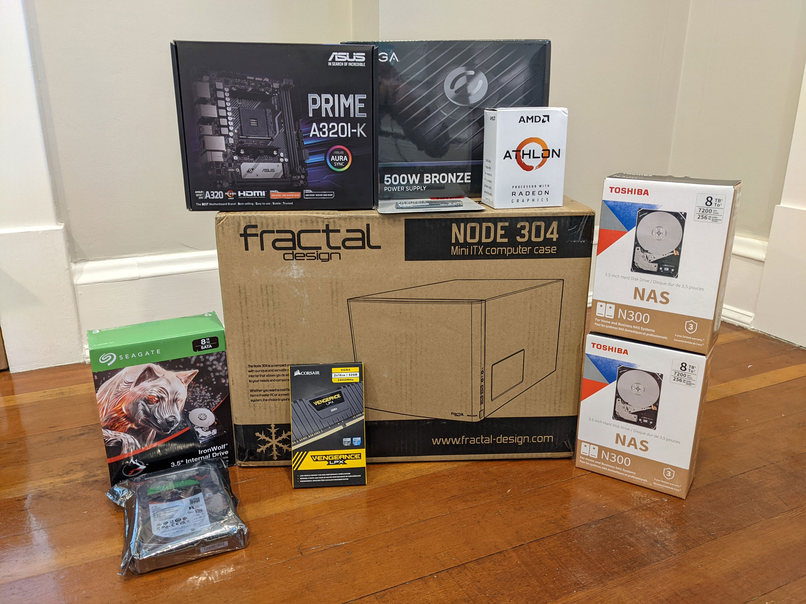

This year, I decided to build my first ever homelab NAS server. It's a 32 TB storage server that I use to keep all of my data.

The server itself cost $531, and I bought four disk drives for $732, bringing the total cost to $1,263. It's similar in price to off-the shelf storage servers, but it offers significantly more power and customizability.

In this post, I'll walk through how I chose the parts, what issues I ran into in the build, and my recommendations for anyone interested in building their own.

- Background
- Parts list
- Build photos
- Reflections


{{}}
{{}}


## What's the point of a NAS server?

NAS stands for network-attached storage. A NAS server is just a server you can keep whose purpose is to store data and make it available to computers within your home network.

But every computer stores data. Why have a whole dedicated server for data?

I like decoupling data storage from my computers. I upgrade my main workstation every two to three years, and moving my data was always a pain. Solid state drives continue to get faster, and that's usually one of the biggest bottlenecks, but it was a pain to move all of my data from

I also have a _lot_ of data. I'm a data hoarder, so I have every digital photo I've ever taken, all of my notes from college, and the source code for every personal project.

The biggest data source is my my DVD and Blu-Ray collection. I don't like relying on streaming services to keep good content available, so I still buy physical copies of movies and TV shows. As soon as I get a new disc, I rip it so that I have it available on my computer and can stream it to my TV. Between the raw ISO copy and the streamable MP4s, a single disc can take up around 60 GB of disk space.

## What's a "homelab server?"

Homelab is a colloquial term that's grown in popularity in the last few years.

Homelab servers are no different from any other servers, except that you build them at home rather than in an office or data center. Many people use homelab servers as low-stakes practice environments before they use the technologies in a real-world business context.

## Why build your own NAS?

If you're new to homelab or you don't have experience building PCs, I recommend that you **don't build your own NAS**. There are off-the-shelf solutions that offer most of the same functionality and with a substantially better user experience.

Before building my own homelab NAS, I used a Synology DSXX that I used for XX years. And honestly, I loved it. It was one of the best purchases I ever made. It was a very gentle introduction into the world of NAS servers, and it's where I'd recommend you start if you're not sure about the whole NAS thing.

As much as I love Synology, I hate platform lock-in. I had configured my Synology using Synology Hybrid RAID, a proprietary storage format that allows you to mix disks of different sizes.

A few months ago, my Synology started to make a clicking noise. I started to worry that XX years in, it didn't have much time left. I've built all the other computers in my home, so if a component breaks, I can just replace that part. Synology devices are not user-repairable. If a part breaks and you're past warranty, you have to replace the whole server. And if you've short-sightedly used a Synology-proprietary data format, you can't access the data on your disks unless you buy another Synology sytem.

Fortunately, my Synology's clicking went away, but it was a wake up call how dependent I'd let myself become on that NAS. I decided to switch to something open source and open standards, so I decided on TrueNAS.

## Why TrueNAS?

There are only two options.

- Proxmox: I'm already familiar with it, but it's much more focused on virtual machine management than acting as a storage server. I wanted an OS dedicated to storage.
- Unraid: Looks nice, but I wanted an open-source solution.

That left TrueNAS (formerly known as FreeNAS).

TrueNAS uses ZFS, which is a whole other technology. I had no experience with ZFS, but it seems like cool technology optimized for large disks.

## How I planned disk capacity

When I bought my Synology NAS, I initially installed three 4 TB drives, giving me a total of XX space with Synology Hybrid Raid. Three years later, I was running out of space, so I added a fourth drive, bringing my total usable space to about 10 TB.

That strategy worked well, so I decided to take the same path on this build. My goal was to start with enough space to accomodate me for the next 2-3 years while still making it easy for me to add drives incrementally.

I decided to aim for double my current capacity with the ability to add later. I'd aim for 20 TB of usable storage.

## Many small disks or fewer large disks?

ZFS is designed to survive disk failures, so it stores each block of data redundantly. Because of this redundancy, it's complicated to think about storage capacity. Naively, you'd expect that four 8 TB drives would give you 32 TB of space, but if you take into account the space needed for redundancy, your actual usable capacity is XX TB.

I found this raidz calculator that tells you how much space different disk configurations give you:

TODO: Link to raidz calculator.

ZFS uses space more efficiently the more disks it has. Many homelab builders would build a 20 TB server by buying something like eight drives of 2 TB each (TODO: check). The problem is that disks are large, so eight drives drastically increases the size of the case you need, especially if you want to leave some drive bays open to give yourself room for expansion. I wanted to keep my server on the smaller side, so I opted for fewer, larger drives.

raidz2 can protect you in the case of two disks failing, but it eats a lot of your storage capacity. I chose raidz1, which means I can suffer a single disk failure without data loss, but not two.

## How I chose parts

### Motherboard

The first decision was motherboard size. My Synology DS412+ was nice and compact, and I liked that form factor. I've never built a computer with a mini-ITX motherboard before, and this seemed like a good opportunity.

I chose the [ASUS Prime A320I-K](https://www.newegg.com/asus-prime-a320i-k/p/N82E16813119200) for a few reasons:

- It has four SATA ports, which would allow me to connect four disks directly to the motherboard.
- It supports Radeon graphics, which would spare me from buying a separate graphics card

I also looked at the B450, which was very similar, but it was almost twice the price, and the main advantage seemed to be better overclocking support, which I didn't need.



**Warning**: I regret this choice of motherboard. See more discussion below (TODO: link).



### CPU

From what I've read, ZFS is not very CPU-intensive. I ran a basic test by installing TrueNAS on a cheap Dell OptiPlex 7040 mini PC. It barely used the CPU, so it seemed safe to go with a low-powered CPU.

The important thing to me was to find a CPU that supported Radeon graphics so that I could use my motherboard's onboard HDMI output.

My main concern with the CPU was finding a CPU and motherboard combination that supported video without requiring a dedicated GPU.

I settled on the AMD Athlon 3000G. It's inexpensive at only $105, and it has decent CPU benchmarks.

Normally, I'd buy a third-party CPU fan for more efficient cooling, but for this build, I just used the Athlon's stock fan. I wasn't worried about the CPU absorbing heavy workloads, and I didn't want to worry about verifying that a larger fan would fit in a mini-ITX case.

### Case

For my VM server, I used a Fractal Design case, and it's my favorite computer case I'd ever used. I decided to stick with Fractal Design for this build.

I went with the [Fractal Design Node 304 Black](hhttps://www.newegg.com/black-fractal-design-node-304-mini-itx-tower/p/N82E16811352027), a compact mini-ITX case. I liked the design because it's closer to a cube than a tower. It has six drive bays, which was the number I wanted.

### Disk (Data)

To reduce the chances of

I looked at the failure rate of .

Checked average failure rate (AFR) [on Backblaze](https://www.backblaze.com/blog/backblaze-hard-drive-stats-for-2020/). I didn't want to hyper-optimize for low failure rate. At one point, I rejected a disk that Backblaze reported as a 1.2% AFR in favor of one that cost twice as much but had a 0.5% AFR.

I also did things to increase my chances of getting disks from different mannufacturing batches. Each disk has some probability of failing during the time you're using it, but it's important to note that the failure rates are not statistically independent.

The problem with disks is that they're not statistically independent. Maybe each disk only has a 2% chance of failing each year, so the naive expectation would be that the chances of two drives failing at the same time is vanishingly thin. But drives from the same manufacturing batch that have served the same loads in the same environment have a much higher probability of failing at the same time than two random drives.

Quantity or size? If you're building a NAS server that has 20-drive bays, then sure, buy a bunch of small disks. ZFS can make more efficient use of your disks the more you have of them. I wanted to give myself room to grow. The problem with buying a lot of small disks is that . And since you can't mix drive sizes in a ZFS pool, you have to replace all disks in a drive pool if you want to expand storage. ZFS doesn't support adding a new drive to, but that feature is [under active development](https://github.com/openzfs/zfs/pull/12225). I figure that I won't need to do that for another year or two, and then hopefully by that time, the feature is complete and landed in TrueNAS.

Shucking - didn't want to deal with it. At my scale, it's a maximum savings of tens of dollars, so it wasn't worth it.

Avoiding SMR

Shingled magnetic

List of [known SMR drives](https://www.truenas.com/community/resources/list-of-known-smr-drives.141/).

### Disk (OS)

I need a dedicated disk to install the TrueNAS OS, but from what I'd read, TrueNAS doesn't demand much of its OS disk. The OS needs at least XX of space, but it otherwise doesn't read or write much to the OS disk. I went with the Kingston A400 because it was incredibly inexpensive &mdash; $32 for a 120 GB M.2 disk. And I love M.2 disks. They don't require any cabling. They just tuck away into the motherboard, take up nearly zero space, and you never have to touch them again.

### Memory

I find memory extremely boring to shop for. I perhaps should have looked more into benchmarks since ZFS is so RAM-intensive, but honestly I didn't. I went with a brand name I trust and looked for sticks below $150 that were listed as compatible with the XX motherboard

### Power supply unit (PSU)

There are different ratings for PSUs like bronze, silver, gold, platinum that reflect the power efficiency. The differences are fairly small, so I didn't optimize for that.

The main choices are case modularity and power capacity. You want to have enough wattage to support your components plus any that you might add in the future. For a system like this, basically any PSU would have more than enough capacity. According to PCPartPicker, the total power consumption of all my components is only 218 W, so 500 W gives me plenty of breathing room.

I specifically chose a semi-modular PSU because I wanted to minimize clutter. Having a single cable supply power to multiple disks allowed. I didn't want full modular because I didn't want a separate cable for each disk. And I didn't want to go non-modular because then I'd have a bunch of unused power cables in my case.

### 90-degree SATA cables

{{}}

One item I've never purchased before was these 90-degree SATA cables. I didn't realize I needed them until I tried connecting all the disks and realized there wasn't enough space to plug in a standard SATA cable. These slim 90-degree cables solved the problem.

TODO: Photo

## What's missing?

### Graphics card (GPU)

As I mentioned above, with space and ports at a premium, I wanted to avoid graphics card. I chose a motherboard and CPU combination that supported graphics rendering without an external card.

### Host bus adaptor (HBA)

A lot of NAS builds include a host bus adaptor (HBA). I chose against an HBA. It seems like a pain in the butt.

My motherboard had four SATA ports, so I figured I could start with four disks. When I need to add disks, I'll buy an HBA. I made sure to leave an available PCI slot for that purpose.

### ECC RAM

I saw people urging ECC RAM. ECC RAM does XX. At first, I thought I had to get it, but then I realized I've been using computers without ECC RAM for the past 30 years, and I've never noticed any data corruption, so I didn't think it was worth doubling the price.

If I was building a server that was going to be under heavy load from multiple users all day, then sure I'd spring for a build with ECC RAM. But for home needs, I think simple consumer-grade RAM should be fine.

### SLOG disk

Before writing data to disk, ZFS first writes an entry in the transaction log. When you store the transaction log on the same disk as your data, you take a performance hit because ZFS has to do two separate writes to the same disk. Many ZFS builds include a separate, dedicated disk for storing the SLOG, using high-performance SSD. Serve The Home found [significant speed improvements](https://www.servethehome.com/exploring-best-zfs-zil-slog-ssd-intel-optane-nand/) with a SLOG disk.

I decided against the SLOG disk because I'm limited by ports and drive bays. Adding a SLOG disk meant either forfeiting my only PCI slot or one of my six drive bays. I'd rather leave myself room to expand capacity later.

Also, most of my disk operations on this server will be over the network. I suspected that my network would be the bottleneck rather than optimizing disk writes.

If I were building a rack-mounted server with 16 drive bays, I definitely would have reserved some for a SLOG disk, but it didn't seem worth it in my build.

## Preventing concurrent disk failures

Recall that I chose raidz1, which protects me if one disk fails. If two or more drives fail at once, I'll suffer data loss.

Based on Backblaze's stats, the average failure rate of each disk is only 0.5-4% per year. Naively, the probability of two disks failing at once would seem vanishingly small.

Disks aren't statistically independent. If one disk fails, the odds of another disk failing are much higher if it:

- has the same model number
- was manufactured in the same batch
- operated in the same environment
- processed a similar disk load

Given this, I did what I could to reduce the risk of concurrent disk failures. I chose two different models of disk from two different manufacturers. To reduce the chances of getting disks in the same manufacturing batch, I bought the disks from different vendors. I can't say how much this matters, but it didn't increase costs significantly, so why not?

## Parts list

| Category                    | Component                                                                                                                            | I paid        |
| --------------------------- | ------------------------------------------------------------------------------------------------------------------------------------ | ------------- |
| CPU                         | [AMD Athlon 3000G](https://www.newegg.com/amd-athlon-3000g/p/274-000M-001B8)                                                         | $105.13       |
| Motherboard                 | [ASUS Prime A320I-K](https://www.newegg.com/asus-prime-a320i-k/p/N82E16813119200)\*                                                  | $97.99        |
| Graphics                    | None needed &mdash; motherboard has native graphics support                                                                          | $0            |
| Disk (OS)                   | [Kingston A400 120GB](https://www.newegg.com/kingston-a400-120gb/p/N82E16820242474)                                                  | $31.90        |
| Memory                      | [CORSAIR Vengeance LPX 32GB CMK32GX4M2A2400C14 (2 x 16GB)](https://www.newegg.com/corsair-32gb-288-pin-ddr4-sdram/p/N82E16820233854) | $127.99       |
| Power                       | [EVGA 110-BQ-0500-K1 500W 80+ Bronze Semi-Modular](https://www.newegg.com/evga-500-bq-110-bq-0500-k1-500w/p/N82E16817438101)         | $44.99        |
| Case                        | [Fractal Design Node 304 Black](hhttps://www.newegg.com/black-fractal-design-node-304-mini-itx-tower/p/N82E16811352027)              | $99.99        |
| SATA cables                 | [Silverstone Tek Ultra Thin Lateral 90 Degree SATA Cables](https://www.newegg.com/p/N82E16812162042) (x2)                            | $22.30        |
| **_Total (without disks)_** |                                                                                                                                      | **_$530.29_** |
| Disk (Storage)              | [Toshiba N300 HDWG480XZSTA 8TB 7200 RPM](https://www.newegg.com/toshiba-n300-hdwg480xzsta-8tb/p/N82E16822149793) (x2)                | $372.79       |
| Disk (Storage)              | [Seagate IronWolf 8TB NAS Hard Drive 7200 RPM](https://www.newegg.com/seagate-ironwolf-st8000vn004-8tb/p/N82E16822184796) (x2)       | $359.98       |
| **Total**                   |                                                                                                                                      | **$1,263.06** |

\* Caveat: This motherboard won't work out of the box with the AMD Athlon 3000G CPU. See details below.

## Compared to off-the-shelf products

For comparison, here are some off-the-shelf solutions at similar price points.

| Product       | 2022 Budget NAS | Synology DS920+ | QNAP TS-473A-8G-US |
| ------------- | --------------- | --------------- | ------------------ |
| Disk bays     | 6               | 4               | 4                  |
| RAM           | 32 GB           | 4 GB            | 4 GB               |
| Max RAM       | XX GB           | 8 GB            | 8 GB               |
| CPU benchmark | XX              | XX              | XX                 |
| Price         | $530.29         | $549.99         | $549               |

## Build photos

TODO

## Building the server with TinyPilot

Longtime readers of this blog will recall that I built a device on top of the Raspberry Pi specifically for building servers. It's called [TinyPilot](/tinypilot/). This was the third server I've built with TinyPilot and the first I built with the new Voyager 2, and I really enjoyed it.

The one place where TinyPilot fell down was in upgrading the BIOS. TinyPilot can mount disk images like `.img` and `.iso` files, but it doesn't yet know how to share raw files with the target computer. When I needed to load the XX files for the ASUS BIOS upgrade, I shamefully put them on a USB thumbdrive instead of keeping it a pure TinyPilot build. But I hope to add that feature soon so that my next BIOS upgrade can be all TinyPilot.

I created TinyPilot specifically for the task of building custom PCs and servers. It was great in this instance because I could monitor video output, boot to BIOS, and mount the TrueNAS system entirely from the TinyPilot browser window.

## Build issues

### My first PSU was dead

I got everything hooked up, and nothing. I've built several computers, and this is one of the worst feelings. You just have no feedback, and you have to go on a long hunt to find the defective part or the bad connection.

I disconnected everything except for the PSU's cables to the motherboard and the power button. Still, no luck. I tried removing the RAM. Same thing. I tried re-seating the CPU. Same thing.

Finally, I took apart my 2017 homelab VM server and connected its PSU to the NAS motherboard. It powered on! So, I successfully identified the problem as a defective PSU. I ordered a replacement of the same model, and it powered on

Success! But there was no video output. This led to the next issue...

### The CPU BIOS incompatibility fiasco

I got the system to power on, but there was no video display. Oh no! Did I misunderstand what was required for the motherboard's on-board video to work?

After some research, I saw some comments that the Asus Prime A320I-K requires a BIOS upgrade before it can work with the Athlon 3000G. I remember seeing that during parts selection, and I breezed by it. I've done BIOS updates in the past, and they're no big deal. I didn't think about how I'd do a BIOS when I _don't have a CPU_.

I caught an extremely lucky break in realizing that the AMD Ryzen 7 1700 CPU from my [2017 homelab VM server](/building-a-vm-homelab-2017/) was compatible [from BIOS version 0212](https://www.asus.com/us/Motherboards-Components/Motherboards/PRIME/PRIME-A320I-K/HelpDesk_CPU/). I borrowed the CPU and GPU from that server, and I got my new NAS server to boot!

Strangely, even after I got the system to boot with borrowed parts, the BIOS reported that it was version XXX, which ASUS claims _is_ compatible with the AMD Athlon 3000G CPU. The BIOS supports downloading its own updates, and I tried doing that, but it kept telling me that I had the latest BIOS version available, even though I could clearly see later BIOS versions.

I ended up having to download the BIOS files manually and load them on a USB disk. I upgraded to BIOS version XXX, and _then_ it recognized my Athlon 3000G.

So if you're trying a similar build, watch out for CPU compatiblity.

## Performance benchmarks

One of the surprises to me in writing this up is that I couldn't find any good benchmarking tools for measuring NAS performance. There are tools that can benchmark local disk writes, but those will miss bottlenecks in the Samba network sharing stack or in the networking equipment.

To benchmark my system, I just used robocopy with lots of files.

Large file write, encrypted volume

Large file write, unencrypted volume

```ps
robocopy /s `
  C:\tmp\nas-benchmark-files\small-files\ `
  \\truenas\vids\scratch\small-files
```

```ps
robocopy /s `
  C:\tmp\nas-benchmark-files\large-files\ `
  \\truenas\vids\scratch\large-files
```

```ps
robocopy /s `
  \\truenas\vids\scratch\large-files `
  C:\tmp\nas-benchmark-files\read-scratch
```

## Power usage

TODO:

## Final thoughts

### CPU

The Athlon 3000G has worked well. I perhaps could have even gone with an even slower CPU because my TrueNAS dashboard reports that CPU load has been 99% idle for the past month of usage:

{{}}

The most important thing about the CPU was that it supported AMD's XX video technology, which meant that I didn't need a separate GPU. That worked well.

### Motherboard

The biggest flaw with the motherboard was its limited compatibility. The AMD 3000G came out in XX and the XX motherboard came out in XX, so it should have been compatible. It even advertised the BIOS revision it shipped with as compatible with my CPU, but it didn't work until I upgraded to BIOS revision XX.

The other weakness with the motherboard was how poorly the BIOS update worked. It's supposed to support native updating, but it didn't work. I had to do the update myself.

But aside from that, it's been fine as far as BIOS goes.

I'm happy with it, and the BIOS UI is fine, but the BIOS itself is flaky. It didn't work with the Athlon 3000G CPU even though it claims that revision XX was compatible. It worked better after I upgraded to revision XX.

Its BIOS upgrade utility was completely broken. It claimed that I had the latest BIOS when I didn't, so I had to upgrade manually by downloading the files and loading them on a thumbdirve.

I also missed that it only supports 32 GB of RAM. If I want to expand storage, I might start being RAM bound because ZFS is so RAM-hungry.

If I were doing it again, I'd go with the Gigabyte B550I. It's $50 more, but it supports 64 GB of RAM, and it has an extra M.2 slot, so I could add a SLOG disk if I ever wanted one.

### Case

I was disappointed in the case. With my Fractal Design XX, I kept discovering features I'd never seen on any case before that delighted me. I'd think, "Wow, why has nobody done this before?" On this case, it was the opposite. I kept thinking, "Why is this a problem in this case when this has never been a problem for me before?"

It looks nice on the outside, but I found it awkward to work in. I know it's minimizing space.

There was very little documentation, and some of the case mechanisms weren't obvious.

It's my first mini-ITX build, and I know the case designers have to make sacrifices in the name of minimizing size, so maybe I'm judging too harshly, but I was definitely disappointed.

### Disk (Data)

It's a bit too early to judge disks, so check back in about five years to see how I'm liking them, but so far, so good.

My biggest worry was that they'd be too noisy, but I can't hear them at all.

### Disk (OS)

The Kingston A400 is working fine. TrueNAS puts such a minimal load on the OS disk that there isn't much for it to do, but it's been fine. It has 90 GB free, so I could have used an even smaller drive.

There's almost zero disk activity in TrueNAS' reporting. There's a tiny I/O read every week as part of some scheduled task, but that's it.

{{}}

### TrueNAS

I've been using the TrueNAS system for a few months

User experience is miles better on the Synology. Synology feels like they're trying hard to make their system usable to people who don't need to understand the underlying technologies, whereas TrueNAS's UI feels like an afterthought designed by people who prefer to do everything from the command-line.

It took me several tries to even figure out how to create a new volume and share it on my network with correct permissions. You have to jump between several different menus to just set up a drive and share it. With Synology, it's hard to get it wrong because there's a complete UI flow when you set up a volume where Synology helps you configure it on the network and give users permissions.

I found third-party apps _much_ harder to install on TrueNAS. I use Plex Media Server to stream my movie and TV collection. With Synology, I installed it and it worked out of the box. With TrueNAS, it was about an hour of fiddling. For Plex to access my storage, I had to:

1. Create a BSD jail
1. SSH into that jail
1. Find the UID of the user under the jail system
1. Create a matching user with a matching UID on the TrueNAS host system
1. Edit permissions on the TrueNAS host system to give the jail user access to my media files

Plex is a pre-configured plugin on TrueNAS, so this should be one of the easiest apps to install. I tried installing something

I'm sticking with TrueNAS because I care more about platform lock-in than almost anything else. I like supporting open-source software.

If I were to recommend an OS to a friend who wasn't as ideologically driven, I'd definitely recommend Synology.

## Further reading

I like Brian Moses' posts on his homelabs. I learned a lot especially from his EconoNAS series, but it's worth noting that some of his builds are theoretical, so he wouldn't have hit issues like the CPU/BIOS mismatch I saw.
